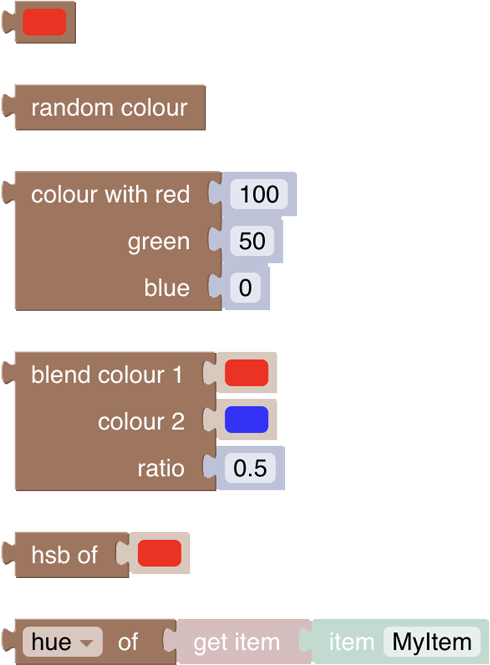

<!-- markdownlint-disable MD036 -->

# openHAB Extensions to the Standard

[return to Blockly Reference](index.html#openhab-extensions-to-the-standard)

## Introduction

This section explains only the blocks that have been added to the standard blocks by openHAB

## Logic

One of the most commonly used standard blocks are conditions blocks.
More about conditions can be viewed at  [How to use IF and ELSE](https://youtu.be/hSRfooBKn9A?t=445).

A specific block that was added by openHAB is the **UNDEFINED**-Block which allows better comparison of undefined values.

Here is an example on how to use it:

## Math

The Math section mainly consists of standard Blockly blocks.
Two new math blocks were added for bitwise operations:

### Quantity Type support

Blockly allows to use Quantity types to do its math operations.
This means that Quantity States can directly be used as an input for math operation blocks.

Here are some examples for math operations with unit-accompanied values:

Note that there is a special case on min/max if the inputs are not of equal type.
In this case an error will be shown to the user:

### Bitwise operators

_Function:_ The block allows to compute the following operations with two quantities:

- bitwise and &
- bitwise or |
- bitwise xor ^
- bitwise left shift <<
- bitwise right shift >>
- bitwise unary right shift >>>

### Bitwise invert

_Function:_ The bitwise NOT (~) operator inverts the bits of its operand.

### Rounding

The standard block has been extended to provide a rounding function with the ability to set the number of decimal places:

### Parse Number

This blocks takes a String floating point number representation and converts it into a Number type block.

## Text

The Text section is the general section that allows text or string manipulation

More about that topic can be viewed at  [Working with Text-Blocks](https://youtu.be/EdllUlJ7p6k?t=975).

### CRLF

CRLF stands for carriage-return / line-feed which is a technical term for adding a new line in a string

_Function:_ return a newline character to be added to a string.

**Example:**

### Text Replace

_Function:_ Allows to replace something that is defined by the _pattern_ in the _origin_-text with what is provided in _replacement_.
Note that the pattern can be just a text or also regex expression.

**Example:**

## Colors

More about that topic can be viewed at  [Using Color-Blocks and HSB-Conversion](https://youtu.be/EdllUlJ7p6k?t=1366)

The Colors section simplifies the selection of  Color Values.
Technically these color RGB values are provided as a hexadecimal combination of the three values for red, green and blue (hence RGB).
Each of the individual colors can range from 0 - 255 or 0-FF (hexadecimal).
A color of r=255, g=255, b=255 would therefore result into #ffffff preceded by a # which identifies it as a hexadecimal number.

Note that typically RGB values are not used within openHAB for color states but instead the Color-Type expects a HSB Type.
See the special hsb-conversion block below.

Blockly supports the following use cases:

- pick a color to return the value as an RGB type
- chose a random color as RGB type
- define an RGB color based on red, green and blue.
- blend two colors with a ratio - this block can be used to dynamically transition from one color to the other by applying the ratio as a computed value in a rule.
- calculate the HSB value of the RGB value
- get hue, saturation or brightness from a HSB Type Color Status of an Item

### Color Picker

_Function:_ Lets the user pick from a (limited) set of colors and returns a the hexadecimal number (in the above case the value = #33cc00.

### Random Color

_Function:_ Returns a random color as a hexcode

### Create RGB color

_Function:_ Returns a color by mixing the given values in a range from 0 - 255 for reg, green and blue as a hexcode

### Blend two colors

_Function:_ Blends two colors chosen via a color picker into one color by the given ratio.

:::tip

this could be used for example with a loop that changes the ratio from 0 to 1 to blend the first color into a second

:::

### Create HSB-color from RGB color (openHAB)

HSB stands for hue-saturation-brightness which is a different way of describing a color.
An RGB color can therefore be converted equally into an HSB-color.

_Function:_ This a special openHAB block that converts a hexadecimal color code from one of the above blocks into a String that is required when sending a color command to any item that accepts a color.

- use that block and connect one of the above blocks into that one to be able to retrieve the HSB value of that block.

HSB stands for hue-saturation-brightness which is a different way of describing a color.
An RGB color can therefore be converted equally into an HSB-color.

_Function:_ This a special openHAB block that converts a hexadecimal color code from one of the above blocks into a String that is required when sending a color command to any item that accepts a color.

- use that block and connect one of the above blocks into that one to be able to retrieve the HSB value of that block.

Example

### Retrieve indidivual HSB values from an Item state

This block allows to retrieve the individual values of an Item’s HSB color state by returning

- Hue,
- Saturation,
- or Brightness

## Lists

### Dictionary for managing key / value pairs

The dictionary is a holder for key value pairs that can be passed along as one.
Add or remove new key value pairs by clicking on the cog icon to open the popup of the dictionary block (finally click on the cog again to close the popup).
Then drag the key block on the upper left into the key/value bracket on the right like depicted below:

Rename the keys as required and then add any value block type to the related key:

**Example:**

### get value of key from dictionary

_Function:_ Retrieves the value of the key in the given directory

**Example:**

### Loop over a dictionary

This block can be found in the Loops section and is a dedicated block that allows to iterate over the elements of a dictionary.
The loop provides the value into the variable that was choosen in the drop down.
See the examples below how the loop can be used.

Either the dictionary itself can be provided directly or via a variable.

### Concatenate lists

_Function:_ adds the second list to the first list and returns a new list

Example:

## Loops

Even though there a no specialized openHAB blocks provided, loops are used rather often.
Therefore there is a good introduction to loops available which can be viewed at  [Loops in Blockly](https://youtu.be/EdllUlJ7p6k?t=1947)

## Functions

A more advanced feature for reusable blockly code is _functions_.
More about that topic can be viewed at  [Functions](https://youtu.be/hSRfooBKn9A?t=60) and [Parameters](https://youtu.be/hSRfooBKn9A?t=170).

## Return to Blockly Reference

[return to Blockly Reference](index.html#openhab-extensions-to-the-standard)
