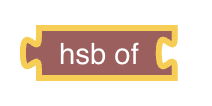

<!-- markdownlint-disable MD036 -->

# openHAB Extensions to the Standard

[return to Blockly Reference](index.html#openhab-extensions-to-the-standard)

## Introduction

This section explains only the blocks that have been added to the standard blocks by openHAB

{::options toc_levels="2..4"/}

- TOC
{:toc}

{: #blockly-standard-extension-overview}

## Logic

One of the most commonly used standard blocks are conditions blocks.
More about conditions can be viewed at  [How to use IF and ELSE](https://youtu.be/hSRfooBKn9A?t=445).

## Text

The Text section is the general section that allows text or string manipulation

More about that topic can be viewed at  [Working with Text-Blocks](https://youtu.be/EdllUlJ7p6k?t=975).

### CRLF

Since OpenHAB 3.3.0M6

CRLF stands for carriage-return / line-feed which is a technical term for adding a new line in a string

_Function:_ return a newline character to be added to a string.

**Example:**

## Colors

More about that topic can be viewed at  [Using Color-Blocks and HSB-Conversion](https://youtu.be/EdllUlJ7p6k?t=1366)

The Colors section simplifies the selection of  Color Values.
Technically these color RGB values are provided as a hexadecimal combination of the three values for red, green and blue (hence RGB).
Each of the individual colors can range from 0 - 255 or 0-FF (hexadecimal).
A color of r=255, g=255, b=255 would therefore result into #ffffff preceded by a # which identifies it as a hexadecimal number.

Note that typically RGB values are not used within openHAB for color states but instead the Color-Type expects a HSB Type.
See the special hsb-conversion block below.

### Color Picker

_Function:_ Lets the user pick from a (limited) set of colors and returns a the hexadecimal number (in the above case the value = #33cc00.

### Random Color

_Function:_ Returns a random color as a hexcode

### Create RGB color

_Function:_ Returns a color by mixing the given values in a range from 0 - 255 for reg, green and blue as a hexcode

### Blend two colors

_Function:_ Blends two colors chosen via a color picker into one color by the given ratio.

Tip: this could be used for example with a loop that changes the ratio from 0 to 1 to blend the first color into a second

### Create HSB-color from RGB color (openHAB)

HSB stands for hue-saturation-brightness which is a different way of describing a color.
An RGB color can therefore be converted equally into an HSB-color.

_Function:_ This a special openHAB block that converts a hexadecimal color code from one of the above blocks into a String that is required when sending a color command to any item that accepts a color.

- use that block and connect one of the above blocks into that one to be able to retrieve the HSB value of that block.

HSB stands for hue-saturation-brightness which is a different way of describing a color.
An RGB color can therefore be converted equally into an HSB-color.

_Function:_ This a special openHAB block that converts a hexadecimal color code from one of the above blocks into a String that is required when sending a color command to any item that accepts a color.

- use that block and connect one of the above blocks into that one to be able to retrieve the HSB value of that block.

**Example:**

## Lists

### Dictionary for managing key / value pairs

The dictionary is a holder for key value pairs that can be passed along as one.
Add or remove new key value pairs by clicking on the cog icon to open the popup of the dictionary block (finally click on the cog again to close the popup).
Then drag the key block on the upper left into the key/value bracket on the right like depicted below:

Rename the keys as required and then add any value block type to the related key:

Example:

### get value of key from dictionary

_Function:_ Retrieves the value of the key in the given directory

Example:

## Loops

Even though there a no specialized openHAB blocks provided, loops are used rather often.
Therefore there is a good introduction to loops available which can be viewed at  [Loops in Blockly](https://youtu.be/EdllUlJ7p6k?t=1947)

## Functions

A more advanced feature for reusable blockly code is _functions_.
More about that topic can be viewed at  [Functions](https://youtu.be/hSRfooBKn9A?t=60) and [Parameters](https://youtu.be/hSRfooBKn9A?t=170).

## Return to Blockly Reference

[return to Blockly Reference](index.html#openhab-extensions-to-the-standard)
