<!-- markdownlint-disable MD036 -->

# Timers & Delays

[return to Blockly Reference](index.html#timers-and-delays)

Timers and Delays are a little more complex but add important functionality to rules.
Whilst the "Wait-For"-block is straightforward, the timer blocks should be well understood before being used - they may behave differently than expected.
This chapter explains what these blocks do, sometimes displaying generated code to explain what is happening behind the scenes.

More about that topic can be viewed at  [Timers](https://youtu.be/hSRfooBKn9A?t=630).

[[toc]]

## Overview of the Timers and Delays category

> 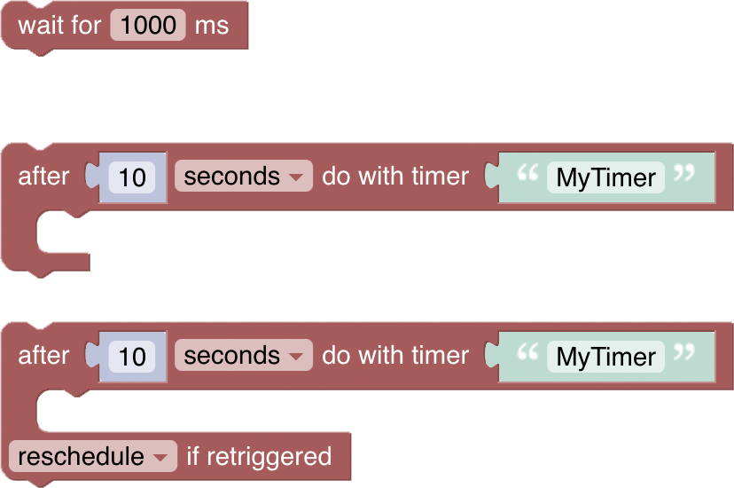 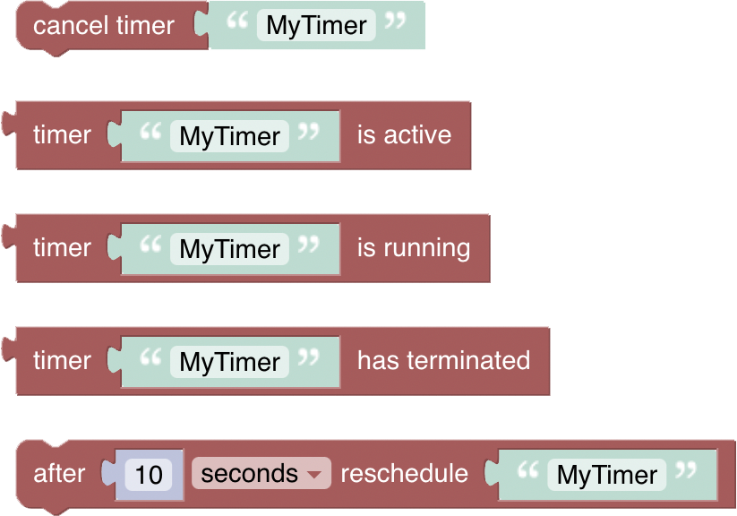

## Timer Naming

Timers are created and referred to by name, enabling manipulation within a rule.

> **Important**: a named timer is _only_ available within the same rule. The same timer _cannot_ be accessed via a different rule. A different rule with a timer of the same name results into two separate timers.

### Wait for

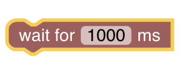

_Function:_ Suspends execution of the rule for a given period of time

- unit of time (ms) is milliseconds (1000 ms = 1 second)

_Example_

The following simple example uses a loop to implement a blinking light with a 1 second delay, looping three times:

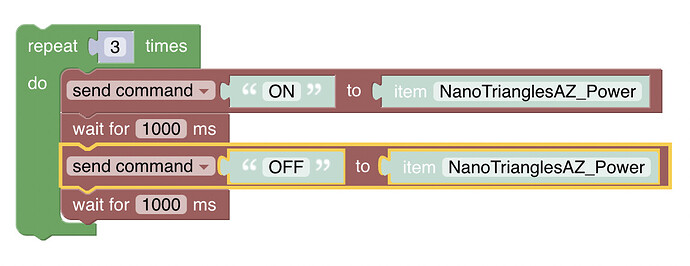

More about that topic can be viewed at  [Waiting in Rules](https://youtu.be/EdllUlJ7p6k?t=1600)

### After _period of time_ Do With Timer

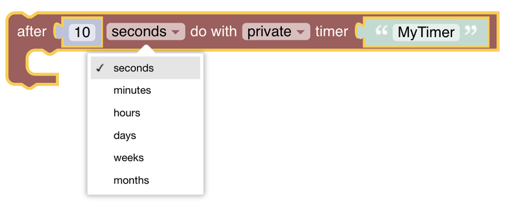

_Function:_ Schedule a task to be performed once after a specific amount of time has elapsed.

- A number and unit (seconds, minutes up to months) can be chosen after which the commands within the block will be executed
- Provide the name of the timer, allowing further access to that timer within the same rule. The name also ensures the timer is unique within the rule.

_Example_

10 seconds after the rule has been called, the timer triggers all lights to go off:

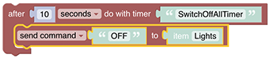

### Reschedule Timer

_Function:_  Sometimes one may want to use the same timer and reschedule the same block of code again. This can be achieved with the reschedule-block


An example is as follows:

- The code within the timer-block will run after 5 seconds.
- The last part in the block reschedules the same timer-block for 5 seconds later.
- And so on, in an endless loop.

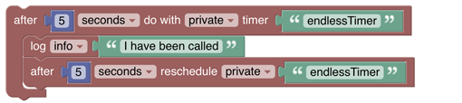

Setting up an endless timer in the above way is not recommended. The example shown below will stop rescheduling after 3 doorbell rings.

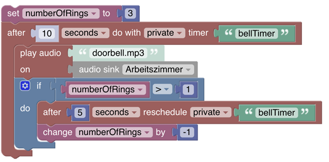

### After _period of time_ Do With Timer with options on retriggering rule

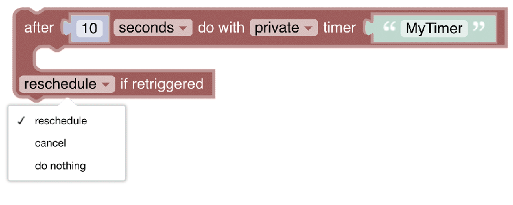

_Function:_ Schedule a task to be performed at a specified period in the future with the ability to reschedule, cancel or ignore the timer **when the rule is retriggered**.

Before using that block, it is important to understand what the idea behind the option of retriggering:
Though it may not seem to be obvious, the same rule can be retriggered at any time. To allow more control about what is happening in this case the rule is executed again, the following options are available:

**Options on Retrigger**

- _reschedule_: If the same rule that contains this Blockly script is re-triggered, and this specific timer is currently active, this specific timer will be rescheduled (i.e. restart the countdown timer).
- _cancel_: If the same rule that contains this Blockly script is re-triggered, and this specific timer is currently active, this specific timer will be cancelled. The code within the timer will not be executed.
- _do nothing_: If the same rule that contains this Blockly script is re-triggered, nothing happens - this will make the block identical to the simple timer-block in function, but the generated code is slightly modified - see below.

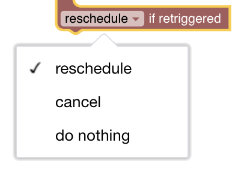

**Generated code**

The following code example and the following are provided to understand what exactly happens behind the scenes:

```javascript
if (typeof this.timers['MyTimer'] === 'undefined' || this.timers['MyTimer'].hasTerminated()) {
  this.timers['MyTimer'] = scriptExecution.createTimer(zdt.now().plusSeconds(10), function () {
    })
} else {
  this.timers['MyTimer'].reschedule(zdt.now().plusSeconds(10));
}
```

**Simple timer-block**

The simple timer-block generates the code shown underneath the image below.


```javascript
if (typeof this.timers['simpleTimerBlock'] === 'undefined' || this.timers['simpleTimerBlock'].hasTerminated()) {
  this.timers['simpleTimerBlock'] = scriptExecution.createTimer(zdt.now().plusSeconds(10), function () {
    })
}
```

**Retrigger timer-block**

The retrigger timer-block inserts an additional `else{}` branch into the generated code which will run if:

- The rule is retriggered and
- the timer already exists and
- the timer has not yet finished (it's still ticking)

In the case of _do nothing_ the `else{}` branch is empty (which turns to be almost equals to the simple-timer).

```javascript
if (typeof this.timers['nothingTimerBlock'] === 'undefined' || this.timers['nothingTimerBlock'].hasTerminated()) {
  this.timers['nothingTimerBlock'] = scriptExecution.createTimer(zdt.now().plusSeconds(10), function () {
    })
} else {
  // do nothing
}
```

In the case of _cancel_ the `else{}` branch contains code to cancel the timer.

```javascript
if (typeof this.timers['cancelTimerBlock'] === 'undefined' || this.timers['cancelTimerBlock'].hasTerminated()) {
  this.timers['cancelTimerBlock'] = scriptExecution.createTimer(zdt.now().plusSeconds(10), function () {
    })
} else {
  this.timers['cancelTimerBlock'].cancel();
  this.timers['cancelTimerBlock'] = undefined;
}
```

In the case of _reschedule_ the `else{}` statement contains code to reschedule the timer - restart the countdown. In the example generated code below:

- Imagine the rule is triggered at 0 elapsed seconds.
- The timer is started with a 10 second countdown.
- Lets say the rule is triggered again at 5 elapsed seconds.
- Then timer will be rescheduled for another 10 second countdown, so will execute the code within its block at 15 elapsed seconds.

```javascript
if (typeof this.timers['rescheduleTimerBlock'] === 'undefined' || this.timers['rescheduleTimerBlock'].hasTerminated()) {
  this.timers['rescheduleTimerBlock'] = scriptExecution.createTimer(zdt.now().plusSeconds(10), function () {
    logger.info('I am doing my job');
    })
} else {
  this.timers['rescheduleTimerBlock'].reschedule(zdt.now().plusSeconds(10));
}
```

### Cancel Timer


_Function_: Cancels the existing named timer, preventing code within the timer block from executing.

### Timer is Active

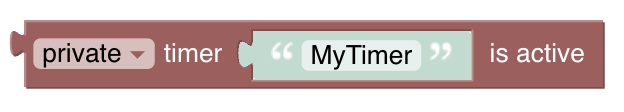

_Function:_ returns `true` if the timer itself is currently counting down, and the code within the timer will be eventually executed as scheduled. This block will return `false` if the timer doesn't exist, has been cancelled, or has already finished.

### Timer is Running

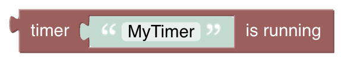

_Function_: returns `true` if the code _within the timer block_ is currently running - i.e. the countdown has finished, and the code within the timer block is currently executing. This event will usually only last a few milliseconds, and you’d be (un)lucky to catch it when your rule retriggers.

### Timer has terminated


_Function_: returns `true` if the timer has finished its countdown, and the code within the timer block has finished running.

### Comprehensive Timer Example

The intent here is to trigger an alarm to the police but allow the timer to be reset in case a reset button has been pressed during the trigger time.
The rule is triggered when the burglar-alarm-item or the reset-button-item is changed.

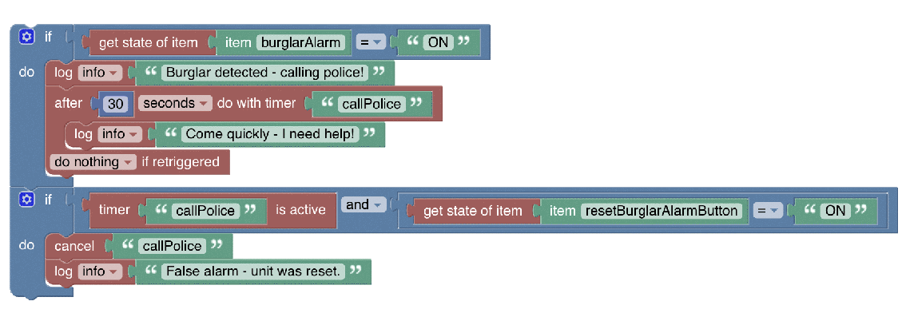

## Return to Blockly Reference

[return to Blockly Reference](index.html#timers-and-delays)
