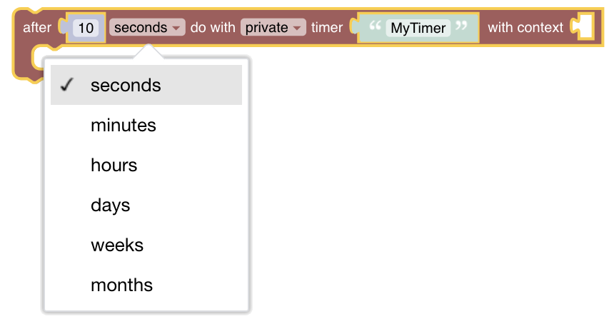
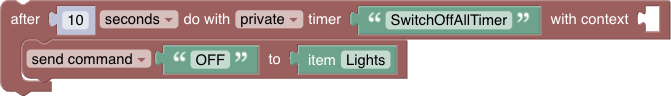
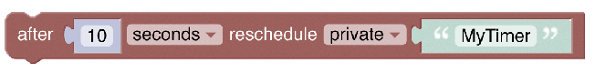
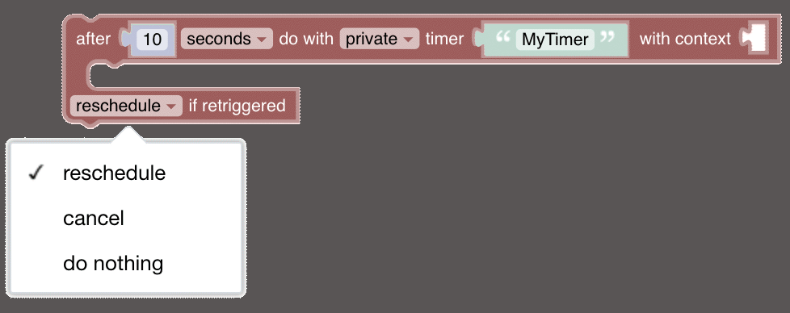
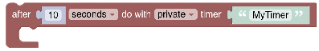
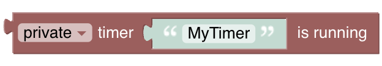
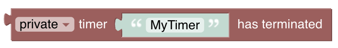
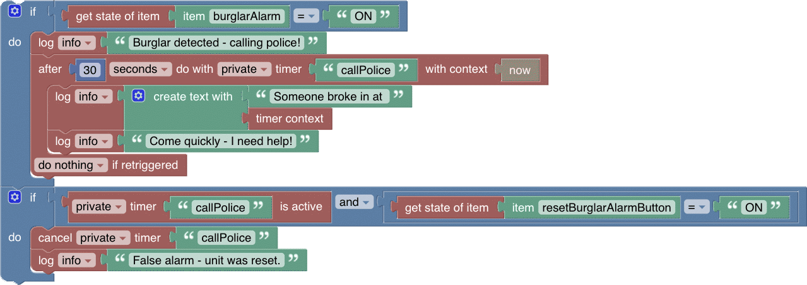
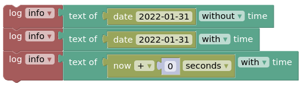

# Timers & Delays

[return to Blockly Reference](index.html#timers-and-delays)

Timers and Delays are a little more complex but add important functionality to rules. Whilst the "Wait-For"-block is straightforward, the timer blocks should be well understood before being used - they may behave differently than expected. This chapter explains what these blocks do, sometimes displaying generated code to explain what is happening behind the scenes.

- TOC
{:toc}

{: #blockly-timers-and-delays-overview}

## Overview of the Timers and Delays category

>  

## Timer Naming

Timers are created and referred to by name, enabling manipulation within a rule.

> **Important**: a named timer is *only* available within the same rule. The same timer *cannot* be accessed via a different rule. A different rule with a timer of the same name results into two separate timers.

### Wait for


*Function:* Suspends execution of the rule for a given period of time

- unit of time (ms) is milliseconds (1000 ms = 1 second)

*Example*

The following simple example uses a loop to implement a blinking light with a 1 second delay, looping three times:


### After *period of time* Do With Timer



*Function:* Schedule a task to be performed once after a specific amount of time has elapsed.

- A number and unit (seconds, minutes up to months) can be chosen after which the commands within the block will be executed
- Provide the name of the timer, allowing further access to that timer within the same rule. The name also ensures the timer is unique within the rule.

*Example*

10 seconds after the rule has been called, the timer triggers all lights to go off:



### Reschedule Timer

*Function:*  Sometimes one may want to use the same timer and reschedule the same block of code again. This can be achieved with the reschedule-block



An example is as follows:

- The code within the timer-block will run after 5 seconds.
- The last part in the block reschedules the same timer-block for 5 seconds later.
- And so on, in an endless loop.


Setting up an endless timer in teh above way is not recommended. The example shown below will stop rescheduling after 3 doorbell rings.


### After *period of time* Do With Timer with options on retriggering rule



*Function:* Schedule a task to be performed at a specified period in the future with the ability to reschedule, cancel or ignore the timer **when the rule is retriggered**.

Before using that block, it is important to understand what the idea behind the option of retriggering:
Though it may not seem to be obvious, the same rule can be retriggered at any time. To allow more control about what is happening in this case the rule is executed again, the following options are available:

**Options on Retrigger**

- *reschedule*: If the same rule that contains this Blockly script is re-triggered, and this specific timer is currently active, this specific timer will be rescheduled (i.e. restart the countdown timer).
- *cancel*: If the same rule that contains this Blockly script is re-triggered, and this specific timer is currently active, this specific timer will be cancelled. The code within the timer will not be executed.
- *do nothing*: If the same rule that contains this Blockly script is re-triggered, nothing happens - this will make the block identical to the simple timer-block in function, but the generated code is slightly modified - see below.


**Generated code**

The following code example and the following are provided to understand what exactly happens behind the scenes:

```javascript
if (typeof this.timers['MyTimer'] === 'undefined' || this.timers['MyTimer'].hasTerminated()) {
  this.timers['MyTimer'] = scriptExecution.createTimer(zdt.now().plusSeconds(10), function () {
    })
} else {
  this.timers['MyTimer'].reschedule(zdt.now().plusSeconds(10));
}
```

**Simple timer-block**

The simple timer-block generates the code shown underneath the image below.



```javascript
if (typeof this.timers['simpleTimerBlock'] === 'undefined' || this.timers['simpleTimerBlock'].hasTerminated()) {
  this.timers['simpleTimerBlock'] = scriptExecution.createTimer(zdt.now().plusSeconds(10), function () {
    })
}
```

**Retrigger timer-block**

The retrigger timer-block inserts an additional `else{}` branch into the generated code which will run if:

- The rule is retriggered and
- the timer already exists and
- the timer has not yet finished (it's still ticking)

In the case of *do nothing* the `else{}` branch is empty (which turns to be almost equals to the simle-timer).

```javascript
if (typeof this.timers['nothingTimerBlock'] === 'undefined' || this.timers['nothingTimerBlock'].hasTerminated()) {
  this.timers['nothingTimerBlock'] = scriptExecution.createTimer(zdt.now().plusSeconds(10), function () {
    })
} else {
  // do nothing
}
```

In the case of *cancel* the `else{}` branch contains code to cancel the timer.

```javascript
if (typeof this.timers['cancelTimerBlock'] === 'undefined' || this.timers['cancelTimerBlock'].hasTerminated()) {
  this.timers['cancelTimerBlock'] = scriptExecution.createTimer(zdt.now().plusSeconds(10), function () {
    })
} else {
  this.timers['cancelTimerBlock'].cancel();
  this.timers['cancelTimerBlock'] = undefined;
}
```

In the case of *reschedule* the `else{}` statement contains code to reschedule the timer - restart the countdown. In the example generated code below:

- Imagine the rule is triggered at 0 elapsed seconds.
- The timer is started with a 10 second countdown.
- Lets say the rule is triggered again at 5 elapsed seconds.
- Then timer will be rescheduled for another 10 second countdown, so will execute the code within its block at 15 elapsed seconds.

```javascript
if (typeof this.timers['rescheduleTimerBlock'] === 'undefined' || this.timers['rescheduleTimerBlock'].hasTerminated()) {
  this.timers['rescheduleTimerBlock'] = scriptExecution.createTimer(zdt.now().plusSeconds(10), function () {
    logger.info('I am doing my job');
    })
} else {
  this.timers['rescheduleTimerBlock'].reschedule(zdt.now().plusSeconds(10));
}
```

### Cancel Timer


*Function*: Cancels the existing named timer, preventing code within the timer block from executing.

### Timer is Active


*Function:* returns `true` if the timer itself is currently counting down, and the code within the timer will be eventually executed as scheduled. This block will return `false` if the timer doesn't exist, has been cancelled, or has already finished.

### Timer is Running


*Function*: returns `true` if the code *within the timer block* is currently running - i.e. the countdown has finished, and the code within the timer block is currently executing. This event will usually only last a few milliseconds, and you’d be (un)lucky to catch it when your rule retriggers.

### Timer has terminated


*Function*: returns `true` if the timer has finished its countdown, and the code within the timer block has finished running.

### Comprehensive Timer Example

The intent here is to trigger an alarm to the police but allow the timer to be reset in case a reset button has been pressed during the trigger time.
The rule is triggered when the burglar-alarm-item or the reset-button-item is changed.



---

## Date handling blocks

Date blocks are used as input parameters for other blocks.
At the moment some of these blocks are found in the ephemeris section, whilst others are found in the persistence section - they may be equally useful for both.
These blocks are *typed* to assure correct connection to other blocks.

### today


Type: *DayOffset*

Ephemeris blocks expect a date formatted as the number of days since today.
As a result, this block returns 0.

### today +/- x days


Type: *DayOffset*

Returns the number of days since today, as configured in the number block.
The number can be positive (offset into the future) or negative (offset into the past).

### date-picker


Type: *ZonedDateTime*

Returns a date as *ZonedDateTime*.
The date can be selected from a date picker.
The time is set to `00:00:00`.

### Get date


Type: *ZonedDateTime*

From a String in the format `yyyy-MM-dd`, this block will return the date as *ZonedDateTime*.
The input String  may be a variable-block.
The time will be `00:00:00`.

### Get Date now with offset


Type: *ZonedDateTime*

Returns a date as *ZonedDateTime* with offset relative to the current date *and* time.

### Get String representation of date


Type: *String*

Returns the the String representation of a given *ZonedDateTime*-block, with or without the time.

### Example

Assuming this block is run at `20:47:36` on `31/01/2022`



The output in the log will be.

```text
2022-01-31
2022-01-31 00:00:00
2022-01-31 20:47:36
```

## Return to Blockly Reference

[return to Blockly Reference](index.html#timers-and-delays)
