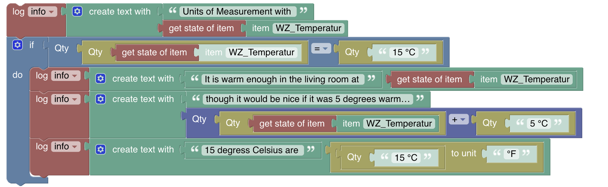
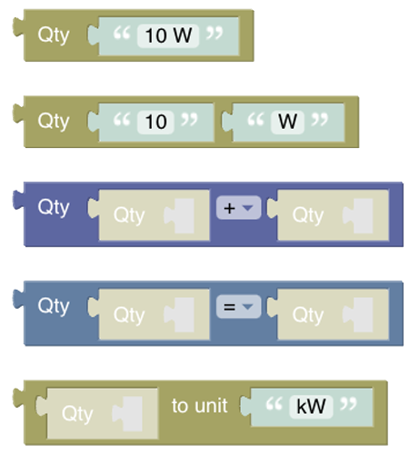

<!-- markdownlint-disable MD036 -->

# Units of Measurements

[Return to Blockly Reference](index.html#items-and-things)

## Introduction

[Unit of Measurements](docs/concepts/units-of-measurement.html) have been a part of openHAB for a long time already and received some major improvements in particular in openHAB 4.0.
Therefore, to make the usage in Blockly easier and allow math computations with measurement units, severals blocks have been added.

Note that these blocks are only available since openHAB 4.0 and are based on JS Scripting / graalJS.

The following example block gives a good idea of what can be done with the Unit of Measurement blocks

[[toc]]

## Overview of the Items and Things category

### Unit of Measurement Blocks

These blocks allow you to convert to, add, substract, multiply and divide measurements, which include a [**unit**](/docs/concepts/units-of-measurement.html#list-of-units) of measurement which is also called a Quantity Type, as well as comparing values against each other.

### Smart block input type handling

Note that the block is smart enough to either take either one of the three blocks

- "get item block" (which returns the whole Item object and from which the block retrieves state value)
- "get state item block" (which returns the Item state and from which the block retrieves state value)
- "item block" (which returns only the name of the Item and from which the block retrieves quantity state of the Item)

or you can directly access the to retrieve the quantity state.

Blockly cannot detect the type that is contained in a variable so it expects an item object.
This allows to iterate over a group of item members which returns a list of item objects:

This approach is valid for all blocks in this section except _Quantity Conversion_ which expects a Quantity.

## Quantity Blocks

A _Quantity_ is the combination of a value and a unit of measurement, which means that the blocks require a _Quantity_ as an input and generate a _Quantity_ as an output.
Even though the quantity block looks similar to the standard text block it actually wraps a string into a _Quantity_ type.

_Function:_ The following block takes a string of "10 W" (10 Watts) and converts into a quantity of 10 W which then can be used for computations.
Instead of using a constant string, the block can also take the output of an item or a variable and convert it into a quantity.
The second block below allows easier handling in some special cases where you like to supply value and unit seperately.

### Quantity computation

_Function:_ The block allows to compute the following operations with two quantities:

- addition
- substraction
- division
- multiplication

It only takes a [quantity block](rules-blockly-uom.html#quantity-blocks) as an input and also returns a quantity as an output.

Due to the smart type detection even this short form works as expected:

Amazingly, this multiplication results into the right quantity of 100 W².

### Quantity Comparison

_Function:_ The block allows to compare two quantities with the following operands which will return a boolean as a result.

The following shows how it can be used in an if-statement:

More examples:

### Quantity Conversion

_Function:_ The block provides the conversion from one quantity to another.

The result of that operation would be 0.01 kW.

The following examples show how to use it with an Item:

## Return to Blockly Reference

[Return to Blockly Reference](index.html#items-and-things)
