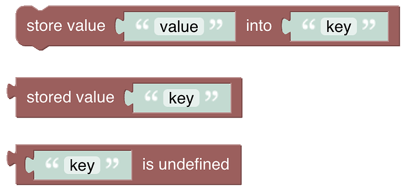
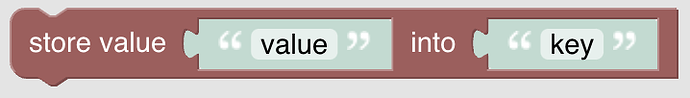
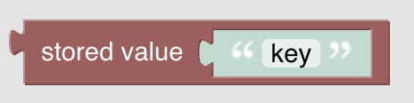
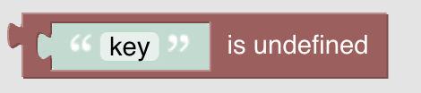
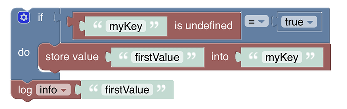
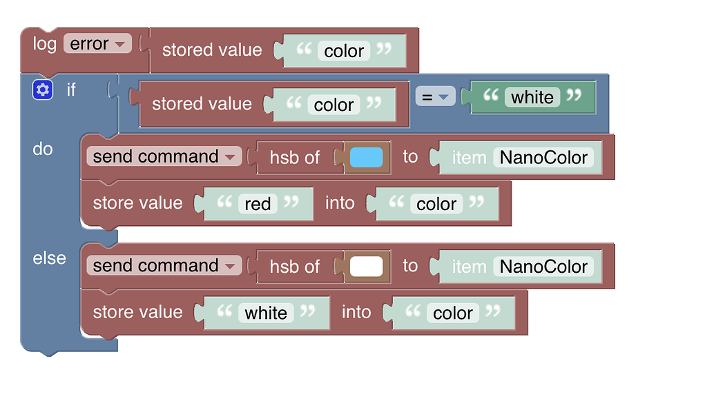

<!-- markdownlint-disable MD036 -->

# Value Storage

[return to Blockly Reference](index.html#value-storage)

## Introduction

These blocks enable storing information _for a rule_ that is kept after the rule has run, so it can be reused when the rule is run again later in stateful way.
Basically a value storage can be perceived as a global variable for the rule instance.

- The values are persisted as a part of the _instance_ of the rule
  - Modifying the rule during development creates a new instance which means the value is reset.
  - Restarting openHAB creates a new rule instance which also means the value is reset
  - In most cases both situations are negligible for many rules.
- If you need full persistence of values that can be used across rules you need to persist the value in one of the persistence engines like MapDB
- By default the value is _undefined_.
To check if a value is undefined, use the special "is undefined"-block

[[toc]]

## Overview of the Value Storage blocks

## Value Storage Blocks

See also the short video part about  [Global Value Storage](https://youtu.be/KwhYKy1_qVk?t=2060)

### Store Value

Function: Stores a value under the key name

### Get Stored Value

Function: Retrieves a stored value by the key name

### Check if Value is undefined

Function: Checks if a value is undefined

### Example 1: Initialize a key if not set

### Example 2: Use the rule instance variable to remember a color that has been set

## Return to Blockly Reference

[return to Blockly Reference](index.html#value-storage)
