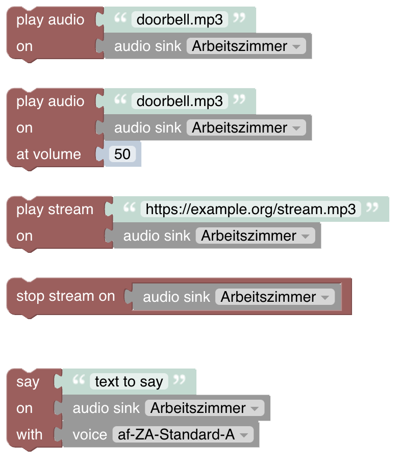
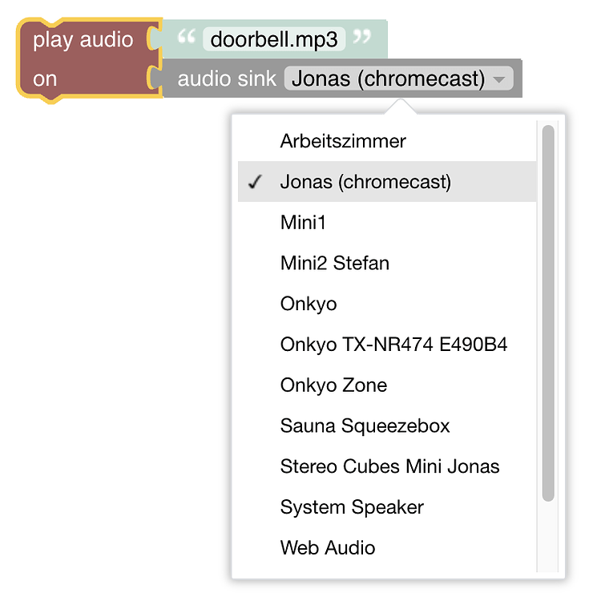
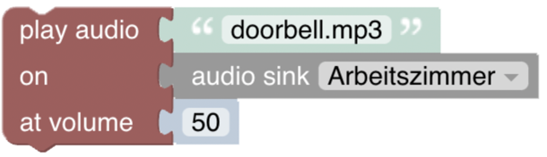
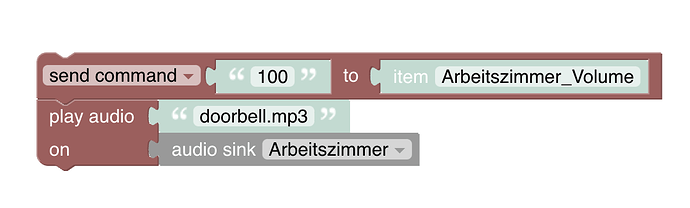
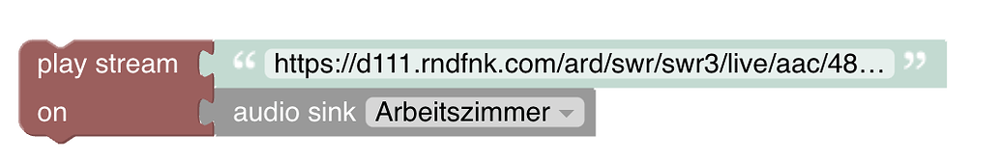
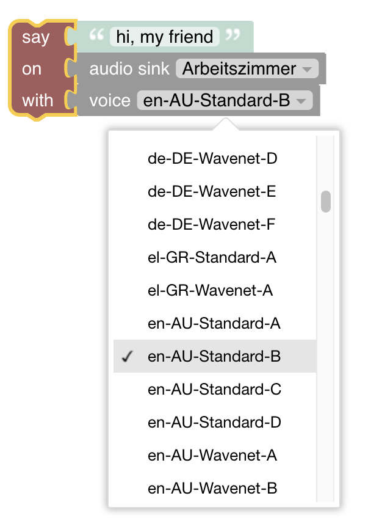

<!-- markdownlint-disable MD036 -->

# Multimedia

[return to Blockly Reference](index.html#voice-and-multimedia)

## Introduction

In general, this section deals with two topics

1) Playing or streaming audio to an audio sink e.g a speaker
1) Saying a text via using any Text-to-Speech API (e.g. Google's API)

It should be noted that both functionalities do not just work right out of the box because e.g for (1) the audio sinks need to be installed in openHAB and for (2) e.g. the whole Google API needs to be configured in particular with your own personal google account.
Even though (2) is not trivial but after having done that the usage of the functionality with blockly is very easy and worth the effort.

More about that topic can be viewed at  [Playing sounds on audio sinks](https://youtu.be/EdllUlJ7p6k?t=2035)

[[toc]]

## Overview of the Voice and Multimedia blocks

## Setup

- Audio Sinks
  - Audio devices are automatically added by their bindings as _sinks_ in openHAB
  - [Reference on how to setup Audio and Audio Sinks](https://www.openhab.org/docs/configuration/multimedia.html)
- Text-To-Speech
  - In order to use text-to-speech, you need to install at least one [TTS service](https://www.openhab.org/addons/#voice).
  - see [openHAB Voice](https://www.openhab.org/docs/configuration/multimedia.html#voice) for more information
  - in case you only have one TTS service, this becomes your default TTS services.
  In case you have several TTS services installed, you have to configure one of them as the default which can be done in your [services.cfg](https://github.com/openhab/openhab-distro/blob/master/distributions/distribution-resources/src/main/resources/runtime/etc/services.cfg#L20).
  See more on that special case [here](https://community.openhab.org/t/where-to-set-default-tts-voice/15450/2)

## Voice and Multimedia Blocks

### Play Audio

_Function:_ Plays an audio file on an audio sink

- the audio file must reside in the sounds-folder of openHAB that can be found [here](https://community.openhab.org/t/blockly-reference/128785#openhab-configuration-files-7)
- all available audio sinks are automatically provided by openHABs blocklies

Also view [Playing sounds on audio sinks](https://youtu.be/EdllUlJ7p6k?t=2035)

### Play Audio with Volume

_Function:_ Plays an audio file on an audio sink and setting the volume at the same time

same as above but also allowing to provide the volume at the same time

- the audio file must reside in the sounds-folder of openHAB that can be found [here](https://community.openhab.org/t/blockly-reference/128785#openhab-configuration-files-7)
- all available audio sinks are automatically provided by openHABs blocklies

**Known issue workaround:**
In several cases (like the google minis) it is known that setting the volume together with playing the sound results into only setting the volume either during playing the sound or even after the sound has played.
In case this happens the more robust approach is as follows

- Search for the thing of that particular sink and add an in item for the volume channel
- Then create the following block sequence

### Play Stream

_Function:_ Starts an stream playing on an audio sink

- The audio streams must be reachable from the openHAB server and can therefore be either internally or externally hosted
- All available audio sinks are automatically provided by openHAB's blocklies
- Changing the volume needs to be done via the thing volume channel linked to the sink device by sending the respective volume level command to that item

More about that topic can be viewed at  [Play Stream](https://youtu.be/hSRfooBKn9A?t=335)

### Stop Stream

_Function:_ Stops playing the current stream of the specified audio sink

### Say

_Function:_ Sends the given text to the sink by using the default Text-to-Speech-Service to translate the text based on the chosen language voice into a stream which is then played on that device sink.

More about that topic can be viewed at [Using Text-to-speach easily with blocks](https://youtu.be/EdllUlJ7p6k?t=2403)

[return to Blockly Reference](index.html#voice-and-multimedia)
