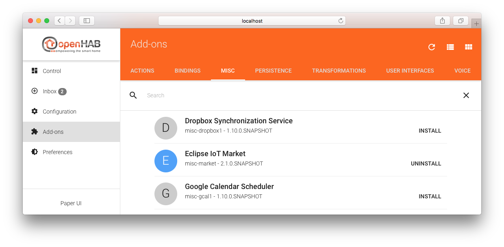
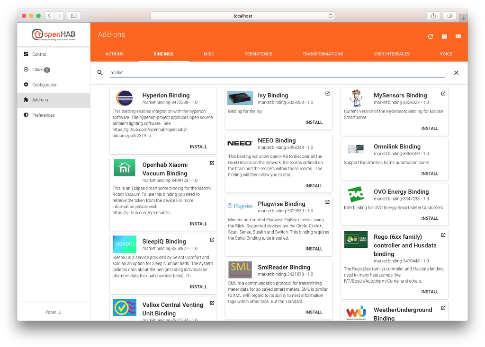
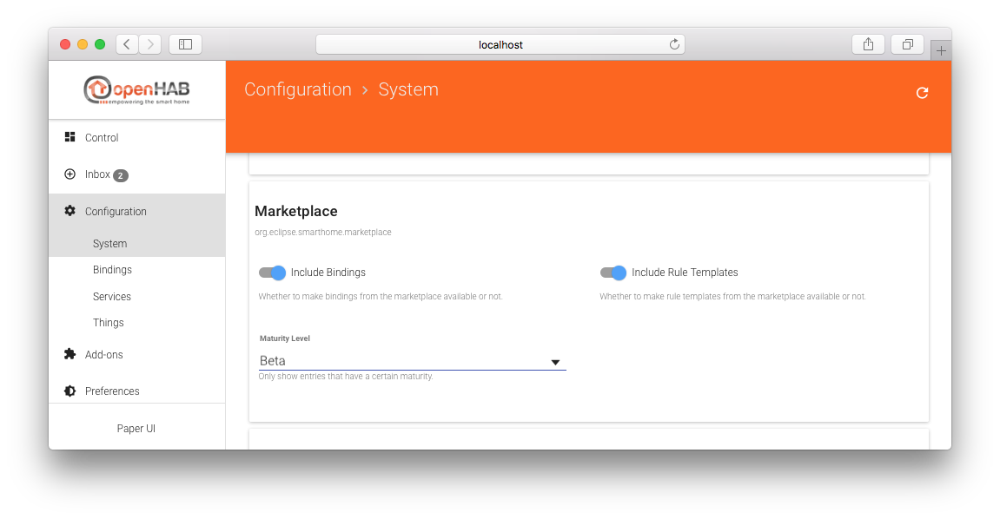



# Eclipse IoT Marketplace Integration

The [Eclipse IoT Marketplace](https://marketplace.eclipse.org/taxonomy/term/4988%2C4396/title) hosts third-party add-ons that can be browsed and installed to openHAB through this integration.

## Installation

Install the market integration from Add-ons → Misc → Eclipse IoT Market.



## Usage

With the Eclipse IoT Marketplace installed, you will see additional entries in the "Bindings" tab of the Add-ons menu.
As the new entries come with logos and descriptions, the card layout (instead of the list layout, can be selected in the top right) is best for browsing the entries.
To filter the view to show only third-party add-ons from the marketplace, you can simply type "market" in the search bar:



Simply use the install/uninstall buttons to add or remove add-ons from your installation.

Alternatively add-ons can be installed right from the catalog on the [Eclipse Marketplace website](https://marketplace.eclipse.org/taxonomy/term/4988%2C4396/title).
Drag the "Install" button from the web page to your add-ons page of the Paper UI to initiate installation.

**Attention:**
Please note that after a system upgrade the installed add-ons are lost and you will need to re-install them.
This behavior will be changed in future.

## Configuration

The marketplace integration can be configured to only provide add-ons of certain types (Note: Currently only bindings are supported!) and of a certain maturity level.

To do so, you can add a configuration file `conf/services/marketplace.cfg` with content like:

```conf
# whether to show bindings from the marketplace (default is true)
org.eclipse.smarthome.marketplace:bindings=false

# whether to show rule templates from the marketplace (default is true)
org.eclipse.smarthome.marketplace:ruletemplates=true

# possible values for maturity are
# 0 = Alpha
# 1 = Beta
# 2 = Production/Stable
# 3 = Mature
# default is 1
org.eclipse.smarthome.marketplace:maturity=2
```

Alternatively, these settings can also be done through the Paper UI under Configuration → System → Marketplace:


