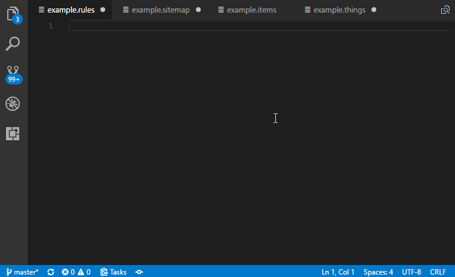



# Editors - Different Ways to Simplify Your Textual Configuration

Currently there are several existing solutions, that can help you configuring your openHAB instance in a textual way.
This documentation page can give you some guidance in choosing the right one for you and setting it up.

{::options toc_levels="2..4"/}

- TOC
{:toc}

{: #openhab-vscode}
## openHAB VS Code Extension

openHAB VS Code is an extension for the [Visual Studio Code](https://code.visualstudio.com) editor.
You can find it in the [Microsoft Visual Studio Marketplace](https://marketplace.visualstudio.com/items?itemName=openhab.openhab).

  

### Installation

0. Install [Visual Studio Code](https://code.visualstudio.com/Download) if not yet available.
1. Open the extension sidebar. 
2. Search for openHAB and install the extension.

[Visit the Extensions GitHub Page for further Informations](https://github.com/openhab/openhab-vscode/blob/master/README.md "GitHub Repo for the VS Code Extension")

### Rule Validation

This extension has the ability to check rules and validate them through a so called `Language Server`.
(If youn want to know more about this in general look [here](https://langserver.org/).)
The validation needs a running openHAB installation in your environment and can be activated with some simple steps.
You can find all important information in the extensions [readme file](https://github.com/openhab/openhab-vscode#validating-the-rules).

{: #esh-designer}
## Eclipse SmartHome Designer

The Eclipse SmartHome Designer is a specialized version of the [Eclipse](http://www.eclipse.org) IDE for openHAB.
Just like known from other IDEs, the Designer allows to browse and edit the configuration files of your openHAB setup, with the advantage of syntax highlighting, syntax checking and autocompletion.

### Network Preparations

If your openHAB instance is set up on a different device or a dedicated system, the Designer can be installed and executed on your personal PC or Mac.
The Designer needs to be able to access the configuration files on the remote openHAB host.

You have to have a [network share](https://en.wikipedia.org/wiki/Shared_resource) set up on the remote host and mounted on your local device.
Steps needed to so are specific to the hosts operation system.
How to setup and use Samba on a Linux system is described in the [Linux article]({{base}}/installation/linux.html#network-sharing).
If you are using [openHABian]({{base}}/installation/openhabian.html), the needed set of network shares is already configured for you, you just need to mount them locally.

*Attention Windows users:* Directly accessing network shares (UNC paths) is not supported. Please be sure to mount the network share to a drive letter prior to using the SmartHome Designer.

### Setup

- Get the latest version from: [Eclipse SmartHome Designer Downloads](https://github.com/eclipse/smarthome/blob/master/docs/documentation/community/downloads.md#designer-builds)
  (*Note:* the "Snapshot" build is currently not recommended for daily use)

The downloaded `.zip` archive contains the Designer executable.

- **Windows**: Extract the archive to a path of your choosing, e.g. `C:\designer`
- **Linux**: Extract the archive to a path of your choosing, e.g. `/opt/designer`
- **Max OSX**: Extract the archive to your applications folder

### First Launch

After launching the Designer executable you will see an empty configuration file pane on the top left.

  

Click on the "Select a configuration folder" icon at the top right of the configuration window and navigate to your openHAB configuration folder (containing `items`, `rules`, ...).

  

The configuration pane should now list the different configuration folders:

  

### Usage

You can now start to create and modify your configuration files.
Changes are automatically loaded by the openHAB runtime.
More details about the syntax of the different configuration files can be found in the [Configuration]({{base}}/configuration/index.html) chapter.

Hint: Press `<Ctrl + N>` to create a new file.

{: #others}
## Other Editor Integrations

The here summarized projects provide syntax highlighting for different text editors, but have no _on top_ functionality like the two tools above.

### mcedit

mcedit is an editor which comes with mc (Midnight Commander).
You can find the syntax files and installation instructions on [openhab-mcedit](https://github.com/CWempe/openhab-mcedit).

{: #notepadpp}
### Notepad++

Notepad++ is a free source code editor for Windows.
Version 6.2 or above is required.
You can find the syntax files on [openhab-samples](https://github.com/thefrip/openhab-samples) and install the files like it is described in the [editors documentation](http://docs.notepad-plus-plus.org/index.php/User_Defined_Language_Files#How_to_install_user_defined_language_files).

### Vim

Vim is a text editor in Linux systems.
You can find the syntax file and installation instructions on [openhab-vim](https://github.com/cyberkov/openhab-vim).

### Nano

Nano is a common editor in Linux systems.
You can find the syntax file and installation instructions on [openhabnano](https://github.com/airix1/openhabnano).

### Textwrangler

Textwrangler is a text and code editor for MAC OS X.
You can find the syntax file and installation instructions on [openhab-syntax-textwrangler](https://github.com/GrisoMG/openhab-syntax-textwrangler).
