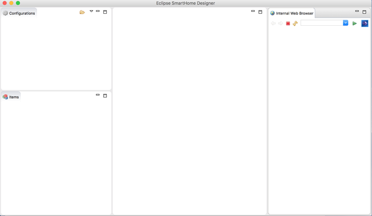
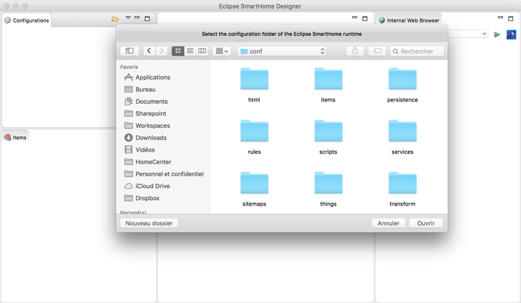
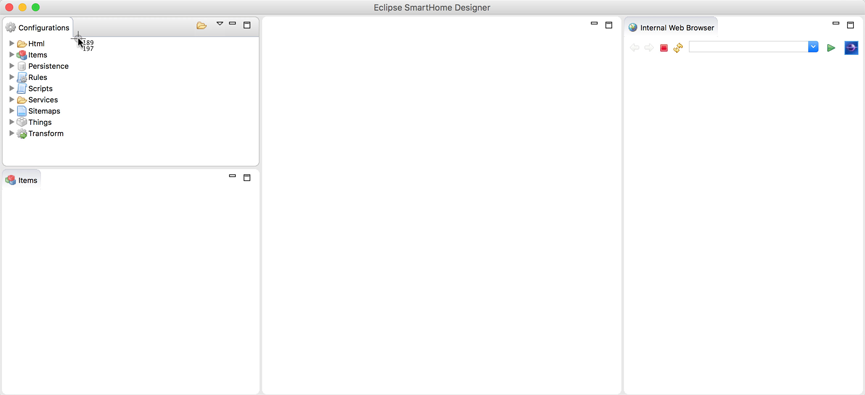



# Editors - Different ways to power up your textual configuration

There are several existing solutions, that can help you configuring your openHAB instance in a textual way.
Mainly there are two bigger projects for this. 
_Eclipse Smart Home - Designer_ as a standalone editor and _openhab-vscode_ as an extension for the Visual Studio Code open source editor.
Additionally there some syntax highligting solutions existing for other text editors.
This documentation page can give you some guidance in choosing the right one for you and setting it up.

{::options toc_levels="2"/}

* TOC
{:toc}

## openhab-vscode

openhab-vscode is an extension for the [Visual Studio Code](https://code.visualstudio.com) editor.

### Manual Installation

1. Download the latest release from <https://github.com/openhab/openhab-vscode/releases>
2. Open command line in the same folder you downloaded the extension
3. Type the following command:
    ```
    code --install-extension openhab-0.0.2.vsix
    ```
Currently openhab-vscode isn't yet listed in [Microsoft Visual Studio Marketplace](https://marketplace.visualstudio.com/vscode), but the contributors are working on it already.

[Visit the Extensions GitHub Page for further Informations](https://github.com/openhab/openhab-vscode/blob/master/README.md "GitHub Repo for the VS Code Extension")

## Eclipse Smarthome Designer

The Eclipse SmartHome Designer is a specialized version of the [Eclipse](http://www.eclipse.org) IDE for openHAB.
Just like known from other IDEs, the Designer allows to browse and edit the configuration files of your openHAB setup, with the advantage of syntax highlighting, syntax checking and autocompletion.

### Network Preparations

If your openHAB instance is set up on a different device or a dedicated system, the Designer can be installed and executed on your personal PC or Mac.
The Designer needs to be able to access the configuration files on the remote openHAB host.

You have to have a [network share](https://en.wikipedia.org/wiki/Shared_resource) set up on the remote host and mounted on your local device.
Steps needed to so are specific to the hosts operation system.
How to setup and use Samba on a Linux system is described in the [Linux article](linux.html#network-sharing).
If you are using [openHABian](openhabian.html), the needed set of network shares is already configured for you, you just need to mount them locally.

*Attention Windows users:* Directly accessing network shares (UNC paths) is not supported. Please be sure to mount the network share to a drive letter prior to using the SmartHome Designer.

### Setup

- Get the latest version from: [Eclipse SmartHome Designer Downloads](https://github.com/eclipse/smarthome/blob/master/docs/documentation/community/downloads.md#designer-builds)
  (*Note:* the "Snapshot" build is currently not recommended for daily use)

The downloaded `.zip` archive contains the Designer executable.

- **Windows**: Extract the archive to a path of your choosing, e.g. `C:\designer`
- **Linux**: Extract the archive to a path of your choosing, e.g. `/opt/designer`
- **Max OSX**: Extract the archive to your applications folder

### First Launch

After launching the Designer executable you will see an empty configuration file pane on the top left.

  

Click on the "Select a configuration folder" icon at the top right of the configuration window and navigate to your openHAB configuration folder (containing `items`, `rules`, ...).

  

The configuration pane should now list the different configuration folders:

  

### Usage

You can now start to create and modify your configuration files.
Changes are automatically loaded by the openHAB runtime.
More details about the syntax of the different configuration files can be found in the [Configuration]({{base}}/configuration/index.html) chapter.

Hint: Press `<Ctrl + N>` to create a new file.

## Others

### mcedit

mcedit is an editor which comes with mc (Midnight Commander).


#### Installing the syntax-files

- Download copy the syntax-files to */usr/share/mc/syntax/*
- <https://groups.google.com/forum/#!searchin/openhab/syntax$20highlighting%7Csort:relevance/openhab/zJrfTDjahbc/r8GcpKDgr1cJ>

- insert the following lines to the file *Syntax* in */usr/share/mc/syntax/*
```shell
    file ..\*\\.(items)$ openHAB\sItems 
    include openhab-items.syntax  
     
    file ..\*\\.(sitemap)$ openHAB\sSitemap 
    include openhab-sitemap.syntax
     
    file ..\*\\.(persist)$ openHAB\sPersistence
    include openhab-persist.syntax
     
    file ..\*\\.(rules)$ openHAB\sRules
    include openhab-rules.syntax 
```
- edit the Debian-line from
`file (rules|rocks)$ Debian\srules`
to 
`file (rocks)$ Debian\srules`
because it interferes with openHABs rules-files.

### Notepad++

Notepad++ Version 6.2 or above is required to support UDL2 (User Defined Language v2).

#### Comments

```shell
color brightgreen "//.*"
color brightgreen start="/\*" end="\*/"
color brightgreen start="/\*\*" end="\*/"# Comments
color brightgreen "//.*"
color brightgreen start="/\*" end="\*/"
color brightgreen start="/\*\*" end="\*/"# Comments
color brightgreen "//.*"
color brightgreen start="/\*" end="\*/"
color brightgreen start="/\*\*" end="\*/"# Comments
color brightgreen "//.*"
color brightgreen start="/\*" end="\*/"
color brightgreen start="/\*\*" end="\*/"# Comments
color brightgreen "//.*"
color brightgreen start="/\*" end="\*/"
color brightgreen start="/\*\*" end="\*/"# Comments
color brightgreen "//.*"
color brightgreen start="/\*" end="\*/"
color brightgreen start="/\*\*" end="\*/"# Comments
color brightgreen "//.*"
color brightgreen start="/\*" end="\*/"
color brightgreen start="/\*\*" end="\*/"# Comments
color brightgreen "//.*"
color brightgreen start="/\*" end="\*/"
color brightgreen start="/\*\*" end="\*/"# Comments
color brightgreen "//.*"
color brightgreen start="/\*" end="\*/"
color brightgreen start="/\*\*" end="\*/"# Comments
color brightgreen "//.*"
color brightgreen start="/\*" end="\*/"
color brightgreen start="/\*\*" end="\*/"# Comments
color brightgreen "//.*"
color brightgreen start="/\*" end="\*/"
color brightgreen start="/\*\*" end="\*/"
```
http://notepad-plus-plus.org/news/notepad-6.2-release-udl2.html

#### How to import UDL2-files?

- Download the UDL2-Files (openHAB-`*`.xml) from [openhab-samples](https://github.com/thefrip/openhab-samples)
- Install the files like it is described in the [editors documentation](http://docs.notepad-plus-plus.org/index.php/User_Defined_Language_Files#How_to_install_user_defined_language_files)

### vi

#### Installing the syntax-files

##### Automatic installation

Paste the following code into a commandline

```shell
mkdir -p ~/.vim/{ftdetect,syntax} && \
curl -L -o ~/.vim/syntax/openhab.vim https://github.com/cyberkov/openhab-vim/raw/master/syntax/openhab.vim && \
curl -L -o ~/.vim/ftdetect/openhab.vim https://github.com/cyberkov/openhab-vim/raw/master/ftdetect/openhab.vim
```

##### Manual installation

- Download the syntax files from [openhab-vim](https://github.com/cyberkov/openhab-vim)
- Place them in your home directory under `~/.vim/`
- Start vim with an openHAB configuration file and it should work.

### nano

Nano is a common editor in linux systems

#### Installing the syntax-files

- Download the syntax file openhab.nanorc from [openhabnano](https://github.com/airix1/openhabnano) repository
- Place them in your nanorc directory ie: `~/.nano` or `/usr/share/nano`. Then simply include the openhab.nanorc file in your `~/.nanorc` or `/etc/nanorc` file ie:

```shell

## Openhab

include /usr/share/nano/openhab.nanorc
```

### Textwrangler

Textwrangler is a text and code editor for MAC OS X.

#### Manual installation

- Download the syntax file from [openhab-syntax-textwrangler](https://github.com/GrisoMG/openhab-syntax-textwrangler/blob/master/openhab.plist) repository
- Copy the file openhab.plist into `~/Library/Application Support/TextWrangler/Language Modules`