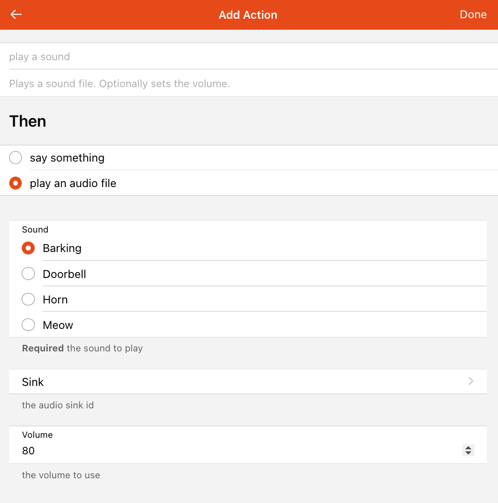

# Multimedia

[[toc]]

## Volume

The framework supports some base [functions](https://openhab.org/javadoc/latest/org/openhab/core/model/script/actions/audio#method.summary) to control the audio sinks' volume.

### Actions

You can set and get the volume in DSL rules by using these functions:

- `setMasterVolume(float volume)` : Sets the volume of the host machine (volume in range 0-1)
- `setMasterVolume(PercentType percent)` : Sets the volume of the host machine
- `increaseMasterVolume(float percent)` : Increases the volume by the given percent
- `decreaseMasterVolume(float percent)` : Decreases the volume by the given percent
- `float getMasterVolume()` : Returns the current volume as a float between 0 and 1

Please refer to the documentation of the [Automation add-ons](/addons/#automation) on how to use these actions from the respective language, e.g. JavaScript or JRuby.

## Audio Capture

openHAB is able to capture audio.

There are different options for input devices (so called audio sources):

The distribution comes with these options built-in:

| Output Device | Audio Source      | Description                                     |
|---------------|-------------------|-------------------------------------------------|
| `javasound`   | System Microphone | This uses the Java Sound API for audio capture. |

Additionally, certain bindings register their supported devices as audio sources, e.g. PulseAudio.

### Console commands

To check which audio sources are available, you can use the console:

```text
openhab> openhab:audio sources
* System Microphone (javasound)
```

You can define the default audio source either by textual configuration in `$OPENHAB_CONF/services/runtime.cfg` or in the UI in `Settings->Audio`.

You can also record wav audio files using the console, you should provide the desired record duration in seconds and its filename, if you do not specify the source the default will be used:

```text
openhab> openhab:audio record javasound 10 hello.wav
```

The generated record will be saved at the folder `$OPENHAB_CONF/sounds`.

## Audio Playback

openHAB is able to play sound either from the file system (files need to be put in the folder `$OPENHAB_CONF/sounds`), from URLs (e.g. Internet radio streams) or generated by text-to-speech engines (which are available as optional [Voice add-ons](/addons/#voice)).

There are different options for output devices (so called audio sinks):

The distribution comes with these options built-in:

| Output Device       | Audio Sink                        | Description                                                                                                                                                                                                                                                                                                                                                  |
|---------------------|-----------------------------------|--------------------------------------------------------------------------------------------------------------------------------------------------------------------------------------------------------------------------------------------------------------------------------------------------------------------------------------------------------------|
| `enhancedjavasound` | System Speaker (with mp3 support) | This uses the JRE sound drivers plus an additional 3rd party library, which adds support for mp3 files.                                                                                                                                                                                                                                                      |
| `webaudio`          | Web Audio                         | Convenient, if sounds should not be played on the server, but on the client: This sink sends the audio stream through HTTP to web clients, which then cause it to be played back by the browser. Obviously, the browser needs to be opened and have a compatible openHAB UI running. Currently, this feature is supported by Main UI, Basic UI and HABPanel. |

Please refer to the [Main UI docs]({{base}}/mainui/about.html#web-audio-sink) for setting up web audio in Main UI.

Additionally, certain bindings register their supported devices as audio sinks, e.g. Sonos speakers.

### Default Audio Sink

You can configure a default audio sink, which will be used if no audio sink is provided in audio and voice actions.

You can define the default audio sink either by textual configuration in `$OPENHAB_CONF/services/runtime.cfg` or in the UI by visitting the **Settings** page and opening **System Settings** -> **Audio**.

### Console commands

To check which audio sinks are available, you can use the console:

```text
openhab> openhab:audio sinks
* System Speaker (enhancedjavasound)
  Web Audio (webaudio)
```

In order to play a sound, you can use the following commands on the console:

```text
openhab> openhab:audio play doorbell.mp3
openhab> openhab:audio play sonos:PLAY5:kitchen doorbell.mp3
openhab> openhab:audio play sonos:PLAY5:kitchen doorbell.mp3 25

openhab> openhab:audio stream example.com
openhab> openhab:audio stream sonos:PLAY5:kitchen example.com
```

You can optionally specify the audio sink between the `play` parameter and the file name and between the `stream` parameter and the URL.
This parameter can even be a pattern including `*` and `?` placeholders; in this case, the sound is played to all audio sinks matching the pattern.
If this parameter is not provided, the sound is played to the default audio sink.
The command to play a file accepts an optional last parameter to specify the volume of playback.

### Actions

Alternatively the [`playSound()`](https://www.openhab.org/javadoc/latest/org/openhab/core/model/script/actions/audio#playSound(java.lang.String)) or [`playStream()`](https://www.openhab.org/javadoc/latest/org/openhab/core/model/script/actions/audio#playStream(java.lang.String)) functions can be used in DSL rules:

- `playSound(String filename)` : plays a sound from the sounds folder to the default sink
- `playSound(String filename, PercentType volume)` : plays a sound with the given volume from the sounds folder to the default sink
- `playSound(String sink, String filename)` : plays a sound from the sounds folder to the given sink(s)
- `playSound(String sink, String filename, PercentType volume)` : plays a sound with the given volume from the sounds folder to the given sink(s)

- `playStream(String url)` : plays an audio stream from an url to the default sink (set url to `null` if streaming should be stopped)
- `playStream(String sink, String url)` : plays an audio stream from an url to the given sink(s) (set url to `null` if streaming should be stopped)

If no audio sink is provided, the default audio sink will be used.

Please refer to the documentation of the [Automation add-ons](/addons/#automation) on how to use these actions from the respective language, e.g. JavaScript or JRuby.

UI-based rules support audio actions as well.
Just create or edit a rule, add a new action, select "Audio & Voice" and the UI will then guide you trough the setup:



Visit the [Blockly docs]({{base}}/configuration/blockly/rules-blockly-voice-and-multimedia.html) to learn how to use audio actions from Blockly.

#### Examples

```java
playSound("doorbell.mp3")
playSound("doorbell.mp3", new PercentType(25))
playSound("sonos:PLAY5:kitchen", "doorbell.mp3")
playSound("sonos:PLAY5:kitchen", "doorbell.mp3", new PercentType(25))

playStream("example.com")
playStream("sonos:PLAY5:kitchen", "example.com")
```

You will find more examples in the documentation of the [Automation add-ons](/addons/#automation) and the [Blockly docs]({{base}}/configuration/blockly/rules-blockly-voice-and-multimedia.html).

## Voice

### Text-to-Speech

In order to use text-to-speech, you need to install at least one [TTS service](/addons/#voice).

#### Default TTS Service & Voice

You can define a default TTS service and a default voice to use either by textual configuration in `$OPENHAB_CONF/services/runtime.cfg` or in the UI by visitting the **Settings** page and opening **System Settings** -> **Voice**.

#### Console Commands

To check which Text-to-Speech services are available, you can use the console:

```text
openhab> openhab:voice ttsservices
* VoiceRSS (voicerss)
```

Once you have installed at least one text-to-speech service, you will find voices available in your system:

```text
openhab> openhab:voice voices
  VoiceRSS - allemand (Allemagne) - Hanna (voicerss:deDE_Hanna)
  VoiceRSS - allemand (Allemagne) - Jonas (voicerss:deDE_Jonas)
  VoiceRSS - allemand (Allemagne) - Lina (voicerss:deDE_Lina)
  VoiceRSS - allemand (Allemagne) - default (voicerss:deDE)
  VoiceRSS - allemand (Autriche) - Lukas (voicerss:deAT_Lukas)
  VoiceRSS - allemand (Autriche) - default (voicerss:deAT)
  VoiceRSS - allemand (Suisse) - Tim (voicerss:deCH_Tim)
  VoiceRSS - allemand (Suisse) - default (voicerss:deCH)
...
  VoiceRSS - français (France) - Axel (voicerss:frFR_Axel)
  VoiceRSS - français (France) - Bette (voicerss:frFR_Bette)
  VoiceRSS - français (France) - Iva (voicerss:frFR_Iva)
* VoiceRSS - français (France) - Zola (voicerss:frFR_Zola)
  VoiceRSS - français (France) - default (voicerss:frFR)
...
  VoiceRSS - vietnamien (Vietnam) - Chi (voicerss:viVN_Chi)
  VoiceRSS - vietnamien (Vietnam) - default (voicerss:viVN)
```

In order to say a text, you can enter such a command on the console (The default voice and default audio sink will be used):

```text
openhab> openhab:voice say Hello world!
```

#### Actions

Alternatively you can execute such commands within DSL rules by using the [`say()`](https://www.openhab.org/javadoc/latest/org/openhab/core/model/script/actions/voice#say(java.lang.Object)) function:

- `say(Object text)` : says a given text with the default voice
- `say(Object text, PercentType volume)` : says a given text with the default voice and the given volume
- `say(Object text, String voice)` : says a given text with a given voice
- `say(Object text, String voice, PercentType volume)` : says a given text with a given voice and the given volume
- `say(Object text, String voice, String sink)` : says a given text with a given voice through the given sink
- `say(Object text, String voice, String sink, PercentType volume)` : says a given text with a given voice and the given volume through the given sink

You can select a particular voice (second parameter) and a particular audio sink (third parameter).
If no voice or no audio sink is provided, the default voice and default audio sink will be used.

Please refer to the documentation of the [Automation add-ons](/addons/#automation) on how to use these actions from the respective language, e.g. JavaScript or JRuby.

UI-based rules support voice actions as well.
Just create or edit a rule, add a new action, select "Audio & Voice" and the UI will then guide you trough the setup.
The presented dialog will look similar to the one shown [above](#actions-2).

Visit the [Blockly docs]({{base}}/configuration/blockly/rules-blockly-voice-and-multimedia.html) to learn how to use voice actions from Blockly.

##### Examples

```java
say("Hello world!")
say("Hello world!", new PercentType(25))
say("Hello world!", "voicerss:enGB")
say("Hello world!", "voicerss:enGB", new PercentType(25))
say("Hello world!", "voicerss:enUS", "sonos:PLAY5:kitchen")
say("Hello world!", "voicerss:enUS", "sonos:PLAY5:kitchen", new PercentType(25))
```

You will find more examples in the documentation of the [Automation add-ons](/addons/#automation) and the [Blockly docs]({{base}}/configuration/blockly/rules-blockly-voice-and-multimedia.html).

### Speech-to-Text

In order to use Speech-to-Text, you need to install at least one [STT service](/addons/#voice).

#### Console Commands

To check which Speech-to-Text services are available, you can use the console:

```text
openhab> openhab:voice sttservices
* Vosk (voskstt)
```

You can define a default STT service to use either by textual configuration in `$OPENHAB_CONF/services/runtime.cfg` or in the UI in `Settings->Voice`.

### Keyword Spotter

Spotting a keyword is usually the first step to trigger a dialogue with a voice assistant.
In order to spot keyword, you need to install at least one [Keyword Spotter service](/addons/#voice).

#### Console Commands

To check which Keyword Spotter services are available, you can use the console:

```text
openhab> openhab:voice keywordspotters
* Porcupine (porcupineks)
```

You can define a default Keyword Spotter service to use either by textual configuration in `$OPENHAB_CONF/services/runtime.cfg` or in the UI in `Settings->Voice`.

### Human Language Interpreter

Human language interpreters are meant to process prose that e.g., is a result of voice recognition or from other sources.

There are two implementations available by default:

| Interpreter | Type                      | Description                                                                                                                                                   |
|-------------|---------------------------|---------------------------------------------------------------------------------------------------------------------------------------------------------------|
| `rulehli`   | Rule-based Interpreter    | Sends the string as a command to a (configurable, default is "VoiceCommand") item and expects a rule to pick it up and further process it.                    |
| `system`    | Built-in Interpreter      | This is a simple implementation that understands basic home automation commands like "turn on the light" or "stop the music". Explained in more detail below. |

#### Item Permission Model

You can control which Items are exposed to the voice system and can be accessed by human language interpreters.
This allows preventing HLIs from controlling Items that are security-critical and should not be controllable through voice, e.g., locks and garage doors.
Restricting the Items that are exposed and excluding some Items can also improve interpretation performance as fewer Items have to be considered in the interpretation process.

The system evaluates permissions based on the following rules (in order of precedence):

1. **Explicit Configuration**:<br>
   Set the `permission` parameter of the `voiceSystem` metadata for an Item to explicitly configure the permission (allowed values: `NO_ACCESS`, `READ_ONLY`, `READ_WRITE`).
1. **Inheritance**:<br>
   If no permission is explicitly configured on the Item, it inherits the permissions defined on its parent Groups.
1. **Merging & Priority**:<br>
   Parent Group permissions are merged.
   If conflicts arise, the most restrictive permission wins (`NO_ACCESS` > `READ_ONLY` > `READ_WRITE`).
   The permission configured on the closest parent layer takes priority over layers further up the hierarchy.
1. **System Default**:<br>
   If no explicit or inherited permission is resolved, the system default configured in **Implicit Item Permission** (`implicitItemPermission`) under _System Settings_ → _Voice_ is used. The default value is `READ_WRITE`.

You can inspect the resolved permissions accessible or all Items using the console:

```text
openhab> openhab:voice items [--all]
```

This shows a table containing the Item name, resolved permission, and the source of that permission.

#### LLM-based Interpreters

Large Language Model (LLM) based Human Language Interpreters (HLIs) provide advanced, multi-turn conversational capabilities to openHAB by leveraging external AI models (e.g., OpenAI or Google Gemini).
Instead of parsing static grammar rules, these interpreters send natural language instructions to an LLM to interpret user requests.
This approach allows for more natural and dynamic interaction with the system in nearly any language.

##### How LLM-based Interpreters Work

LLM-based HLIs operate on three main concepts:

- **System Prompt**:<br>
  A base set of instructions that defines the AI's persona and guidelines for interacting with openHAB.
  You can customize the base prompt via the **System Prompt** (`systemPrompt`) setting in _System Settings_ → _Voice_.
- **Context**:<br>
  To help the LLM understand the structure of your home, openHAB automatically generates context containing details about your accessible Items (see [Item Permission Model](#item-permission-model)) and injects it into the prompt.
  Both semantic and non-semantic Items are provided to the LLM as context.
- **Tool Calling**:<br>
  As the LLM cannot directly access your home or perform actions, it is equipped with tools.
  When processing a request, the LLM decides which tools to call, and openHAB executes them on behalf of the LLM, passing the results back to the conversation.
  It is important to note that an LLM only acts upon receiving a request, it cannot become active on its own and start controlling your home.

##### Conversations

To support back-and-forth discussions and multi-turn interactions, openHAB stores the conversation history and provides it to the LLM for continued processing.

Conversations can optionally be persistent across restarts and sessions.
The maximum number of messages stored in the conversation history is configurable via the **Conversation History Limit** (`conversationHistoryLimit`) setting under in _System Settings_ → _Voice_.

Conversations can be managed through the console:

- List conversations: `openhab:voice conversations`
- View a conversation: `openhab:voice conversation <conversationId>`
- Delete a conversation: `openhab:voice conversationremove <conversationId>`

##### LLM Tooling Framework

openHAB provides a customizable framework for LLM tooling, allowing to dynamically select the tools that are available to the LLM.
This framework is designed to be extensible and allows developers to integrate custom tools.

The following tools are built-in to the framework:

- **Get Date & Time** (`get-date-time`): Retrieves the current date and time with time zone context.
- **Get Item State** (`item-get-state`): Retrieves the current state of a specific Item, subject to [permission checks](#item-permission-model).
- **Send Command to Item** (`item-send-command`): Sends a command to a specific Item, subject to [permission checks](#item-permission-model).

You can list the available tools using the console:

```text
openhab> openhab:voice llmtools
```

#### Built-in Interpreter

This interpreter is provided by the core framework and always available.
It includes built-in grammar for English, German, French, and Spanish that can be extended using the voiceSystem metadata.
Here are some examples of the built-in English grammar:

```text
increase the <item name>
decrease the <item name>
set the color of the <item name> to red
put the <item name> to next
put the <item name> to previous
play the <item name>
pause the <item name>
rewind the <item name>
fast forward the <item name>
start the <item name>
stop the <item name>
refresh the <item name>
```

For an exact overview of the built-in grammer, you can refer to its [definition in the source code](https://github.com/openhab/openhab-core/blob/main/bundles/org.openhab.core.voice/src/main/java/org/openhab/core/voice/internal/text/interpreter/StandardInterpreter.java#L92).

##### Target Item

The interpreter resolves the Item name based on its label/synonyms and its parent label/synonyms.

An example of the possible situations could be:

If you have `Group` Item labeled as `TV` with a `Dimmer` child `Brightness`:
The interpreter understands these phrases as the same `turn off tv`, `turn off brightness`, `turn off tv brightness` and `turn off brightness tv`.

If you add a Switch child labeled as `Power` to the `TV` group:
The interpreter now also understands the phrases `turn off power`, `turn off tv power` and `turn off power tv`.
But the `turn off tv` phrase now detects a collision because of two matching Items accepting the `OFF` command.

###### Name prevalence

One way you can solve this is by using the name prevalence, Items with start with other Items names take prevalence over them.

If the Switch Item has the name `tv` and the Dimmer Item the name `tv_brightness` there will be no collisions between them and therefore the `OFF` command will target the Switch Item.

###### Exact match label/synonym prevalence

Another way you can solve this is by using the exact match prevalence, Items whose label/synonym match the one in the command exactly take prevalence.

If the Switch Item has the synonym `TV` there will be no collisions between them and therefore the `OFF` command will target the Switch Item.

###### Location prevalence

The dialog processor forwards its configured location Item to the standard interpreter to be used for reducing collisions on the target resolution.

If you have two Items labeled as `Light`  but one is a child of the location Item that has been configured for the dialog execution, the Item takes prevalence.
So the phrase `Turn on the light` will work correctly and turn on the Item at your location.

The location takes prevalence over an exact match.

##### Item Description Rules

The standard interpreter also creates rules for your Item descriptions for English, German, French, and Spanish.

If you have a Dimmer Item called `Light` with command description `100=high` the interpreter will also understand the phrase `Set light to high`.

##### Custom Rules

You can register custom rules for specific Items into the interpreter through `voiceSystem` metadata.

Examples of such rules:

```text
"start? watch|watching $*$ on $name$" -> Matches "start watching some show on tv" and sends command "some show".

"watch|play $*$ on tv" -> Matches "play some show on tv" and sends command "some show".

"watch|play $cmd$" -> Matches "play some show" and sends command "some_show_id", only if the Item metadata `commandDescription` contains `some_show_id=some show`.

"start? watch|watching $cmd$ at|on? $name$" -> Matches "watch some show tv" and sends command "some_show_id", only if Item `commandDescription` contains `some_show_id=some show`.
```

There are some reserved tokens and characters:

- `$name$` defines the place of the Item name (resolved as explained before), is optional.
- `$cmd$` defines the place of a command label, extracted from the Item command description.
- `$*$` defines the place of a command, its value is not constrained.
- `|` defines alternative word tokens.
- `?` defines optional word tokens.

The standard interpreter can be further configured through `voiceSystem` metadata configuration:

- `isTemplate`: The rules defined on this Item will not target that Item but similar Items (Items with same tags and semantic).
- `isSilent`: The interpreter will say nothing in case these rules are executed correctly (a possible use case can be a trigger for a rule on an Item command to answer programmatically).
- `isForced`: Send the command without checking the current Item state (default behavior).
- `permission`: See [Item Permission Model](#item-permission-model).

Note that if the `isTemplate` config is false, the rule target is limited to the Item that registers it. When it's true the Item registering the rule gets excluded of been a valid target.

Note that when you use the option `isTemplate` in rules without the `$name$` token, collisions are still solved based on the location. So you can have a `play $cmd$ here` rule which is scoped to the dialog location.

There are some limitations:

- Rule should contain `$cmd$` or `$*$` but not both.
- Rules that include `$name$` and `$*$` should have at least one non-optional token between them.
- Rules must not start by `$name$` or `$*$`, neither by them prefixed only of optional tokens.
- Rules must not contain `$name$`, `$cmd$` or `$*$` multiple times.

#### Console Commands

To check which human language interpreters are available, you can use the console:

```text
openhab> openhab:voice interpreters
  Built-in Interpreter (system)
* Rule-based Interpreter (rulehli)
```

You can define the default human language interpreter to use either by textual configuration in `$OPENHAB_CONF/services/runtime.cfg` or in Main UI in _System Settings_ → _Voice_.

To test an interpreter, you can enter such a command on the console (assuming you have an Item with label 'light'):

```text
openhab> openhab:voice interpret turn on the light
```

The following command allows specifying the interpreter (e.g. `gemini`) and conversation to use as well as the LLM tools to provide:

```text
openhab> openhab:voice interpret --hli gemini --conversation conv-1 --llm-tools get-item-state,send-item-command turn on the kitchen light
```

In case of interpretation error, the error message will be said using the default voice and default audio sink.

An overview of available commands can be obtained by entering `openhab:voice`.

#### Actions

Alternatively you can execute such commands within DSL rules using the [`interpret()`](https://www.openhab.org/javadoc/latest/org/openhab/core/model/script/actions/voice#interpret(java.lang.Object)) function:

- `interpret(Object text)` : interprets a given text by the default human language interpreter
- `interpret(Object text, String interpreters)` : interprets given text by given human language interpreter(s)
- `interpret(Object text, String interpreters, String sink)` : interprets a given text by given human language interpreter(s) and using the given sink
- `interpret(Object text, String interpreters, String conversationId, String llmTools)` : interprets a given text by given human language interpreter(s) in the given conversation and using the provided LLM tools

If no human language interpreter or no audio sink is provided, the default human language interpreter and default audio sink will be used.

The human language interpreter(s) parameter must be the ID of an installed interpreter or a comma-separated list of interpreter IDs; each provided interpreter is executed in the provided order until one is able to interpret the command.

The LLM tools parameter must be a comma-separated list of LLM tool IDs to be provided to the interpreter.

The audio sink parameter is used when the interpretation fails; in this case, the error message is said using the default voice and the provided audio sink.
If the provided audio sink is set to null, the error message will not be said.

The interpretation result is returned as a string.
Note that this result is always a null string with the rule-based Interpreter (rulehli).

##### Examples

```java
interpret("turn on the light")
var String result = interpret("turn on the light", "system")
result = interpret("turn on the light", "system", null)
result = interpret("turn on the light", "system,rulehli")
result = interpret(VoiceCommand.state, "system", "sonos:PLAY5:kitchen")
result = interpret("turn on the kitchen light", "gemini", "", "get-date-time,item-get-state,item-send-command")
```

### Voice Assistant

openHAB embeds a dialog processor based on the services previously presented on this page.
With this dialog processor and these services, openHAB can become a voice assistant dedicated to home automation.
Here are the components needed to instantiate a voice assistant:

- an audio source: the audio device that will listen for user speaking,
- a keyword spotter: this will detect the keyword defined by the user to start a dialogue,
- a Speech-to-Text service: captured audio will be converted into text,
- one (or more) interpreter(s): the text will be analyzed and converted into commands in the automation system and a response will be produced,
- a Text-to-Speech service: the text response will be converted into an audio file,
- an audio sink: the audio file will be played to be heard by the user.

The quality of the voice assistant will of course depend on the quality of each of the selected components.

Your openHAB server can run multiple voice assistants but can only run one voice assistant for a given audio source.

After you start a voice assistant, it will live until you stop it, which means it will continue to detect keyword and handle dialogues.

However, there is a special mode that allows handling a single dialogue, bypassing keyword detection and starting to listen for user request immediately after running it.
You do not need to stop it, it stops automatically after handling the user request.
It's something you could run in a rule triggered by a particular user action, for example.
This mode is executed using the `listenAndAnswer`command.

#### Console Commands

To start and stop a voice assistant, you can enter such commands on the console:

```text
# start a dialog
openhab> openhab:voice startdialog --source javasound --sink sonos:PLAY5:kitchen --hlis system,rulehli --stt voicerss --tts voskstt --keyword terminator --ks rustpotterks
# list running dialogs
openhab> openhab:voice dialogs
# register a dialog (same as start but persisting the configuration to spawn dialog on restart or temporal service unavailability).
openhab> openhab:voice registerdialog --source javasound --sink sonos:PLAY5:kitchen --hlis system,rulehli --tts voicerss --stt voskstt --keyword terminator --ks rustpotterks
# list dialogs registrations
openhab> openhab:voice dialogregs
# stop a dialog
openhab> openhab:voice stopdialog --source javasound
# unregister a dialog, and stop if running
openhab> openhab:voice unregisterdialog --source javasound
# run single shot dialog
openhab> openhab:voice listenandanswer --source javasound --sink sonos:PLAY5:kitchen --hlis system,rulehli --tts voicerss --stt voskstt --keyword terminator --ks rustpotterks
# run transcription and output to the console
openhab> openhab:voice transcribe --source javasound --stt voskstt
```

When an argument is not provided in the command line, the default from the voice settings is used.
If no default value is set in voice settings, the command will fail.

You can select particular human language interpreter(s).
This parameter must be the ID of an installed interpreter or a comma separated list of interpreter IDs; each provided interpreter is executed in the provided order until one is able to interpret the command.

If the language is defined in the regional settings, it is used as the language for the voice assistant; if not set, the system default locale is assumed.
To not fail, the keyword spotter, the Speech-to-Text and Text-to-Speech services, and the interpreters must support this language.

You can select a particular voice for the Text-to-Speech service.
If no voice is provided, the voice defined in the regional settings is preferred.
If this voice is not associated with the selected Text-to-Speech service or not applicable to the language used, any voice from the selected Text-to-Speech service applicable to the language being used will be selected.

Using the 'Listening Melody' in the voice settings, you can configure an acoustic melody to be played when the keyword is spotted before the voice command recognition stars.

Other interesting options for the dialog initialization are:

- --dialog-group `<group name>`: You can prevent simultaneous execution of dialogs by assigning them to same group, by default they are assigned the 'default' group.
- --location-item `<ItemName>`: You can provide an Item as location context for the dialogs, the interpreters can take advantage of these.
- --listening-item `<ItemName>`: You  can configure an Item to be "ON"/"OFF" on recognition start/stop, useful for example to trigger a rule that mutes the surrounding devices.

#### Actions

Alternatively you can execute such commands within DSL rules using the [`startDialog()`](https://www.openhab.org/javadoc/latest/org/openhab/core/model/script/actions/voice#startDialog(java.lang.String,java.lang.String)), [`stopDialog()`](https://www.openhab.org/javadoc/latest/org/openhab/core/model/script/actions/voice#stopDialog(java.lang.String)) and [`listenAndAnswer()`](https://www.openhab.org/javadoc/latest/org/openhab/core/model/script/actions/voice#listenAndAnswer(java.lang.String,java.lang.String)) functions:

- `startDialog(String source, String sink)` : starts dialog processing for a given audio source
- `startDialog(String ks, String stt, String tts, String voice, String interpreters, String source, String sink, String locale, String keyword, String listeningItem)` : starts dialog processing for a given audio source
- `stopDialog(String source)` : stops dialog processing for a given audio source
- `listenAndAnswer(String source, String sink)` : executes a simple dialog sequence without keyword spotting for a given audio source
- `listenAndAnswer(String stt, String tts, String voice, String interpreters, String source, String sink, String locale, String listeningItem)` : executes a simple dialog sequence without keyword spotting for a given audio source

Each parameter can be `null`; in this case, the default from the voice settings is used.
If no default value is set in the voice settings, the action will fail.

You can select particular human language interpreter(s).
The `interpreters` parameter for `startDialog` and `listenAndAnswer` must be the ID of an installed interpreter or a comma separated list of interpreter IDs; each provided interpreter is executed in the provided order until one is able to interpret the command.

The `locale` parameter for `startDialog` and `listenAndAnswer` is the language to be used by the voice assistant.
If `null` is provided, the language defined in the regional settings is used; if not set, the system default locale is assumed.
To not fail, the keyword spotter, the Speech-to-Text and Text-to-Speech services, and the interpreters must support this language.

The `voice` parameter for `startDialog` and `listenAndAnswer` is the voice to be used by the Text-to-Speech service.
If `null` is provided, the voice defined in the regional settings is preferred.
If this voice is not associated with the selected Text-to-Speech service or not applicable to the language used, any voice from the selected Text-to-Speech service applicable to the language being used will be selected.

The `listeningItem` parameter for `startDialog` and `listenAndAnswer` is the Item name of the listening switch.
This Item is switched on during the period when the dialog processor has spotted the keyword and is listening for commands.
If `null` is provided, the default Item from the voice settings is used.
If not set, no Item will be switched on and off.

##### Examples

```java
startDialog(null, null)
stopDialog(null)

startDialog("javasound", "sonos:PLAY5:kitchen")
stopDialog("javasound")

startDialog("porcupineks", "voskstt", "voicerss", "voicerss:frFR_Zola", "system,rulehli", "javasound", "sonos:PLAY5:kitchen", "fr-FR", "terminator", "listeningItem")
stopDialog("javasound")

listenAndAnswer(null, null)
listenAndAnswer("javasound", "sonos:PLAY5:kitchen")
listenAndAnswer("voskstt", "voicerss", "voicerss:frFR_Axel", "system,rulehli", "javasound", "sonos:PLAY5:kitchen", "fr-FR", "listeningItem")
```
