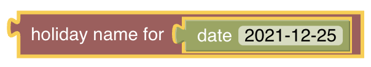

# Ephemeris
[return to Blockly Reference]({{base}}/configuration/rules-blockly.html)

## Introduction

The ephemeris category provides blocks with calendar functionality. The blocks can be used to determine what type of day today is, or a number of days before or after today is. For example, a way to determine if today is a weekend, a bank holiday, someone’s birthday, trash day, etc.

Definition of holidays can be customised through the *ephemeris.cfg* file. See the [Ephemeris configuration page](https://www.openhab.org/docs/configuration/actions.html#configuration) for more information.

{::options toc_levels="2..4"/}

- TOC
{:toc}

{: #blockly-ephemeris-overview}

## Overview of the Ephemeris blocks

## Ephemeris Blocks

### Holiday, weekend or weekday check

*Function:* this block checks if the given date is a holiday, weekday or weekend.

Type: _boolean_ `true` or `false`

**Examples**

### Get the holiday name for a particular date

*Function:* Returns the holiday name for the given date. Will return `null` if no holiday is found for the date.

Type: _String_

### Get the number of days until a specific holiday

Function: Return the number of days until the given holiday name, or `-1` if the holiday is not found.

Type: _number_

Some holidays are already provided by default from openHAB. Additional holidays must be configured in *ephemeris.cfg*.

## Return to Blockly Reference

[return to Blockly Reference]({{base}}/configuration/rules-blockly.html)
