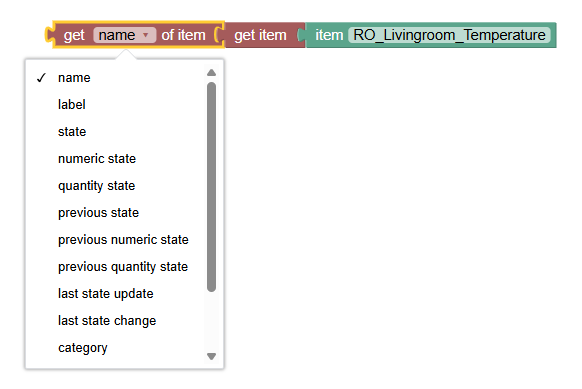

# Items &  Things
[return to Blockly Reference]({{base}}/configuration/rules-blockly.html)

*Items* and *Things* are the [major entities of openHAB](https://www.openhab.org/docs/concepts/) to control and monitor the home. These can be accessed via the "Items & Things" section of the [Blockly Toolbox]({{base}}/configuration/rules-blockly.html#blockly-toolbox).

{::options toc_levels="2..4"/}

- TOC
{:toc}

{: #blockly-items-and-things-overview}

## Overview of the Items and Things category

> 


### Item and Thing Blocks
Most of the time you will want to get and set the state of an *item* - set a switch to ON, or get a temperature. Sometimes you may want to access the *thing* directly. Both are possible using the item-block and thing-block

> 

However, these blocks are not useful by themselves - they are always used together with another block. The example below uses the *get state of item* block to retrieve the *MainSwitch* *item* state, before checking if that is equal to ON within a standard comparison block


## Items

### Item


Function: Retrieves a specific **Item** or **Group** for use in other item related functions.

* Clicking 'MyItem' displays a list of **Items** to pick from
* Technically this block returns the *name* of the item as a String. As a result, this block can be used wherever the item name is required as a String.
* Learn more about items [here](https://www.openhab.org/docs/configuration/items.html)

### Get Item


Function: Gets an **Item** for use in other item related functions

* Clicking 'MyItem' displays a list of **Items** to pick from.
* Technically this block returns an item *object*, to be used to retrieve specific attributes using other blocks (see below).
* As this block does not return a String it cannot be directly attached to a log-block, as demonstrated below.


### Get State of Item


Function: Get the current state of an **Item** or **Group**

* Should return the state of an item as a String like ON/OFF, the temperature value etc.

Note: currently a String is not always returned. [See this thread](https://community.openhab.org/t/blockly-cannot-split-text-string-from-string-item/130819) for reference and potential workaround.

### Get Members of Group


Function: Gets the members of a **group**

* returns a collection of items which should be used with a for-each-block to loop over the items
* it can be attached to a log-block which would list all items in that block in the form a string representation as follows
````
GF_IndirectLights (Type=GroupItem, BaseType=SwitchItem, Members=9, State=OFF, Label=Indirekten Lichter, Category=light, Tags=[Lightbulb], Groups=[Lights]),LichterOG (Type=GroupItem, BaseType=SwitchItem, Members=4, State=ON, Label=Lichter OG, Category=light, Groups=[Lights]),LichterEG (Type=GroupItem, BaseType=SwitchItem, Members=5, State=ON, Label=Lichter EG, Category=light, Groups=[Lights])
````
* Alternatively you can use the item block var the loop variable to send a command to the items of the group

The following example depicts the above possibilities:


### Get particular attributes of an item



Function: Get either the current name, label, state, category, tags, groups, or type of an item as a String

These attributes are returned with the following types:
* name: String
* label: String
* state: State
* category: String
* tag: Array, e.g.
```
[plannedTimes]
```
* groups: Array, e.g.
```
[plannedTimes, timers]
```
* type: String

Depending on your openHAB version (pre-3.3) this block may not connect as expected. As a workaround attach the block to a variable first, and use the variable in the rest of the script.


**Special handling for Arrays**

The attributes *groups* and *tags* return an Array of entries.  Therefore
* they *cannot* be connected to a block that expects a String (e.g. log-block)
* they *must* be handled using a for-loop as follows


### Send Command


Function: Sends a command or posts an update to an **Item** or **Group**.

* value: any state value that is allowed for that item, eg. ON or OFF for a switch.
* Clicking 'MyItem' displays a list of **Items** to pick one item from

For the difference between *send command* and *post update* two check ["Manipulating States"](https://www.openhab.org/docs/configuration/rules-dsl.html#manipulating-item-states).

**Item-block examples**

**Example 1:**
* Check if *MainSwitch* is ON.
* If ON, send ON command to *livingroomLight* item.


**Example 2:**
* Get the state of *MainSwitch* and
* Immediately send it as a command to *F2_Office_Main_Light*


Ensure that the receiving item can handle the state of the 'sending' item.

## Things

### Thing


Function: Retrieves a specific **Thing** for use in other thing related functions.

* Clicking 'MyThing' displays a list of **Things** to pick from
* Technically this block returns the thingUid of the thing as a String
* Learn more about things [here](https://www.openhab.org/docs/configuration/things.html)

**Example**


will write the following into the log

```text
thing name = nanoleaf:controller:645E3A484A83
```

### Get Thing Status


Function: Gets a **Thing Status** for use in other Thing related functions

* Clicking 'MyThing' displays a list of **Things** to pick from.
* Technically this block returns a [ThingStatus](https://www.openhab.org/docs/concepts/things.html#thing-status)  - a String with one of the following statuses
  * UNINITIALIZED
  * INITIALIZING
  * UNKNOWN
  * ONLINE
  * OFFLINE
  * REMOVING
  * REMOVED


## Return to Blockly Reference

[return to Blockly Reference]({{base}}/configuration/rules-blockly.html)
