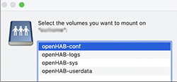

# Blockly Reference

One of the core feature that OpenHAB provides is writing rules to allow specific behaviour with the home automation system. The usual way of developing rules is by coding them like described in the [Textual Rules]({{base}}/configuration/rules-dsl.html). However, this art of programming may become intimidating early on and shy away away people with few or almost no experience in programming. Therefore openHAB also provides a graphical way of writing rules which allows to put together rules in a rather visual way (even though some programming background may still help).

{::options toc_levels="2..4"/}

- TOC
{:toc}

{: #blockly-introduction}
## Introduction

The basic idea behind the visual paradigm and representation within openHAB is based on the [Google Blockly Support](https://developers.google.com/blockly) which has been integrated and which provides the basic blocks for programming like the ones on the left and the right side of the below images

{: #blockly-toolbox}
*Blockly toolbox*

All of these provide general functionality that is not specific to openHAB itself. If you want to learn more about how to use them, search for the many blockly tutorials that are available.
However, to leverage the full capabilities more than *50 specific blocks* have been provided that are tailored for easy access of openHAB's capabilities.

This section provides a detailed description of the specific blocks and provides examples on how to use them. Note that some of the blocks (like voice, streaming or notifications) need some special setup within openHAB  - in these case links to the respective documentation is provided. It should also be mentioned that each of the blocks do have a context sensitive menu which appears upon a right click on the block itself.

*Block context menu*

**Looking for help**

A special mention should go towards the **Help** entry that links to a resource that is usually very helpful to understand the context of that particular block. Please read this information first before asking questions in the forum. *In case you ask for help please always post the respective code that is being generated.*

## Before using openHAB Blocklies

### **OpenHAB Configuration Files**

Some openHAB blocks rely on particular configuration files found in the openHAB configuration folder. This folder is referred to as $OPENHAB_CONF in this page, and the location of this folder for your setup can be found via the UI: *Help & About* -> *Technical Information* -> *Configuration folder*.

- via mounting the files shares from the server to your client-PC. In the main UI as an admin you can go to *Help & About* and will have the different folder locations under *Technical information*.
  - the exact configuration of the shares can be found on your server at [/etc/samba/smb.conf](https://github.com/openhab/openhabian/blob/main/includes/smb.conf).
- Use the share *openHAB*-conf when mounting it from Windows or MacOS

**Link the openHAB share in Windows**
- Find you openHAB-Server via the network share functionality
- User the share *openHAB*-conf to assign it to a network drive

**Link the openHAB share in macOS**

- Finder -> Go -> Connect to Server
  - Enter the username and server name to connect to the openHAB Server

  
  - then choose the folder you want to mount

  

**Finding it on Linux**
- Access the folder directly on the openHAB server at */etc/openhab*

All methods reveal the following folders
  - html
  - icons
  - items
  - services
  - html
  - persistence
  - rules
  - scripts
  - sitemaps
  - sounds
  - things
  - transform

### Creating a blockly rule via the UI
  - go to Settings -> Rules
  - press  on bottom right
  - enter a unique id and rule name for your new blockly rule
  - Under "When" click on "Add Trigger" to define a trigger for the rule (you may add multiple triggers which are perceived as any of those triggers may occurs which stands for an OR combination of the triggers)
    - choose a title for the rule
    - choose "item" (or something else) that should trigger the rule
    - select the item from your model and the click PICK on the upper right corner
    - choose "received a command", "was updated" or "changed"
  - Under "Then" click on "Add Action"
  - choose 
  - click on  und you should now see this screen
  
  - you can now click the  to access all openHAB Blocks.
  - Drag and Drop the blocks to the white area
  - Press `Ctrl-s` (Windows) or `Command-s` (MacOS) to save your rule
  - Press `Ctrl-r` (Windows) or `Command-r` (MacOS) to directly run your rule with the trigger
  - Press `Ctrl-d` (Windows) or `Command-d` (MacOS) to disable / enable your rule
  - Click on  on the lower right to see the generated code (click again to come back to the blocks)

### Use Frontail for viewing log files
During development the log-block is lot very often which writes information into the log files.

- To be able to conveniently view your log files it is recommended to setup *frontail* which can be achieved easily via [openhabian-config](https://www.openhab.org/docs/installation/openhabian.html#optional-components)
- Start `openhabian-config` on your server and choose option 20 and then option 21
- After installation you can view your logs under http://myopenhab-server:9001 (adapt the server name)
- **see [how to log](https://www.openhab.org/docs/administration/logging.html)**

## Items and Things

*Items* and *Things* are the [major entities of openHAB](https://www.openhab.org/docs/concepts/) to control and monitor the home.

See [Items & Things](rules-blockly-items-things.html) section
## Timers and Delays

Timers and Delays are a little more complex but add important functionality to rules. Whilst the “Wait-For”-block is straightforward, the timer blocks should be well understood before being used - they may behave differently than expected. This chapter explains what these blocks do, sometimes displaying generated code to explain what is happening behind the scenes.

See [Timers and Delays](rules-blockly-items-things.html) section.

## Further useful information

- [Getting Started: Rules - Blockly](https://community.openhab.org/t/getting-started-rules-blockly/132453)
- [Extending Blockly with new openHAB commands](https://community.openhab.org/t/extending-blockly-with-new-openhab-commands/127169)
