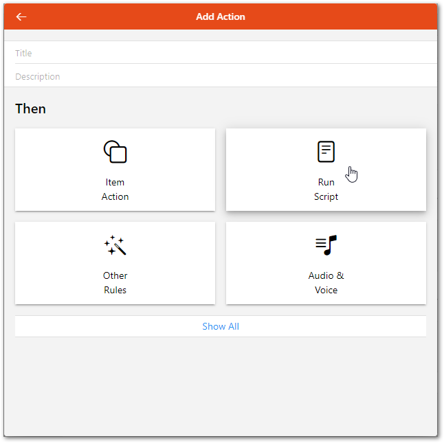

# Textual Rules

"Rules" are used for automating processes: Each rule can be triggered, which invokes a script that performs any kinds of tasks, e.g. turn on lights by modifying your items, do mathematical calculations, start timers etcetera.

Note that there is also a visual way of programming openHAB rules, which may be more suitable for beginners. Its documentation can be found in the [Blockly Reference section]({{base}}/configuration/blockly/)

openHAB has a highly integrated, lightweight but yet powerful rule engine called _Rules DSL_ included.
On this page you will learn how to leverage its functionality to do _real_ home automation.

[[toc]]

## Defining Rules

### File Location

Rules are placed in the folder `$OPENHAB_CONF/rules`.
The [demo setup](https://demo.openhab.org) already comes with a demo file called [`demo.rules`](https://github.com/openhab/openhab-distro/blob/main/distributions/openhab-demo/src/main/resources/conf/rules/demo.rules), which has a couple of examples that can be a good starting point.

A rule file can contain multiple rules.
All rules of a file share a common execution context, i.e. they can access and exchange variables with each other.
It therefore makes sense to have different rule files for different use-cases or categories.

### UI based definition

Rules can be created and edited with in the UI.
You can find the editor browsing to `Settings` -> `Rules`.
Click on the `+` icon to add a rule and define a name and a trigger.

  

In our example we will catch the openHAB Startup to initialize our environment.

  

Click on `Add Action` and choose `Run Script`.

  

Choose `Rule DSL` and enter a rule like it is described below in this article.

### IDE Support

The [openHAB VS Code Extension]({{base}}/configuration/editors.html#openhab-vs-code-extension) offers support for rules building.
It includes syntax checks and coloring, validation with error markers, content assist (Ctrl+Space) incl. templates etc.
This makes the creation of rules very easy!
Check out the editors page for more information and additional editor possibilities.

### The Syntax

::: tip Note
The rule syntax is based on [Xbase](https://www.eclipse.org/Xtext/#xbase) and as a result it is sharing many details with [Xtend](https://www.eclipse.org/xtend/), which is built on top of Xbase as well.
As a result, we will often point to the Xtend documentation for details.
:::

A rule file is a text file with the following structure:

- Imports
- Variable Declarations
- Rules

The **Imports** section contains import statement just like in Java.
As in Java, they make the imported types available without having to use the fully qualified name for them.
For further details, please see the [Xtend documentation for imports](https://www.eclipse.org/xtend/documentation/202_xtend_classes_members.html#imports).

Example:

```javascript
import java.net.URI
```

A few default imports are already done, so classes from these packages do not need to be explicitly imported:

```java
org.openhab.core.items
org.openhab.core.persistence
org.openhab.core.library.types
org.openhab.core.library.items
org.openhab.model.script.actions
```

The **Variable Declarations** section can be used to declare variables that should be accessible to all rules in this file.
You can declare variables with or without initial values and modifiable or read-only.
For further details, please see the [Xtend documentation for variable declarations](https://www.eclipse.org/xtend/documentation/203_xtend_expressions.html#variable-declaration).

Example:

```java
// a variable with an initial value. Note that the variable type is automatically inferred
var counter = 0

// a read-only value, again the type is automatically inferred
val msg = "This is a message"

// an uninitialized variable where we have to provide the type (as it cannot be inferred from an initial value)
var Number x
```

The **Rules** section contains a list of rules.
Each rule has the following syntax:

```java
rule "<RULE_NAME>"
when
    <TRIGGER_CONDITION> [or <TRIGGER_CONDITION2> [or ...]]
then
    <SCRIPT_BLOCK>
end
```

- `<RULE_NAME>` - Each rule must have a unique name (given within quotes). It is recommended that you choose a name that has meaning when spoken.
- `<TRIGGER_CONDITION>` - The triggering event upon which the rule logic is executed. A rule is executed in reaction to one or more trigger conditions. Multiple conditions are separated by the keyword `or`. Please see below for different possible triggers.
- `<SCRIPT_BLOCK>` - Contains the logic that should be executed when a trigger condition is met, see the [script](#scripts) section for details on its syntax.

### Rule Triggers

Before a rule starts working, it has to be triggered.

There are different categories of rule triggers:

- **Item**(-Event)-based triggers: They react on events on the openHAB event bus, i.e. commands and status updates for items
- **Member of**(-Event)-based triggers: They react on events on the openHAB event bus for Items that are a member of the supplied Group
- **Time**-based triggers: They react at special times, e.g. at midnight, every hour, etc.
- **System**-based triggers: They react on certain system statuses.
- **Thing**-based triggers: They react on thing status, i.e. change from ONLINE to OFFLINE.

Here are the details for each category:

### Event-based Triggers

You can listen to commands for a specific item, on status updates or on status changes (an update might leave the status unchanged).
You can decide whether you want to catch only a specific command/status or any.
Here is the syntax for all these cases (parts in square brackets are optional):

```java
Item <item> received command [<command>]
Item <item> received update [<state>]
Item <item> changed [from <state>] [to <state>]
```

A simplistic explanation of the differences between `command` and `update` can be found in the article about [openHAB core actions](/docs/configuration/actions.html#event-bus-actions).

When using the `received command` trigger, the Rule might trigger **before** the Item's state is updated.
Therefore, if the Rule needs to know what the command was, use the [implicit variable]({{base}}/configuration/rules-dsl.html#implicit-variables-inside-the-execution-block) `receivedCommand` instead of `<ItemName>.state`.

### Member of Triggers

As with Item based event-based triggers discussed above, you can listen for commands, status updates, or status changes on the members of a given Group.
You can also decide whether you want to catch only a specific command/status or any.
All of the [implicit variables]({{base}}/configuration/rules-dsl.html#implicit-variables-inside-the-execution-block) get populated using the Item that caused the event.
The implicit variables `triggeringItem` and `triggeringItemName` are populated with the Item and the item name that caused the Rule to trigger.
The implicit variables `triggeringGroup` and `triggeringGroupName` are populated with the Group and the group name specified in the trigger, whose member caused the Rule to trigger.

```java
Member of <group> received command [<command>]
Member of <group> received update [<state>]
Member of <group> changed [from <state>] [to <state>]
```

The `Member of` trigger only works with Items that are a direct member of the Group.
It does not work with members of nested subgroups.
Also, as with Item event-based triggers, when using `received command`, the Rule might trigger before the Item's state is updated.
So in Rules where the Rule needs to know what the command was, use the `receivedCommand` implicit variable instead of `triggeringItem.state`.

### Time-based Triggers

You can either use some pre-defined expressions for timers or use a [cron expression](https://www.quartz-scheduler.org/documentation/quartz-2.2.2/tutorials/tutorial-lesson-06.html) or an item instead:

```java
Time is midnight
Time is noon
Time is <item> [timeOnly] [offset=N]
Time cron "<cron expression>"
```

A cron expression takes the form of six or optionally seven fields:

1. Seconds
1. Minutes
1. Hours
1. Day-of-Month
1. Month
1. Day-of-Week
1. Year (optional field)

You may use the generator at [FreeFormatter.com](https://www.freeformatter.com/cron-expression-generator-quartz.html) to generate your cron expressions.

When using an item and you want to ignore the date-portion of that item the `timeOnly` option can be used.
A positive or negative offset in seconds, relative to the date/time of the given item can be specified.

### System-based Triggers

System-based triggers are provided as described in the table below:

| Trigger                              | Description                                                                                                                                                                                                                                          |
| ------------------------------------ | ---------------------------------------------------------------------------------------------------------------------------------------------------------------------------------------------------------------------------------------------------- |
| System started                       | `System started` is triggered upon openHAB startup. In openHAB version 2, `System started` is also triggered after the rule file containing the System started trigger is modified, or after item(s) are modified in a .items file.                  |
| System reached start level `<level>` | `System reached start level <level>` is triggered when openHAB reaches a specific start level. A list of possible start levels is available below. Please note that only levels 40 and higher are useful as the rule engine needs to be ready first. |

You may wish to use the 'System started' trigger to initialize values at startup if they are not already set.

Example:

```java
rule "Speedtest init"
when
    System started
then
    if (Speedtest_Summary.state == NULL || Speedtest_Summary.state == "") Speedtest_Summary.postUpdate("unknown")
end
```

You can then execute a rule on the next startup level which depends on the value set by the initialization rule.

Example:

```java
rule "Speedtest update"
when
    System reached start level 50
then
    logInfo("Speedtest", "We now have the following state right after startup: " + Speedtest_Summary.state)
end
```

In openHAB version 3 the System-based Trigger for startlevel had been added, values depends on the startlevel:

```text
00 - OSGi framework has been started.
10 - OSGi application start level has been reached, i.e. bundles are activated.
20 - Model entities (items, things, links, persist config) have been loaded, both from db as well as files.
30 - Item states have been restored from persistence service, where applicable.
40 - Rules are loaded and parsed, both from db as well as dsl and script files.
50 - Rule engine has executed all "system started" rules and is active.
70 - User interface is up and running. (planned, not included yet)
80 - All things have been initialized. (planned, not included yet)
100 - Startup is fully complete.
```

Startlevels less than 40 are not available as triggers because the rule engine needs to start up first before it can execute any rules.

A rule that triggers for a start level and is saved during development is reloaded, if the expected startlevel (or higher) has been reached.
The reason behind is that updated rules are considered as new rules.

Writing rules with quite low startlevels might be too early, as for instance not all things are online yet.

Example:

```java
rule "Start level reload"
when
    System reached start level 70
then
    logInfo("StartLevelTest", "triggered a second time, if active rule being edited and saved another time.")
    logInfo("StartLevelTest", "You won´t realize this behaviour under regular run conditions, each start level is reached exactly once.")
end
```

### Thing-based Triggers

Your rules can take actions based upon status updates or status changes generated by Things.
You can decide whether you want to catch only a specific or any status the Thing can get updated too.
Here is the syntax for all these cases (parts in square brackets are optional):

```java
Thing <thingUID> received update [<status>]
Thing <thingUID> changed [from <status>] [to <status>]
```

The status used in the trigger is a string (no quotes).
You can find all the possible values for status from [Thing Status](/docs/concepts/things.html).

The `thingUID` is the identifier assigned to the Thing, manually in your configuration or automatically during auto discovery.
You can find it from UI or from Karaf remote console.
For example, one z-wave device can be "zwave:device:c5155aa4:node14".
The `*` wildcard is allowed in the `thingUID`.
For example, `chromecast:*` will trigger on all `chromecast` Things and `*` will trigger on all things.

If the Rule needs to know what the triggering thing was, or access a string value of the previous or new status, use the [implicit variables]({{base}}/configuration/rules-dsl.html#implicit-variables-inside-the-execution-block) `triggeringThing`, `previousThingStatus` or `newThingStatus` to access the information.

Refer to [Thing Status Action](/docs/configuration/actions.html#thing-status-action) to find how to get the new thing status details or description in the script.

::: tip Note
You need to use quotes around `thingUID` if it contains special characters such as ':'.
:::

### Channel-based Triggers

Some add-ons provide trigger channels.
Compared with other types of channels, a trigger channel provides information about discrete events, but does not provide continuous state information.

Your rules can take actions based upon trigger events generated by these trigger channels.
You can decide whether you want to catch only a specific or any trigger the channel provides.
Here is the syntax for these cases (parts in square brackets are optional):

::: tip Note
You need to use quotes around `triggerChannel` if it contains special characters such as `:`.
:::

```java
Channel "<triggerChannel>" triggered [<triggerEvent>]
```

`triggerChannel` is the identifier for a specific channel.

When a binding provides such channels, you can find the needed information in the corresponding binding documentation.
There is no generic list of possible values for `triggerEvent`,
The `triggerEvent`(s) available depend upon the specific implementation details of the binding.
If the Rule needs to know what the received event or the triggering channel was, use the [implicit variable]({{base}}/configuration/rules-dsl.html#implicit-variables-inside-the-execution-block) `receivedEvent` or `triggeringChannel` to access the information.

Example:

```java
rule "Start wake up light on sunrise"
when
    Channel "astro:sun:home:rise#event" triggered START
then
    ...
end
```

## Scripts

The expression language used within scripts is the same that is used in the Xtend language - see the [documentation of expressions](https://www.eclipse.org/xtend/documentation/203_xtend_expressions.html) on the Xtend homepage.

The syntax is very similar to Java, but has many nice features that allow writing concise code.
It is especially powerful in handling collections.
What makes it a good match for openHAB from a technical perspective is the fact that there is no need to compile the scripts as they can be interpreted at runtime.

To be able to do something useful with the scripts, openHAB provides access to

- all defined items, so that you can easily access them by their name
- all enumerated states/commands, e.g. `ON, OFF, DOWN, INCREASE` etc.
- all [standard actions](https://github.com/openhab/openhab/wiki/Actions) to make something happen

Combining these features, you can easily write code like:

```java
if (Temperature.state < 20) {
    Heating.sendCommand(ON)
}
```

### Manipulating Item States

Rules are often used to manipulate the state of an Item, for example switching lights on and off under certain conditions.
Two commands can change the value or state of an Item within rules:

- `MyItem.postUpdate(<new_state>)` - Change the status of an Item without causing any implicit actions. Can be used to reflect changes that may be caused by other means.
- `MyItem.sendCommand(<new_state>)` - Change the status of an Item and trigger potential further actions, e.g. send a command to the linked device/binding.

In relation to [event-based rule triggers]({{base}}/configuration/rules-dsl.html#event-based-triggers) the manipulator commands `sendCommand` and `postUpdate` act differently.
The following table summarizes the impact of the two manipulator commands on the rule execution due to the used trigger:

| Command \ Rule Trigger   | `received update` | `received command` | `changed` |
| ------------------------ | ----------------- | ------------------ | --------- |
| postUpdate               | ⚡ rule fires      | ❌                  | (depends) |
| sendCommand              | (❌) see below     | ⚡ rule fires       | (depends) |
| _Change through Binding_ | ⚡ rule fires      | ⚡ rule fires       | (depends) |

**Beware:**
In most cases, a rule with a trigger of `received update` will fire following the command `sendCommand` as:

- openHAB auto-updates the status of Items for which the item definition does not contain `autoupdate="false"`
- the Thing sends a status update to the Item.

Besides the specific manipulator command methods `MyItem.sendCommand(<new_state>)` and `MyItem.postUpdate(<new_state>)`, generic manipulators in the form of `sendCommand(MyItem, <new_state>)` and `postUpdate(MyItem, <new_state>)` are available. The specific versions is normally recommended.

#### MyItem.sendCommand("new state") versus sendCommand(MyItem, "new state")

Using the methods `MyItem.sendCommand(<new_state>)` and `MyItem.postUpdate(<new_state>)` is often preferable.
These are methods of Objects that can accept a variety of types.

Contrary, the Actions `sendCommand(MyItem, "<new_state>")` and `postUpdate(MyItem, "<new_state>")` can only accept strings as arguments.

The reasons lie within Java, the object-oriented programming language on which openHAB is built.
Java and the Rules DSL have two basic types, primitives and Objects.
A lower case letter data type after a `var` or a `val` statement, for example `var int`, indicates a primitive type.
An upper case letter data type after a `val` and `var` statement, for example `var Number` indicates an Object.
Objects are more complex than primitives.

Objects have special methods that can perform many necessary type conversions automatically.
Using `MyItem.sendCommand(new_state)` or `MyItem.postUpdate(new_state)` will, in most cases, convert `new_state` into a type that Object `myItem` can apply.

The Action `sendCommand(MyItem, new_state)` does not provide the same flexibility.
For example, if `new_state` is typed as a primitive (e.g., `var int new_state = 3`) and myItem is of the Object type Dimmer:

- the following command _**will fail**_: ~~sendCommand(MyItem, new_state)~~.
- However, the following command **will work**: `MyItem.sendCommand(new_state)`.

Using `MyItem.postUpdate(new_state)` or `MyItem.sendCommand(new_state)` will create the most stable code.
It provides by far the best option for avoiding most problems.
This syntax ensures that any conversion (typing) of the `new_state` is done in a way that is most suitable for `myItem`.

**Exception:**
Actions are useful when the name of the Item is only available as a String.
For example, if the name of the Item to receive an update or command was calculated in the Rule by building up a String:

```java
val index = 5
sendCommand("My_Lamp_" + index, ON)
```

### Using the States of Items in Rules

Often it is desired to calculate other values from Item states or to compare Item states against other values

In openHAB, every item carries a state.
The state of an Item is an Object itself and can be accessed with `MyItem.state`.
A complete and up-to-date list of item types are currently allowed in openHAB and the command types each item can accept is given in the [openHab documentation for items]({{base}}/concepts/items.html).
To use the state of an Item in rules it is often necessary to know what type of state the Item is carrying and how to convert it into types that can be used in such operations.
Conversely, to use the result of a calculation to modify the state of an item may require its transformation into a suitable type.

This section differentiates between command type and state type.
For ease of reading, it is possible to simply add “type” to the end of a command type thereby obtaining the state type.
For example, a Color Item can receive an OnOffType, IncreaseDecreaseType, PercentType, or HSBType.
Therefore the following are all valid commands one can send to a Color Item:

- `MyColorItem.sendCommand(ON)`
- `MyColorItem.sendCommand(INCREASE)`
- `MyColorItem.sendCommand(new PercentType(50))`
- `MyColorItem.sendCommand(new HSBType(new DecimalType(123), new PercentType(45), new PercentType(67)))`

An alternative way to command or update the state of an item is through the use of specially formatted strings.
The section in the [item documentation on formatting]({{base}}/concepts/items.html#state-and-command-type-formatting) details the requirements for the formatting.

Even though many Items accept commands and updates of various different types, each stores its state internally using only one type.
The Color Item from the example above will accept various command types, but will only return an HSBType.

Groups can be declared with any Item type and the internal state of the Group will match that type.
For example, `Group:Switch` will return an OnOffType for its state.

Each State Type provides a number of convenience methods that will greatly aid in conversion and calculations.
There are two ways to discover these methods:

- Use the [openHAB VS Code Extension](/docs/configuration/editors.html#editors.html#openhab-vs-code-extension) and the `<ctrl><space>` key combo to list all the available methods
- Look at the JavaDocs for the given type.
    For example, the [JavaDoc for HSBType](https://openhab.org/javadoc/latest/org/openhab/core/library/types/hsbtype) shows `getRed`, `getBlue`, and `getGreen` methods.
    These methods can be called in Rules-DSL without the `get` part in name as in `(MyColorItem.state as HSBType).red)`.
    They retrieve the state of MyColorItem and then casts it as HSBType to be able to use the methods associated with the HSBType.

#### Working with Item States: Conversions

_Reminder: For a complete and up-to-date list of what item types are currently allowed in openHAB and the command types each item can accept refer to the section on [items in the openHAB documentation]({{base}}/concepts/items.html)._

Below a **non-exhaustive** list of some more common conversions.
The interested reader is encouraged to also visit the [forum](https://community.openhab.org) where many more examples can be found.

##### Conversion of Item.state to String

All Item states can be converted into a string by invoking `MyItem.state.toString`.

##### Color Item

A Color Item stores an **HSBType**.
The HSB stands for Hue, Saturation, and Brightness.
Often one has the desired color as an RGB value (Red, Green, Blue).
The following code can be used to send an RGB value to a Color Item.

```java
import java.awt.Color

// Create item
val newColor = new Color(red, blue, green) // where red, blue, and green are integers between 0 and 255

//Saving to an Item
MyColorItem.sendCommand(new HSBType(newColor))
```

When individual color values from a HSBType as a PercentType are retrieved, it will be necessary to divide the PercentType by 100 and multiply by 255 to obtain a standard 8-bit per color channel RGB.
Correspondingly, for the 16 or 32 bit representation, the PercentType needs to divided by 100 and multiplied by 65535 (2 ^ 16 - 1) or 4294967295 (2 ^ 32 - 1), respectively.

```java
//Example for conversion to 8-bit representation
// In rule body
val red = (MyColorItem.state as HSBType).red / 100 * 255
val green = (MyColorItem.state as HSBType).green / 100 * 255
val blue = (MyColorItem.state as HSBType).blue / 100 * 255
```

##### Contact Item

A Contact Item carries a  OpenClosedType.
OpenClosedType is an Enumeration.
One can convert from Open and Closed to 1 and 0 with code similar to:

```java
val contactNum = if (MyContactItem.state == OPEN) 1 else 0
```

##### DateTime Item

A DateTime Item carries a **DateTimeType**, which internally holds a Java `ZonedDateTime` object.

```java
// Get epoch from DateTimeType
val Number epoch = (MyDateTimeItem.state as DateTimeType).instant.toEpochMilli

// Get epoch from Java ZonedDateTime
val Number nowEpoch = now.toInstant.toEpochMilli

// Convert DateTimeType to Java ZonedDateTime
val javaZonedDateTime = (MyDateTimeItem.state as DateTimeType).getZonedDateTime(ZoneId.systemDefault)

// Convert Java ZonedDateTime to DateTimeType
val DateTimeType date = new DateTimeType(now)
```

In certain cases it is needed to convert an epoch timestamp to a human readable and/or store it in a DateTimeType and a DateTime Item.
Here an option to do so utilizing SimpleDateFormat:

```java
import java.time.format.DateTimeFormatter

// Convert epoch to a human readable
val DateTimeFormatter formatter = DateTimeFormatter.ofPattern("yyyy-MM-dd'T'HH:mm:ss.SSSZ")
val long epoch = now.toInstant.toEpochMilli
val ZonedDateTime zdt = ZonedDateTime.ofInstant(Instant.ofEpochMilli(epoch), ZoneOffset.UTC);
val String dateTimeString = zdt.format(formatter)

// Convert human readable time stamp to DateTimeType
val DateTimeType dtt = DateTimeType.valueOf(dateTimeString)

//convert state from Item of DateTimeType into a string
val String datetime_string  = DateTime_Item.state.format("%1$td.%1$tm.%1$ty %1$tH:%1$tM")
```

ZonedDateTimes provide a number of useful methods for comparing date times together and/or extracting parts of the date:

```java
// See if DateTimeType is before now
if(now.toInstant.isBefore((MyDateTimeItem.state as DateTimeType).instant)) ...

// See if DateTimeType is after now
if(now.toInstant.isAfter((MyDateTimeItem.state as DateTimeType).instant)) ...

// Get the hour in the day from a DateTimeType
val hour = (MyDateTimeItem.state as DateTimeType).getZonedDateTime(ZoneId.systemDefault).hour
```

##### Dimmer Item

A Dimmer Item carries a **PercentType**.
PercentType can be cast to and treated like a java.lang.Number, where Number represents any type of numerical value.
The Rules language supports doing mathematical and logical operations with Numbers
The Number Object supports methods for getting primitive versions of that Number if needed.

```java
//Loading from an Item
val dimVal = MyDimmerItem.state as Number
//as integer
val int dimAsInt = dimVal.intValue
// as float
val float dimAsFloat = dimVal.floatValue
```

If the conversion from or into hexadecimal values is necessary, the following examples may be useful:

```java
// to convert a hex_code (a number expressed in hexadecimals) to a Number type
val dimVal =  Integer.parseInt(hex_code, 16) as Number
//for very large_hex_codes use
val dimVal = Long.valueOf(large_hex_code, 16).longValue() as Number

// and here an additional example to convert an integer_value to hex_code string
var String hex = Long.toHexString(integer_value);
```

Additional conversions that might be useful are listed below under NumberItem

##### Location Item

A Location Items carries a **PointType**.
A PointType consist of two or three DecimalType numbers representing latitude and longitude in degrees, and an optional altitude in meters.
Here are a few examples:

```java
// Creation
val location = new PointType(new DecimalType(50.12345), new DecimalType(10.12345))
// Creation from String; ATTENTION: do not add space after comma
val PointType home = new PointType("12.121212,123.123123")

// Loading from an Item
val PointType location = Device_Coordinates.state as PointType
```

##### Number Item

A Number Items carries either a **DecimalType** or a **QuantityType** in case the Number Item has a dimension attached (e.g. `Number:Temperature` in the items file).
In rules, units are added to a number by a `|`, where the unit has to be put in quotes, if it contains non-alphabetic characters, e.g. `10|m`, but `20|"km/h"`.
A couple of commonly used units do not necessarily require quotes, these are `°C`, `°F`, `Ω`, `°`, `%`, `m²` and `m³`, so it is ok to write `20|"°C"`, but `20|°C` will also work.
DecimalType and QuantityType are also java.lang.Number so all the conversions listed above under Dimmer Item apply to Number Item as well.

Here some other commonly needed conversions:

- For DecimalType states:

```java
// convert integer_number to string containing hex_code
var String hex_code = Long.toHexString(integer_number)

// convert hex_code to Number type
var myNumber = Integer.parseInt(hex_code, 16) as Number
// use the following for large_hex_code
var myNumber = Long.parseLong(hex, 16) as Number

// convert hex_code to DecimalType
var DecimalType parsedResult = new DecimalType(Long.parseLong(hex_code, 16))
```

- For QuantityType states:

```java
// define a QuantityType variable
var myTemperature = 20|°C

// get units in text
var myUnits = myTemperature.getUnit.toString  // gives "°C"

// convert a quantity state into a different unit:
var fahrenheit = myTemperature.toUnit("°F")   // will contain quantity 68°F

// convert quantity value to DecimalType
var myDecimal = new DecimalType(fahrenheit.doubleValue) // myDecimal == 68
var myCentigrade = fahrenheit.toUnit("°C").toBigDecimal  // 20

// access scalar values as int, double, float
var myInt = fahrenheit.intValue
var mydouble = fahrenheit.doubleValue
var myfloat = fahrenheit.floatValue

// check if a number item state is a QuantityType
var isQuantity = myItem.state instanceof QuantityType

// comparing Quantities
// Tempting ... if (fahrenheit > 10) but NO!! that will not work as expected
if (fahrenheit > 10|°C) { logInfo("test", "It's warm.") }
```

Other useful conversions can be found under Dimmer Item.

One warning comes with DecimalType (also holds true for QuantityType).
The full explanation is [beyond the scope of this introduction](https://community.openhab.org/t/ambiguous-feature-call-whats-wrong-designer-user-or-bug/9477/4).
To avoid an error mentioning an "Ambiguous Method Call" always cast the state of a DecimalType to a Number, not DecimalType.

Take care with maths around Quantity Types.  While you can freely mix units in many cases, there are pitfalls.

```java
// add a QuantityType variable
var miles = 2|mi
var metres = 10|m
var distance = miles + metres // result 2.0062 mi
// The result uses units of first given quantity

var area = metres * metres // result 100 m²
// New appropriate units are used for result

var fahr = 68|°F
var centi = 1|°C
var sumTemps = fahr + centi // result 101.80 °F
// Probably not what you expected
// Temperatures are always absolute, not interval or increment scale.
// 1°C has been converted to 33.8°F, not to the interval 1.8°F

// There is a mathematical trick for this
var increment = fahr + centi - 0|°C  // result 69.80 °F
// "subtracting zero" fixes the offset in the different scales
```

##### Player Item

The Player item allows to control players (e.g. audio players) with commands such as Play, Pause, Next, Previous, Rewind and Fastforward.
The Player Item carries three types with predefined commands

| State Type                | Commands            |
| ------------------------- | ------------------- |
| **PlayPauseType**         | PLAY, PAUSE         |
| **RewindFastforwardType** | REWIND, FASTFORWARD |
| **NextPreviousType**      | NEXT, PREVIOUS      |

These types can be convert from Open and Closed to 1 and 0 with code similar to the Contact Item (OpenClosedType)

```java
//Loading from an Item
val int Playing = if (MyPlayerItem.state == PLAY) 1 else 0
```

##### PointType

See Location item

##### Rollershutter Item

See Dimmer
In addition to the command types of the item type Dimmer, the Rollershutter item accepts the StopMoveType with the commands STOP and MOVE

##### String Item

To convert the state of an Item that carries a StringType, the method toString can be invoked.

```java
//Loading from an Item
val stateAsString = MyStringItem.state.toString
```

In case an item returns a string containing a value as a hexadecimal number, it can be converted to an integer by using

```shell
//Loading hexvalue from string
val itemvalue = new java.math.BigDecimal(Integer::parseInt(myHexValue, 16))
```

##### Switch Item

A Switch Item carries an OnOffType.
OnOffType is an Enumeration.
One can convert from ON and OFF to 1 and 0 with code similar to:

```java
val SwitchNum = if (MySwitchItem.state == ON) 1 else 0
```

#### Deeper Dive

While interacting with Item states, care must be taken to understand the difference between Objects and primitives.
As all object-oriented computer languages, Java and the Rules DSL have implemented the concept of inheritance.
However, inheritance only applies to Objects and does **not** apply to primitives; examples for primitives are `integer` and `boolean`.
Inheritance allows to take an existing Object type, called a Class, and adding to it to make it into something different.
This “something different” becomes a Child of the original Class, the parent. The Child still can do everything the parent could do.
The top level base Class for all Objects in Java and the Rules DSL is called simply `Object`.

In addition to other useful things, the class `Object` implements a method called `toString`.
And since `Object` is the parent of all Objects, ALL Classes also implement a `toString` method.
_However primitives do not inherit from Object.
They don't inherit from anything and they don't have any methods at all which includes the lack of a toString Method._

Objects are typically equipped with many more type conversion methods, while primitives do not support any type conversion.
This distinction is very relevant when trying to use the result of a calculation and apply it to an Item state.
The `sendCommand` is a generic action and needs to be able to work with all Item types.
Actions only support two String arguments as all Objects will support the conversion `toString`.
`sendCommand (MyItem, new_state)` will automatically use the `MyItem.toString` method to convert MyItem into a String.
It will also attempt to do so with the second argument if `new_state` is not already a String.
However, if the second argument is a primitive, and not an Object, it does not carry a method `toString`.
Thus, Rules DSL will not be able to cast `new_state` as a String.
As a consequence, the use of `sendCommand(MyItem, primitive)`, using a primitive as the second argument, will almost always fail.

The different syntax for the generic and the objective-specific differs and is given in the table below:

| Generic (Action)                 | Specific (Method)               |
| -------------------------------- | ------------------------------- |
| `postUpdate(MyItem, new_state)`  | `MyItem.postUpdate(new_state)`  |
| `sendCommand(MyItem, new_state)` | `MyItem.sendCommand(new_state)` |

The benefit of using Objects over primitives is apparent through the following type conversions that are automatically invoked by Object as the context requires.
Using the method `MyItems.sendCommand()` that is owned by MyItem will use the `sendCommand` method that is suitable to make the necessary type conversions.
For example, the `NumberItem` class would have a `sendCommand(int)`, `sendCommand(long)`, `sendCommand(float)`, `sendCommand(double)`, `sendCommand(Number)`, `sendCommand(DecimalType)`, and `sendCommand(String)` method.
Each of these separate methods is individually written to handle all of these different types of Objects.
MyItem will automatically apply the method that corresponds to the argument type.

### Implicit Variables inside the Execution Block

Besides the implicitly available variables for items and commands/states, rules can have additional pre-defined variables, depending on their triggers:

- `receivedCommand` - implicitly available in every rule that has at least one command event trigger.
- `previousState` - implicitly available in every rule that has at least one status change event trigger.
- `newState` - implicitly available in every rule that has at least one status update or status change event trigger.
- `triggeringItemName` - implicitly available in every rule that has at least one status update, status change or command event trigger.
- `triggeringItem` - implicitly available in every rule that has a "Member of" trigger.
- `triggeringGroupName` - implicitly available in every rule that has a "Member of" trigger.
- `triggeringGroup` - implicitly available in every rule that has a "Member of" trigger.
- `receivedEvent` - implicitly available in every rule that has a channel-based trigger.
- `triggeringChannel` - implicitly available in every rule that has a channel-based trigger.
- `triggeringThing` - implicitly available in every rule that has a thing-based trigger.
- `previousThingStatus` - implicitly available in every rule that has a thing-based trigger.
- `newThingStatus` - implicitly available in every rule that has a thing-based trigger.

- `sharedCache` - a cache that is shared between all rules and all scripting languages
- `privateCache` - a cache private to the script/rule that requests it

For further documentation on using the cache see [here](jsr223.html#cache-preset).

### Early returns

It is possible to return early from a rule, not executing the rest of the statements like this:

```java
if (Temperature.state > 20) {
 return;
}
Heating.sendCommand(ON)
```

Caveat: Please note the semicolon after the return statement which terminates the command without an additional argument.

### Concurrency Guard

If a rule triggers on UI events it may be necessary to guard against concurrency.

```javascript
import java.util.concurrent.locks.ReentrantLock

val ReentrantLock lock  = new ReentrantLock()

rule ConcurrentCode
when
    Item Dummy received update
then
    lock.lock()
    try {
        // do stuff
    } finally{
        lock.unlock()
    }
end
```

### Transformations

openHAB [Transformation services](/addons/#transform) can be used in rules to transform/translate/convert data.

The general syntax is as follows:

```java
transform("<transformation-identifier>", "<transf. expression or transf. file name>", <input-data or variable>)
```

- `<transformation-identifier>` - Shorthand identifier of the transformation service
- `<transf. expression or transf. file name>` - Transformation service specific
- `<input-data or variable>` - The data to transform, MUST be of data type _String_

Examples:

```java
var condition = transform("MAP", "window_esp.map", "CLOSED")
var temperature = transform("JSONPATH", "$.temperature", jsonstring)
var fahrenheit = transform("JS", "convert-C-to-F.js", temperature)
var doorstate = transform("MAP", "garage.map", GarageStateDoor1.state.toString) // must be type string
```

The `transform` method tries to transform the given value and if it does not succeed it returns the original unchanged value.
In contrast to the `transform` method, the `transformRaw` method does not catch any `TransformationException`s internally, but throws them, so that the caller can handle it.

```java
transformRaw("<transformation-identifier>", "<transf. expression or transf. file name>", <input-data or variable>)
```

Example:

```java
try {
    var temperature = transformRaw("JSONPATH", "$.temperature", jsonstring)
}
catch(TransformationException e) {
    logError("Error", "Some bad stuff happened in my rule: " + e.getMessage)
}
finally {
    // always runs even if there was an error, good place for cleanup
}
```

For all available Transformation services please refer to the list of [Transformation Add-ons](/addons/#transform).

### Logging

You can emit log messages from your rules to aid debugging.
There are a number of logging methods available from your rules, the java signatures are:

```java
logDebug(String loggerName, String format, Object... args)
logInfo(String loggerName, String format, Object... args)
logWarn(String loggerName, String format, Object... args)
logError(String loggerName, String format, Object... args)
```

In each case, the `loggerName` parameter is combined with the string `org.openhab.core.model.script.` to create the log4j logger name.
For example, if your rules file contained the following log message:

```java
logDebug("kitchen", "Kitchen light turned on")
```

then the logger you would have to configure to have your messages appearing in the console would be:

```text
log:set DEBUG org.openhab.core.model.script.kitchen
```

## Rule Examples

Below some examples of common rules:

```java
var Number counter

// setting the counter to some initial value
// we could have done this in the variable declaration already
rule "Startup"
when
    System started
then
    counter = 0
end

// increase the counter at midnight
rule "Increase counter"
when
    Time cron "0 0 0 * * ?"
then
    counter = counter + 1
end

// tell the number of days either at noon or if a button is pressed
rule "Announce number of days up"
when
    Time is noon or
    Item AnnounceButton received command ON
then
    say("The system is up since " + counter + " days")
end

// sets the counter to the value of a received command
rule "Set the counter"
when
    Item SetCounterItem received command
then
    counter = receivedCommand as DecimalType
end

// turns on a light when one of several motion sensors received command ON, turns it off when one of several received command OFF
rule "Motion sensor light"
when
    Member of MotionSensors received command
then
    if(receivedCommand == ON) Light.sendCommand(ON)
    else Light.sendCommand(OFF)
end

rule "Start wake up light on sunrise"
when
    Channel "astro:sun:home:rise#event" triggered
then
    switch(receivedEvent) {
        case "START": {
            Light.sendCommand(ON)
        }
    }
end
```

## Further Examples

Many more examples can be found in the [Tutorials & Examples](https://community.openhab.org/c/tutorials-examples) category of the community forum.
They are community provided and new ones are added constantly.
