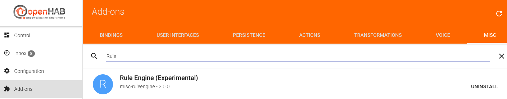
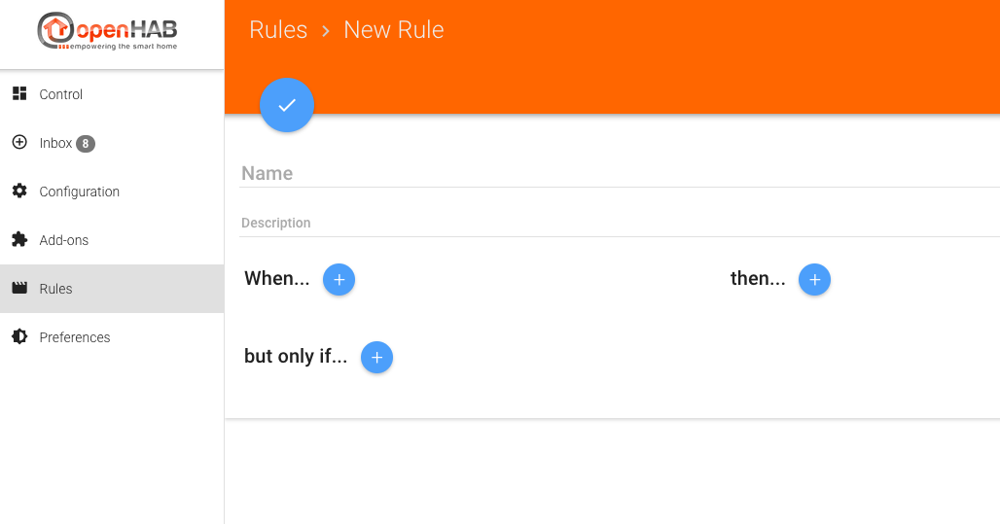



# Experimental Next-Gen Rule Engine

Eclipse SmartHome now comes with an initial version of a next-generation rule engine - this is available within openHAB 2 only as an experimental feature.

> Note: If you use it, this is at your own risk. Especially, you should not expect any documentation besides what is available on the [Eclipse SmartHome website](https://www.eclipse.org/smarthome/documentation/features/rules.html).

## Installation

Install the rule engine from Add-ons → Misc → Rule Engine (Experimental).

## Usage

When you now refresh your browser, you will see a `Rules` menu appearing in the main menu of the Paper UI.

