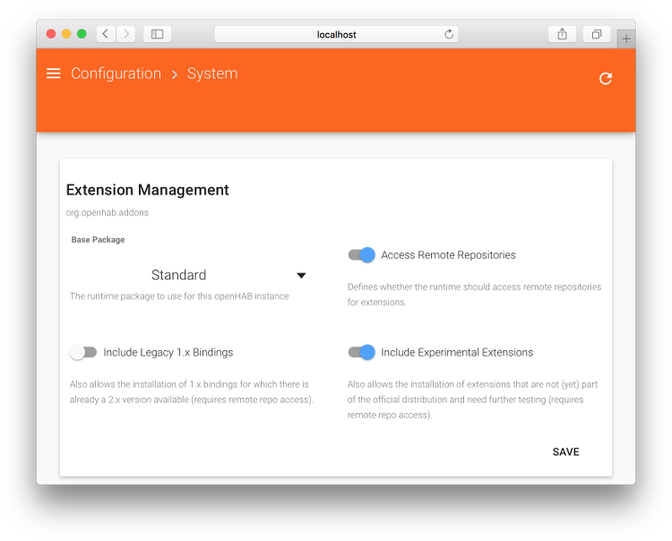
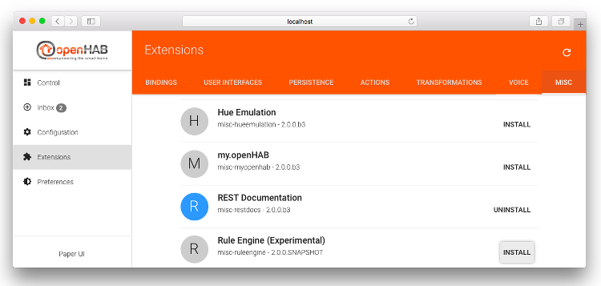
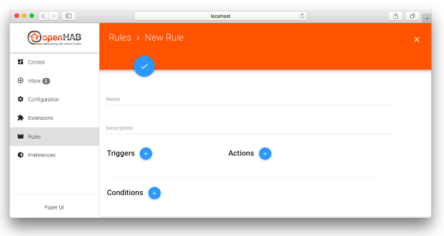



# Experimental Next-Gen Rule Engine

Eclipse SmartHome now comes with an initial version of a next-generation rule engine - this is available within openHAB 2 only as an experimental feature.

> Note: If you use it, this is at your own risk. Especially, you should not expect any documentation besides what is available on the [Eclipse SmartHome website](https://www.eclipse.org/smarthome/documentation/features/rules.html).

In order to install it you need to:

- Enable remote repository access of your runtime as well as enabling experimental features. You can do so in the Paper UI under `Configuration->System->Extension Management`:

- Install the rule engine from `Extensions->Misc-> Rule Engine (Experimental)`:

- When you now refresh your browser, you will see a `Rules` menu appearing in the main menu of the Paper UI:

