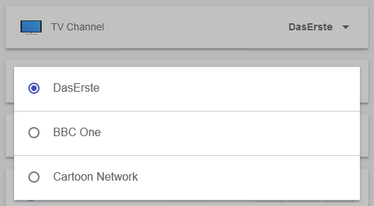
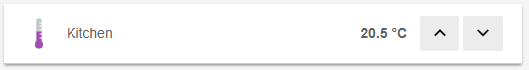



# Sitemaps

In openHAB a collection of [Things]({{base}}/concepts/things.html) and [Items]({{base}}/concepts/items.html) represent physical or logical objects in the user's home automation setup.
Sitemaps are used to select and prepare these elements in order to compose a user-oriented presentation of this setup for various User Interfaces (UIs),
including [BasicUI]({{base}}/addons/uis/basic/readme.html),
the [Android openHAB app](https://play.google.com/store/apps/details?id=org.openhab.habdroid) and others.

This page is structured as follows:

{::options toc_levels="2..4"/}

- TOC
{:toc}

Sitemaps are text files with the `.sitemap` extension, and are stored in the `$OPENHAB_CONF/sitemaps` directory.
Sitemaps follow the syntax described in this article.

For easy editing of sitemap definition files, we suggest to use on of the [openHAB supporting editors]({{base}}/configuration/editors.html).
These provide full IDE support for sitemap files, including syntax checking and auto-completion.

The openHAB runtime distribution comes with a demo configuration package containing a sitemap file named [`demo.sitemap`](https://github.com/openhab/openhab-distro/blob/master/features/distro-resources/src/main/resources/sitemaps/demo.sitemap).
You may find it useful to use this file as a starting point in creating a sitemap that fits your personal home setup.

The following example illustrates what a typical Sitemap definition might look like:

```perl
sitemap demo label="My home automation" {
    Frame label="Date" {
        Text item=Date
    }
    Frame label="Demo" {
        Switch item=Lights icon="light"
        Text item=LR_Temperature label="Livingroom [%.1f °C]"
        Group item=Heating
        Text item=LR_Multimedia_Summary label="Multimedia [%s]" icon="video" {
            Selection item=LR_TV_Channel mappings=[0="off", 1="DasErste", 2="BBC One", 3="Cartoon Network"]
            Slider item=LR_TV_Volume
        }
    }
}
```

<!-- Note to author: If you update this example, remember to copy it to the end of the article as well! -->

This textual UI configuration will produce a user interface similar to this:


<!-- Note to author: The files to create all screenshots can be found at the end of the article! -->

A full explanation for this example can be found [at the end of this article](#full-example).

## Concepts

**Elements:**
Sitemaps are composed by arranging various user interface elements.
A set of different element types supports a user-friendly and clear presentation.
The example above contains `Frame`, `Text` and `Switch` elements among others.
Elements present information, allow interaction and are highly configurable based on the system state.
One line of Sitemap element definition produces one corresponding UI element.
As shown in the example, each element generates a descriptive text next to an icon on the left side and a status and/or interaction elements on the right.

**Parameters:**
A certain set of parameters can be configured to customize the presentation of an element.
In the shown example `item`, `label` and `valuecolor` are parameters.
Almost all parameters are optional, some are however needed to result in a meaningful user interface.
To avoid very long or unstructured lines of element definition, parameters can be broken down to multiple code lines.

**Blocks:**
By encapsulating elements with curly brackets, multiple elements can be nested inside or behind others.
The `Frame` element type is often used in combination with element blocks.
Frames are used to visually distinguish multiple elements of the same topic on one interface page.
When using code blocks behind other element types such as `Text`, `Group` or `Switch`, these UI elements will, in addition to their normal function, be links to a new view, presenting the nested elements.
In the above example, multiple Frames are defined and some elements are not visible on the main view but are accessible behind their parent element.
These are indicated by the ">" control icon on the right of an element.

**Dependencies:**
A typical sitemap contains dozens of individual elements.
A system state and possible interactions are however often closely dependent.
openHAB supports these dependencies by providing parameters for dynamic behavior.
Be sure to check out the [Dynamic Sitemaps](#dynamic-sitemaps) chapter.

For the technically interested: The Sitemap definition language is an
Xtext Domain Specific Language and the sitemap file model can be found [here](https://github.com/eclipse/smarthome/blob/master/bundles/model/org.eclipse.smarthome.model.sitemap/src/org/eclipse/smarthome/model/Sitemap.xtext).

### Special Element 'sitemap'

The `sitemap` element is **mandatory** in a Sitemap definition.
This element shall be the first line in the sitemap file, and the following code block comprises the entire Sitemap definition.

```perl
sitemap <sitemapname> label="<title of the main screen>" {
    [all sitemap elements]
}
```

- `sitemapname` shall always be equal to the Sitemaps file name, e.g. the `sitemapname` in a sitemap file named `demo.sitemap` must be "demo"
- `label` is free text and will be shown as the title of the main screen.

(Note that the element `sitemap` is written with a lower case "s".)

## Element Types

The following element types may be used in a Sitemap definition file.

| Element                                   | Description                                               |
|-------------------------------------------|-----------------------------------------------------------|
| [Chart](#element-type-chart)              | Adds a time-series chart object for [persisted](persistence.html) data. |
| [Colorpicker](#element-type-colorpicker)  | Allows the user to choose a color from a color wheel. |
| [Default](#element-type-default)          | Renders an Item in the default UI representation specified by the type of the given Item. |
| [Frame](#element-type-frame)              | Establishes an area containing various other Sitemap elements. |
| [Group](#element-type-group)              | Concentrates all elements of a given group in a nested block. |
| [Image](#element-type-image)              | Renders an image given by an URL. |
| [Mapview](#element-type-mapview)          | Displays an OSM map based on a given Location Item. |
| [Selection](#element-type-selection)      | Provides a dropdown or modal popup presenting values to choose from for an Item. |
| [Setpoint](#element-type-setpoint)        | Renders a value between an increase and a decrease buttons. |
| [Slider](#element-type-slider)            | Presents a value in a progress-bar-like slider. |
| [Switch](#element-type-switch)            | Renders an Item as an ON/OFF or multi-button switch. |
| [Text](#element-type-text)                | Renders an Item as text. |
| [Video](#element-type-video)              | Displays a video stream, given a direct URL. |
| [Webview](#element-type-webview)          | Displays the content of a webpage. |

<!-- TODO: check for new element types -->

**Choosing the right element type:**
Data presented by Sitemap elements will almost always originate from a referenced [Item]({{base}}/configuration/items.html).
Each Item is of a certain Item type, for example `Switch`, `Number` or `String`.

While not all combinations are meaningful, Items of one datatype may be linked to different Sitemap element types.
This provides the flexibility to present Items in the way desired in your home automation user interface.

<!-- TODO: an example of the above would be useful here -->

**General remarks on parameters:**

-   In the following definitions, parameters in `[square brackets]` are optional.

-   Parameters must be supplied in the order shown.

-   Common parameters, also known from [items definition](items.html#item-syntax):
    - `item` defines the name of the Item you want to present (e.g. `Temperature`), [more details](items.html#item-name).
    - `label` sets the textual description displayed next to the preprocessed Item data (e.g. "`Now [%s °C]`"), [more details](items.html#item-label).
    - `icon` chooses the name of the icon file to show next to the element, [more details](items.html#icons).

-   When an [Item]({{base}}/configuration/items.html) is defined, you have the opportunity to assign a label and/or an icon at that point.
If no label or icon are specified in the Sitemap, then the label and/or icon you assigned to the Item will be displayed.
Setting a value for `label` or `icon` of a Sitemap element will override the values defined for the linked Item.

-   Additional parameters such as `mappings` and `valuecolor` are described below.

### Element Type 'Frame'

```perl
Frame [label="<labelname>"] [icon="<icon>"] {
    [additional sitemap elements]
}
```

Frames are used to visually separate areas of items when the items are viewed in a UI.

**Example:**

```perl
Frame label="Demo" {
    Switch item=Lights icon="light"
    //# and so on...
}
```


### Element Type 'Default'

```perl
Default item=<itemname> [label="<labelname>"] [icon="<iconname>"]
```

Presents an Item using the default UI representation specified by the type of the given Item.
E.g., a `Dimmer` Item will be represented as a [Slider](#element-type-slider) element while a `Player` Item will be rendered with player button controls (Previous/Pause/Play/Next).

<!-- TODO: specify what the default representation for each Item type is -->

### Element Type 'Text'

```perl
Text [item=<itemname>] [label="<labelname>"] [icon="<iconname>"]
```

Presents data as normal text.
Most Item types can be used; the values can be prepared and reformatted by using string formatters and transformations.
Please refer to the documentation on [item labels](items.html#item-label) for details.

**Example:**

```perl
Text item=Temperature label="Livingroom [%.1f °C]" icon="temperature"
```


### Element Type 'Group'

```perl
Group item=<itemname> [label="<labelname>"] [icon="<iconname>"]
```

Clicking on a Group element will reveal a new view showing all group items using the [Default](#element-type-default) element type.
In addition, Item groups may be configured to hold a value, just as with normal items.
Please refer to the documentation on [Item groups](items.html#groups) for details.

- `item` refers to the name of the Item group to be presented.

**Attention:**
There is no way to override the parameters, change the default element type, change the order, use dynamic tags, or insert other elements (e.g. Chart, Image, Webview, etc) in the subframe generated by the Group element.
Please see the Blocks section above for information on how to create a custom subframe with full control over its contents and appearance.

**Example:**

```perl
Group item=gTemperature label="Room Temperatures [%.1f °C]"
```


### Element Type 'Switch'

```perl
Switch item=<itemname> [label="<labelname>"] [icon="<iconname>"] [mappings="<mapping definition>"]
```

Switches are one of the more common elements of a typical Sitemap.
A Switch will present a discrete state Item and allow changing of it's value.
Note that Switch elements can be rendered differently on the user interface, based on the Item type and the `mappings` parameter.

- `mappings` comes as an array of value-to-string translations, [documented further down](#mappings).
  Without the mappings parameter, user interfaces will present an On/Off Switch, if mappings are given, several labeled buttons will be rendered.

**Examples:**

```perl
Switch item=LR_CeilingLight label="Ceiling Light" icon="light"
Switch item=LR_TV_Channel label="TV Channel" mappings=[0="DasErste", 1="BBC One", 2="Cartoon Network"]
```


### Element Type 'Selection'

```perl
Selection item=<itemname> [label="<labelname>"] [icon="<iconname>"] [mappings="<mapping definition>"]
```

The Selection element type renders the options as a dropdown menu or as a modal dialog prompt, depending on the user interface.
The element type is, in its use cases, similar to a Switch with multiple states but has the advantage that the main UI stays clean, and more options can be offered.

- `mappings` comes as an array of value-to-string translations, [documented further down](#mappings).

**Example:**

```perl
Selection item=LR_TV_Channel label="TV Channel" mappings=[0="DasErste", 1="BBC One", 2="Cartoon Network"]
```



### Element Type 'Setpoint'

```perl
Setpoint item=<itemname> [label="<labelname>"] [icon="<iconname>"] minValue=<min value> maxValue=<max value> step=<step value>
```

- `minValue` and `maxValue` limit the possible range of the value (both included in the range).
- `step` defines how much the value will change when the button is pressed one time.

**Example:**

```perl
Setpoint item=KI_Temperature label="Kitchen [%.1f °C]" minValue=4.5 maxValue=30 step=0.5
```



### Element Type 'Slider'

```perl
Slider item=<itemname> [label="<labelname>"] [icon="<iconname>"] [sendFrequency="frequency"] [switchSupport]
```

This type presents a value as a user-adjustable control which slides from left (0) to right (100).

-   `sendFrequency` is used to distinguish between long and short button presses in the classic (web) frontend.
    This parameter defines the interval in milliseconds for sending increase/decrease requests.

-   `switchSupport` is a parameter without an assignment (Classic UI only!).
    If specified, a short press on the "up" or "down" button switches the item "on" or "off" (0 or 100) respectively.

**Example:**

```perl
Slider item=KI_Temperature label="Kitchen"
```


### Element Type 'Colorpicker'

```perl
Colorpicker item=<itemname> [label="<labelname>"] [icon="<iconname>"] [sendFrequency=""]
```

This element provides the ability to select a color.
When the user clicks on the middle button, a color wheel will appear.

- `sendFrequency` is used to distinguish between long and short button presses in the classic (web) frontend.
  This parameter defines the interval in milliseconds for sending increase/decrease requests.

<!-- TODO: This paragraph needs an update. What are the left and the right buttons for? -->

**Example:**

```perl
Colorpicker item=LR_LEDLight_Color label="LED Light Color" icon="colorwheel"
```


### Element Type 'Webview'

```perl
Webview item=<itemname> [label="<labelname>"] [icon="<iconname>"] url="<url>" [height=<heightvalue>]
```

The content of a webpage will be presented live on your user interface next to other Sitemap elements.
Please be aware that Webview elements are not usable by all user interface options.

- `height` is the number of element rows to fill.

**Example:**

```perl
Webview url="http://www.openhab.org" height=5
```


### Element Type 'Mapview'

```perl
Mapview [item=<itemname>] [label="<labelname>"] [icon="<iconname>"] [height=<heightvalue>]
```

Displays an [OSM](https://www.openstreetmap.org) map based on a given Location Item.

- `height` is the number of element rows to fill.

**Example:**

```perl
Mapview item=Demo_Location height=5
```


### Element Type 'Image'

```perl
Image [item=<itemname>] [icon="<iconname>"] url="<url of image>" [label="<labelname>"] [refresh=xxxx]
```

This element type is able to present an image.
The image must be available on a reachable website or webserver without password or access token.
Alternatively, the image file (e.g. YourImageFile.png) may be stored locally in the $OPENHAB_CONF/html folder, and will be accessible through the static route, http://<my.openHAB.device>:8080/static/YourImageFile.png.

- `item` can refer to either an Image Item whose state is the raw data of the image, or a String Item whose state is an URL that points to an image. Some clients may not (yet) consider `item`.
- `url` is the default URL from which to retrieve the image, if there is no associated Item or if the associated item's state is not a URL.
- `refresh` is the refresh period of the image in milliseconds ("60000" for minutely updates).

**Example:**

```perl
Image url="https://raw.githubusercontent.com/wiki/openhab/openhab/images/features.png"
```


### Element Type 'Video'

```perl
Video [item=<itemname>] [icon="<iconname>"] url="<url of video to embed>" [encoding="<video encoding>"]
```

Allows you to display a video as part of your Sitemap.
Note: not all video encodings (formats) are supported; you may need to transcode your video.
The video must be reachable directly via URL.
An embedded and/or protected video are not supported.

- `item` can refer to a String Item whose state is a URL to a video. Some clients may not (yet) consider `item`.
- `url` is the default URL from which to retrieve the video if there is no associated Item or if the associated item's state is not a URL.
- `encoding` should be set to "mjpeg" for an MJPEG video, or "HLS" for an HTTP Live Streaming playlist (file with .m3u8 extension).  If you omit the `encoding` parameter, openHAB will attempt to automatically select the correct format.

**Example:**

```perl
Video url="http://demo.openhab.org/Hue.m4v"
```


### Element Type 'Chart'

```perl
Chart [item=<itemname>] [icon="<iconname>"] [label="<labelname>"] [refresh=xxxx]
[period=xxxx] [service="<service>"] [begin=yyyyMMddHHmm] [end=yyyyMMddHHmm] [legend=true/false]
```

Adds a time-series chart object for the display of logged data.

-   `refresh` defines the refresh period of the Image (in milliseconds).

-   `service` sets the persistence service to use.
If no service is specified, openHAB will use the first queryable persistence service it finds.
Therefore, for an installation with only a single persistence service, this is not required.

<!-- TODO: Is this statement correct?  Isn't there a default persistence setting in paperUI? -->

-   `period` is the scale of the time axis. Valid values are `h, 4h, 8h, 12h, D, 2D, 3D, W, 2W, M, 2M, 4M or Y`.

-   `begin` / `end` sets the beginning and end of the time axis.
Valid values are in the format: "yyyyMMddHHmm" (yyyy = year, MM = month, dd = day, HH = hour (0-23), mm = minutes).

-   `legend` is used to show or to hide the chart legend.
    Valid values are `true` (always show the legend) and `false` (never show the legend).
    If this parameter is not set, the legend is hidden if there is only one chart series.

<!-- TODO: This paragraph needs an update -->

Visit [Charts](https://github.com/openhab/openhab/wiki/Charts) in the Wiki for examples.

<!-- TODO

-->

**Other options to look out for:**
The Chart element type is a good way to present time series data quickly.
For more sophisticated diagrams, openHAB supports the integration of outside sources like most logging and graphing solutions (e.g. [Grafana](http://grafana.org)).
See this [Tutorial](https://community.openhab.org/t/13761/1) for more details.

**Technical constraints and details:**

- When using rrd4j persistence, you must use the `everyMinute` (60 seconds) logging strategy.  Otherwise rrd4j thinks that there is no data and will not properly draw the charts.
- The visibility of multiple Chart objects may be toggled to simulate changing the Chart period; non-visible Chart widgets are NOT generated behind the scenes until they become visible.
- When charting a group of item, make sure that every label is unique. If the label contains spaces, the first word of the label must be unique. Identical labels result in an empty chart.

<!-- TODO: This paragraph needs an update -->

<!-- TODO: Element type list is not supported and throws NPE in BasicUI
### Element Type 'List'

```perl
List item=<itemname> [label="<labelname>"] [icon="<iconname>"] [separator=""]
```
Splits a String Item at each separator into multiple rows.
-->

## Mappings

Mappings is an optional parameter for the [Switch](#element-type-switch) and [Selection](#element-type-selection) element types.

Mapping syntax:

```perl
mappings=[value_1="description_1", value_2="description_2", ...]
```

Examples:

```perl
mappings=[ON="on", OFF="standby"]
mappings=[1="DasErste", 2="BBC One", 3="Cartoon Network"]

mappings=[OFF="All heaters off"]
mappings=[15="Gone", 19="Chilly", 21="Cozy"]
```

As you can see, different Item data types are accepted as mappings values.
The first two lines show very typical use cases.
Imagine your TV is part of your openHAB setup.
Its power state is represented by a binary Switch Item.
Its channel number is a discrete number Item that may only be set to one of three states.
By using a Switch or Selection element with a mappings array, you can replace these meaningless values with user-friendly descriptions for display on the user interface.


This mapping changes the displayed power state of the TV from "ON" and "OFF" to the more accurate terms, "on" and "standby".
Similarly, mapping above changes the numbers "1", "2", and "3" to "DasErste", "BBC One", and "Cartoon Network" respectively.

In the third and forth examples above, only a subset of the possible values of items belonging to a heating system are presented to the user.
This limits the possible input values, which is yet another often occurring use case for mappings.

## Dynamic Sitemaps

All Sitemap elements can be configured to be hidden, color highlighted or to have a [dynamic icon]({{base}}/items.md#icons-dynamic), depending on certain Item states.
A few practical use cases are:

- Show a battery warning if the voltage level of a device is below 30%
- Hide further control elements for the TV if it is turned off
- Highlight a value with a warning color if it is outside accepted limits
- Present a special icon, depending on the state of an item (a [dynamic icon]({{base}}/items.md#icons-dynamic))

### Visibility

The `visibility` parameter is used to dynamically show or hide an Item.
If the parameter is not provided, the default is to display the Item.

Visibility syntax:

```perl
visibility=[item_name operator value, item_name operator value, ... ]
```

Valid comparison operators are:
- equal to `==`, unequal to `!=`
- less than or equal to `<=`, greater than or equal to`>=`
- less than `<`, greater than `>`
Expressions are evaluated from left to right.

**Examples:**

```perl
visibility=[Battery_Level<30]
visibility=[TV_Power==ON]
visibility=[Day_Time=="Morning", Day_Time=="Afternoon", Temperature>19]
```

If any one of the comparisons is evaluated as `true`, the Item will be visible, otherwise it will be hidden.
It is important to note that visibility may be determined based on only one condition at a time.
If any one of the comparisons is evaluated as `true`, then the Item will be visible.
Otherwise it will be hidden.

In the third example above, a control for a lawn sprinkler will be visible if it is Morning, *OR* if it is Afternoon, *OR* if the temperature is above 19 °C.
Combining multiple conditions, for example Morning *AND* above 19 °C is not supported.
To control visibility based upon combining multiple Items, or on more complex conditions, consider defining and using an additional Item that is set by a Rule.
Rules have a rich set of features that can support more involved scenarios.

### Label and Value Colors

Colors can be used to emphasize an items label or its value based on conditions.
Colors may be assigned to either the label or the value associated with an Item.

**Label and Value Color Syntax:**

```perl
labelcolor=[item_name operator value = "color", ... ]
valuecolor=[item_name operator value = "color", ... ]
```

Note that `item_name` and `operator` are both optional.
If `item_name` is not provided, the Item name will default to the current Item.
If an operator is not specified, the operator will default to `==`.

The comparison operators for `labelcolor` and `valuecolor` are the same as for the visibility parameter.

**Examples:**

The following three lines are equivalent.

```perl
Text item=Temperature labelcolor=[>0="blue"] valuecolor=[22="green"]
Text item=Temperature labelcolor=[>0="blue"] valuecolor=[==22="green"]
Text item=Temperature labelcolor=[>0="blue"] valuecolor=[Temperature==22="green"]
```

The line below illustrates the importance of operator order:

```perl
Text item=Temperature valuecolor=[Last_Update=="Uninitialized"="gray",
                                  >=25="orange", >=15="green", 0="white", <15="blue"]
```

Note that expressions are evaluated from left to right; the first matching expression determines the color.
If the order of the expressions was reversed, the color assignment would not work properly.
Note also, the effect of omitting `Temperature` and the comparison operator in the expression `0="white"` (as compared to `==0="white"`).

Below is a list of standard colors and their respective RGB color codes.

| Color Name  | Preview and RGB Color Code              |
|-------------|-----------------------------------------|
| maroon      | *`► #800000`*{: style="color: #800000"} |
| red         | *`► #ff0000`*{: style="color: #ff0000"} |
| orange      | *`► #ffa500`*{: style="color: #ffa500"} |
| olive       | *`► #808000`*{: style="color: #808000"} |
| yellow      | *`► #ffff00`*{: style="color: #ffff00"} |
| purple      | *`► #800080`*{: style="color: #800080"} |
| fuchsia     | *`► #ff00ff`*{: style="color: #ff00ff"} |
| white       | *`► #ffffff`*{: style="color: #ffffff"} |
| lime        | *`► #00ff00`*{: style="color: #00ff00"} |
| green       | *`► #008000`*{: style="color: #008000"} |
| navy        | *`► #000080`*{: style="color: #000080"} |
| blue        | *`► #0000ff`*{: style="color: #0000ff"} |
| teal        | *`► #008080`*{: style="color: #008080"} |
| aqua        | *`► #00ffff`*{: style="color: #00ffff"} |
| black       | *`► #000000`*{: style="color: #000000"} |
| silver      | *`► #c0c0c0`*{: style="color: #c0c0c0"} |
| gray        | *`► #808080`*{: style="color: #808080"} |

Please take note that colors other than those listed in the list above may be used.
Generally, you can expected that valid HTML colors will be accepted (e.g. "green", "lightgrey", "#334455"), but note that a UI may only accept internally defined colors, or work with a special theme.
The color names above are agreed on between all openHAB UIs and are therefor your safest choice.

### Icons

openHAB allows a set of icons to be assigned to the different states of an Item and therefor to be presented in a Sitemap.
Please refer to the documentation on [Item configuration](items.html) for details.


## Full Example


<!-- Note to author: If you update this example, remember to copy it to the beginning of this article as well! -->

```perl
sitemap demo label="My home automation" {
    Frame label="Date" {
        Text item=Date
    }
    Frame label="Demo" {
        Switch item=Lights icon="light"
        Text item=LR_Temperature label="Livingroom [%.1f °C]"
        Group item=Heating
        Text item=LR_Multimedia_Summary label="Multimedia [%s]" icon="video" {
            Selection item=LR_TV_Channel mappings=[0="off", 1="DasErste", 2="BBC One", 3="Cartoon Network"]
            Slider item=LR_TV_Volume
        }
    }
}
```

<!-- Note to author: If you update this example, remember to copy it to the beginning of this article as well! -->

Explanation:

-   The Sitemap "demo" with the shown title "My home automation" is defined.

-   One first Frame with a date stamp is shown.

-   Another Frame with a visual label "Demo" is presented, containing:

    -   A Switch for the Item "Lights"

    -   A Text element showing a temperature in a given format

    -   A Group element. Upon clicking the element, a new view containing all "Heating" Items will be shown.

    -   Another Text element showing a "Multimedia" summary, e.g. "Currently playing".
        The element is additionally the host for a nested block.
        By clicking in the element, a new view with two elements is presented:
        - A Selection presenting four options in a modal dialog prompt
        - A Slider to set the volume (e.g. 0-100%)

<!-- Note to author: If you update this example, remember to copy it to the beginning of this article as well! -->

## Further notes and comparison details

-   String comparisons are case sensitive, so `==ON` is not the same a `==on`.

-   DateTime comparisons are relative to the current time and specified in seconds.
    So the expression `Lights_On_Time > 300` will return true if the DateTime Item is set to a value that's newer than the past 5 minutes (300 seconds).

-   Further examples for defining Sitemaps can be found in our [openHAB-Samples](https://github.com/openhab/openhab/wiki/Samples-Sitemap-Definitions) section.

<!-- Note to author:
- The screenshot were created with chrome mobile developer tools on a page width of 529px
 -The screenshots were created in BasicUI with the following items and Sitemap file content:
Group:Number:AVG Temperatures <heating>
Number Demo_LivingroomTemperature "Livingroom [21.0 °C]" <temperature> (Temperatures)
Number Demo_BedroomTemperature "Bedroom [19.5 °C]" <temperature> (Temperatures)
Number Demo_KitchenTemperature "Kitchen [20.5 °C]" <temperature> (Temperatures)
Location Demo_Location "Location [48.858377,2.294486,66.0]"

Number Demo_TV_Channel
Color Demo_Color


sitemap demo label="My home automation" {
        Frame label="Date" {
                Text item=Date label="Today [Monday, 01. Aug. 2016]"
        }
        Frame label="Demo" {
                Switch item=Lights icon="light" mappings=[OFF="All Off"]
                Text item=Temperature label="Livingroom [21.3 °C]" icon="temperature" valuecolor=[>25="orange",>15="green",<=15="blue"]
                Group item=Heating
                Text item=Multimedia_Summary label="Multimedia" icon="video" {
                        Selection item=TV_Channel mappings=[0="off", 1="DasErste", 2="BBC One", 3="Cartoon Network"]
                        Slider item=Volume
                }
        }

        Text label="The following elements are for screenshots. The screen was at this width:"
        Text label="---------------------------------------------------------------------------------------"
    Frame {
        Text item=Temperature label="Livingroom [21.3 °C]" icon="temperature"
    }
    Frame {
        Switch item=Livingroom_Light_OnOff label="Ceiling Light" icon="light"
    }
    Frame {
        Switch item=Demo_TV_Channel label="TV Channel" icon="television" mappings=[0="DasErste", 1="BBC One", 2="Cartoon Network"]
    }
    Frame {
        Selection item=Demo_TV_Channel label="TV Channel" icon="television" mappings=[0="DasErste", 1="BBC One", 2="Cartoon Network"]
    }
    Frame {
        Setpoint item=Demo_KitchenTemperature
    }
    Frame {
        Slider item=Demo_KitchenTemperature switchSupport
    }
    Frame {
        Colorpicker item=Demo_Color label="LED Light Color" icon="colorwheel"
    }
    //Frame {
    //    Chart item=Demo_KitchenTemperature label="Test" period=h refresh=600
    //}
    Frame {
        Group item=gHeatAct label="Room Temperatures [%.1f °C]"
    }
    Frame {
        Image url="https://raw.githubusercontent.com/wiki/openhab/openhab/images/features.png"
    }
    Frame {
        Video url="http://demo.openhab.org/Hue.m4v"
    }
    Frame {
        Webview url="http://www.openhab.org" height=5
    }
    Frame {
        Text item=Temperature label="Livingroom [22.0 °C]" icon="temperature" labelcolor=[!=1="blue"] valuecolor=[!=1="green"]
    }
    Frame {
        Mapview item=Demo_Location height=5
    }
}
-->
