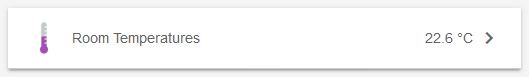
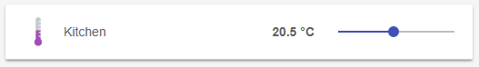
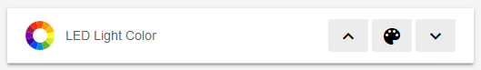



# Sitemaps

In openHAB a collection of [Things]({{base}}/concepts/things.html) and [Items]({{base}}/concepts/items.html) represent physical or logical objects of the user's home automation setup.
Sitemaps are used to select and prepare these elements in order to compose a user-oriented presentation of this setup for various frontends,
including [BasicUI]({{base}}/addons/uis/basic/readme.html),
the [Android openHAB app](https://play.google.com/store/apps/details?id=org.openhab.habdroid) and others.

This page is structured as follows:

{::options toc_levels="2..4"/}

- TOC
{:toc}

Sitemaps are text files with the `.sitemap` extension, and are stored in the `$OPENHAB_CONF/sitemaps` directory.
Sitemaps follow the syntax described below.

For easy editing of sitemap definition files, we suggest you consider using the [Eclipse SmartHome Designer]({{base}}/configuration/editors.html#esh-designer), which provides full IDE support for these files including, among other functions, syntax checking and auto-complete.

The openHAB runtime distribution comes with a demo configuration package containing a sitemap file named [`demo.sitemap`](https://github.com/openhab/openhab-distro/blob/master/features/distro-resources/src/main/resources/sitemaps/demo.sitemap).
You may find it useful to use this file, or another example sitemap as a starting point towards building a Sitemap that fits your personal home setup.

The following example illustrates what a typical Sitemap definition might look like:

```perl
sitemap demo label="My home automation" {
    Frame label="Date" {
        Text item=Date
    }
    Frame label="Demo" {
        Group item=Heating
        Switch item=Lights icon="big_bulb" mappings=[OFF="All Off"]
        Text item=Temperature valuecolor=[>25="orange",>15="green",<=15="blue"]
        Text item=Multimedia_Summary label="Multimedia" icon="video" {
            Selection item=TV_Channel mappings=[0="off", 1="DasErste", 2="BBC One", 3="Cartoon Network"]
            Slider item=Volume
        }
    }
}
```

<!-- Note to author: If you update this example, remember to copy it to the end of the article as well! -->

This textual UI configuration will produce a user interface similar to this:


<!-- Note to author: The files to create all screenshots can be found at the end of the article! -->

A full explanation for this example can be found [at the end of this article](#full-example).

## Concepts

**Elements:**
Sitemaps are composed by arranging various user interface elements.
A counted set of different element types supports a user-friendly and clear presentation.
The example above contains `Frame`, `Text` or `Switch` elements besides others.
Elements will present information or status data, allow interaction and are highly configurable based on the system state.
One line of Sitemap element definition produces one corresponding UI element.
As can be seen in the example, an important design decision was, to have a descriptive text next to an icon on the left side and the status or interaction element(s) on the right.

**Parameters:**
A certain set of parameters can be configured to customize the presentation of an element.
In the shown example `item`, `label` or `valuecolor` are parameters.
Almost all parameters are optional, some are however needed to result in a meaningful user interface.
To avoid very long or unstructured lines of element definition, parameters can be broken down to multiple code lines.

**Blocks:**
By encapsulating elements with curly brackets, multiple elements can be nested inside or behind others.
The `Frame` element type is often used in combination with element blocks and a bit special in that matter.
Frames are used to visually distinguish multiple elements of the same topic on one interface page.
When using code blocks behind other element types like `Text`, `Group` or `Switch`, these UI elements will - in addition to their normal function - be links to a new view, presenting the nested elements.
In the above example, multiple frames are defined and some elements are not visible on the main view but are accessible behind their parent element.

**Dependencies:**
Sitemaps contain dozens of individual elements.
A system state and possible interactions are however often closely dependent.
openHAB supports these dependencies by providing parameters for dynamic behavior.
Be sure to check out the [Dynamic Sitemaps](#dynamic-sitemaps) chapter.

For the technically interested: The Sitemap definition language is an
[Xtext DSL](https://github.com/openhab/openhab/blob/master/bundles/model/org.openhab.model.sitemap/src/org/openhab/model/Sitemap.xtext).

### Special Element 'sitemap'

The `sitemap` element is **mandatory** in a Sitemap definition and has to be named after the Sitemap file name.
The element will always be the first line and the following code block encloses the whole Sitemap definition.

```perl
sitemap <sitemapname> label="<title of the main screen>"
```

- `sitemapname` is always equal to the Sitemaps file name, e.g. `demo.sitemap` -> "demo"
- `label` is free text and will be shown as the title of the main screen.

(Please be aware, that the element `sitemap` is written with a lower case "s".)

## Element Types

The following element types can be used in a Sitemap definition file.

| Element                                   | Description                                               |
|-------------------------------------------|-----------------------------------------------------------|
| [Frame](#element-type-frame)              | Area containing various other Sitemap elements. |
| [Default](#element-type-default)          | Renders an Item in the default UI representation specified by the type of the given item. |
| [Text](#element-type-text)                | Renders an Item in a text representation. |
| [Group](#element-type-group)              | Concentrates all elements of a given group nested in one group element. |
| [Switch](#element-type-switch)            | Renders an Item as a ON/OFF or multiple buttons switch. |
| [Selection](#element-type-selection)      | Provides a dropdown or modal popup presenting values to choose from for an item. |
| [Setpoint](#element-type-setpoint)        | Renders a value between an increase and a decrease buttons. |
| [Slider](#element-type-slider)            | A value is presented in a progress bar like slider. |
| [Colorpicker](#element-type-colorpicker)  | Allows the user to choose a color from a color wheel. |
| [Chart](#element-type-chart)              | Adds a time-series chart object for displaying logged data. |
| [Webview](#element-type-webview)          | Displays the content of a webpage. |
| [Image](#element-type-image)              | Renders an image given by an URL. |
| [Video](#element-type-video)              | Displays a video given by a direct URL. |

<!-- TODO: check for new element types -->

**Choosing the right element type:**
Data presented by Sitemap elements will almost always originate from the referenced items.
Each Item is of a certain datatype, for example `Switch`, `Number` or `String`.
While not all combinations are allowed or meaningful, items of one datatype can be linked to different Sitemap element types.

This provides the flexibility to present items in the way desired in your home automation user interface.

**General remarks on parameters:**

-   In the following definitions, parameters in `[square brackets]` are optional, parameters in front are considered more relevant.

-   Common parameters, also known from [items definition](items.html#item-syntax):
    - `item` defines the name of the Item you want to present (e.g. `Temperature`), [more details](items.html#item-name).
    - `label` sets the textual description besides the preprocessed Item data (e.g. "`Now [%s °C]`"), [more details](items.html#item-label).
    - `icon` is the name of the icon file to show next to the element, [more details](items.html#icons).

-   Additional parameters like `mappings` or `valuecolor` are described below.

### Element Type 'Frame'

```perl
Frame [label="<labelname>"] [icon="<icon>"] {
        [additional sitemap elements]
}
```

Frames are used to create visually separated areas of items.


### Element Type 'Default'

```perl
Default item=<itemname> [label="<labelname>"] [icon="<iconname>"]
```

Presents an Item using the default UI representation specified by the type of the given Item.
E.g., a `Dimmer` Item will be represented as if using a [Slider](#element-type-slider) element while a `Player` Item will be rendered with the commonly known player button controls (Previous/Pause/Play/Next).

<!-- TODO: specify what the default representation for each Item type is -->

### Element Type 'Text'

```perl
Text [item=<itemname>] [label="<labelname>"] [icon="<iconname>"]
```

Presents data as normal text.
Most Item types can be used, the values can be prepared and reformatted by using string formatters and transformations.
Please check with the documentation on the [item label](items.html#item-label) for details.


### Element Type 'Group'

```perl
Group item=<itemname> [label="<labelname>"] [icon="<iconname>"]
```

The element will be clickable, revealing a new view showing all group items using the [Default](#element-type-default) element type.
In addition, Item groups may be configured to hold a value, just like with normal items.
Please refer to the documentation on [items](items.html) for details.

<!--TODO: Link to items-groups -->

- `item` refers to the name of the Item group to be presented.



### Element Type 'Switch'

```perl
Switch item=<itemname> [label="<labelname>"] [icon="<iconname>"] [mappings="<mapping definition>"]
```

Switches are one of the more common elements of a typical Sitemap.
A switch will present a discrete state Item and allow changing of it's value.
Note that switch elements can be rendered differently on the user interface, based on the Item type and the `mappings` parameter.

- `mappings` comes as an array of value-to-string translations, [documented further down](#mappings).
  Without the mappings parameter, user interfaces will present an On/Off Switch, if mappings are given several labeled buttons are rendered.


### Element Type 'Selection'

```perl
Selection item=<itemname> [label="<labelname>"] [icon="<iconname>"] [mappings="<mapping definition>"]
```

The selection element type allows to select from different settings, similar to a switch with multiple states.
The selection renders the options as lines in a menu shown as a dropdown menu or a modal dialog prompt, depending on your user interface.

- `mappings` comes as an array of value-to-string translations, [documented further down](#mappings).


### Element Type 'Setpoint'

```perl
Setpoint item=<itemname> [label="<labelname>"] [icon="<iconname>"] minValue="<min value>" maxValue="<max value>" step="<step value>"
```

A special switch-like element to increase or decrease the value of an item.
The element is often used to gradually change a number item.

- `minValue` and `maxValue` limit the possible range of the value (both included in the range).
- `step` defines the change in value one button press will cause.


### Element Type 'Slider'

```perl
Slider item=<itemname> [label="<labelname>"] [icon="<iconname>"] [sendFrequency="frequency"] [switchSupport]
```

This type presents a value as a slider or percentage bar like UI element and allows manipulation.

-   `sendFrequency` is used to distinguish between long and short button presses in the classic (web) frontend.
    This parameter defines the interval in milliseconds for sending increase/decrease requests.

-   `switchSupport` is a parameter without assignment.
    If specified a short press on the "up" or "down" button/arrow in the classic (web) frontend switched the Item on/off completely.

<!-- TODO: This paragraph needs an update -->



### Element Type 'Colorpicker'

```perl
Colorpicker item=<itemname> [label="<labelname>"] [icon="<iconname>"] [sendFrequency=""]
```

This element provides the ability to select a color.
Upon clicking the middle button, a color wheel will be presented.

- `sendFrequency` is used to distinguish between long and short button presses in the classic (web) frontend.
  This parameter defines the interval in milliseconds for sending increase/decrease requests.

<!-- TODO: This paragraph needs an update. What are the left and the right buttons for? -->



### Element Type 'Chart'

```perl
Chart [item=<itemname>] [icon="<iconname>"] [label="<labelname>"] [refresh=xxxx]
[period=xxxx] [service="<service>"] [begin=yyyyMMddHHmm] [end=yyyyMMddHHmm]
```

Adds a time-series chart object for displaying logged data.

-   `refresh` defines the refresh period of the image (in milliseconds).

-   `service` sets the persistence service to use.
    If no service is set, openHAB will use the first queryable persistence service it finds.
    Therefore, for an installation with only a single persistence service, this is not required.

-   `period` is the length of the time axis of the chart. Valid values are `h, 4h, 8h, 12h, D, 2D, 3D, W, 2W, M, 2M, 4M or Y`.

-   `begin` / `end` represent the beginning and end of the time axis of the chart.
    Valid values are in the format: "yyyyMMddHHmm" (yyyy = year, MM = month, dd = day, HH = hour (0-23), mm = minutes).

<!-- TODO: This paragraph needs an update -->

Visit [Charts](https://github.com/openhab/openhab/wiki/Charts) in the Wiki for examples.
Charts by most logging and graphing solutions (e.g. [Grafana](http://grafana.org)) may also be generated as images and presented by the [image element type](#element-type-image).

<!-- TODO

-->

**Note on chart providers:**
The openHAB system provides a default chart provider, which will work with all queryable persistence services.
Other chart providers can be used to render the chart.
Currently, the only alternative is to use the rrd4j provider to render the graphs.

<!-- TODO: This paragraph needs an update -->

**Technical constraints and details:**

- When using rrd4j persistence, you must use the `everyMinute` (60 seconds) logging strategy otherwise rrd4j thinks that there is no data and will not properly draw the charts
- When using chart:provider=rrd4j, the `service=<service>` is ignored and only the persistence service rrd4j is used
- The visibility of multiple chart objects can be toggled to simulate changing the chart period, and the non-visible chart widgets are NOT generated behind the scenes until it becomes visible
- When charting a group of items make sure every label is unique. If the label contains spaces, the first word of the label must be unique. Identical labels result in an empty chart

<!-- TODO: This paragraph needs an update -->

### Element Type 'Webview'

```perl
Webview item=<itemname> [label="<labelname>"] [icon="<iconname>"] url="<url>" [height=<heightvalue>]
```

The content of a webpage will be presented live on your user interface besides other Sitemap elements.

- `height` is the number of element rows to fill.


### Element Type 'Image'

```perl
Image [item=<itemname>] [icon="<iconname>"] url="<url of image>" [label="<labelname>"] [refresh=xxxx]
```

This element type is able to present an image.
The image has to be available on a reachable website or webserver without password or access token.
It's also possible to place an image in the `html` folder under your configuration folder.
The file will be available under the "static" route, [http://<my.openHAB.device>:8080/static/image.png](http://127.0.0.1:8080/static).

- `item` can refer to either an Image Item whose state is the raw data of the image, or a String Item whose state is an URL to an image.  Some clients may not (yet) consider `item`.
- `url` is the default URL from which to retrieve the image, if there is no associated Item or if the associated item's state is not an URL.
- `refresh` is the refresh period of the image in milliseconds ("60000" for minutely updates).


### Element Type 'Video'

```perl
Video [item=<itemname>] [icon="<iconname>"] url="<url of video to embed>" [encoding="<video encoding>"]
```

Allows to integrate a video presentation into a your Sitemap.
Not all video encodings (formats) are supported, you may need to transcode your video.
The video has to be reachable directly via URL.
An embedded or protected video is not supported.

- `item` can refer to a String Item whose state is an URL to a video.    Some clients may not (yet) consider `item`.
- `url` is the default URL from which to retrieve the video, if there is no associated Item or if the associated item's state is not an URL.
- `encoding` can stay left empty for auto selection, for an MJPEG video please set the "mjpeg" encoding explicitly.


<!-- TODO: Element type list is not supported and throws NPE in BasicUI
### Element Type 'List'

```perl
List item=<itemname> [label="<labelname>"] [icon="<iconname>"] [separator=""]
```
Splits a String Item at each separator into multiple rows.
-->

<!-- TODO: Further element types? -->

## Mappings

Mappings is an optional parameter for the [switch](#element-type-switch) and [selection](#element-type-selection) element types.

Please be aware of the fact, that both switch and selection are input element types.
If you are looking to transform Item data into meaningful outputs, a [text element](#element-type-text) with it's label parameter may be a better choice.

```perl
mappings=[value_1="description_1", value_2="description_2", ...]
```

Above you can see the general syntax for the mappings parameter.
Let's have a look at a few examples:

```perl
mappings=[ON="on", OFF="standby"]
mappings=[1="DasErste", 2="BBC One", 3="Cartoon Network"]

mappings=[OFF="All heaters off"]
mappings=[15="Gone", 19="Chilly", 21="Cozy"]
```

As you can see, different Item data types are accepted as mappings values.
The first two lines show very typical use cases.
Imagine your TV as part of your openHAB setup.
It's power state and channel number are internally represented by a binary switch Item (OFF/ON) and a discrete number Item with only a few selectable states.
By using a switch or selection element with a mappings array, you can replace these meaningless values by meaningful descriptions for your inputs in the user interface.

In the third and forth line only a subset of the possible values of items belonging to a heating system is presented to the user.
This limits the possible input values, which is yet another often occurring use case.

## Dynamic Sitemaps

All Sitemap elements can be configured to be hidden, color highlighted or to have a dynamic icon, depending on certain Item states.
A few practical use cases are:

- Show a battery warning if the voltage level of a device is below 30%.
- Hide further control elements for the TV if it is turned off.
- Highlight a value with a warning color if it is outside accepted limits.
- Present a special icon, depending on the state of an item.

### Visibility

To dynamically show or hide an item, the `visibility` parameter is used.
By default, an Item is visible if the `visibility` parameter is not provided.

```perl
visibility=[item_name operator value, item_name operator value, ... ]
```

The format of the `visibility` parameter is given above, let's also look at a few examples:

```perl
visibility=[Battery_Level<30]
visibility=[TV_Power==ON]
visibility=[Day_Time=="Morning", Day_Time=="Afternoon", Temperature>19]
```

If any one of the comparisons is evaluated as `true`, the Item will be visible, otherwise it will be hidden.
It is important to note, that it is not possible to decide visibility on more than one condition at the same time.
The third example might be the visibility of a sprinkler control.
The control will be visible if it is Morning *OR* if it is Afternoon *OR* if the temperature is above 19°C.
To achieve more complex conditions, you will benefit from defining a helper Item and a rule to set it.

Valid comparison operators are:

- equal to `==`, unequal to `!=`
- smaller or equal to `<=`, bigger or equal to`>=`.
- smaller than `<`, bigger than `>`

### Colors

Colors can be used to emphasize an items label or its value based on conditions.

```perl
labelcolor=[item_name operator value = "color", ... ]
valuecolor=[item_name operator value = "color", ... ]
```

The general format of the `labelcolor` and `valuecolor` parameters is given above.
The comparison operators are the same as for the mappings parameter.
Let's have a look at a few examples:

```perl
Text item=Weather valuecolor=[Temperature<=4="blue"]
                  labelcolor=[Temperature<=4="blue"]
Text item=Temperature valuecolor=[Last_Update=="Uninitialized"="gray",
                                  >=25="orange", >=15="green", 0="white", <15="blue"]
```

In the first example, the `Weather` Item is colored blue (label and value) if the `Temperature` is below or equal to 4°C.

Expressions will be evaluated from left to right.
The first condition returning `true` will decide on the color.
Looking at the second example, you will see, that the given five expressions are ordered in the only meaningful combination.

`item_name` and `operator` are both optional.
If not provided, the Item name will default to the current Item and operator will default to `==`.
In the second example, this is shown by leaving out Temperature and by not giving a comparison operator in the expression `0="white"`.
The following three lines are totally equal and valid:

```perl
Text item=Temperature labelcolor=[>0="blue"] valuecolor=[22="green"]
Text item=Temperature labelcolor=[>0="blue"] valuecolor=[==22="green"]
Text item=Temperature labelcolor=[>0="blue"] valuecolor=[Temperature==22="green"]
```


Below you can find a list of standard colors and their respective RGB color code.
Please take note, that other colors can be used.
It is generally expected that valid HTML colors will be accepted (e.g. "green", "lightgrey", "#334455"), but a UI may only accept internally defined colors or work with a special theme.
The given color names are agreed on between all openHAB UIs and are therefor your safest choice.

Please note that there currently is a [known issue with the iOS app](https://github.com/openhab/openhab.ios/issues/112) where named colors (e.g. 'green') do not work for valuecolor.
Until resolved you can use the corresponding HTML code (e.g. '#008000') instead.

| Color Name  | Preview and RGB Color Code              |
|-------------|-----------------------------------------|
| maroon      | *`► #800000`*{: style="color: #800000"} |
| red         | *`► #ff0000`*{: style="color: #ff0000"} |
| orange      | *`► #ffa500`*{: style="color: #ffa500"} |
| olive       | *`► #808000`*{: style="color: #808000"} |
| yellow      | *`► #ffff00`*{: style="color: #ffff00"} |
| purple      | *`► #800080`*{: style="color: #800080"} |
| fuchsia     | *`► #ff00ff`*{: style="color: #ff00ff"} |
| white       | *`► #ffffff`*{: style="color: #ffffff"} |
| lime        | *`► #00ff00`*{: style="color: #00ff00"} |
| green       | *`► #008000`*{: style="color: #008000"} |
| navy        | *`► #000080`*{: style="color: #000080"} |
| blue        | *`► #0000ff`*{: style="color: #0000ff"} |
| teal        | *`► #008080`*{: style="color: #008080"} |
| aqua        | *`► #00ffff`*{: style="color: #00ffff"} |
| black       | *`► #000000`*{: style="color: #000000"} |
| silver      | *`► #c0c0c0`*{: style="color: #c0c0c0"} |
| gray        | *`► #808080`*{: style="color: #808080"} |

### Icons

openHAB allows a set of icons to be assigned to the different states of an Item and therefor to be presented in a Sitemap.
Please refer to the documentation on [item configuration](items.html) for details.


## Full Example


<!-- Note to author: If you update this example, remember to copy it to the beginning of this article as well! -->

```perl
sitemap demo label="My home automation" {
    Frame label="Date" {
        Text item=Date
    }
    Frame label="Demo" {
        Group item=Heating
        Switch item=Lights icon="big_bulb" mappings=[OFF="All Off"]
        Text item=Temperature valuecolor=[>25="orange",>15="green",<=15="blue"]
        Text item=Multimedia_Summary label="Multimedia" icon="video" {
            Selection item=TV_Channel mappings=[0="off", 1="DasErste", 2="BBC One", 3="Cartoon Network"]
            Slider item=Volume
        }
    }
}
```

<!-- Note to author: If you update this example, remember to copy it to the beginning of this article as well! -->

Explanation:

-   The Sitemap "demo" with the shown title "My home automation" is defined.

-   One first frame with a date stamp is shown.

-   Another frame with a visual label "Demo" is presented, containing:

    -   A Group element. Upon clicking the element, a new view containing all "Heating" items will be shown.

    -   A Switch for the Item "Lights" with the only available button "All Off". Because the associated value is `OFF`, it's clear, that "Lights" is of the Switch Item typ.

    -   A text element showing a temperature colored based on value.
        Take note, that the presentation is not defined as a label parameter and hence taken from the "Temperature" Item definition

    -   Another text element showing a "Multimedia" summary, e.g. "Currently playing".
        The element is additionally the host for a nested block.
        By clicking in the element, a new view with two elements is presented:
        - A Selection presenting four options in a modal dialog prompt
        - A slider to set the volume (e.g. 0-100%)

<!-- Note to author: If you update this example, remember to copy it to the beginning of this article as well! -->

## Further notes and comparison details

-   String comparisons are case sensitive, so `==ON` is not the same a `==on`.

-   DateTime comparisons are relative to the current time and specified in seconds.
    So the expression `Lights_On_Time > 300` will return true if the DateTime Item is set to a value that's newer than the past 5 minutes (300 seconds).

-   Further examples for defining Sitemaps can be found in our [openHAB-Samples](https://github.com/openhab/openhab/wiki/Samples-Sitemap-Definitions) section.

<!-- Note to author: The screenshot was created in BasicUI with the following items and Sitemap file content:
Group:Number:AVG Temperatures <heating>
Number Demo_LivingroomTemperature "Livingroom [21.0 °C]" <temperature> (Temperatures)
Number Demo_BedroomTemperature "Bedroom [19.5 °C]" <temperature> (Temperatures)
Number Demo_KitchenTemperature "Kitchen [20.3 °C]" <temperature> (Temperatures)

Number Demo_TV_Channel
Color Demo_Color


sitemap demo label="My home automation" {
        Frame label="Date" {
                Text item=Date label="Today [Monday, 01. Aug. 2016]"
        }
        Frame label="Demo" {
                Switch item=Lights icon="light" mappings=[OFF="All Off"]
                Text item=Temperature label="Livingroom [21.3 °C]" icon="temperature" valuecolor=[>25="orange",>15="green",<=15="blue"]
        Group item=Heating
                Text item=Multimedia_Summary label="Multimedia" icon="video" {
                        Selection item=TV_Channel mappings=[0="off", 1="DasErste", 2="BBC One", 3="Cartoon Network"]
                        Slider item=Volume
                }
        }

        Text label="The following elements are for screenshots. The screen was at this width:"
        Text label="---------------------------------------------------------------------------------------"
    Frame {
        Text item=Temperature label="Livingroom [21.3 °C]" icon="temperature"
    }
    Frame {
        Switch item=Livingroom_Light_OnOff label="Ceiling Light" icon="light"
    }
    Frame {
        Switch item=Demo_TV_Channel label="TV Channel" icon="television" mappings=[0="DasErste", 1="BBC One", 2="Cartoon Network"]
    }
    Frame {
        Selection item=Demo_TV_Channel label="TV Channel" icon="television" mappings=[0="DasErste", 1="BBC One", 2="Cartoon Network"]
    }
    Frame {
        Setpoint item=Demo_KitchenTemperature
    }
    Frame {
        Slider item=Demo_KitchenTemperature switchSupport
    }
    Frame {
        Colorpicker item=Demo_Color label="LED Light Color" icon="colorwheel"
    }
    //Frame {
    //    Chart item=Demo_KitchenTemperature label="Test" period=h refresh=600
    //}
    Frame {
        Group item=gHeatAct label="Room Temperatures [%.1f °C]"
    }
    Frame {
        Image url="https://raw.githubusercontent.com/wiki/openhab/openhab/images/features.png"
    }
    Frame {
        Video url="http://demo.openhab.org/Hue.m4v"
    }
    Frame {
        Webview url="http://www.openhab.org" height=5
    }
    Frame {
        Text item=Temperature label="Livingroom [22.0 °C]" icon="temperature" labelcolor=[!=1="blue"] valuecolor=[!=1="green"]
    }
}
-->
