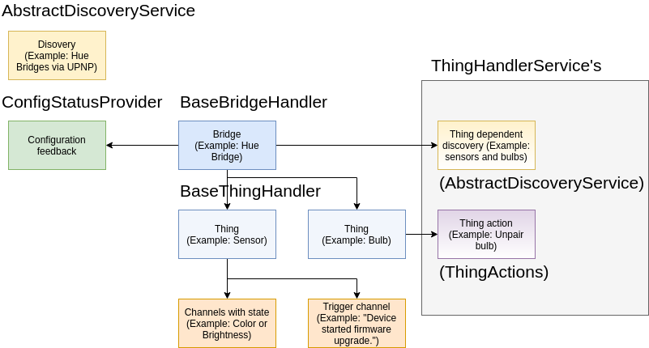



# Developing a Binding

{:.no_toc}

A binding is an extension to openHAB that integrates an external system like a software service or a hardware device.
The external system is represented as a set of *Things* and sometimes *Bridges* with *Channels*.

This chapter covers everything to know about binding development.
It makes sense to briefly read over all sections to make you familiar with what the framework has to offer.



During development you might come back with specific questions.

{::options toc_levels="2,3"/}

- TOC
{:toc}

## Structure of a Binding

Every binding needs to define a `binding.xml` file.
Find more information in the respective [binding XML reference](binding-xml.html).

## Describing Things

External systems are represented as *Things* in openHAB.
When starting the implementation of a binding, you should think about the abstraction of your external system.
Different services or devices should be represented as individual *Things*.
Each functionality of the *Thing* should be modelled as a `Channel`.

*Thing* and *Channel* structures need to be explained to the openHAB runtime.
This is done in a declarative way via XML files, so called *ThingTypes* and *ChannelTypes*.

Find more information in the respective [Thing & Channel XML reference](thing-xml.html).

## The ThingHandlerFactory

For each *Thing* the binding must provide a proper `ThingHandler` implementation that is able to handle the communication.

The `ThingHandlerFactory` is responsible for creating `ThingHandler` instances.

Every binding must implement a `ThingHandlerFactory` and register it as OSGi service so that the runtime knows which class needs to be called for creating and handling things.

When a new *Thing* is added, the openHAB runtime queries every `ThingHandlerFactory` for support of the *ThingType* by calling the `supportsThingType` method.
When the method returns `true`, the runtime calls `createHandler`, which should then return a proper `ThingHandler` implementation.

A weather bindings `WeatherHandlerFactory` for example supports only one *ThingType* and instantiates a new `WeatherHandler` for a given thing:

```java
@NonNullByDefault
@Component(configurationPid = "binding.myweatherbinding", service = ThingHandlerFactory.class)
public class WeatherHandlerFactory extends BaseThingHandlerFactory {

    private static final Collection<ThingTypeUID> SUPPORTED_THING_TYPES_UIDS = Collections.singleton(WeatherBindingConstants.THING_TYPE_WEATHER);

    @Override
    public boolean supportsThingType(ThingTypeUID thingTypeUID) {
        return SUPPORTED_THING_TYPES_UIDS.contains(thingTypeUID);
    }

    @Override
    protected @Nullable ThingHandler createHandler(Thing thing) {
        ThingTypeUID thingTypeUID = thing.getThingTypeUID();

        if (WeatherBindingConstants.THING_TYPE_WEATHER.equals(thingTypeUID)) {
            return new WeatherHandler(thing);
        }

        return null;
    }
}
```

Constants like the `THING_TYPE_WEATHER` UID and also *Channel* UIDs are typically defined inside a public `BindingConstants` class.

Depending on your implementation, each *ThingType* may use its own handler.
It is also possible to use the same handler for different *Things*, or use different handlers for the same *ThingType*, depending on the configuration.

## The ThingHandler

A `ThingHandler` handles the communication between openHAB and an entity from the real world, e.g. a physical device, a web service, represented by a `Thing`.

openHAB provides an abstract base class named `BaseThingHandler`.
It is recommended to use this class, because it covers a lot of common logic.
Most of the explanations are based on the assumption, that the binding inherits from the BaseThingHandler in all concrete `ThingHandler` implementations.
Nevertheless if there are reasons why you can not use the base class, the binding can also directly implement the `ThingHandler` interface.

The communication between the framework and the ThingHandler is bidirectional.

If the framework wants the binding to do something or just notfiy it about changes,
it calls methods like `handleCommand`, `handleUpdate` or `thingUpdated`.

If the ThingHandler wants to inform the framework about changes, it uses a callback
 The `BaseThingHandler` provides convience methods like `updateState`, `updateStatus` `updateThing` or `triggerChannel`, that can be used to inform the framework about changes.

The overall structure looks like this:

```java
TODO
```

### Lifecycle

The `ThingHandler` has two important lifecycle methods: `initialize` and `dispose`.
The `initialize` method is called when the handler is started and `dispose` just before the handler is stopped.
Therefore these methods can be used to allocate and deallocate resources.
For an example, our exemplary Weather binding starts and stops a scheduled job to update weather information within these methods.

#### Startup

The startup of a handler is divided in two essential steps:

1. Handler is registered: `ThingHandler` instance is created by a `ThingHandlerFactory` and tracked by the framework.
In addition, the handler can be registered as a service if required, e.g. as `FirmwareUpdateHandler` or `ConfigStatusProvider`.

2. Handler is initialized: `ThingHandler.initialize()` is called by the framework in order to initialize the handler.
This method is only called if all 'required' configuration parameters of the Thing are present.
The handler is ready to work (methods like `handleCommand`, `handleUpdate` or `thingUpdated` can be called).

The diagram below illustrates the startup of a handler in more detail.
The life cycle is controlled by the `ThingManager`.


The `ThingManager` mediates the communication between a `Thing` and a `ThingHandler` from the binding.
The `ThingManager` creates for each Thing a `ThingHandler` instance using a `ThingHandlerFactory`.
Therefore, it tracks all `ThingHandlerFactory`s from the binding.

The `ThingManager` determines if the `Thing` is initializable or not.
A `Thing` is considered as *initializable* if all *required* configuration parameters (cf. property *parameter.required* in [Configuration Description](config-xml.html)) are available.
If so, the method `ThingHandler.initialize()` is called.

Only Things with status (cf. [Thing Status](../../concepts/things.html#thing-status)) *UNKNOWN*, *ONLINE* or *OFFLINE* are considered as *initialized* by the framework and therefore it is the handler's duty to assign one of these states sooner or later.
To achieve that, the status must be reported to the framework via the callback or `BaseThingHandler.updateStatus(...)` for convenience.
Furthermore, the framework expects `initialize()` to be non-blocking and to return quickly.
For longer running initializations, the implementation has to take care of scheduling a separate job which must guarantee to set the status eventually.
Also, please note that the framework expects the `initialize()` method to handle anticipated error situations gracefully and set the thing to *OFFLINE* with the corresponding status detail (e.g. *COMMUNICATION_ERROR* or *CONFIGURATION_ERROR* including a meaningful description) instead of throwing exceptions.

If the `Thing` is not initializable the configuration can be updated via `ThingHandler.handleConfigurationUpdate(Map)`.
The binding has to notify the `ThingManager` about the updated configuration by a callback.
The `ThingManager` tries to initialize the `ThingHandler` resp. `Thing` again.

After the handler is initialized, the handler must be ready to handle methods calls like `handleCommand` and `handleUpdate`, as well as `thingUpdated`.

#### Shutdown

The shutdown of a handler is also divided in two essential steps:

1. Handler is unregistered: `ThingHandler` instance is no longer tracked by the framework.
The `ThingHandlerFactory` can unregister handler services (e.g. `FirmwareUpdateHandler` or `ConfigStatusProvider`) if registered, or release resources.

2. Handler is disposed: `ThingHandler.disposed()` method is called.
The framework expects `dispose()` to be non-blocking and to return quickly.
For longer running disposals, the implementation has to take care of scheduling a separate job.


After the handler is disposed, the framework will not call the handler anymore.

#### Bridge Status Changes

A `ThingHandler` is notified about Bridge status changes to *ONLINE* and *OFFLINE* after a `BridgeHandler` has been initialized.
Therefore, the method `ThingHandler.bridgeStatusChanged(ThingStatusInfo)` must be implemented
(this method is not called for a bridge status updated through the bridge initialization itself).
If the Thing of this handler does not have a Bridge, this method is never called.

If the bridge status has changed to OFFLINE, the status of the handled thing must also be updated to *OFFLINE* with detail *BRIDGE_OFFLINE*.
If the bridge returns to *ONLINE*, the thing status must be changed at least to *OFFLINE* with detail *NONE* or to another thing specific status.

### Configuration

*Things* can be configured with parameters.
To retrieve the configuration of a *Thing* one can call `getThing().getConfiguration()` inside the `ThingHandler`.
The configuration class has the equivalent methods as the `Map` interface, thus the method `get(String key)` can be used to retrieve a value for a given key.

Moreover the configuration class has a utility method `as(Class<T> configurationClass)` that transforms the configuration into a Java object of the given type.

All configuration values will be mapped to properties of the class.
The type of the property must match the type of the configuration.
The following types are supported for configuration values: `Boolean`, `boolean`, `String`, `BigDecimal`, `int`, `long`, `float` and `double`.

For example, the Yahoo Weather binding allows configuration of the location and the refresh frequency.

### Properties

*Things* can have properties.
If you would like to add meta data to your thing, e.g. the vendor of the thing, then you can define your own thing properties by simply adding them to the thing type definition.
The properties section [here](thing-definition.html#Properties) explains how to specify such properties.

To retrieve the properties one can call the operation `getProperties` of the corresponding `org.openhab.core.thing.type.ThingType` instance.
If a thing will be created for this thing type then its properties will be automatically copied into the new thing instance.
Therefore the `org.openhab.core.thing.Thing` interface also provides the `getProperties` operation to retrieve the defined properties.
In contrast to the `getProperties` operation of the thing type instance the result of the thing´s `getProperties` operation will also contain the properties updated during runtime (cp. the thing handler [documentation](thing-handler.html)).

### Handling Commands

For handling commands the `ThingHandler` interface defines the `handleCommand` method.
This method is called when a command is sent to an item, which is linked to a channel of the *Thing*.
A Command represents the intention that an action should be executed on the external system,
or that the state should be changed.
Inside the `handleCommand` method binding specific logic can be executed.

The ThingHandler implementation must be prepared to

- handle different command types depending on the item types, that are defined by the channels,
- be called at the same time from different threads.

If an exception is thrown in the method, it will be caught by the framework and logged as an error.
So it is better to handle communication errors within the binding and to update the thing status accordingly.

The following code block shows a typical implementation of the `handleCommand` method:

```java
@Override
public void handleCommand(ChannelUID channelUID, Command command) {
    try {
        switch (channelUID.getId()) {
            case CHANNEL_TEMPERATURE:
                if(command instanceof OnOffType.class) {
                    // binding specific logic goes here
                    SwitchState deviceSwitchState = convert((OnOffType) command);
                    updateDeviceState(deviceSwitchState);
                }
                break;
            // ...
        }
        statusUpdated(ThingStatus.ONLINE);
    } catch(DeviceCommunicationException ex) {
        // catch exceptions and handle it in your binding
        statusUpdated(ThingStatus.OFFLINE, ThingStatusDetail.COMMUNICATION_ERROR, ex.getMessage());
    }
}
```

### Handling RefreshType Command

If the framework requires the value of a channel, for example after bootup or because
a user-interface requested a refreshed value, if will send a `RefreshType` command.

```java
@Override
public void handleCommand(ChannelUID channelUID, Command command) {
    if (command instanceof RefreshType) {

        updateWeatherData();

        switch (channelUID.getId()) {
            case CHANNEL_TEMPERATURE:
                updateState(channelUID, getTemperature());
                break;
            case CHANNEL_HUMIDITY:
                [...]
        }
    }
}
```

In this example, when a `RefreshType` command is sent to the `ThingHandler` it updates the weather data by executing an HTTP call in the `updateWeatherData` method and sends a state update via the `updateState` method.
This will update the state of the Item, which is linked to the channel for the given channel UID.

### Updating the Channel State

State updates are sent from the binding to inform the framework, that the state of a channel has been updated.
For this the binding developer can call a method from the `BaseThingHandler` class like this:

```java
updateState("channelId", OnOffType.ON)
```

The call will be delegated to the framework, which changes the state of all bound items.
It is binding specific when the channel should be updated.
If the device or service supports an event mechanism the ThingHandler should make use of it and update the state every time when the device changes its state.

### Polling for a State

If no event mechanism is available, the binding can poll for the state.
The `BaseThingHandlerFactory` has an accessible `ScheduledExecutorService`, which can be used to schedule a job.
The following code block shows how to start a polling job in the initialize method of a `ThingHandler`, which runs with an interval of 30 seconds:

```java
@Override
public void initialize() {
    pollingJob = scheduler.scheduleWithFixedDelay(this::pollingCode, 0, 30, TimeUnit.SECONDS);
}

private void pollingCode() {
    // execute some binding specific polling code
}
```

Of course, the polling job must be cancelled in the dispose method:

```java
@Override
public void dispose() {
    pollingJob.cancel(true);
}
```

Even if the state has not changed since the last update, the binding should inform the framework, because it indicates that the value is still present.

### Trigger a channel

The binding can inform the framework, that a channel has been triggered.
For this the binding developer can call a method from the BaseThingHandler class like this:

```java
triggerChannel("channelId")
```

If an event payload is needed, use the overloaded version:

```java
triggerChannel("channelId", "PRESSED")
```

The call will be delegated to the framework.
It is binding specific when the channel should be triggered.

### Updating the Thing Status

The *ThingHandler* must also manage the thing status (see also: [Thing Status Concept](../../concepts/things.html#thing-status)).
If the device or service is not working correctly, the binding should change the status to *OFFLINE* and back to *ONLINE*, if it is working again.
The status can be updated via an inherited method from the BaseThingHandler class by calling:

```java
updateStatus(ThingStatus.OFFLINE, ThingStatusDetail.OFFLINE.COMMUNICATION_ERROR);
```

The second argument of the method takes a `ThingStatusDetail` enumeration value, which further specifies the current status situation.
A complete list of all thing statuses and thing status details is listed in the [Thing Status](../../concepts/things.html#thing-status) chapter.

The binding should also provide additional status description, if available.
This description might contain technical information (e.g. an HTTP status code, or any other protocol specific information, which helps to identify the current problem):

```java
updateStatus(ThingStatus.OFFLINE, ThingStatusDetail.OFFLINE.COMMUNICATION_ERROR, "HTTP 403 - Access denied");
```

After the thing is created, the framework calls the `initialize` method of the handler.
At this time the state of the thing is *INTIALIZING* as long as the binding sets it to something else.
Because of this the default implementation of the `initialize()` method in the `BaseThingHandler` just changes the status to *ONLINE*.

::: tip Note
A binding should not set any other state than ONLINE, OFFLINE and UNKNOWN.
Additionally, REMOVED must be set after `handleRemoval()` has completed the removal process.
All other states are managed by the framework.
:::

Furthermore bindings can specify a localized description of the thing status by providing the reference of the localization string, e.g &#64;text/rate_limit.
The corresponding handler is able to provide placeholder values as a JSON-serialized array of strings:

```text
&#64;text/rate_limit ["60", "10", "@text/hour"]
```

```text
rate_limit=Device is blocked by remote service for {0} minutes.
Maximum limit of {1} configuration changes per {2} has been exceeded.
For further info please refer to device vendor.
```

### Channel Links

Some bindings might want to start specific functionality for a channel only if an item is linked to the channel.
The `ThingHandler` has two callback methods `channelLinked(ChannelUID channelUID)` and `channelUnlinked(ChannelUID channelUID)`, which are called for every link that is added or removed to/from a channel.
So please be aware of the fact that both methods can be called multiple times.

The `channelLinked` method is only called, if the thing handler has been initialized (status ONLINE/OFFLINE/UNKNOWN).
To actively check if a channel is linked, you can use the `isChannelLinked(ChannelUID channelUID)` method of the `ThingHandlerCallback`.

## Updating the Thing from a Binding

It can happen that the binding wants to update the configuration or even the whole structure of a thing.
If the `BaseThingHandler` class is used, it provides some helper methods for modifying the thing.

### Updating the Configuration

Usually the configuration is maintained by the user and the binding is informed about the updated configuration.
But if the configuration can also be changed in the external system, the binding should reflect this change and notify the framework about it.

If the configuration should be updated, then the binding developer can retrieve a copy of the current configuration by calling `editConfiguration()`.
The updated configuration can be stored as a whole by calling `updateConfiguration(Configuration)`.

Suppose that an external system causes an update of the configuration, which is read in as a `DeviceConfig` instance.
The following code shows how to update configuration:

```java
protected void deviceConfigurationChanged(DeviceConfig deviceConfig) {
    Configuration configuration = editConfiguration();
    configuration.put("parameter1", deviceConfig.getValue1());
    configuration.put("parameter2", deviceConfig.getValue2());
    updateConfiguration(configuration);
}
```

### Updating Thing Properties

Thing properties can be updated in the same way as the configuration.
The following example shows how to modify two properties of a thing:

```java
protected void devicePropertiesChanged(DeviceInfo deviceInfo) {
    Map<String, String> properties = editProperties();
    properties.put(Thing.PROPERTY_SERIAL_NUMBER, deviceInfo.getSerialNumber());
    properties.put(Thing.PROPERTY_FIRMWARE_VERSION, deviceInfo.getFirmwareVersion());
    updateProperties(properties);
}
```

If only one property must be changed, there is also a convenient method `updateProperty(String name, String value)`.
Both methods will only inform the framework that the thing was modified, if at least one property was added, removed or updated.

Thing handler implementations must not rely on properties to be persisted as not all providers support that.

### Updating the Thing Structure

The binding also has the possibility to change the thing structure by adding or removing channels.
The following code shows how to use the ThingBuilder to add one channel to the thing:

```java
protected void thingStructureChanged() {
    ThingBuilder thingBuilder = editThing();
    Channel channel = ChannelBuilder.create(new ChannelUID("bindingId:type:thingId:1"), "String").build();
    thingBuilder.withChannel(channel);
    updateThing(thingBuilder.build());
}
```

### Handling Thing Updates

If the structure of a thing has been changed during runtime (after the thing was created), the binding is informed about this change in the ThingHandler within the `thingUpdated` method.
The `BaseThingHandler` has a default implementation for this method:

```java
@Override
public void thingUpdated(Thing thing) {
    dispose();
    this.thing = thing;
    initialize();
}
```

If your binding contains resource-intensive logic in your initialize method, you should think of implementing the method by yourself and figuring out what is the best way to handle the change.

For configuration updates, which are triggered from the binding, like in the previous three section,
the framework does not call the `thingUpdated` method to avoid infinite loops.

## Bridges

In the domain of an IoT system there are often hierarchical structures of devices and services.
For example, one device acts as a gateway that enables communication with other devices that use the same protocol.
In openHAB this kind of device or service is called *Bridge*.
Philips Hue is one example of a system that requires a bridge.
The Hue gateway is an IP device with an HTTP API, which communicates over the ZigBee protocol with the Hue bulbs.
In the openHAB model the Hue gateway is represented as a *Bridge* with connected *Things*, that represent the Hue bulbs.
*Bridge* inherits from *Thing*, so that it also has *Channels* and all other features of a thing, with the addition that it also holds a list of things.

We have a FAQ, dicussing [Thing, Bridge and Channel modelling](faq.html#structuring-things-and-thing-types).

When implementing a binding with *Bridges*, the logic to communicate with the external system is often shared between the different `ThingHandler` implementations.
In that case it makes sense to implement a handler for the *Bridge* and delegate the actual command execution from the *ThingHandler* to the *BridgeHandler*.
To access the *BridgeHandler* from the *ThingHandler*, call `getBridge().getHandler()`

The following excerpt shows how the `HueLightHandler` delegates the command for changing the light state to the `HueBridgeHandler`:

```java
@Override
public void handleCommand(ChannelUID channelUID, Command command) {

    HueBridgeHandler hueBridgeHandler = (HueBridgeHandler) getBridge().getHandler();

    switch (channelUID.getId()) {
        case CHANNEL_ID_COLOR_TEMPERATURE:
            StateUpdate lightState = lightStateConverter.toColorLightState(command);
            hueBridgeHandler.updateLightState(getLight(), lightState);
            break;
        case CHANNEL_ID_COLOR:
            // ...
    }
}
```

Inside the `BridgeHandler` the list of *Things* can be retrieved via the `getThings()` call.

### Bridge Handler Implementation

A `BridgeHandler` handles the communication between the openHAB framework and a *bridge*  (a device that acts as a gateway to enable the communication with other devices) represented by a `Bridge` instance.

A bridge handler has the same properties as thing handler.
Therefore, the `BridgeHandler` interface extends the `ThingHandler` interface.

### The BaseBridgeHandler

openHAB provides an abstract implementation of the `BridgeHandler` interface named `BaseBridgeHandler`.
It is recommended to use this class, because it covers a lot of common logic.

### Life cycle

A `BridgeHandler` has the same life cycle than a `ThingHandler` (created by a `ThingHandlerFactory`, well defined life cycle by handler methods `initialize()` and `dispose()`, see chapter [Life Cycle](#lifecycle)).
A bridge acts as a gateway in order to provide access to other devices, the *child things*.
Hence, the life cycle of a child handler depends on the life cycle of a bridge handler.
Bridge and child handlers are subject to the following restrictions:

- A `BridgeHandler` of a bridge is initialized before `ThingHandler`s of its child things are initialized.
- A `BridgeHandler` is disposed after all `ThingHandler`s of its child things are disposed.

### Handler initialization notification

A `BridgeHandler` is notified about the initialization and disposal of child things.
Therefore, the `BridgeHandler` interface provides the two methods `childHandlerInitialized(ThingHandler, Thing)` and `childHandlerDisposed(ThingHandler, Thing)`.

These methods can be used to allocate and deallocate resources for child things.

## Config Status Provider

Each entity that has a configuration can provide its current configuration status to provide further information, especially in an error case.

This information is available to user-interfaces to present configuration errors to the user.

For this purpose the handler of the entity implements the interface `org.openhab.core.config.core.status.ConfigStatusProvider`.

### Providing the Configuration Status

A *ThingHandler* as handler for the thing entity can provide the configuration status of the thing by implementing the `org.openhab.core.config.core.status.ConfigStatusProvider` interface.

For things that are created by sub-classes of the `BaseThingHandlerFactory` the provider is already automatically registered as an OSGi service if the concrete thing handler implements the configuration status provider interface.
Currently the framework provides two base thing handler implementations for the configuration status provider interface:

- `org.openhab.core.thing.binding.ConfigStatusThingHandler` extends the `BaseThingHandler` and is to be used if the configuration status is to be provided for thing entities
- `org.openhab.core.thing.binding.ConfigStatusBridgeHandler` extends the `BaseBridgeHandler` and is to be used if the configuration status is to be provided for bridge entities

Sub-classes of these handlers must only override the operation `getConfigStatus` to provide the configuration status in form of a collection of `org.openhab.core.config.core.status.ConfigStatusMessage`s.

#### Internationalization

The framework will take care of internationalizing messages.

For this purpose there must be an [i18n](../utils/i18n.html) properties file inside the bundle of the configuration status provider that has a message declared for the message key of the `ConfigStatusMessage`.
The actual message key is built by the operation `withMessageKeySuffix(String)` of the message´s builder in the manner that the given message key suffix is appended to *config-status."config-status-message-type."*.

As a result depending on the type of the message the final constructed message keys are:

- config-status.information.any-suffix
- config-status.warning.any-suffix
- config-status.error.any-suffix
- config-status.pending.any-suffix

## Handling Thing / Bridge Removal

If a thing should be removed, the framework informs the binding about the removal request by calling `handleRemoval` at the thing/bridge handler.

The thing will not be removed from the runtime until the binding confirms the deletion by setting the thing status to `REMOVED`.
If no special removal handling is required by the binding, you do not have to care about removal because the default implementation of this method in the `BaseThingHandler` class just calls `updateStatus(ThingStatus.REMOVED)`.

However, for some radio-based devices it is needed to communicate with the device in order to unpair it safely.
After the device was successfully unpaired, the binding must inform the framework that the thing was removed by setting the thing status to `REMOVED`.

After the removal was requested (i.e. the thing is in  `REMOVING` state), it cannot be changed back anymore to `ONLINE`/`OFFLINE`/`UNKNOWN` by the binding.
The binding may only initiate the status transition to `REMOVED`.

## Actions bound to a Thing

Quite often the device or service you expose via openHAB Things allows certain actions to be performed.

Examples are:

- Reboot / Restart device
- Start searching for new lights for a Hue lights bridge
- Send message (via E-Mail / SMS Gateway service / Instant Messanger)

If you implement the `ThingActions` interface, you can tell the framework about your Thing related actions.

Please note that for actions not related to Things you will instead implement an `ActionHandler` as described in the developing [Module Types](../module-types/) chapter.

You start things off by implementing `ThingActions` and annotate your class with `@ThingActionsScope`:

```java
@ThingActionsScope(name = "mqtt") // Your bindings id is usually the scope
@NonNullByDefault
public class MQTTActions implements ThingActions {
    private @Nullable AbstractBrokerHandler handler;

    @Override
    public void setThingHandler(@Nullable ThingHandler handler) { this.handler = (AbstractBrokerHandler) handler; }

    @Override
    public @Nullable ThingHandler getThingHandler() { return handler; }
}
```

The second step is to return this class in your Thing handlers `getServices()` method:

```java
public class MyThingHandler extends BaseThingHandler {
    ...
    @Override
    public Collection<Class<? extends ThingHandlerService>> getServices() {
        return Collections.singleton(MQTTActions.class);
    }
}
```

As you can see in the above `MqttActions` implementation, the framework will call you back with the `ThingHandler`.

You are now free to specify as many actions as you want in `MqttActions`.

In the following example we provide a "publishMQTT" action.
An action must be annotated with `@RuleAction`, a label and a description must be provided.
In this case we refer to translation, see [i18n](../utils/i18n.html) support, instead of directly providing a string.

```java
@RuleAction(label = "@text/actionLabel", description = "@text/actionDesc")
    public void publishMQTT(
            @ActionInput(name = "topic", label = "@text/actionInputTopicLabel", description = "@text/actionInputTopicDesc") @Nullable String topic,
            @ActionInput(name = "value", label = "@text/actionInputValueLabel", description = "@text/actionInputValueDesc") @Nullable String value) {
        ...
    }

    public static void publishMQTT(@Nullable ThingActions actions, @Nullable String topic, @Nullable String value) {
        if (actions instanceof MQTTActions) {
            ((MQTTActions) actions).publishMQTT(topic, value);
        } else {
            throw new IllegalArgumentException("Instance is not an MQTTActions class.");
        }
    }
```

Each member method also requires a static method with the same name.
This is to support the old DSL rules engine and make the action available there.

Each parameter of an action member method must be annotated with `@ActionInput`.

If you return values, you do so by returning a `Map<String,Object>` and annotate the method itself with as many `@ActionOutput`s as you will return map entries.

## Firmware information / Firmware update

TODO

## Implementing a Discovery Service

Bindings can implement the `DiscoveryService` interface and register it as an OSGi service to inform the framework about devices and services, that can be added as things to the system (see also [Inbox & Discovery Concept](../../concepts/discovery.html)).

A discovery service provides discovery results.
The following table gives an overview about the main parts of a `DiscoveryResult`:

| Field | Description |
|-------|-------------|
| `thingUID` | The `thingUID` is the unique identifier of the specific discovered thing (e.g. a device's serial number). It  *must not* be constructed out of properties, that can change (e.g. IP addresses). A typical `thingUID` could look like this: `hue:bridge:001788141f1a`
| `thingTypeUID` | Contrary to the `thingUID` is the `thingTypeUID` that specifies the type the discovered thing belongs to. It could be constructed from e.g. a product number. A typical `thingTypeUID` could be the following: `hue:bridge`.
| `bridgeUID` | If the discovered thing belongs to a bridge, the `bridgeUID` contains the UID of that bridge.
| `properties` | The `properties` of a `DiscoveryResult` contain the configuration for the newly created thing.
| `label` | The human readable representation of the discovery result. Do not put IP/MAC addresses or similar into the label but use the special `representationProperty` instead. |
| `representationProperty` | The name of one of the properties or configuration parameters, which best discriminates the result from other results of the same type. See chapter [Representation Property](#representation-property) below. |

To simplify the implementation of custom discovery services, an abstract base class `AbstractDiscoveryService` implements the `DiscoveryService` and just needs to be extended.
Subclasses of `AbstractDiscoveryService` do not need to handle the `DiscoveryListeners` themselves, they can use the methods `thingDiscovered` and `thingRemoved` to notify the registered listeners.
Most of the descriptions in this chapter refer to the `AbstractDiscoveryService`.

For UPnP and mDNS there already are generic discovery services available.
Bindings only need to implement a `UpnpDiscoveryParticipant` resp. `mDNSDiscoveryParticipant`.
For details refer to the chapters [UPnP Discovery](#upnp-discovery) and [mDNS Discovery](#mdns-discovery).

The following example is taken from the `HueLightDiscoveryService`, it calls `thingDiscovered` for each found light.
It uses the `DiscoveryResultBuilder` to create the discovery result.

```java
    private void onLightAddedInternal(FullLight light) {
        ThingUID thingUID = getThingUID(light);
        if (thingUID != null) {
            ThingUID bridgeUID = hueBridgeHandler.getThing().getUID();
            Map<String, Object> properties = new HashMap<>(1);
            properties.put(LIGHT_ID, light.getId());
            DiscoveryResult discoveryResult = DiscoveryResultBuilder.create(thingUID).withProperties(properties)
                    .withBridge(bridgeUID).withLabel(light.getName()).build();
            thingDiscovered(discoveryResult);
        } else {
            logger.debug("discovered unsupported light of type '{}' with id {}", light.getModelID(), light.getId());
        }
    }
```

The discovery service needs to provide the list of supported thing types, that can be found by the discovery service.
This list will be given to the constructor of `AbstractDiscoveryService` and can be requested by using `DiscoveryService#getSupportedThingTypes` method.

### Representation Property

The name of one of the properties or configuration parameters, which best discriminates the discovery result from other results of the same type.
Typically this is a serial number, or an IP or MAC address.
The representation property is used to auto-ignore discovery results of Things that already exist in the system.
This can happen, a) if a Thing has been created manually, or b) if the Thing has been discovered separately by two mechanisms e.g. by mDNS, and by NetBios, or UPnP.
If a new Thing goes online, the auto-ignore service of the inbox checks if the inbox already contains a discovery result of the same type where the existing representation property is identical to the representation property of the newly discovered Thing.
If this is the case, the Thing in the inbox is automatically ignored.
The representation property must be declared in the [thing-types.xml](thing-xml.md#representation-property)

When comparing representation properties, the framework checks for matches between the representation property of the newly discovered Thing, and both the `properties` and the `configuration parameters` of existing Things.

If defining a representation property for a bridge, the representation property does not need to be **globally** unique, but only unique within the context of the bridge, so long as the discovery service calls `.withBridge(bridgeUID)` when building the DiscoveryResult. e.g. if bridge A. has child Things with representation properties of 1, 2, and 3, and bridge B. also has child Things with representation properties of 1, 2, and 3, they will not conflict.

```java
DiscoveryResult result = DiscoveryResultBuilder.create(thingUID)
  .withProperty("uniqueId", nonUniquePropertyValue)
  .withBridge(bridgeUID) // bridgeUID plus nonUniquePropertyValue are unique
  .withRepresentationProperty("uniqueId")
  .build();
```

Furthermore, if a Thing has two configuration parameters where each individually is not globally unique, but the combination of the two is unique, one can define an extra property that combines the two:

```java
String cfgParamValA = "value-of-non-unique-config-param-A";
String cfgParamValB = "value-of-non-unique-config-param-B";
String uniquePropVal = String.format("%s-%s", cfgParamValA, cfgParamValB);
...
DiscoveryResult hub = DiscoveryResultBuilder.create(thingUID)
  .withProperty("uniqueId", uniquePropVal)
  .withRepresentationProperty("uniqueId")
  .build();
```

If Things are created manually, the property or configuration parameter that will match the auto discovery representation property must be set.
In the case that a `property` will be used to match the representation property its value must be set in the Thing handler's `initialize()` method:

```java
updateProperty("uniqueId", uniquePropVal);
```

Alternatively in the case that a `configuration parameter` will be used to match the auto discovery representation property, the parameter must be declared in either, a) the `thing-types.xml` file, or b) the `config-description` [XML file](config-xml.md).
And it must also be declared in the Thing handler's `Configuration` class:

```java
public class MyThingConfiguration {
    public String uniqueId;
}
```

### Registering as an OSGi service

The `Discovery` class of a binding which implements `AbstractDiscoveryService` should be annotated with

```java
@Component(service = DiscoveryService.class, immediate = true, configurationPid = "discovery.<binding-id>")
```

where `<binding-id>` is the id of the binding, i.e. `astro` for the Astro binding.
Such a registered service will be picked up automatically by the framework.

### Background Discovery

If the implemented discovery service enables background discovery, the `AbstractDiscoveryService` class automatically starts it.
If background discovery is enabled, the framework calls `AbstractDiscoveryService#startBackgroundDiscovery` when the binding is activated and `AbstractDiscoveryService#stopBackgroundDiscovery` when the component is deactivated.
The default implementations of both methods are empty and could be overridden by the binding developer.
Depending on the concrete implementation the discovery service might start and stop a scheduler in these method or register a listener for an external protocol.
The `thingDiscovered` method can be used to notify about a newly discovered thing.

The following example shows the implementation of the above mentioned methods in the Wemo binding.

```java
    @Override
    protected void startBackgroundDiscovery() {
        logger.debug("Start WeMo device background discovery");
        if (wemoDiscoveryJob == null || wemoDiscoveryJob.isCancelled()) {
            wemoDiscoveryJob = scheduler.scheduleWithFixedDelay(wemoDiscoveryRunnable, 0, refreshInterval, TimeUnit.SECONDS);
        }
    }

    @Override
    protected void stopBackgroundDiscovery() {
        logger.debug("Stop WeMo device background discovery");
        if (wemoDiscoveryJob != null) {
            wemoDiscoveryJob.cancel(true);
            wemoDiscoveryJob = null;
        }
    }
```

### Active Scan

If the user triggers an active scan for a binding or specific set of thing types, the method `startScan` of each discovery service which supports these thing type is called.
Within these methods the things can be discovered.
The abstract base class automatically starts a thread, so the implementation of this method can be long-running.

The following example implementation for `startScan` is taken from the `HueLightDiscoveryService`, that triggers a scan for known and also for new lights of the hue bridge.
Already discovered things are identified by the ThingUID the DiscoveryResult was created with, and won't appear in the inbox again.

```java
    @Override
    public void startScan() {
        List<FullLight> lights = hueBridgeHandler.getFullLights();
        if (lights != null) {
            for (FullLight l : lights) {
                onLightAddedInternal(l);
            }
        }
        // search for unpaired lights
        hueBridgeHandler.startSearch();
    }
```

### Re-Discovered Results and Things

The `getThingUID` method of the discovery service should create a consistent UID every time the same thing gets discovered.
This way existing discovery results and existing things with this UID will be updated with the properties from the current scan.
With this, dynamic discoveries (like UPnP or mDNS) can re-discover existing things and update communication properties like host names or TCP ports.

### Ending an Active Scan

As described above an active scan is initiated via `startScan`.
There is no explicit end to an active scan and discovery results can be provided even after `startScan` completes (e.g. from a separate thread).
If you would like assistance with enforcing a scan end pass a timeout to the `AbstractDiscoveryService` constructor.
`stopScan` will then be called on your discovery service upon timeout expiration allowing you to stop your scan however needed.
If a timeout is specified the scan will be considered active until the timeout expires even if `startScan` completed beforehand.
In particular UIs such as the Paper UI will show the scan as in progress throughout the timeout.
If you override `stopScan` don't forget to call `super.stopScan` as `AbstractDiscoveryService` performs some cleanup in its version.
If the timeout is set to 0 `stopScan` will not be called.

### Remove older results

Normally, older discovery results already in the inbox are left untouched by a newly triggered scan.
If this behavior is not appropriate for the implemented discovery service, one can override the method `stopScan` to call `removeOlderResults` as shown in the following example from the Hue binding:

```java
    @Override
    protected synchronized void stopScan() {
        super.stopScan();
        removeOlderResults(getTimestampOfLastScan());
    }
```

### Internationalization

The framework will take care of internationalizing labels of discovery results if you extend the `AbstractDiscoveryService`.
See [i18n](../utils/i18n.html#discovery) for more information.

::: tip Hint!
To make it work you have to inject references to the `LocaleProvider` and the `TranslationProvider` services into your implementation.
The `AbstractDiscoveryService` already provides `protected` properties, which are not yet linked to a service.
The devoloper has to take care about that.

```java
    protected @NonNullByDefault({}) TranslationProvider i18nProvider;
    protected @NonNullByDefault({}) LocaleProvider localeProvider;
```

:::

### UPnP Discovery

UPnP discovery is implemented in the framework as `UpnpDiscoveryService`.
It is widely used in bindings.
To facilitate the development, binding developers only need to implement a `UpnpDiscoveryParticipant`.
Here the developer only needs to implement three simple methods:

- `getSupportedThingTypeUIDs` - Returns the list of thing type UIDs that this participant supports.
The discovery service uses this method of all registered discovery participants to return the list of currently supported thing type UIDs.
- `getThingUID` - Creates a thing UID out of the UPnP result or returns `null` if this is not possible.
This method is called from the discovery service during result creation to provide a unique thing UID for the result.
- `createResult` - Creates the `DiscoveryResult` out of the UPnP result.
This method is called from the discovery service to create the actual discovery result.
It uses the `getThingUID` method to create the thing UID of the result.

The following example shows the implementation of the UPnP discovery participant for the Hue binding, the `HueBridgeDiscoveryParticipant`.

```java
public class HueBridgeDiscoveryParticipant implements UpnpDiscoveryParticipant {

    @Override
    public Set<ThingTypeUID> getSupportedThingTypeUIDs() {
        return Collections.singleton(THING_TYPE_BRIDGE);
    }

    @Override
    public DiscoveryResult createResult(RemoteDevice device) {
        ThingUID uid = getThingUID(device);
        if (uid != null) {
            Map<String, Object> properties = new HashMap<>(2);
            properties.put(HOST, device.getDetails().getBaseURL().getHost());
            properties.put(SERIAL_NUMBER, device.getDetails().getSerialNumber());

            DiscoveryResult result = DiscoveryResultBuilder.create(uid).withProperties(properties)
                    .withLabel(device.getDetails().getFriendlyName()).withRepresentationProperty(SERIAL_NUMBER).build();
            return result;
        } else {
            return null;
        }
    }

    @Override
    public ThingUID getThingUID(RemoteDevice device) {
        DeviceDetails details = device.getDetails();
        if (details != null) {
            ModelDetails modelDetails = details.getModelDetails();
            if (modelDetails != null) {
                String modelName = modelDetails.getModelName();
                if (modelName != null) {
                    if (modelName.startsWith("Philips hue bridge")) {
                        return new ThingUID(THING_TYPE_BRIDGE, details.getSerialNumber());
                    }
                }
            }
        }
        return null;
    }
}
```

### mDNS Discovery

mDNS discovery is implemented in the framework as `MDNSDiscoveryService`.
To facilitate the development, binding developers only need to implement a `MDNSDiscoveryParticipant`.
Here the developer only needs to implement four simple methods:

- `getServiceType` - Defines the [mDNS service type](https://www.dns-sd.org/ServiceTypes.html).
- `getSupportedThingTypeUIDs` - Returns the list of thing type UIDs that this participant supports.
The discovery service uses this method of all registered discovery participants to return the list of currently supported thing type UIDs.
- `getThingUID` - Creates a thing UID out of the mDNS service info or returns `null` if this is not possible.
This method is called from the discovery service during result creation to provide a unique thing UID for the result.
- `createResult` - Creates the `DiscoveryResult` out of the mDNS result.
This method is called from the discovery service to create the actual discovery result.
It uses the `getThingUID` method to create the thing UID of the result.

### Discovery that is bound to a Thing

TODO

## Frequently asked questions / FAQ

Various binding related questions are answered in our [Binding development FAQ](faq.html).

## Include the Binding in the Build

Once you are happy with your implementation, you need to integrate it in the Maven build and add it to the official distro.

- Add a new line in the [bundle pom.xml](https://github.com/openhab/openhab-addons/blob/master/bundles/pom.xml).
- Add a new line in the [binding pom.xml](https://github.com/openhab/openhab-addons/blob/master/bom/openhab-addons/pom.xml).
- If you have a dependency on a transport bundle (e.g. upnp, mdns or serial) or an external library,
  make sure to add a line for this dependency in the `/src/main/feature/feature.xml` file in your binding folder. See the other bindings as an example.
- Add your binding to the [CODEOWNERS](https://github.com/openhab/openhab-addons/blob/master/CODEOWNERS) file so that you get notified by Github when someone adds a pull request towards your binding.

> Please make sure you add the above entries at their alphabetically correct position!

Before you create a pull request on GitHub, you should now run

```bash
mvn clean install
```

from the repository root to ensure that the build works smoothly (that step takes about 30 minutes).

The build includes [Tooling for static code analysis](https://github.com/openhab/static-code-analysis) that will validate your code against the openHAB Coding Guidelines and some additional best practices.
Please fix all the priority 1 issues and all issues with priority 2 and 3 that are relevant (if you have any doubt don't hesitate to ask).

You can always run the above command from within your bindings directory to speed the build up and fix and check reported errors.

Re-run the build to confirm that the checks are passing.
If it does, it is time to [contribute your work](../contributing.html)!
