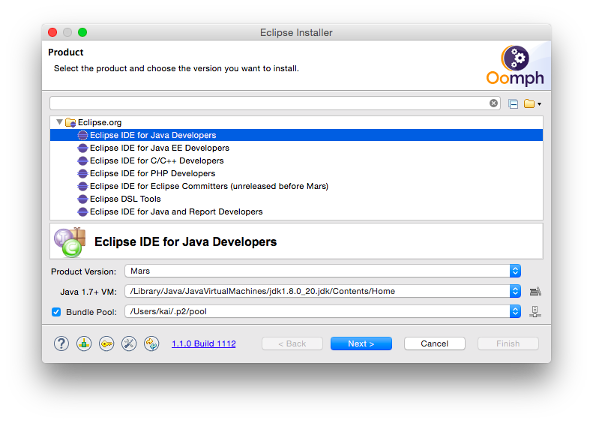



# Setting up an IDE for openHAB

If you are a developer yourself, you might want to setup a development environment, so that you can debug and develop openHAB yourself.

Note that the project build is completely mavenized - so running "mvn install" on any repository root will nicely build all artifacts. For development and debugging, we recommend using an Eclipse IDE though. It should be possible to use other IDEs (e.g. NetBeans or IntelliJ), but you will have to work out how to resolve OSGi dependencies etc. yourself. So unless you have a strong reason to go for another IDE, we recommend using Eclipse.

## Prerequisites

Please ensure that you have the following prerequisites installed on your machine:

1. [Git](https://git-scm.com/downloads)
1. [Maven 3.x](https://maven.apache.org/download.cgi) (optional, Eclipse m2e can also be used)
1. [Oracle JDK 8](http://www.oracle.com/technetwork/java/javase/downloads/jdk8-downloads-2133151.html)

## Installing the Eclipse IDE

The Eclipse IDE is used for openHAB developments. The Eclipse Installer automatically prepares the IDE so that it comes with all required plug-ins, the correct workspace encoding settings, pre-configured code formatters and more. Simply follow these steps:

1. Download the [Eclipse Installer](https://wiki.eclipse.org/Eclipse_Installer)
2. Launch the Eclipse Installer and switch to "Advanced Mode" in the top right menu:

3. Choose the "Eclipse IDE for Java Developers" and select "Next":

4. Expand "Github Projects", then "openHAB".

From here, you can now follow two different paths: One for add-on/binding development (the right choice for most developers) or one for the core framework development.
Both are currently based on different build systems and thus require separate IDE setups.

### Option 1: Installation of IDE for Add-on Development

1. Select (double-click) the "openHAB Add-on Development" item and any other entries (apart from "openHAB Core Development") that you want to have available in your workspace (you can select multiple/all of them). Click "Next" when you are finished.
2. Now provide an installation folder (don't use spaces in the path on Windows!) and your Github id (used to push your changesets to) and select "Next".
3. The installation begins when you press "Finish".
4. Once it is done, you will see the Eclipse Welcome Screen, which you can close by clicking "Workbench" on the top right. You will see that the installer not only set up an Eclipse IDE instance for you, but also checked out all selected git repositories and imported all projects into the workspace.
5. Your workspace should now fully compile and you can start the runtime by launching the "openHAB_Runtime" launch configuration.

In the Package Explorer tab you will see the openHAB components that were checked out from Git.
Open the "Infrastructure > launch" folder.
Right click on openHAB_Runtime.launch, select "Run as > openHAB_Runtime".
You should now see output in the console window.

Debugging is done in the same way as running, but instead of Run as, select "Debug as > openHAB_Runtime".
openHAB will launch, and the debugger will stop at any breakpoint that you have set in the code.

Note that projects from your workspace are not by default started by the launch config.
To add them, you must right click on openHAB_Runtime.launch > Run as > Run configurations ... and go to the Plug-ins tab.
In the Workspace section, select all add-ons that you want to be included in the launch.

### Option 2: Installation of IDE for Core Development

1. Select (double-click) the "openHAB Core Development" item and click "Next".
2. Now provide an installation folder (don't use spaces in the path on Windows!) and your Github id (used to push your changesets to) and select "Next".
3. The installation begins when you press "Finish".
4. Trust any certificate you are asked for.
5. Once it is done, you will see the Eclipse Welcome Screen, which you can close by clicking "Workbench" on the top right. The initial tasks are executed. Wait until the bottom right corner of the IDE does not show "Build" or "Refreshing workspace" or any other progress messages.
6. Select "Help", "Perform Setup Tasks..." and press "Finish".
7. The dialog disappears but could be opened again using the icon in the (bottom) status bar (near to the left side). You should open it and check it, because the chance is high that a restart is requested. The process (perform setup tasks) continues after the restart has been done. You can bring the dialog to the front after the restart using the same icon. Wait until all tasks have finished (wait for an empty buttom right status field).

To launch the openHAB Core runtime from the IDE, open Demo -> org.openhab.core.demo.app and open "app.bndrun".
In the opened editor either click "Run OSGi" or "Debug OSGi" and the runtime will be started up.

### Start Coding & Contributing

Note that for both options, you will find the sources in a subfolder called "git" within your selected installation folder.
You can use any kind of git client here, if you do not want to use the git support from within the Eclipse IDE.
If you want to push changes, you need to do so to your personal fork of the repository in order to create a pull request.
You will find more details in the ["How to contribute"](../contributing/contributing.html) documentation.

## Refreshing the IDE

If you have resolution errors of dependencies or other unexplicible errors, you might have to update your IDE.
To do so, select Help -> Perform Setup Tasks. 

If the errors remain, do a Clean/Build cycle. Project > Clean ... > Clean all projects/Start build immediately.
Eclipse should now take some time to build everything.
Check the Problems tab for errors.
All errors should now hopefully be gone.
