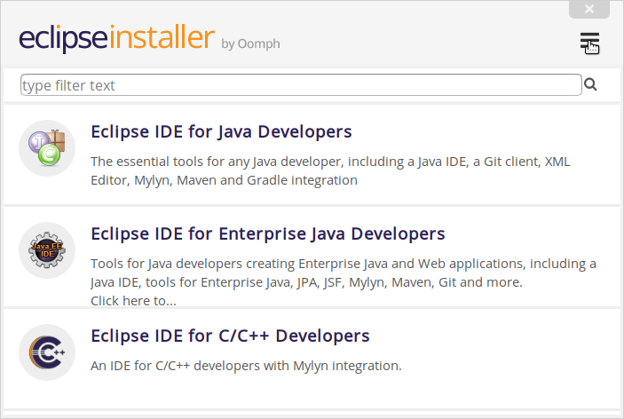
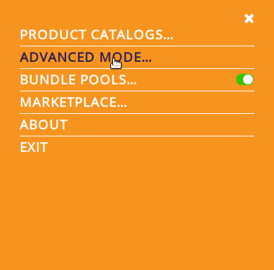
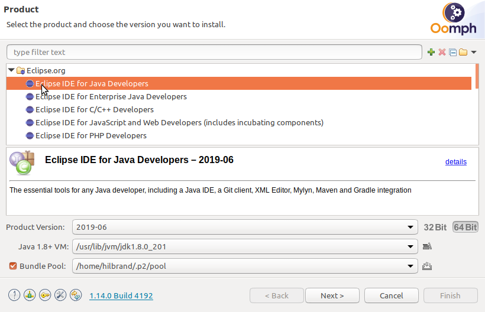
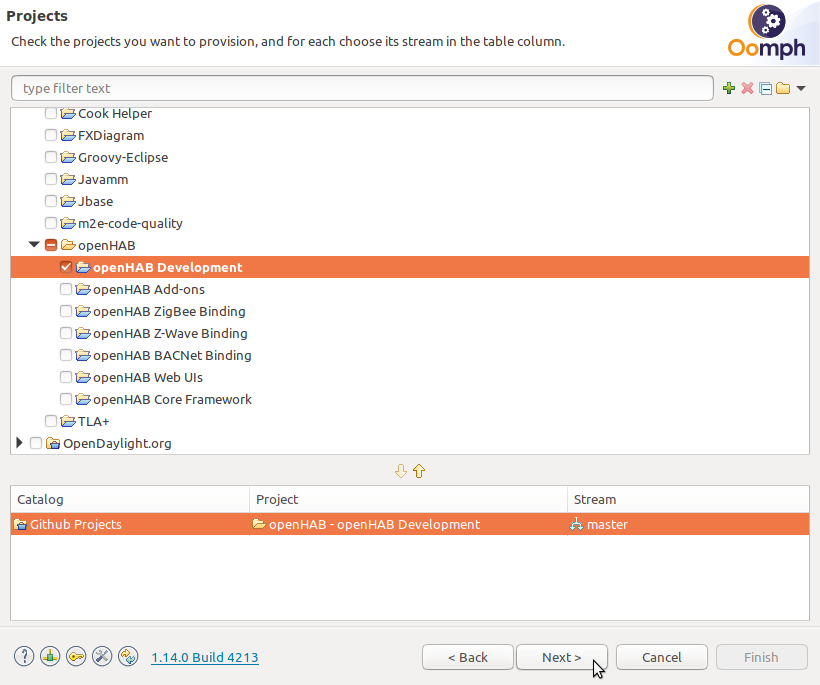
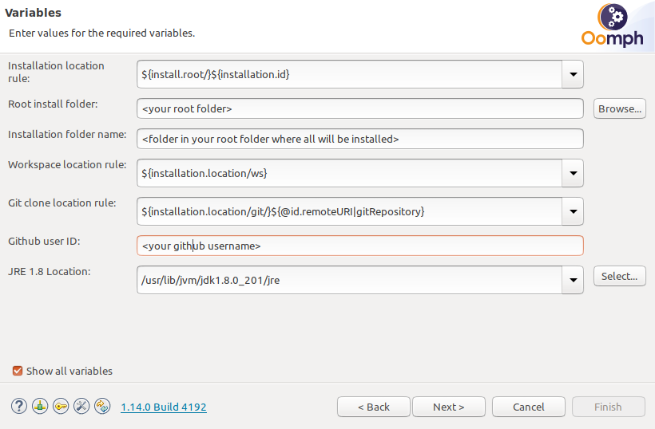
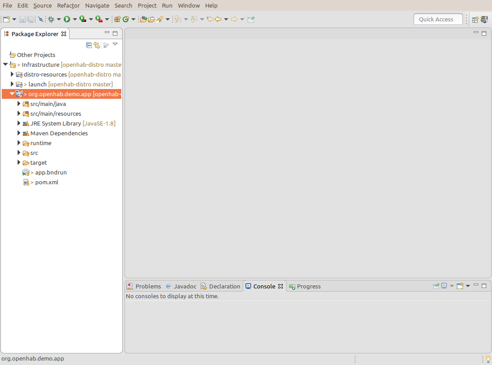
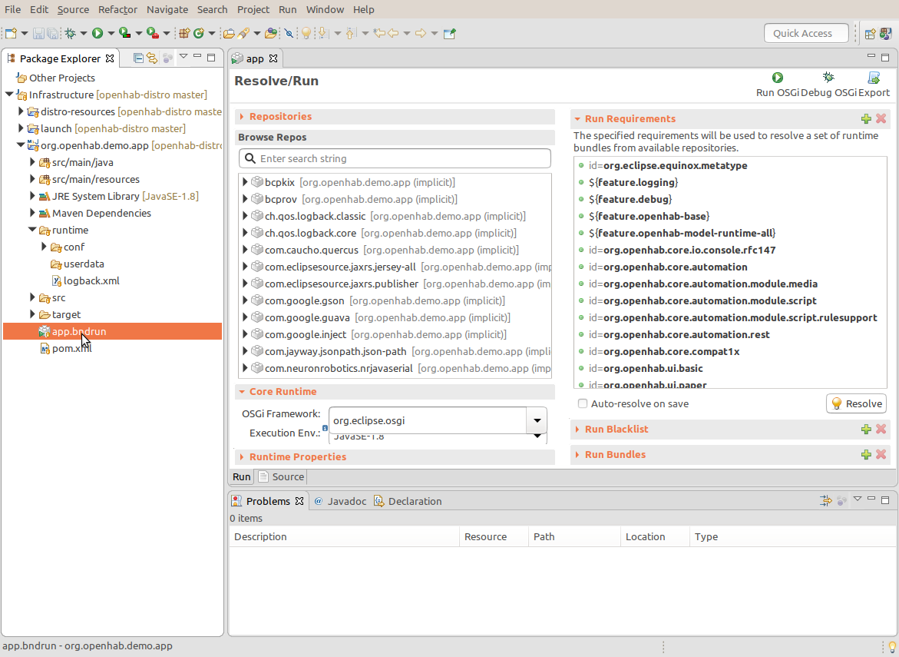
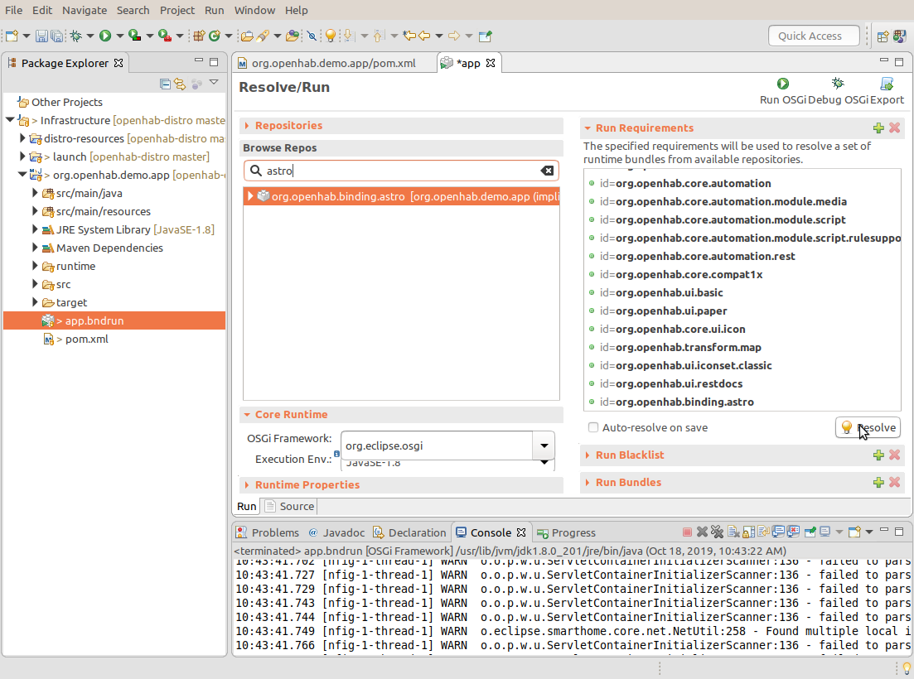

# Eclipse IDE

Eclipse is the development environment used since the inception of openHAB.
To make development easier an out-of-the-box setup is available that completely configures Eclipse to easily develop for the openHAB projects.
This guide describes the steps to setup Eclipse and how to debug an add-on in Eclipse.

## Eclipse IDE Setup

1. Install the Java 8 JDK if you did not have it installed.

   ::: warning Attention
   openHAB development requires **Java JDK version 8**.
   :::

1. Download the "Eclipse Installer": [can be downloaded from the Eclipse web site](https://wiki.eclipse.org/Eclipse_Installer)

1. Launch the Installer and on the menu on the top right (3 bars)

    

1. Select `ADVANCED MODE...`

    

1. Select `Eclipse IDE for Java Developers`. Select `Next >`.

    

1. Under `GitHub Projects > openHAB` select `openHAB Development` and any desired option from `openHAB Add-ons` (includes all add-ons from openhab-addons repo), `openHAB ZigBee Binding` or `openHAB Z-Wave Binding`.

   

    | Selection               | Install if                            |
    |-------------------------|---------------------------------------|
    | **openHAB Development** | **Debug/Demo Environment (Required)** |
    | openHAB Add-ons         | Installs all openHAB 2 Add-ons        |
    | openHAB ZigBee Binding  | ZigBee Binding Development            |
    | openHAB Z-Wave Binding  | Z-Wave Binding Development            |
    | openHAB BACNet Binding  | BACNet Binding Development            |
    | openHAB Web UIs         | Web UIs Development                   |
    | openHAB Core Framework  | Core Framework Development            |

    ::: warning Attention
    If you have selected `openHAB Add-ons` the installer will check out the [openHAB 2.x Add-ons](https://github.com/openhab/openhab-addons/) repository and all add-on projects are imported in Eclipse.

    Select `OH2 Add-ons` and from right-click menu select "Close Projects": *this significantly speeds up the setup*.
    Re-open only the binding project(s) you would like to work on.

    If you want to develop a new binding or a specific binding it is recommended to clone your own fork of [openHAB 2.x Add-ons](https://github.com/openhab/openhab-addons/) and import only the projects you work on.
    :::


1. Click `Next>`, verify/modify Root and install folder name. Click on `Show all variables` to open the window shown below.

    

    Explanation of some of the variables
    - `Root install folder`: The base folder where the `Installation folder` will be placed.
    - `Installation folder name`: This is the directory in the root install folder everything will be installed in.
    - `GitHub user ID`: This is your GitHub user name used to configure the cloned Git projects.


1. Click `Next>` and `Finish` to start installation.

    During install accept licence agreement, "Unsigned Content" for Bndtools, and Eclipse Foundation certificates when requested to complete IDE installation.


1. At this point the Eclipse installer is finished and the Eclipse IDE is automatically launched to continue the installation process.

    ::: warning Attention
    **It is important**, during the first Eclipse IDE launch, to leave Eclipse open until all openHAB related initial Setup tasks / Download sources / Builds are completed.
    :::

    Setup tasks will personalize the IDE with openHAB code formatting tools, configurations and a demo app.
    Setup tasks will also download openHAB latest projects you have selected during installation. Like `openhab-distro` and the add-ons `openhab-addons` project if you have selected it.

    Click bottom right button in the IDE for Progress.

    ::: warning Attention
    If you have selected `openHAB Add-ons` during the installation.
    It may take 30-45mins for all initial tasks to finish, depending on internet connection and your computer speed.
    Be aware of what you select during installation!
    And go and grab a good cup of coffee and be patient until is finished
    :::

   

1. After all tasks are finished you are ready to start developing.

    ::: tip
    The Maven build system is configured to download the SNAPSHOT version daily.
    As a result when you restart Eclipse the other day.
    It may take some time as it updates all SNAPSHOT versions of openHAB.
    :::

1. If you want to develop a new binding. Read about the [Skeleton Script](../#develop-a-new-binding) to generate the base for your binding, creating all required files.

1. If you need additional libraries see the [Build System](../buildsystem.html) documentation.
For other libraries supported out-of-the-box check the [Default Libraries](../guidelines.html#default-libraries) on the guidelines page.

## Debugging an Add-on

To test your binding you can build the add-on on the command line with Maven and drop the jar file in an `addons/` folder of an existing installation.
But to easily debug an add-on the `openHAB Development` setup installs and imports a demo project that contains a complete openHAB environment to run and debug an add-on.

Under `Infrastructure` you will find the project `org.openhab.demo.app`.
This project contains the full configuration to start a debug sessions.
The following files are of interest for the debug environment:

```
|- org.openhab.demo.app
|--- runtime
|------- conf             Here you configure the manual text files
|------- userdata         Here is the openHAB user data
|------- logback.xml      XML file for logging options
|--- app.bndrun           The file to start a debug session
|--- pom.xml              The pom file with all dependencies for the demo project
```

1. Import the add-on in Eclipse.
Either it is an existing add-on or a new binding created with the skeleton script.
Import the add-on project via `File > Import... > General > Existing Projects into Workspace`.
Importing an add-on is necessary if you want to modify or debug the add-on.
It is also possible to run existing add-ons part of the SNAPSHOT release in the demo project without having it imported in Eclipse.
Simply follow the next step to add the add-on.

1. To let the demo project know about the add-on, the add-on must be added to the demo project `pom.xml`.
Here is an example for the `astro` binding:

    ```xml
        <dependency>
        <groupId>org.openhab.addons.bundles</groupId>
        <artifactId>org.openhab.binding.astro</artifactId>
        <version>${project.version}</version>
        <scope>runtime</scope>
        </dependency>
    ```

1. To debug the add-on with the `app.bndrun` run configuration.
Double click to open `app.bndrun` file (takes a few seconds):

    

1. Under `Browse Repos` search for the binding you want to run/debug (`astro` in our case) and add it to the `Run Requirements` list using drag&drop from the `Browse Repos` list:

    ::: tip
    If you cannot find the binding you want run/debug in the Browse Repos list, or the list is empty, then it is likely either the `pom.xml` of the demo project contains an error or there is a build problem with your project.
    Check if your project has no compile errors.
    Or run Maven on the command line to check if it reports any errors.
    :::

    

1. Save and click "Resolve": a window with the list of resolved bundles will be shown.
    Click `Finish` and save the file.

    Now the IDE is ready to start openHAB with a minimum set of the openHAB core bindings, UIs and the selected binding you want to run/debug.

1. Start openHAB from the IDE clicking "Run OSGi" or "Debug OSGi" (upper right of the `app.bndrun` window)

1. You can check openHAB is running going with your browser to: http://localhost:8080/paperui/ (the last `/` is important!)

1. Check the chosen binding is active in `Paper UI > Configuration > Bindings`

### From start to debug in a single animation


