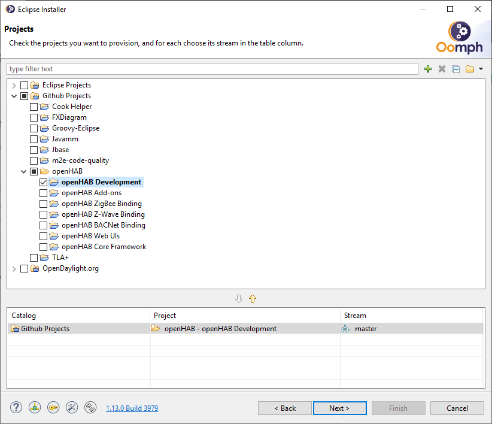
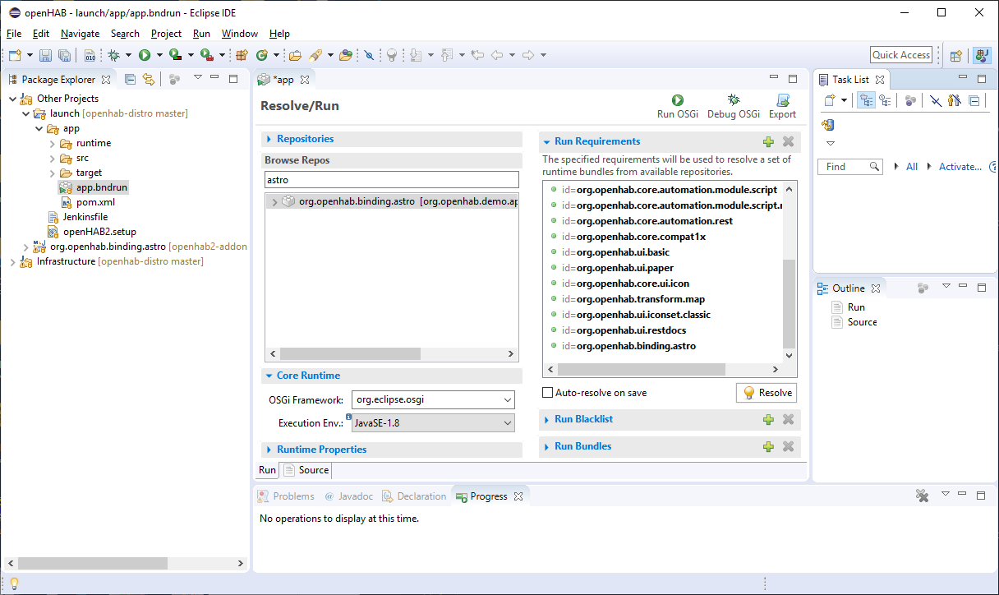

# Eclipse IDE

::: tip TODO
We are currently reworking how to setup a perfect development enviroment.
A new step by step guide will appear here soon.
:::

For now follow these steps:

### Eclipse IDE Setup

This guide focuses on Add-on (binding) development.

1. Download the "Eclipse Installer": [can be downloaded from the Eclipse web site](https://wiki.eclipse.org/Eclipse_Installer)
1. Launch the Installer and select `Advanced Mode...` on the menu (3 bars) on the right, then select `Eclipse IDE for Java Developers` then `Next>`
Eclipse suggested version is "Latest Release" (currently 2019-06 does not support bndtools)
1. Select `Github Projects > openHAB > openHAB Development`. 
    
    Do *NOT* select other projects for now.

   

1. Click `Next >`, `Finish` and then accept licences, "Unsigned Content" for Bndtools,  and Eclipse Foundation certificates when requested to complete IDE installation. 

    When the installation is finished the IDE is launched automatically.

1. For the first launch leave the Eclipse IDE open until all Startup tasks / Download sources / Builds are completed (click bottom right button in the IDE for Progress). 

    **It may take 10-15mins depending on internet connection and your computer speed.
    So go and grab a good cup of coffee and be patient until is finished**

1. Close Eclipse. Move to the `git` folder under the chosen IDE installation directory (the `openhab-distro` folder is already there).

1. Using the `git` command from the command line, checkout the openhab2-addons repository: `git clone --depth=1 https://github.com/openhab/openhab2-addons`

1. Open Eclipse. Add the binding that you want to develop (in this guide we use `astro` as an example) to the Eclipse workspace: `File > Import > Maven > Existing maven projects >` select the root directory of the binding under `git\openahb2-addons` then `Finish`.

    Leave Eclipse open and wait for the downloads and builds to finish.

    **WARNING**: if the build continues indefinitely and starts looping, this a bug in bndtools that has already been identified. To stop the loop deselect from `Eclipse > Project > Build Automatically`. 
    Remember to do `Project > Build Project` after changes in the binding project.

    NOTE: You do not need to add all projects to the workspace, just the binding project you want to work on.

1. In the Eclipse Package Explorer in `Other Projects > launch > app` project folder look for `app.bndrun` file.

   Double click to open `app.bndrun` file (takes a few seconds)

1. Under Browse Repos search for the binding you want to modify (`astro`) and add it to the "Run Requirements" list using drag&drop from the "Browse Repos" list:
       

1. Save and click "Resolve": a window with the list of resolved bundles will be shown.
    Click Finish and save the file.

Now the IDE is ready to start openHAB with a minimum set of the openHAB core bindings, PaperUI and the selected binding.

1. Start openHAB from the IDE clicking "Run OSGi" or "Debug OSGi" (upper right of the `app.bndrun` dialog).
   You can check openHAB is running going with your browser to: http://localhost:8080/paperui/
1. Check the chosen binding is active in `PaperUI > Configuration > Bindings`

## Develop a NEW binding with the IDE

To start developing a new binding follow these steps:

1. Close Eclipse
1. From the command line in `openhab2-addons/bundles` directory run:

    `$ ./create_openhab_binding_skeleton.sh  MyNewBinding <Author> <GitHubUsername>`

    to create a skeleton of a new binding `mynewbinding`.
    Accept with `Y` the skeleton configuration.
1. Edit file `openhab2-addons/bom/openhab-addons/pom.xml`
and add your new binding to the list (adapt the artifactid to your binding name!):
    ```
    <dependency>
        <groupId>org.openhab.addons.bundles</groupId>
        <artifactId>org.openhab.binding.mynewbinding</artifactId>
        <version>${project.version}</version>
    </dependency>
    ```
1. From the `openhab2-addons` directory run: ` mvn -DskipChecks -DskipTests clean install` to rebuild the list of bindings in the BOM (Bill Of Material) and make your new binding visible from the IDE launch configuration
1. Open Eclipse and follow from previous step 8. to import and run/debug your new binding in the Eclipse IDE

Now you can start developing your new binding.

In case the new binding has dependencies to other bundles/libraries see [Adding Dependencies](../buildsystem.html#adding-dependencies) for more information.

