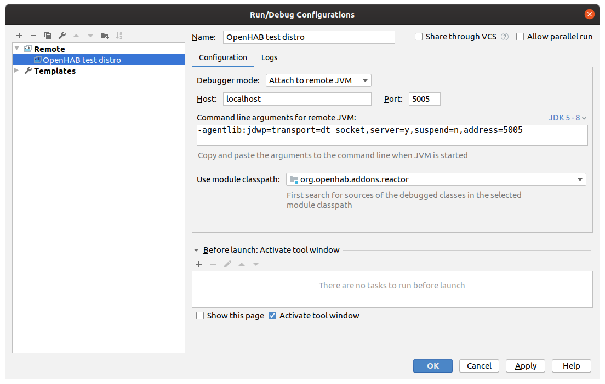

# IntelliJ IDE

## Prerequisities
  - git, Maven, IntelliJ and Java 8 are installed

## Install OpenHAB distribution
1. Install the official [openHAB distribution](https://www.openhab.org/download/)
1. Start the distribution **in debug mode** (use `./start_debug.sh` instead of `./start.sh` in step 4)

This article refers to the directory where you installed the distribution as `<DISTRO_DIR>`.

## Build the addons repostory
1. fork and clone the [openhab addons repository](http://www.github.com/openhab/openhab-addons) into a new directory (Reference `<ADDON_DIR>` from now on for this arcticle)
    - `git clone https://github.com/<yourgitusername>/openhab-addons`  (replace git user name accordingly)
1. open IntelliJ and create a new Project from existing sources (File | New | Project from existing sources) and pick `<ADDON_DIR>`/pom.xml
    - IntelliJ will start importing, indexing and building, it will take while, wait until finished (see status bar)
1. Use Maven to clean & install the addons project
    - mvn clean install in the root of `<ADDON_DIR>` using commandline Maven (or IntelliJ Maven view)
    - some of the addons might fail to build - if it's not the one, you're interested in that should not bother you
    - when the Maven project finished, you should find the freshly built addon JAR in the target directory

## Debug your addon
1. copy the addon JAR to Openhab distribution created before
    - `cp target/<ADDON_NAME>.jar <DISTRO_DIR>/addons`
1. The running instance of the openhab distribution should pick up your new addon & start it
    - you can type `log:tail` in the openhab console to stream the openhab logs
1. create a Remote Debug runtime configuration in IntelliJ:
    - Open menu Run | Edit configurations
    - click the + sign to add a "Remote" configuration
    - adapt the module setting to the root (org.openhab.addons.reactor)
    - click OK
    - start the debug configuration
    - the IntelliJ console should log: `Connected to the target VM, address: 'localhost:5005', transport: 'socket'`

You can now add breakpoints to your project now and your test distro should stop there.
