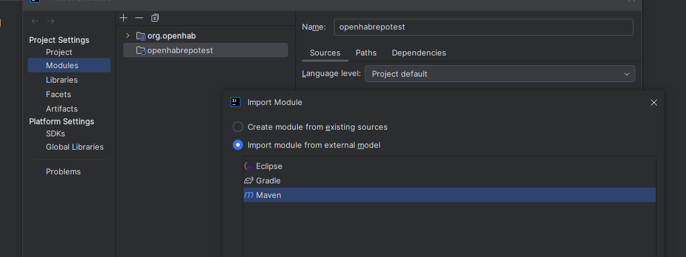
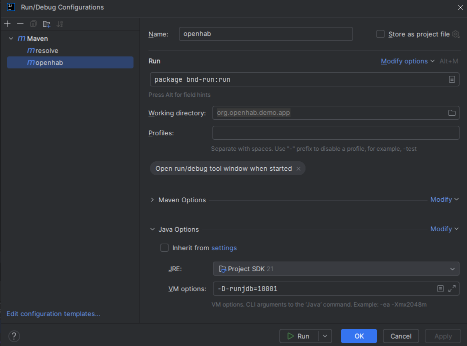
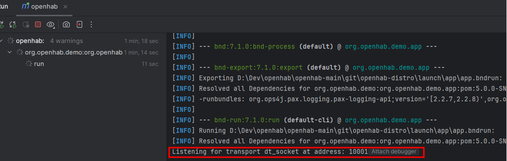

# IntelliJ IDE

## Prerequisites

- git, Maven (at least 3.8.6), IntelliJ and Java (21) are installed and available in the path.

## Build the repositories

1. Fork and clone the repositories into a parent directory (Reference `<PARENT_DIR>` from now on for this article). Take only the one(s) you will work on:

    - [openhab addons repository](https://www.github.com/openhab/openhab-addons)
    - [openhab core repository](https://www.github.com/openhab/openhab-core)
    - [openhab webui repository](https://www.github.com/openhab/openhab-webui)

Use the command `git clone https://github.com/<yourgitusername>/openhab-<addons|core|webui>` (replace git user name accordingly).

1. Open IntelliJ, select the file/open, and choose the `<PARENT_DIR>`
1. Open The Module settings (inside `Project Settings`, or use F4). Click on the + button and select `Import module`.
1. Choose one of the repository directory you just cloned. select the Maven external model as import format.
   IntelliJ will start importing and indexing. It will take while, wait until finished. The Module window should now be filled with a bunch of projects.
   
1. Repeat step 2 and 3 for all repositories you cloned.
1. Use Maven to clean & install projects. Make sure you use the required Maven version (3.8.6 is recommended).

    - `mvn clean install` in the root of the repositories using commandline Maven (or IntelliJ Maven view)
    - some of the add-ons might fail to build - if it's not the one you're interested in, that should not bother you
    - when the Maven project finished, you should find the freshly built addon JAR in the target directory

You then have two main options to run your development: use the official distribution, or use Maven.

## Option 1: Use and debug from the official distribution

This is the simpler option, but you can only use it for add-on development.

### Install openHAB distribution

1. Install the official [openHAB distribution](https://www.openhab.org/download/)
1. Start the distribution **in debug mode** (use `./start_debug.sh` instead of `./start.sh` in step 4)

This article refers to the directory where you installed the distribution as `<DISTRO_DIR>`.

### Debug your addon

1. Copy the addon JAR to Openhab distribution created before

    - `cp target/<ADDON_NAME>.jar <DISTRO_DIR>/addons`

1. The running instance of the openhab distribution should pick up your new addon & start it

    - you can type `log:tail` in the openhab console to stream the openhab logs

1. Create a Remote Debug runtime configuration in IntelliJ:

    - open menu Run | Edit configurations
    - click the + sign to add a "Remote" configuration
    - adapt the module setting to the root (org.openhab.addons.reactor)
    - click OK
    - start the debug configuration
    - the IntelliJ console should log: `Connected to the target VM, address: 'localhost:5005', transport: 'socket'`

You can now add breakpoints to your project now and your test distro should stop there.

## Option 2: Use maven-bdn plugin and the demo project

This option is more complex, but will allow you to run/debug anything.
You will have to clone the additional repository openhab-distro repository in your `<PARENT_DIR>`. It contains the demo project.
Look at the [generic IDEs information](./generic.md) to know more about how to prepare and launch the demo project.

After this, instead of using the command line, you can setup IntelliJ to launch the maven tasks.

When launching the demo project from IntelliJ with the bnd debug option (in VM options in the screenshot above),
look in the Run window for the mention "Listening for transport".
You can then click on the `Attach debugger` to automatically start a debugging session.

