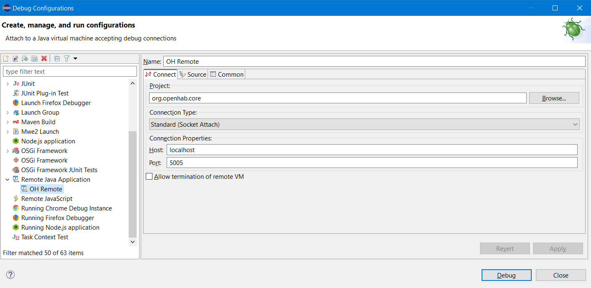

# Karaf debugging

This procedure allows for testing and debugging while running openHAB with [Apache Karaf](https://karaf.apache.org/).

## Limitations of the demo project

The `org.openhab.demo.app` project is great for testing and debugging in most circumstances, but not everything behaves identically to that of a "real" openHAB installation, which uses [Apache Karaf](https://karaf.apache.org/).
Karaf provides a runtime environment with a lot of built-in functionality that isn't available when running the demo project.
As a consequence, some things function slightly differently or aren't available at all, such as loading of `KAR` add-ons.

## Preparation

If you haven't already, clone the [openhab-distro repository](https://www.github.com/openhab/openhab-distro).

Make sure that the bundles you want to test or debug have been installed in your local Maven repository, using `mvn clean install -pl :<bundle coordinates>` or similar.
Any bundles not found in your local Maven repository will be downloaded in their latest snapshot version.
If you want to test or debug an older version, you must therefore build and install everything into your local Maven repository first.

## Building

From the `openhab-distro` folder, run

```bash
mvn package -nsu -Pdev
```

Do not use `mvn install` since it's not possible to install a folder into the local Maven repository.
`-nsu` (`--no-snapshot-updates`) prevents Maven from downloading "updated" artifacts, making sure that those from the local Maven repository are used.

## Launching

The result of the build can be found in `openhab-distro/distributions/openhab/target/openhab-<version>`.
From this folder, you can launch openHAB under Karaf by running `start` or `start_debug`.
The difference between the two is that `start_debug` will also allow a debugger to be attached to port `5005`.
The console from which you did this will now become the [Karaf console](/docs/administration/console.html) and will accept any normal Karaf command.

You can now open this openHAB installation in your browser via [http://localhost:8080/](http://localhost:8080/).

To stop the installation, run `system:shutdown` or `logout` from the [Karaf console](/docs/administration/console.html).

## Debugging

Make sure that you launched openHAB using `start_debug`, and attach the debugger of your IDE to port `5005`.
Your IDE needs to have access to the source code that you want to debug.

The exact procedure for setting up remote debugging is specific to each IDE.

### Eclipse

Create a new "Debug Configuration" for remote debugging:



Once that is done, click `Debug` and it should connect to the running openHAB instance.
Nothing will happen initially, you must set breakpoints and wait for the code to reach one of them.

### IntelliJ

Follow step 3 from [Debug your addon](/docs/developer/ide/intellij.html#debug-your-addon).

### Visual Studio Code

Follow steps 8 to 10 from [Steps for each Bundle](/docs/developer/ide/vscode.html#steps-for-each-bundle).

## Rebuilding

If you modify any code, the bundle that has been modified must first be rebuilt using `mvn clean install`.
Make sure that the Karaf console is stopped, and build the Karaf new installation using

```bash
mvn package -nsu -Pdev
```

If you use `clean` as well, the whole openHAB installation will be wiped, and you must configure a user, go through the startup wizard and repeat any other configuration steps.
It's therefore recommended to just use `package` without `clean`.

The `dev` profile will delete the `runtime` subfolder with each build, so that the Karaf cache is deleted and your newly built code will be used, while retaining the configuration of the installation.
