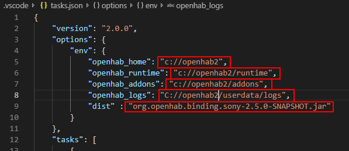

# VSCode

The following shows the steps for building a bundle using Visual Studio Code (VSCode).  Please note that the instructions show a Win10 system but should be similar for OSX/Linux.  This guide assumes you have a base development directory already defined (example: `c:/users/me/development`) and will reference that directory as `%BASE%`.

## One time setup

The following steps will only need to be done once to setup both VSCode and your environment.

1. Install Java Extension Pack for VSCode (https://marketplace.visualstudio.com/items?itemName=vscjava.vscode-java-pack)
   
1. Clone the addons (https://github.com/openhab/openhab-addons.git or preferably your own fork) to %BASE%\openhab-addons
   
1. On Windows, VSCode should be configured to use powershell instead of the classic command line.
If not configured already, add the following to the VSCode settings:
         
     ```"terminal.integrated.automationShell.windows": "C:\\Windows\\sysnative\\WindowsPowerShell\\v1.0\\powershell.exe"```

     Either globally define the options via the global ```settings.json```.  You can also define them local to a specific bundle by putting those lines in the ```.vscode/settings.json``` file in the bundle (similar to ```tasks.json```/```launch.json``` below).

1. If you want to setup openHAB code formatting guidelines, add the following to the VSCode settings:
         
    

    Either globally define the formatting options via ```Files->Preferences->Settings->Extendions->Java configuration``` (or in the global ```settings.json```).  You can also define them local to a specific bundle by putting those lines in the ```.vscode/settings.json``` file in the bundle (similar to ```tasks.json```/```launch.json``` below).

	Download [settings.json](https://raw.githubusercontent.com/openhab/openhab-docs/master/developers/ide/examples/vscode/settings.json) for the recommended settings (or simply wish to copy the URLs in the above image).

## Steps for each Bundle

The following steps will show you how to setup a specific bundle for development with VSCode.  These steps will show how to setup the Russound bundle but are generic to any bundle in the system.

1. Ensure the bundle builds correctly (natively with maven)
   1. Open console to the bundle location (example: `%BASE%\openhab-addons\bundles\org.openhab.binding.russound`)
   2. `mvn clean install -DskipChecks` in the console to build the bundle
   3. Should produce a jar file in the 'target' directory of the bundle(example: `%BASE%\openhab-addons\bundles\org.openhab.binding.russound\target\org.openhab.binding.russound-2.5.0-SNAPSHOT.jar`)
   
2. Open VSCode and then open the folder of the bundle.  From VSCode - use `File->Open Folder->choose bundle directory` (example: `%BASE%\openhab-addons\bundles\org.openhab.binding.russound`)
   
3. Create a ".vscode" directory under the bundle (example: `%BASE%\openhab-addons\bundles\org.openhab.binding.russound\.vscode`)
      
    

4. Download [tasks.json](https://raw.githubusercontent.com/openhab/openhab-docs/master/developers/ide/examples/vscode/tasks.json) to the .vscode directory (example: `%BASE%\openhab-addons\bundles\org.openhab.binding.russound\.vscode\tasks.json`)
   
    
   
5. Edit tasks.json and ...
   
    

   1. Set `openhab_*` to the directories for your openHAB installation 
   2. Set `dist` to the name of the JAR file maven is producing in the target directory
   3. Save and close tasks.json
   
6. Stop any openHAB instance (if it's running).
   
7.  Start the openHAB instance with the debug option - `start.bat debug` from a console in the openHAB home directory.  You should see the following line printed somewhere in the karaf console:
	`Listening for transport dt_socket at address: xxxx` (where xxxx should be 5005)

8.  Download [launch.json](https://raw.githubusercontent.com/openhab/openhab-docs/master/developers/ide/examples/vscode/launch.json) to the .vscode directory  (example: `%BASE%\openhab-addons\bundles\org.openhab.binding.russound\.vscode\launch.json`)

    

9.  Edit launch.json and ...
    
    

    1. Set the `port` to xxxx (from step 7).  This can be skipped if xxxx was 5005 from step 7.
    2. Set the `hostName` to the hostname running openHAB.  This can be skipped if running locally (localhost)
    3. Save and close launch.json

10. Verify that VSCode can build the system and connect to a debug instance of openHAB:
    
    1. Shutdown any instances of openHAB
    2. Press `CTRL-SHIFT-P -> Tasks: Run Task -> Start openHAB (Debug)` to start an openHAB instance in debug mode.  You should see openHAB startup in a new VSCode terminal.
    3. Press F5 (or bring up debug in VSCode and choose the "Debug (Attach) - openHAB" configuration) and the following should occur in the VSCode terminal

        1. The maven compile occuring (successfully)
        2. The resulting JAR is copied to the openHAB addons directory (`openhab_addons`)
        3. Connecting to the openHAB instance (the debug call stack should show a bunch of openHAB type threads running)
   
You can now make changes, set breakpoints, etc.

## Notes

1. May take openHAB a few seconds to realize there is a new bundle and to reinitilize it after it's been copied.  Be a little bit patient.
2. You must run the `mvn Compile (Online)` task atleast once to allow the offline compile to occur.  You should use the `mvn Compile (Offline)` task for most of your development as it's quicker since it uses the cache files.  When you are ready to commit (or release a test bundle) - you should run the `mvn Compile (Release)` task to include code checks (and resolve them).
3. Win10+ allows forward slashes as part of its path.  If you use backward slashes instead - you will need to double up on them since tasks.json uses a backward slash as a delimiter.  Example: `c:\\\\openhab`
   
## Tasks

The [tasks.json](examples/vscode/tasks.json) defines the following tasks that you may use withing VSCode (`CTRL-SHIFT-P > Tasks: Run Task`):

1. **Start openHAB (Debug)** - this task will start a new instance of openHAB in debug mode (allowing VSCode to connect to it).  Please shut down any other instances of openHAB prior to running this (see next task).  This will open a **new** terminal for openHAB to run in.  Formally, this will call `start.bat debug` (or `start.sh debug` on osx/linux) in the `openhab_home` directory.
2. **Stop openHAB** - this task will stop any running instance.  Please note this will stop an instance started outside of VSCode as well on the same machine.  Formally, this will call `stop.bat` (or `stop.sh` on osx/linux) in the `openhab_runtime/bin` directory.
3. **mvn Compile (Online)** - this task will run a online maven compile skipping code checks.  Formally, will run `mvn clean install -DskipChecks`
4. **mvn Compile (Offline)** - this task will run a offline maven compile skipping code checks (assumes you have run a online compile atleast once).  Formally, will run `mvn -o clean install -DskipChecks`
5. **mvn Compile (Release)** - this task will run a online maven compile with code checks.  Formally, will run `mvn clean install`
6. **Copy Distribution to Addons** - this task will run the 'mvn Compile (Offline)' task and then copy the resulting target file (as defined by `dist`) to your openHAB addons directory (defined by `openhab_addons`)
7. **Build** - this is an alias for `Copy Distribution to Addons` task.
8. **Tail events.log** - this will tail the events.log in a new terminal.
9. **Tail openhab.log** - this will tail the openhab.log in a new terminal.
	
## Additional References

1. [VSCode with Java](https://code.visualstudio.com/docs/languages/java)
2. [VSCode with Java debugging](https://code.visualstudio.com/docs/java/java-debugging)
