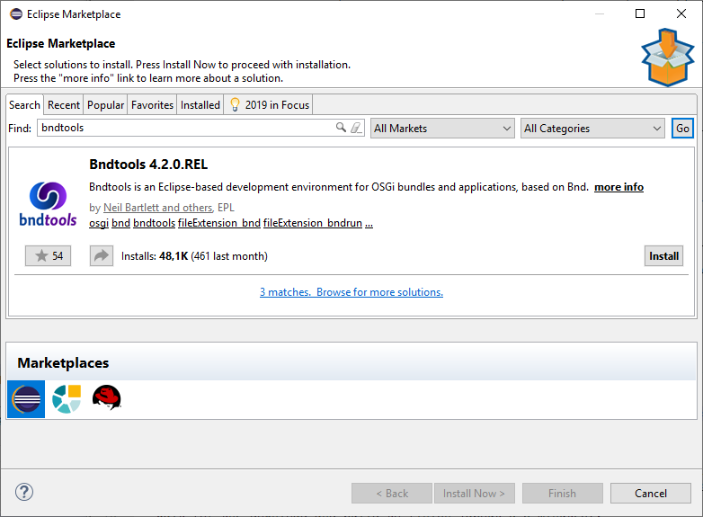
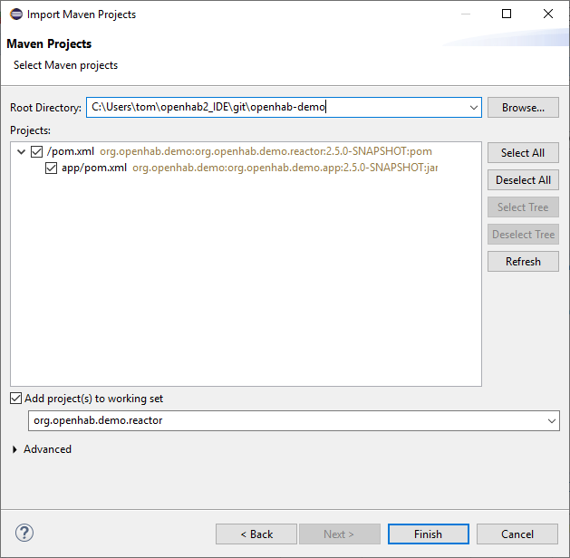
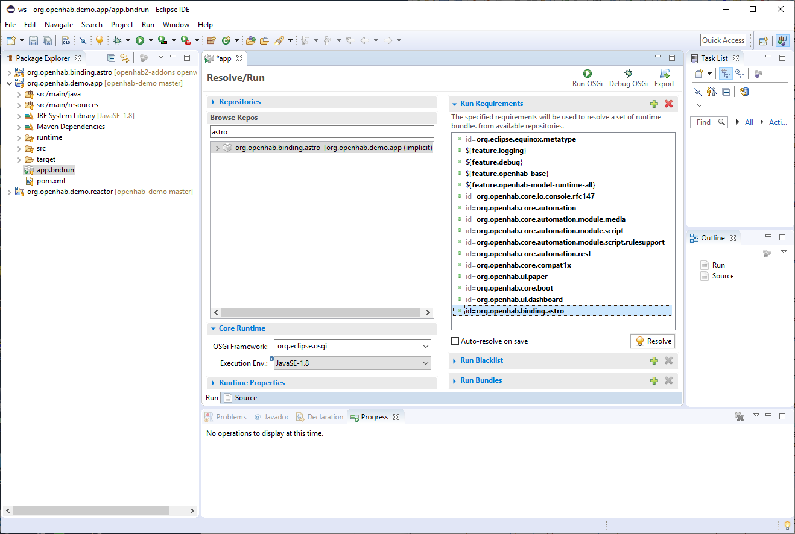

# Overview

A variety of different parts of openHAB can be extended, we go through all of them.

openHAB uses [git](https://git-scm.com/) as its version control system and [GitHub](https://github.com/openhab) for hosting the different repositories and source code.
You will get in contact with git in many places and it makes sense to get familiar with its basic commands and concepts.
There are many pages to learn about Git.
Try [git - the simple guide](http://rogerdudler.github.io/git-guide/) as a start.

Add-ons and the core itself are written in Java.
Java is not hard to learn, but it helps if you have a general technical understanding of programming languages.

The different guides of this chapter assume that you are somewhat familiar with Java 8 and that you have a rough idea of Git's workflow (eg "checkout", "branches", "push").

## Choose the Right Concept

openHAB allows you to build up on the following concepts:

* **Bindings**: A binding connects to external services or devices,
* **Automation engine module**: A trigger, condition or action that can be used in automation rules (or scripts),
* **Transformation / Profiles**: Can be used to transform a *Thing Channel* value before it is assigned to an *Item*,
* **an IO service**: Exposes openHAB internals via a defined interface (for example the REST interface, HomeKit or Hue Emulation Service)
* **a Persistence service**: Persist item state updates and/or changes and allow them to be retrieved for specific points in time.
* **Natural language processing skill**:
  Executes something depending on the understood Intents and returns something back to the user,
* **Audio sinks/sources**:
  Extend where audio can be played on or implement audio sources.
* and many more (not covered yet).

Sometimes though its just not worth writing a binding and you are better off
just using an http action in a rule or script to retrieve some values.

Therefore: First think what you want to archive! Check our [community forum](https://community.openhab.org)
and discuss your concept.

Find the right abstraction and the corresponding link on the left navigation panel.
General [coding guidelines](development/guidelines.html) apply to all types of addon development.

## Setup the Development Environment

You can use any IDE that is suitable for OSGi/Java development.
We recomment the freely available [Eclipse IDE](https://wiki.eclipse.org/Eclipse_Installer).
Development can happen on any of the supported operating systems (Windows, Mac OS, Linux).

Please ensure that you have the following prerequisites installed as well:

1. [Git](https://git-scm.com/downloads) For retrieving our source code and push changes back
1. [Maven 3.x](https://maven.apache.org/download.cgi) Our buildsystem tool
1. Java JDK 8, for example from Oracle [Oracle JDK 8](http://www.oracle.com/technetwork/java/javase/downloads/jdk8-downloads-2133151.html)

**TODO**: We are currently reworking how to setup a perfect development enviroment.
A new step by step guide will appear here after the migration is done.
Watch [Issue 5005](https://github.com/openhab/openhab2-addons/issues/5005) for further information and progress.

For now follow these steps:

### Eclipse IDE Setup

1. Install the latest "Eclipse IDE for Java Developers", the installer [can be downloaded from the Eclipse web site](https://wiki.eclipse.org/Eclipse_Installer)
1. Launch Eclipse and install Bndtools from the Eclipse Marketplace: Help -> Eclipse Marketplace -> Find "bndtools" -> Install:

   
   (Accept License and the Security warning about the software is not signed)
   
   Restart Eclipse to activate Bndtools.
1. Using `git` from the command line, checkout the openHAB demo application: `git clone --depth=1 https://github.com/maggu2810/openhab-demo`
1. Import the demo application from Eclipse: File -> Import -> Maven -> Existing Maven Projects -> select the root directory of the demo application project -> Finish.

   

   Leave Eclipse open and wait for the downloads and build to finish (about 5-10 minutes).
1. Using git from the command line, checkout the `openhab2-addons` repository: `git clone --depth=1 https://github.com/openhab/openhab2-addons`
1. Add the binding that you want to develop (in this guide we use `astro` as an example) to the Eclipse workspace: File -> Import -> Maven -> Existing maven projects -> select the root directory of the binding -> Finish.

   Leave Eclipse open and wait for the downloads and build to finish.
   
   **WARNING**: if the build continues indefinitely, this a bug in the setup that is already being addressed. Meanwhile, to stop the loop deselect from Eclipse -> Project ->  Build Automatically. Remember to do Project -> Build Project after changes in the binding project
   
   *NOTE*: You do not need to add all projects to the workspace, just the binding project you want to work on.
1. In Eclipse Package Explorer: look for `app.bndrun` in the `org.openhab.demo.app` project.
   Double click to open `app.bndrun` (takes a few seconds)
1. Under Browse Repos search for your binding (`astro`) and add it to the "Run Requirements" list using drag&drop from the "Browse Repos" list:
    
1. Click "Resolve": a window with the list of resolved bundles will be shown. 
    Click Finish and save the file.
    
    Now the IDE is ready to start openHAB with a minimum set of the openHAB core bindings, PaperUI and the selected binding 
1. Start openHAB from the IDE clicking "Run OSGi" or "Debug OSGi".
   You can check openHAB is running going with your browser to: http://localhost:8080/paperui/
1. Check the chosen binding is active in PaperUI -> Configuration -> Bindings

## Develop a NEW binding with the IDE 

To start developing a new binding follow these steps:

1. Close Eclipse
1. From the command line in `openhab2-addons/bundles` directory run:

    `$ ./create_openhab_binding_skeleton.sh  MyNewBinding <Author> <GitHubUsername>`
    
    to create a skeleton of a new binding `mynewbinding`.
    Accept with `Y` the skeleton configuration.
1. Edit file `openhab2-addons/bom/openhab-addons/pom.xml`
and add your new binding to the list (adapt the artifactid to your binding name!):
    ```
    <dependency>
        <groupId>org.openhab.addons.bundles</groupId>
        <artifactId>org.openhab.binding.mynewbinding</artifactId>
        <version>${project.version}</version>
    </dependency>
    ```
1. From the `openhab2-addons` directory run: ` mvn -DskipChecks -DskipTests clean install` to rebuild the list of bindings in the BOM (Bill Of Material) and make your new binding visible from the demo.app project
1. Now open Eclipse and follow from previous step 6. to import and run/debug your new binding in the Eclipse IDE

Now you can start developing your new binding. 

In case the new binding has dependencies to other bundles/libraries see [Adding Dependencies](buildsystem.html#adding-dependencies) for more information.


