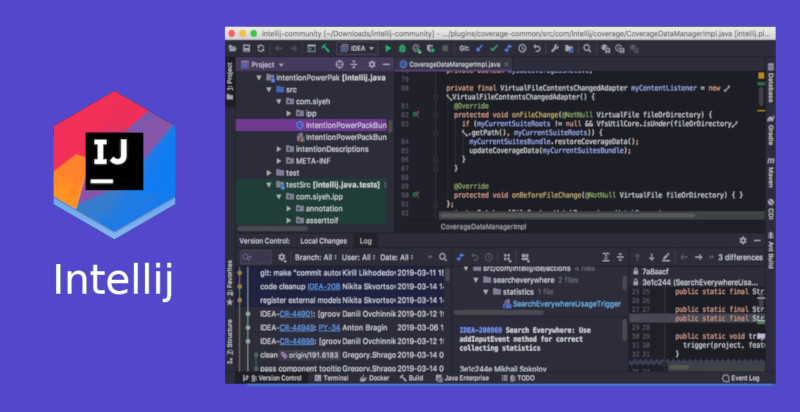

# Overview

A variety of different parts of openHAB can be extended.
We will cover the most important ones here.

openHAB uses [git](https://git-scm.com/) as its version control system and [GitHub](https://github.com/openhab) for hosting the different repositories and source code.
You will come in contact with git in many places, and it makes sense to familiarize yourself with its basic commands and concepts.
There are many places to learn about Git.
Try [git - the simple guide](https://rogerdudler.github.io/git-guide/) as a start.

Add-ons and the openHAB core itself are written in Java.
Java is not hard to learn, but it helps if you have a general technical understanding of programming languages.

The different guides of this chapter assume that you are somewhat familiar with Java 11 and that you have a rough understanding of Git's workflow (e.g. "checkout", "branches", "push").

## Choose the Right Concept

openHAB allows you to build upon the following concepts:

- **Bindings**: A binding connects to external services or devices.
- **Automation engine module**: A trigger, condition, or action that can be used in automation rules (or scripts).
- **Transformation / Profiles**: Can be used to transform a *Thing Channel*- value before it is assigned to an *Item*.
- **An IO service**: Exposes openHAB internals via a defined interface (for example the REST interface, HomeKit or Hue Emulation Service).
- **A Persistence service**: Persist item state updates and/or changes and allows them to be retrieved for specific points in time.
- **Natural language processing skill**:
  Executes something depending on the understood Intents and returns something back to the user.
- **Audio sinks/sources**:
  Control where audio can be played or implement audio sources.
- and many more (not covered yet).

First think about what you want to achieve! Check our [community forum](https://community.openhab.org)
and discuss your concept.
Sometimes it may not even be worth writing a binding or other addon if you can achieve your goal in an easier way.
For example, you may be better off using an http action in a rule or script to retrieve some values.

Find the right abstraction and the corresponding link on the left navigation panel.
General [coding guidelines](guidelines.html) apply to all types of addon development.

## Setup the Development Environment

Development can happen on any of the supported operating systems (Windows, Mac OS, Linux).

Please ensure that you have the following prerequisites installed as well:

1. [Git](https://git-scm.com/downloads) For retrieving our source code and push changes back. On Windows: Must be available in %PATH%
1. [Maven 3.x](https://maven.apache.org/download.cgi) Our buildsystem tool. On Windows: Must be available in %PATH%
1. Java JDK 11, for example from Oracle [Oracle JDK 11](https://www.oracle.com/java/technologies/javase-jdk11-downloads.html). On Windows: %JAVA% must be set.

You can use any IDE that is suitable for OSGi/Java development.
We have prepared some step-by-step guides for the following IDEs:

<table style="width:100%">
<tr>
<td style="width:30%">

[](ide/vscode.html)

</td>
<td style="width:30%">

[](ide/eclipse.html)

</td>
<td style="width:30%">

[](ide/intellij.html)

</td>
</tr>
</table>

Not sure what to choose?: openHAB maintainers use [Eclipse IDE](https://wiki.eclipse.org/Eclipse_Installer).

## Develop a NEW binding

To help start developing a new binding, a script is available to generate the basic skeleton for you.
This script is specific for binding addons. Follow these steps to generate your binding:

1. From the command line in `openhab-addons/bundles` directory to create a skeleton of a new binding `mynewbinding` run:

   On Linux:

    ```bash
    ./create_openhab_binding_skeleton.sh  MyNewBinding "<Author>" <GitHubUsername>
    ```

   On Windows:

    ```bash
    create_openhab_binding_skeleton.cmd MyNewBinding "<Author>" <GitHubUsername>
    ```

    _Use your full name for `<Author>`_.

1. Accept with `Y` when the skeleton configuration asks for it.

1. From `openhab-addons` root you can build only your binding with maven using the `-pl` option:

    ```bash
    mvn clean install -pl :org.openhab.binding.mynewbinding
    ```

   Where `mynewbinding` is the name of your new binding.
   Some additional maven options that may help:
   - `-U`: Forces all dependencies to be downloaded again.
   - `-am`: Builds all projects in openhab-addons your project dependends on.
   - `-o`: Won't update any dependencies.
   - `-DskipChecks`: Skips the static analysis checks
   - `-DskipTests`: Skips the unit tests

1. To start your new binding it's a good practise to commit your code on a new git branch:

   ```bash
   git checkout -b <mynewbranch>
   ```

1. Open Eclipse or your favorite editor and import your new binding project

Now you can start developing your NEW binding. We're looking forward to your pull request!

In case the new binding has dependencies to other bundles/libraries see [Adding Dependencies](buildsystem.html#adding-dependencies) for more information.
