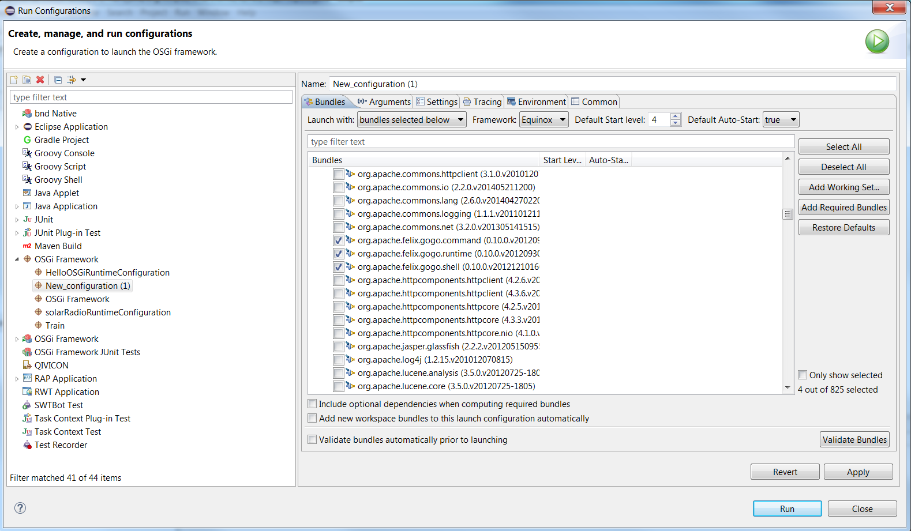



# Equinox

{:.no_toc}

[Equinox][Equinox] is considered to be a reference implementation of the [OSGi Core Release 7][OSGi-core].
It is an [open source project][Equinox-repo], part of the [Eclipse project][Eclipse].
It provides a set of bundles, that implement various optional OSGi services.

The openHAB bundles are deployed on an Equinox runtime.
Knowledge about how to start the runtime and execute basic commands will help you to speedup the development process.

{::options toc_levels="2,3"/}

- TOC
{:toc}

## Start Equinox Runtime from Eclipse

1. Go to "Run" -> "Run Configurations".
2. From the list in the left panel choose "OSGi Framework". Right click on it and choose "New".
3. After you've been created a new configuration, select the bundles that you need from the workspace.
4. Then make sure that the following bundles from the target platform are selected, otherwise the OSGi console will not be available:

    org.apache.felix.gogo.runtime
    org.apache.felix.gogo.shell
    org.apache.felix.gogo.command
    org.eclipse.equinox.console

5. Click on "Add Required Bundles". Eclipse will resolve all dependencies of the bundles listed above and include new bundles to the configuration.
6. Click on "Validate Bundles" and make sure that "No problems were detected" is displayed.
7. You can start Equinox with the "Run" button.



## Run Equinox from the command line

The **org.eclipse.osgi** bundle is the framework implementation of the Core Framework specification in a standalone package.

If you have compiled openHAB once either via command line (`mvn install`) or the Eclipse IDE, maven will have downloaded Equinox for you already.
Find it in your maven cache directory (linux `~/.m2/repository/org/eclipse/platform/org.eclipse.osgi/3.15.0/org.eclipse.osgi-3.15.0.jar`
and windows `C:\Users\your.name\.m2\..`).

 1. Create `configuration` folder in that directory.
 1. Inside the `configuration` folder create a file `config.ini`.
 1. Save the following content in the `config.ini` file:

```ini
    osgi.bundles=\
    org.eclipse.core.runtime,\
    org.eclipse.equinox.common,\
    org.eclipse.core.jobs,\
    org.eclipse.equinox.registry,\
    org.eclipse.equinox.preferences,\
    org.eclipse.core.contenttype,\
    org.eclipse.equinox.app,\
    org.eclipse.equinox.console,\
    org.apache.felix.gogo.runtime,\
    org.apache.felix.gogo.shell,\
    org.apache.felix.gogo.command

    eclipse.ignoreApp=true
    eclipse.consoleLog=true
```

 1. Use the following command line to run Equinox:

```shell
java -jar org.eclipse.osgi-3.x.x.jar -console -configuration configuration
```

## Commands

Once you have Equinox running, you will see a prompt.
Some of the basic OSGi commands are:

| Command                           | Description                                                                                                                                                                                                                                                       |
|-----------------------------------|-------------------------------------------------------------------------------------------------------------------------------------------------------------------------------------------------------------------------------------------------------------------|
| *help*                            | Basic command that will list all available commands                                                                                                                                                                                                               |
| *install* [bundle URL]            | Installs the bundle from the given URL                                                                                                                                                                                                                            |
| *start* [bundle # or bundle name] | Starts the bundle with the given numeric or symbolic id                                                                                                                                                                                                           |
| *stop* [bundle # or bundle name]  | Stops the bundle with the given numeric or symbolic id                                                                                                                                                                                                            |
| *ss*                              | Reports a summary status of all installed bundles                                                                                                                                                                                                                 |
| *diag* [bundle # or bundle name]  | Reports any resolution problems for the bundle with the given numeric or symbolic id                                                                                                                                                                              |
| *services* [filter]               | Lists all available services or only services matching to [LDAP-style filter](http://www.ldapexplorer.com/en/manual/109010000-ldap-filter-syntax.htm) (e.g. services (objectClass="\*virtage\*") - will print only services having *virtage* in their class name) |

Table 1. Equinox commands (Source: <https://www.eclipse.org/equinox/documents/quickstart-framework.php>)

## Equinox Bundles

Another part of the Equinox project is [Equinox Bundles][Equinox-Bundles].
It consists of bundles that implement all add-on services from the OSGi specification and additional services defined in various OSGi expert groups.

Some of the core bundles are listed in the table below.
Some or all of these bundles must be included in your runtime configuration, if you want to use the services that they provide.

 Name | Bundle Symbolic Name | Description
 -------- | -------- | --------
Declarative Services | org.eclipse.equinox.ds | An implementation of the OSGi [Declarative Services](osgids.html) specification
Event Admin Service | org.eclipse.equinox.event | OSGi Compendium Release 7 [Event Admin](https://osgi.org/javadoc/osgi.cmpn/7.0.0/org/osgi/service/event/EventAdmin.html) Service provides an inter-bundle communication mechanism based on an event publish and subscribe model
Equinox Utilities | org.eclipse.equinox.util | A library of utility classes that are frequently used from the Equinox OSGi Service implementation bundles
OSGi Services API | org.eclipse.osgi.service | This bundle contains the set of OSGi specified service APIs

Table 2. OSGi Bundles (Full list can be found at: <https://www.eclipse.org/equinox/bundles/>)

## Further Reading

- <https://www.eclipse.org/equinox/>
- <https://www.eclipse.org/equinox/bundles/>
- <https://www.eclipse.org/equinox/documents/quickstart-framework.php>
- <https://www.eclipse.org/equinox/framework/>
- <https://www.eclipse.org/equinox/incubator/>
- [OSGiEquinoxExplained](https://eclipse.org/equinox/documents/eclipsist2007/EclipseSummitTurkey2007-OSGiEquinoxExplained.pdf)
- <http://blog.idzona.com/2016/01/different-ways-to-start-the-eclipse-equinox-osgi-console.html>
- <https://bugs.eclipse.org/bugs/show_bug.cgi?id=371101>
- <https://www.eclipse.org/equinox/p2/>
- <https://wiki.eclipse.org/Equinox_P2_Resolution>
- <https://wiki.eclipse.org/Equinox/p2/FAQ>
- <https://wiki.eclipse.org/Installable_Units>
- [Products and features](https://help.eclipse.org/mars/index.jsp?topic=%2Forg.eclipse.platform.doc.isv%2Fguide%2Fproduct_def.htm)
- [Dependency Management for the Eclipse Ecosystem, Eclipse p2, metadata and resolution, Daniel Le Berre, Pascal Rapicault,2009](https://hal.archives-ouvertes.fr/hal-00870855/document)
- [RT meets p2](https://bkapukaranov.wordpress.com/category/tech/virgo/)

[Equinox]: https://www.eclipse.org/equinox/
[OSGi-Core]: https://osgi.org/download/r7/osgi.core-7.0.0.pdf
[Equinox-repo]: https://git.eclipse.org/c/equinox/
[Eclipse]: https://eclipse.org/eclipse/
[Equinox-Bundles]: https://www.eclipse.org/equinox/bundles/
[Equinox-Incubator]: https://www.eclipse.org/equinox/incubator/
[p2]: https://www.eclipse.org/equinox/p2/
[Equinox-Server]: https://www.eclipse.org/equinox/incubator/server/
[products]: https://help.eclipse.org/mars/index.jsp?topic=%2Forg.eclipse.platform.doc.isv%2Fguide%2Fproduct_def.htm
[plugins]: https://help.eclipse.org/mars/index.jsp?topic=%2Forg.eclipse.platform.doc.isv%2Fguide%2Fproduct_def_plugins.htm&cp=2_0_21_2
[features]: https://help.eclipse.org/mars/index.jsp?topic=%2Forg.eclipse.platform.doc.isv%2Fguide%2Fproduct_def_feature.htm&cp=2_0_21_1
