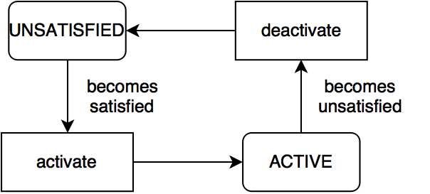
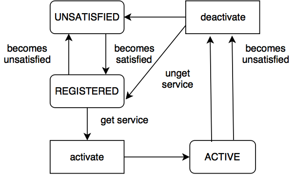



Declarative Services
====================

## Table of contents
{:.no_toc}

{::options toc_levels="2"/}
* TOC
{:toc}

## I. Introduction

The OSGi Declarative Services functionality is part of the [OSGi 4.2 Compendium Specification][OSGi-Compendium] and allows you to define and consume services via metadata (XML) without any dependency in your source code to the OSGi framework.

## II. Declarative Services 

In the [OSGi Overview article](osgi.html) we have mentioned that a bundle can register, unregister, get and unget services from a central point - the Service Registry. In order to simplify the usage of services the [OSGi Alliance](https://www.osgi.org/about-us/) has developed a model of managing services dynamically called *Declarative Services*. In order to understand this model, we will have to first explain a few terms, used below:

- **Declarative Services Container** (we will use the shorthand **DS**) - a module that is managing the [lifecycle](#vii-component-lifecycle) of a *service component* dynamically. It activates and deactivates different components, basing its decisions on the information contained in the *component description*;
- **Service Component** (or also **component**) - an object whose lifecycle is managed, usually by a component framework such as Declarative Services (DS). A component may publish itself as an OSGi service or consume OSGi services. A component can refer to a number of services; 
- **Component Description** - The declaration of a component. It is contained
within an XML document in a bundle. (Source: [OSGi Service Platform Service Compendium Chapter 112.1][OSGi-Compendium]).

### 1. DS container

In order to use the Declarative Services functionality you have to start a bundle with an implementation of the DS container. In [Equinox](http://www.eclipse.org/equinox/) (the reference implementation of OSGi that is used in openHAB) this bundle is called `org.eclipse.equinox.ds`. 

When a bundle that contains a component is added to the framework, DS reads its component description (the XML file). If the conditions, described in this file are fulfilled (you will understand more about this in the next chapters), the DS activates the component (more on the that in the [component lifecycle](#vii-component-lifecycle) chapter). More importantly, after some of the requirements are not met anymore, the DS container deactivates the component. This ensures that service components are managed dynamically.

### 2. Components

It is important to understand the difference between a *component* and a *service*. A component is a normal Java class, that can reference services and provide services. What makes a component specific is that it is declared in a XML file and is managed completely by DS. That means that DS instantiates the component, calls method on this component and manages the lifecycle of a component.

A component requires the following artifacts in a bundle:

- **XML description** of the component;
- **Service-Component manifest header**, which contains the location of the XML description;
- An **implementation class** that is specified in the component description. 

In the examples below we will take a look over more details.

For more detailed definition - [OSGi Service Platform Service Compendium Chapter 112.1][OSGi-Compendium].

### 3. Component Description

The component description is a XML document that contains the *service component description* . The syntax of this document is described in [Component Description Schema, OSGi 4.2 Compendium 112.10][OSGi-Compendium]. The  document contains basic information like the component name, component dependencies and services that are implemented by the component. It also describes, how the DS will handle changes in some of the referenced services and how the service will be activated ([lazy](https://www.osgi.org/developer/design/lazy-start/) or not). We will provide some examples below, that cover the most common use cases.

## III. Advantages

For the user of the service it is from no importance, if the service was registered with the [low level API](https://osgi.org/javadoc/r4v43/core/org/osgi/framework/BundleContext.html#registerService(java.lang.Class,%20S,%20java.util.Dictionary)) or with Declarative Services. However the using of Declarative Services has the following advantages: 

- **they are declarative** - it is not needed to write explicit code to register and get services. This means that a lot of boilerplate code can be removed and the developer can concentrate on the business logic;
- **DS container manages the creation of instances** - whenever the conditions, described in the *component description*, are satisfied *DS* will instantiate the service for us. When the instances are not needed anymore, *DS* will remove the references to them; 
- **components are not initialized until a service is requested** - this is called [lazy initialization](https://www.osgi.org/developer/design/lazy-start/) and it is the default behavior;
- **a component has a lifecycle, that is bound to the defining bundle's lifecycle** - more information can be found in the chapter [component lifecycle](#vii-component-lifecycle).

Components have two most common use cases (which are combined very often):

- a component can [use services](#iv-example---reference-service) from other components;
- a component can [publish itself as an OSGi service](#v-example---provide-service).

## IV. Example - Reference Service

In this example our component needs a [LogService](https://osgi.org/javadoc/r4v42/org/osgi/service/log/LogService.html). We will use DS to inject an implementation of this service in our class. 

### 1. Service Component Description

This is the XML component description. This file is located in the *OSGI-INF* folder and is named *consumer.xml*.

    Note! Please keep in mind that the Service Component Description can be
    automatically generated using SCR Annotations like @Component, @Reference,
    @Activate, @Deacticate and etc that are supported e.g. in Apache Felix. In the openHAB project
    it is preferred to use these annotations and not create the XML component description by hand.
    This should be accompanied with a .gitignore file in the OSGI-INF with /*.xml as content.
    This is needed to avoid adding the generated XML component files to git.

```xml
<?xml version="1.0" encoding="UTF-8"?>
<scr:component xmlns:scr="http://www.osgi.org/xmlns/scr/v1.1.0" name="com.example.consumer" immediate="true">
   <!-- name = the component name must be unique
        immediate = optional parameter that specifies if the component has immediate activation. Options are true or false              
   -->
   <implementation class="com.example.consumer.MyServiceImpl"/> 
   <!--The fully qualified name of the implemenation class-->
   <!--Here we declare references to other services, which we want to use in our implementation class. 
        bind = method in the implementation class which is called when the referenced services gets active
        unbind = method in the implementation class which is called when the referenced services gets inactive
        cardinality = regarding the cardinality of your reference DS handles the lifecycle of your servive as well
        policy = this reference can be handled as static or dynamic
    -->
   <reference 
        interface="org.osgi.service.log.LogService"
        bind="setLog"
        unbind="unsetLog"
        cardinality="1..1"
        policy="static"
    />
</scr:component> 
```

Let's take a look at some settings, that we can apply:

- **immediate**:
    - *true* - the component is activated as soon as all dependencies are satisfied. Adding this option will ensure that the component will be activated right after the bundle is activated and the component is satisfied;
    - *false* - the component has lazy activation. The activation of the component is delayed(lazy activation) until the service is requested. This is the default value;
- **cardinality**:
    - *1..1* - single service reference, that is mandatory. If your referenced service gets inactive, DS deactivates your service component as well (default value);
    - *0..1* - single service reference(not mandatory). You have to be aware that you might not have your reference resolved, your component can live with the absence;
    - *0..n* - multiple service references (not mandatory). The referenced service can be implemented multiple times, so they are added to a list in your component implementation;
    - *1..n* = like the above, but mandatory;
- **policy**:
    - *static* - the default policy. Component configuration are deactivated every time, when a reference with static policy becomes unavailable. This causes the activating and deactivating of the component. It can be very expensive, when we have multiple bound services, or when a service is often unregistered and re-registered;
    - *dynamic* - with this policy the component is not deactivated, when a referenced service is changed. It is slightly more complex, as the component implementation has to properly handle changes in the set of bound services.

### 2. Implementation Class

Most of the bundles will require access to other services. A component may be used to inject the service in the bundle through the `bind()` and `unbind()` methods called on the component instance (the implementation class). In the component description above, we have set that our `bind()` method is named `setLog()`, so now we can inspect an instance of the *LogService* provided by the DS. The `activate()` and `deactivate()` methods are called from DS, when the component configuration is activated and deactivated (more about [activation](osgids.html#activaiton)):
 
```java
package com.example.consumer;

import org.osgi.framework.BundleContext;
import org.osgi.service.log.LogService;

@Component(service = MyServiceImpl.class, immediate = true)
public class MyServiceImpl {
    private LogService log;

    public MyServiceImpl() {
    }

    @Activate
    protected void activate(BundleContext context) {
        System.out.println("Bundle is activated!");
        // No specific action is needed here in this case
    }

    @Deactivate
    protected void deactivate(BundleContext context) {
        System.out.println("Bundle is deactivated!");
        // No specific action is needed here in this case
    }

    @Reference
    public void setLog(LogService l) {
        log = l;
        System.out.println("Log service is available!");
        // We store a reference to the LogService !
    }

    public void unsetLog(LogService l) {
        log = null;
        System.out.println("Log service isn`t available anymore!");
        // We have to clean up after ourselves, when the reference is not needed anymore !
    }
}
```

### 3. Service-Component Header

- The purpose of the *Service-Component* header in the MANIFEST.MF file is to show the DS container, where the component description is located. According to the OSGi specification, such resources must be placed in the *OSGI-INF* folder:

```
Manifest-Version: 1.0
Bundle-ManifestVersion: 2
Bundle-Name: Consumer Example
Bundle-SymbolicName: com.example.consumer
Bundle-Version: 1.0.0.qualifier
Bundle-RequiredExecutionEnvironment: JavaSE-1.7
Import-Package: org.osgi.framework,
 org.osgi.service.log
Service-Component: OSGI-INF/consumer.xml
```

Notice that we have also included this header as well: 

```
...
Service-Component: OSGI-INF/*.xml
...
```

## V. Example - Provide Service

Very often you will have to register a service, that implements an interface defined in the framework (e.g [*EventHandler*](https://osgi.org/javadoc/r4v42/org/osgi/service/event/EventHandler.html)) or interface, that you have defined. An interface allows you to change the implementation easily or register multiple implementations in the Service Registry.  
We will use DS to register an implementation of the EventHandler service in the OSGi Service Registry.

### 1. Component Description
This is how the component description may look like. This file is located in the *OSGI-INF* folder and is named *provider.xml*. We are providing some service specific properties as well (the property with name `event.topics`). The usage of this property is desrcribed in the [API documentation](https://osgi.org/javadoc/r4v42/org/osgi/service/event/EventConstants.html#EVENT_TOPIC):

```
<?xml version="1.0" encoding="UTF-8"?>
<scr:component name="com.example.handler" xmlns:scr="http://www.osgi.org/xmlns/scr/v1.1.0">
    <implementation class="com.example.HandlerImpl"/>
    <property name="event.topics">some/topic</property>
    <service>
        <provide interface="org.osgi.service.event.EventHandler"/>
    </service>
</scr:component>
```

### 2. Implementation Class

```java
package com.example.provider;

import org.osgi.service.event.Event;
import org.osgi.service.event.EventHandler;

@Component(service = EventHandler.class, property = { "event.topics=some/topic" })
public class HandlerImpl implements EventHandler {

    @Override
    public void handleEvent(Event event) {
        String topic = event.getTopic();
        System.out.println("Received event with topic: " + topic);
    }
}
```

### 3. Service-Component Header


```
Manifest-Version: 1.0
Bundle-ManifestVersion: 2
Bundle-Name: Provider Example
Bundle-SymbolicName: com.example.provider
Bundle-Version: 1.0.0.qualifier
Bundle-RequiredExecutionEnvironment: JavaSE-1.7
Import-Package: org.osgi.service.event
Service-Component: OSGI-INF/provider.xml
```

## VI. Component types

A component lifecycle depends of the type of the component. Three type of components are defined:  

- **immediate** - with ```immediate``` attribute set to ```true``` - see the [example component description](#service-component-description);  
- **delayed** - with ```immediate``` attribute set to ```false```;  
- **factory** - we will not discuss the lifecycle of this type in this article. You can find information in the [OSGi 4.2 Compendium Specifiaction, Chapter 112.2.4 Factory Component][OSGi-Compendium].

## VII. Component Lifecycle

A component goes through several states in his lifecycle:

- **UNSATISFIED** - initial state of the Service Component, after the bundle is started;
- **REGISTERED** - temporary state. Only *delayed* components go through this state;
- **ACTIVE** - the component is active and component instance is created.

  
Fig.1 Immediate component lifecycle

  
Fig.2 Delayed component lifecycle 


### 1. States

Like described above, the component lifecycle depends on the lifecycle of the bundle, that includes the component. Component must be enabled before it can be used. 

A component is **enabled**, when the component's bundle is **started** and **disabled**, when the bundle is **stopped**.

After the Component is enabled, it is moved to the UNSATISFIED state. The next step is to satisfy the component configuration. 

The component **configuration is satisfied** when:  

 - component is **enabled**;
 - all the **component references are satisfied**. A reference is satisfied when the reference specifies optional cardinality or there is at least one target service for the reference.
If the component has lazy initialization (the component is *delayed*), it is moved to the REGISTERED state and it is waiting to be activated, when the service is requested (see Fig.2).  
Otherwise (the component is *immediate*) as soon as its dependencies are satisfied, the component is activated (see Fig.1).

### 2. Activation

Activation consists of following steps:

- load the implementation class;
- create component instance;
- bind target services (`bind()` method is called);
- call the `activate()` method, if present.

After the activation, the component is in ACTIVE state. From this state the component can go back to the *REGISTERED* state (or to the *UNSATISFIED* state), if the component configuration becomes unsatisfied.


### 3. Deactivation 

Deactivation consists of the following actions:

 - the `deactivate` method is called, if present;
 - unbind target services (`unbind()` method is called);
 - release all references to the component instance.
 
For more information - [OSGi 4.2 Compendium Specifiaction, Chapter 112.5 Component Life Cycle][OSGi-Compendium].

If you want to practice, what you have learned so far, you can try out our [OSGi Coding tasks](osgitasks.html). In chapter IV. there are tasks, that are using OSGi DS. It is recommended to start from the beginning (chapter I.), as the tasks are related between each other.

## VIII. Troubleshooting

If you are new to Declarative Services and you don't know how to troubleshoot, maybe we can help you. We will give you a few tips what might have gone wrong. Some of the steps below depend on your development IDE and the OSGi Container that you use. Mind that most of the tips below are specific to Eclipse IDE and Equinox as the OSGi Runtime. You might review again the [Equinox commands](equinox.html#iv-commands) before you continue:

- make sure that your Component Description (the XML file) contains the necessary information to provide or reference service (see the examples above);
- make sure that your Component Description is placed in the OSGI-INF folder;
- [Eclipse IDE only] make sure that no warnings are displayed in the Component Description file (a warning might indicate that some of the class names that you have used are not correct !);
- open the bundle manifest file (located in META-INF/MANIFEST.MF) and check if your Component Description is added in the "Service-Component" header (it can be added as "OSGI-INF/*.xml or "OSGI-INF/component.xml");
- [Eclipse IDE only] open the build.properties file and make sure that the Component Description is added in the bin.includes entry (it can be added as "OSGI-INF/" or "OSGI-INF/component.xml"). If it is not included in the build.properties file, it will not end in the .jar file that will be deployed in the Equinox runtime and SCR will be not able to find it;
- Start the runtime and check the log. Do you see any Errors like "MESSAGE [SCR] Error while trying to bind reference"? Read the error message and proceed accordingly.
- Make sure that the bundle that is providing the service is in "ACTIVE" state, if it is not, start it manually with the "start id" command, where id is the id of the bundle;
- [Equinox only] While the runtime is running type the "services" command and search if your service is registered. In case it is not registered, most probably you have missed some of the steps above :);
- [Equinox only] While the runtime is running type "ls -c id", where id is the id of the bundle that is providing the service. This will give detailed information about the services that are registered by this bundle, read the information if the component is satisfied carefully;
- Is your service in use? In case it is not and you are not seeing it registered, the component might have lazy activation policy(this is the default policy). Add "immediate=true" in your Component Definition if you like to change the activation policy.  

## XIX. Further Reading

- [*OSGi Service Platform Service Compendium, Release 4, Version 4.2,
August 2009*](https://osgi.org/download/r4v42/r4.cmpn.pdf)  
- [Lars Vogel - Declarative services](http://www.vogella.com/tutorials/OSGiServices/article.html#declarativeservices)  
- [Getting Started with OSGi: Declarative Services](http://www.eclipsezone.com/eclipse/forums/t97690.rhtml)
- <http://stackoverflow.com/questions/8886430/what-is-the-difference-between-osgi-components-and-services>  

[OSGi-Compendium]: https://osgi.org/download/r4v42/r4.cmpn.pdf
