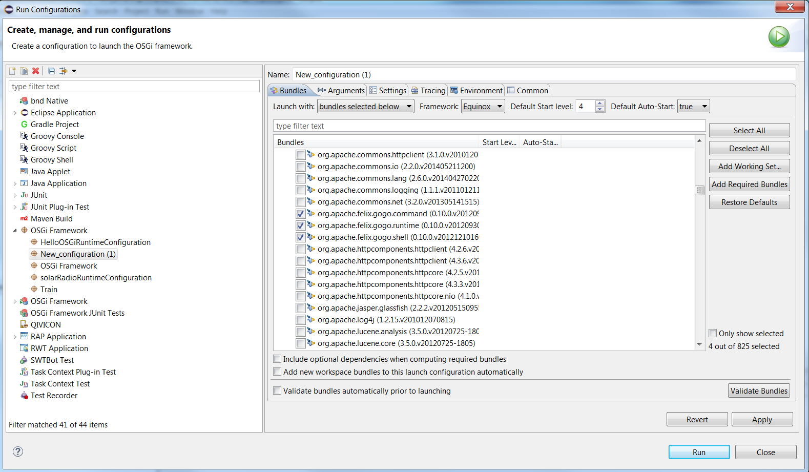



Equinox
=======

## Table of contents
{:.no_toc}

{::options toc_levels="2,3"/}
* TOC
{:toc}

## I. Introduction

[Equinox][Equinox] is considered to be a reference implementation of the [OSGi Core 4.x specification][OSGi-4.x] and one of the most widely used. It is an [open source project][Equinox-repo], part of the [Eclipse project][Eclipse]. It provides a set of bundles, that implement various optional OSGi services.

The openHAB bundles are deployed on Equinox runtime. Knowledge about how to start the runtime and execute basic commands will help you to speedup the development process. Some of the bundles that you are going to use from Eclipse SmartHome**<sup>TM</sup>** and openHAB depend on Equinox bundles and this article will list some of the Equinox core bundles and the services that they provide.

## II. Start Equinox Runtime from Eclipse

First make sure that you have installed [openHAB Eclipse IDE](../development/ide.html).

Then follow these steps:

1. Start Eclipse and go to "Run" -> "Run Configurations".
2. From the list in the left panel choose "OSGi Framework". Right click on it and choose "New".
3. After you've been created a new configuration, select the bundles that you need from the workspace.
4. Then make sure that the following bundles from the target platform are selected, otherwise the OSGi console will not be available:

    org.apache.felix.gogo.runtime
    org.apache.felix.gogo.shell
    org.apache.felix.gogo.command
    org.eclipse.equinox.console

5. Click on "Add Required Bundles". Eclipse will resolve all dependencies of the bundles listed above and include new bundles to the configuration.
6. Click on "Validate Bundles" and make sure that "No problems were detected" is displayed.
7. You can start Equinox with the "Run" button.



If you use Eclipse for an IDE, this will be the easiest way to run your bundles in an Equinox runtime. If you do not have experience with writing OSGi bundles, go to our [coding tasks page](osgitasks.html).

## III. Run Equinox standalone

The **org.eclipse.osgi** bundle is the framework implementation of the Core Framework R4 specification in a standalone package.

You can get it from your [Eclipse IDE installation for openHAB](../development/ide.html) (If you're using Windows, it should be located at `C:\Users\your.name\.p2\pool\plugins\org.eclipse.osgi_3.x.x_xxxx.jar`).

1. Equinox versions before 3.8.0.M4.

In some older version of Equinox, using the following command line:

```shell
java -jar org.eclipse.osgi_3.x.x_xxxx.jar -console
```

was enough to run it standalone.

2. Equinox versions after 3.8.0.M4.

Starting from Equinox 3.8.0.M4, it has a new console. So the command line above will probably not work. You need some additional bundles in order to run Equinox properly. There are different ways to add those bundles and one of them is given below:

 1. After you have downloaded and installed Eclipse IDE for openHAB, find your .p2 repository and go to the `plugins` folder. (if you're using Windows, it should be located at `C:\Users\your.name\.p2\pool\plugins`).

 2. Make sure that there is a `org.eclipse.osgi_3.x.x_xxxx.jar` in that folder.

 3. Create `configuration` folder in the `plugins` folder.

 4. Inside the `configuration` folder create a file `config.ini`.

 5. Save the following content in the `config.ini` file:

```ini
    osgi.bundles=\  
    org.eclipse.core.runtime,\  
    org.eclipse.equinox.common,\  
    org.eclipse.core.jobs,\  
    org.eclipse.equinox.registry,\  
    org.eclipse.equinox.preferences,\  
    org.eclipse.core.contenttype,\  
    org.eclipse.equinox.app,\  
    org.eclipse.equinox.console,\  
    org.apache.felix.gogo.runtime,\  
    org.apache.felix.gogo.shell,\  
    org.apache.felix.gogo.command  

    eclipse.ignoreApp=true  
    eclipse.consoleLog=true  
```

 6. Use the following command line to run Equinox:

```shell
java -jar org.eclipse.osgi_3.x.x_xxxx.jar -console -configuration configuration
```

## IV. Commands

Once you have Equinox running, you will see a prompt. Some of the basic
osgi commands are:

Command | Description
--------|-------
*help*  | Basic command that will list all available commands
*install* [bundle URL] | Installs the bundle from the given URL
*start* [bundle # or bundle name] | Starts the bundle with the given numeric or symbolic id
*stop* [bundle # or bundle name] | Stops the bundle with the given numeric or symbolic id
*ss* | Reports a summary status of all installed bundles
*diag* [bundle # or bundle name] | Reports any resolution problems for the bundle with the given numeric or symbolic id
*services* [filter] | Lists all available services or only services matching to [LDAP-style filter](http://www.ldapexplorer.com/en/manual/109010000-ldap-filter-syntax.htm) (e.g. services (objectClass="\*virtage\*") - will print only services having *virtage* in their class name)  

Table 1. Equinox commands (Source: <http://www.eclipse.org/equinox/documents/quickstart-framework.php>)

## V. Equinox Bundles

Another part of the Equinox project is the [Equinox Bundles][Equinox-Bundles] component. It consists of bundles that implement all add-on services from the OSGi specification and additional services defined in various OSGi expert groups.

Some of the core bundles are listed in the table below. Some or all of these bundles must be included in your runtime configuration, if you want to use the services that they provide.

 Name | Bundle Symbolic Name | Description
 -------- | -------- | --------
Declarative Services | org.eclipse.equinox.ds | An implementation of the OSGi R4 [Declarative Services](osgids.html) specification
Event Admin Service | org.eclipse.equinox.event | OSGi R4 [Event Admin](https://osgi.org/javadoc/r4v42/org/osgi/service/event/EventAdmin.html) Service provides an inter-bundle communication mechanism based on an event publish and subscribe model
Log Service | org.eclipse.equinox.log | This [LogService](https://osgi.org/javadoc/r4v42/org/osgi/service/log/LogService.html) provides a general-purpose message logger for the OSGi environment
Equinox Utilities | org.eclipse.equinox.util | A library of utility classes that are frequently used from the Equinox OSGi Service implementation bundles
OSGi Services API | org.eclipse.osgi.service | This bundle contains the set of OSGi specified service APIs.  

Table 2. OSGi Bundles (Full list can be found at: <http://www.eclipse.org/equinox/bundles/>)

## VI. p2

The [p2 project][p2] is a sub-project of [Equinox][Equinox] that focuses on provisioning technology for OSGi-based applications. Provisioning is the act of finding and installing new functionality and updating or removing existing functionality; it is distinct from building.

Although p2 has a specific support for Equinox and [Eclipse][Eclipse], can be used as a general purpose provisioning infrastructure.

### 1. Core Concepts

p2 manages artifacts, such as [plug-ins(bundles)][plugins], [features][features] and [products][products]. You can think of these as bags of bytes. p2 not only stores these artifacts, it also **stores metadata about these artifacts**, such as version information, cryptographic signatures, dependencies, platform specifics and special installation requirements.

### 2. Installable Unit

Every p2 artifact *Installable Unit or IU* is uniquely identified by an **identifier** and **version number**. For example, in the Equinox OSGi container from the Indigo release there is a bundle whose identifier is *org.eclipse.osgi* and version *3.7.0.v20110110*. p2 assumes that two artifacts with the same identifier and same version number are the same artifact.

An IU representing the SWT bundle:

```
id=org.eclipse.swt, version=3.5.0, singleton=true
Capabilities:
    {namespace=org.eclipse.equinox.p2.iu, name=org.eclipse.swt, version=3.5.0}
    {namespace=org.eclipse.equinox.p2.eclipse.type name=bundle version=1.0.0}
    {namespace=java.package, name=org.eclipse.swt.graphics, version=1.0.0}
    {namespace=java.package, name=org.eclipse.swt.layout, version=1.2.0}
Requirements:
    {namespace=java.package, name=org.eclipse.swt.accessibility2, range=[1.0.0,2.0.0), optional=true, filter=(&(os=linux))}
    {namespace=java.package, name=org.mozilla.xpcom, range=[1.0.0, 1.1.0), optional=true, greed=false}
Updates:
    {namespace=org.eclipse.equinox.p2.iu, name=org.eclipse.swt, range=[0.0.0, 3.5.0)}
```

As you can see the installable unit defines *capabilities* - what the IU expose to the rest of the world, *requirements* - what the IU needs (the requirements are satisfied by capabilities). This metadata is used in the resolvement process.

### 3. Update sites

Installable units can be grouped into a **p2 repository** (also called **update site**). A repository is defined via its URI and can point to a local file system or to a web server. A p2 repository is also frequently called update site.

The most important characteristic of p2 repositories (and difference compared to the Maven repositories) is that **IU do not depend directly on each other**, they depend on packages identified by namespace + name + version(unless *Require-Bundle* is specified).

A sample p2 repository(update site) has the following layout

```
features
plugins
artifacts.jar
content.jar
site.xml
```
Some of the most popular p2 repositories are [orbit p2 Repo](http://download.eclipse.org/tools/orbit/downloads/drops/R20160221192158/)  and [Eclipse p2 Repo](http://download.eclipse.org/eclipse/updates).

You can find information about the Eclipse SmartHome**<sup>TM</sup>** update sites at [this link](http://www.eclipse.org/smarthome/documentation/community/downloads.html).

## VII. Further Reading

- <http://www.eclipse.org/equinox/>
- <http://www.eclipse.org/equinox/bundles/>
- <http://www.eclipse.org/equinox/documents/quickstart-framework.php>
- <http://www.eclipse.org/equinox/framework/>
- <http://www.eclipse.org/equinox/incubator/>   
- [OSGiEquinoxExplained](https://eclipse.org/equinox/documents/eclipsist2007/EclipseSummitTurkey2007-OSGiEquinoxExplained.pdf)
- <http://blog.idzona.com/2016/01/different-ways-to-start-the-eclipse-equinox-osgi-console.html>
- <https://bugs.eclipse.org/bugs/show_bug.cgi?id=371101>  
- <http://www.eclipse.org/equinox/p2/>
- <http://wiki.eclipse.org/Equinox_P2_Resolution>
- <http://wiki.eclipse.org/Equinox/p2/FAQ>
- <https://wiki.eclipse.org/Installable_Units>  
- [Products and features](http://help.eclipse.org/mars/index.jsp?topic=%2Forg.eclipse.platform.doc.isv%2Fguide%2Fproduct_def.htm)   
- [Dependency Management for the Eclipse Ecosystem, Eclipse p2, metadata and resolution, Daniel Le Berre, Pascal Rapicault,2009](https://hal.archives-ouvertes.fr/hal-00870855/document)  
- [RT meets p2](https://bkapukaranov.wordpress.com/category/tech/virgo/)

[Equinox]: http://www.eclipse.org/equinox/
[OSGi-4.x]: https://www.osgi.org/osgi-service-platform-release-4-downloads/
[Equinox-repo]: http://git.eclipse.org/c/equinox/
[Eclipse]: https://eclipse.org/eclipse/
[Equinox-Bundles]: http://www.eclipse.org/equinox/bundles/
[Equinox-Incubator]: http://www.eclipse.org/equinox/incubator/
[p2]: http://www.eclipse.org/equinox/p2/
[Equinox-Server]: http://www.eclipse.org/equinox/incubator/server/
[products]: http://help.eclipse.org/mars/index.jsp?topic=%2Forg.eclipse.platform.doc.isv%2Fguide%2Fproduct_def.htm
[plugins]: http://help.eclipse.org/mars/index.jsp?topic=%2Forg.eclipse.platform.doc.isv%2Fguide%2Fproduct_def_plugins.htm&cp=2_0_21_2
[features]: http://help.eclipse.org/mars/index.jsp?topic=%2Forg.eclipse.platform.doc.isv%2Fguide%2Fproduct_def_feature.htm&cp=2_0_21_1
