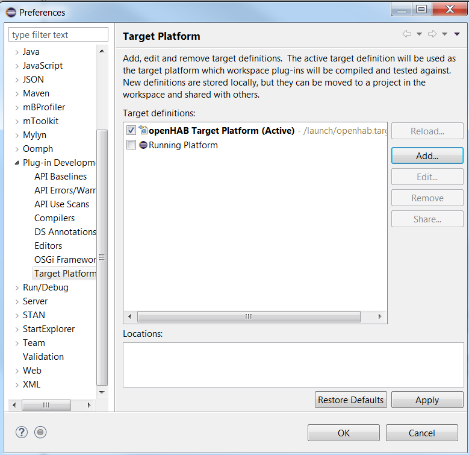
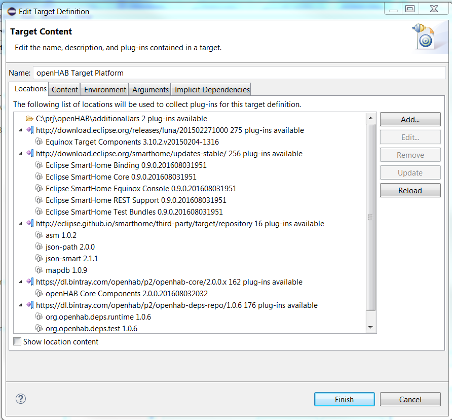



Target platform
=====

## Introduction

The *Target Platform* is a collection of plug-ins which your workspace will be built and run against. It describes the platform that you are developing for. It can be used from [Tycho Maven plugins](tycho.html) as well.

## Target Definition

*Target platform* can be defined in a *target definition* file. *Target Definition is a way of determining the plug-ins to add to the state. You can have multiple target definitions, but only one definition can be selected as the target platform.* (Source: [Eclipse documentation][target-platform]).

Target definitions are stored in a file with the extension `.target`. The openHAB target platform definition looks like this (it will be most probably changed when you read this article - for the latest version check in the [openhad-distro](https://github.com/openhab/openhab-distro/blob/master/launch/openhab.target)):

```xml
<?xml version="1.0" encoding="UTF-8" standalone="no"?>
<?pde version="3.8"?>
<target name="openHAB Target Platform" sequenceNumber="156">
<locations>
	<location includeAllPlatforms="false" includeConfigurePhase="false" includeMode="planner" includeSource="true" type="InstallableUnit">
		<unit id="org.eclipse.smarthome.feature.runtime.core.feature.group" version="0.0.0"/>
		<unit id="org.eclipse.smarthome.feature.runtime.binding.feature.group" version="0.0.0"/>
		<unit id="org.eclipse.smarthome.feature.runtime.console.equinox.feature.group" version="0.0.0"/>
		<unit id="org.eclipse.smarthome.feature.runtime.rest.feature.group" version="0.0.0"/>
		<unit id="org.eclipse.smarthome.feature.test.feature.group" version="0.0.0"/>
		<repository location="http://download.eclipse.org/smarthome/updates-stable/"/>
	</location>
	<location includeAllPlatforms="false" includeConfigurePhase="true" includeMode="planner" includeSource="true" type="InstallableUnit">
		<unit id="org.eclipse.equinox.sdk.feature.group" version="3.10.2.v20150204-1316"/>
		<repository location="http://download.eclipse.org/releases/luna/201502271000"/>
	</location>
	<location includeAllPlatforms="false" includeConfigurePhase="false" includeMode="planner" includeSource="true" type="InstallableUnit">
		<unit id="org.openhab.feature.p2.feature.group" version="0.0.0"/>
		<repository location="https://dl.bintray.com/openhab/p2/openhab-core/2.0.0.x"/>
	</location>
	<location includeAllPlatforms="false" includeConfigurePhase="true" includeMode="planner" includeSource="true" type="InstallableUnit">
		<unit id="org.openhab.deps.runtime.feature.group" version="0.0.0"/>
		<unit id="org.openhab.deps.test.feature.group" version="0.0.0"/>
		<repository location="https://dl.bintray.com/openhab/p2/openhab-deps-repo/1.0.6"/>
	</location>
	<location includeAllPlatforms="false" includeConfigurePhase="false" includeMode="planner" includeSource="true" type="InstallableUnit">
		<unit id="net.minidev.asm" version="1.0.2"/>
		<unit id="com.jayway.jsonpath.json-path" version="2.0.0"/>
		<unit id="org.mapdb.mapdb" version="1.0.9"/>
		<unit id="net.minidev.json-smart" version="2.1.1"/>
		<repository location="http://eclipse.github.io/smarthome/third-party/target/repository"/>
	</location>
</locations>
</target>
```

This file lists the different repositories (or also "update sites"), where the plug-ins are stored, and artifacts ("installable units"). To find more about update sites and installable units, take a look at the [p2 short overview](equinox.html#vi-p2).

## openHAB target platform

The `openHAB target platform` definition file is located in the [openhad-distro](https://github.com/openhab/openhab-distro/blob/master/launch/openhab.target) repository. It contains all the external dependencies that are needed from the openHAB bundles.

## Target Platform Editor in Eclipse IDE

Eclipse has a graphical interface for working with the target platform. It is located in the `Window` -> `Preferences` -> `Plug-in Development` -> `Target Platform`(See Fig.1).

### Selecting

Depending on the repositories that you have selected in the installation process, you might have many options in this window. For openHAB development choose `openHAB Target Platform`. Make sure that it is checked and that it is "Active".

  
Fig. 1. Target Platform dialog window

   Hint! If for some reason the target platform that you want to use is missing from this list, the easiest way to add it is to close this window and simply drag and drop the target definition file into Eclipse. In the top right corner you will see a button `Set as current target platform`. 

### Reloading 

During the development process, some projects might fail to build. There could be several possible problems in this case, two of them are related with the target platform:

- you have updated your plugins repository, but you have not updated the target platform in Eclipse (or the openhab-distro repository). The updated versions of the bundles require new dependencies that are not present in the current target platform that you are using;
- your last update of the target platform in Eclipse has failed. In this case the content of the target platform may not be complete. 

In both cases the first thing to do is to check, if there are any problems with the target platform. Open the `Target Platform` window (See Fig.1). If you see a red cross in front of the `openHAB Target Platform` select it and click on `Edit`(Fig.2). A new window will pop up and Eclipse will try to connect to all repositories listed in the target definition file. If some of the plug-ins are not downloaded, it will download all missing bundles. This may take some minutes, so be patient. After the process has finished, if no problems were found, you can click on `Finish`.

You go back to the previous window and don't forget to to click on `Reload`. After you save your actions with `OK` or `Apply`, Eclipse will try to rebuild all the projects in your workspace.
 
### Editing 

You may wonder, why you have to edit the content of the target platform. If you are developing new binding, that requires a library that is not included in the target platform and you want to setup a quick test, it might be easier to add a folder with the required `.jar` file to your target platform. 

You can edit the target definition file with any text editor that you want, but you might find it easier to edit the content of the target platform from the Eclipse UI. In order to do that, you have to:

- open the `Target Platform` dialog window (see Fig.1);
- click on `Edit`(see Fig.2);
- in the `Locations` tab select `Add..`;
- Select `Folder` and follow the wizard.

  
Fig. 2. Edit Target Definition dialog window

## Further Reading

- <http://www.vogella.com/tutorials/EclipseTargetPlatform/article.html>
- <https://wiki.eclipse.org/PDE/Target_Definitions>
- <http://help.eclipse.org/neon/index.jsp?topic=%2Forg.eclipse.pde.doc.user%2Fconcepts%2Ftarget.htm>

[target-platform]: http://help.eclipse.org/mars/index.jsp?topic=%2Forg.eclipse.pde.doc.user%2Fconcepts%2Ftarget.htm