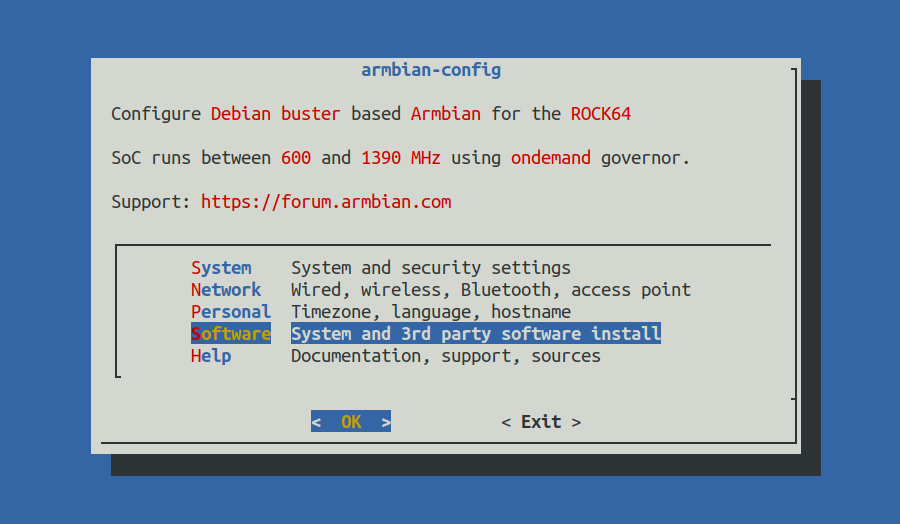
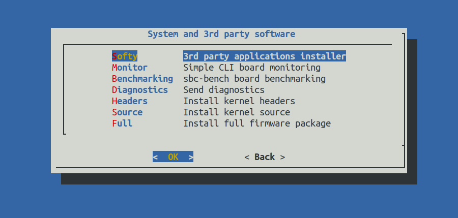
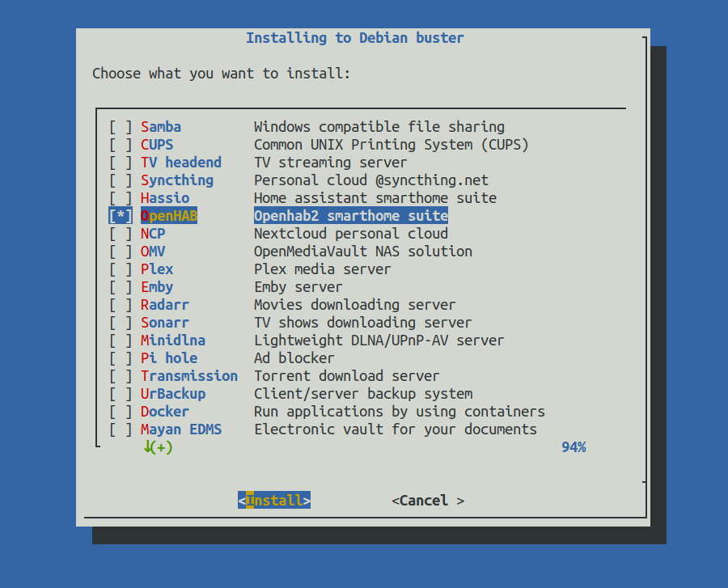
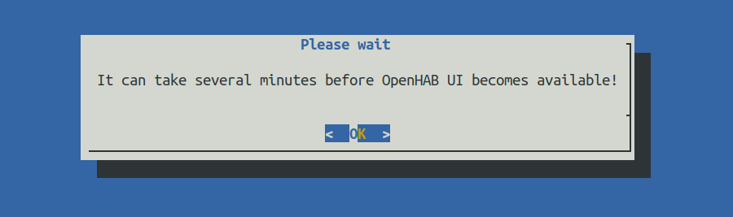
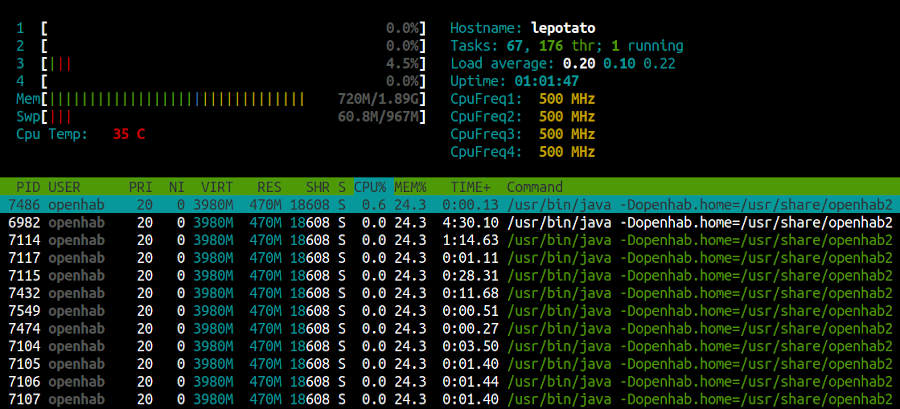




## What is Armbian?

Armbian is a base operating system platform for single board computers.

- Lightweight Debian or Ubuntu based distribution specialized for ARM developing boards.
- Each system is compiled, assembled and optimized by [Armbian Build Tools](https://github.com/armbian/build) 
- A vibrant community.

## Recommended hardware

OpenHab will run on any [supported hardware](https://www.armbian.com/download/?device_support=Supported) but we recommend to choose boards that have at least:

1Gb of memory, eMMC, 4 core 


## Supported images

Armbian Xenial, Bionic, Disco, Eoan, Focal, Stretch

**Note:** Buster and Bullseye are not supported!

## Setup

**First Steps:**
Prepare Armbian as usual:
https://docs.armbian.com/User-Guide_Getting-Started/

You don't need to do any other steps - Armbian comes fully optimised out of the box!

```shell
sudo apt-get update
sudo apt-get upgrade
sudo armbian-config
```





Select Openhab2 with <SPACE> and press <ENTER>



Wait 5-15 minutes depending on your hardware. During this time you can check if installation was succesfull by checking if openhab is doing something:

```shell
sudo htop -u openhab
```



If you don't see any openhab activities, something went wrong.

## Getting started

With the openHAB 2 distribution up and running, you should now continue with
the [Beginner Tutorial]({{base}}/tutorial)
or by working on your own configuration.

## Help

The very active [openHAB Community Forum](https://community.openhab.org) provides many more details and hints.
If you run into any problems, use the search function or open a new thread with your detailed question.
