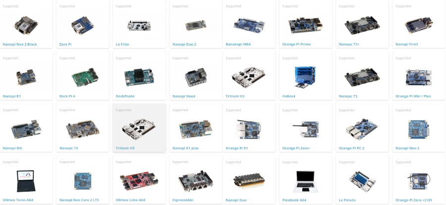
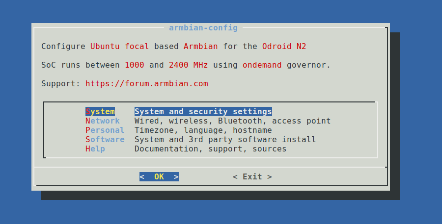
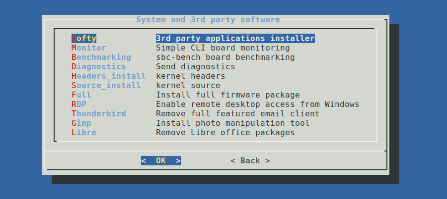
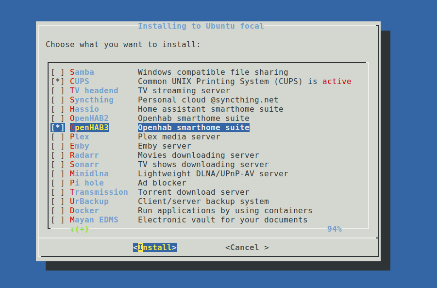
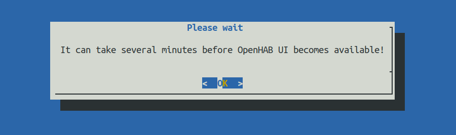
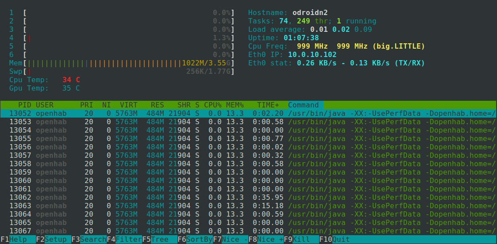

# Armbian

## What is Armbian?

Armbian is a base operating system platform for single board computers.

- comes in desktop, minimal or server variant,
- has clean and highly optimized user space,
- is Ubuntu and Debian compatible,
- is supported with vibrant community,
- comes with a powerful SDK which allows reproduction and customization,
- supports many 3rd party wireless drivers with advanced functionalities,
- supports Docker, disk encryption, Wireguard VPN any many other features.

## Recommended hardware

openHAB will run on any Armbian [supported hardware](https://www.armbian.com/download/?device_support=Supported) but it is recommended to choose boards that have at least:

- 512 MB of memory (on minimal or server image)
- eMMC or a [quality SD card](https://docs.armbian.com/User-Guide_Getting-Started/#how-to-prepare-a-sd-card)
- 4 core
- wired networking



## Supported images

You can [download](https://www.armbian.com/download/?device_support=Supported) and use server, desktop or minimal. If you choose a minimal image, you need to install armbian-config first.

## Setup

**First Steps:**

1. Prepare Armbian as usual - [login as root / 1234, change root password, create username. You don't need to perform any other steps](https://docs.armbian.com/User-Guide_Getting-Started/).

1. Update

```shell
sudo apt-get update
sudo apt-get upgrade
```

1. Run armbian-config

```shell
sudo armbian-config
```





Select OpenHAB2 (old version) or OpenHAB3 with **SPACE** and press **ENTER**



Wait 5 to 10 minutes depending on your hardware. During this time you can leave armbian-config and check if installation was successful by checking what openhab is doing on the system:

```shell
sudo htop -u openhab
```



If you don't see any openhab activities, something went wrong.

## Help

The very active [openHAB Community Forum](https://community.openhab.org) provides many more details and hints.
If you run into any problems, use the search function or open a new thread with your detailed question.

In case you run into a problem that is board hardware related, please use the [Armbian Community forums](https://forum.armbian.com/) or [Armbian bug reporting form](https://www.armbian.com/bugs/).
