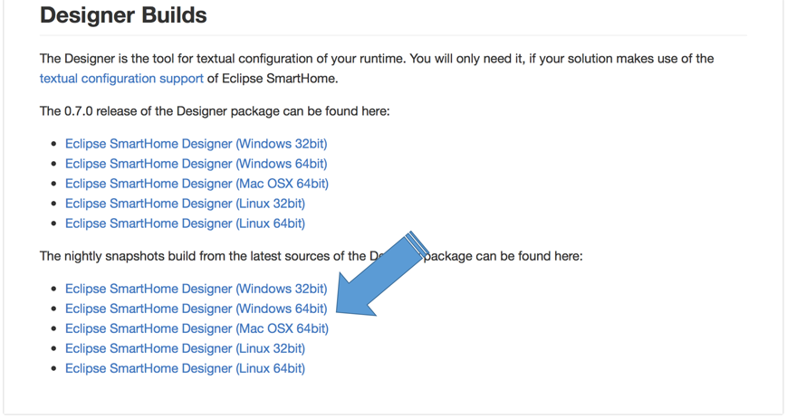
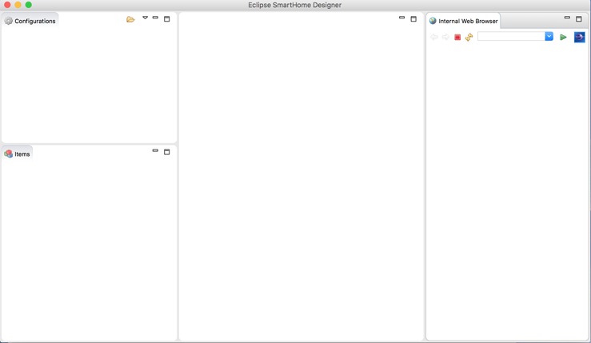
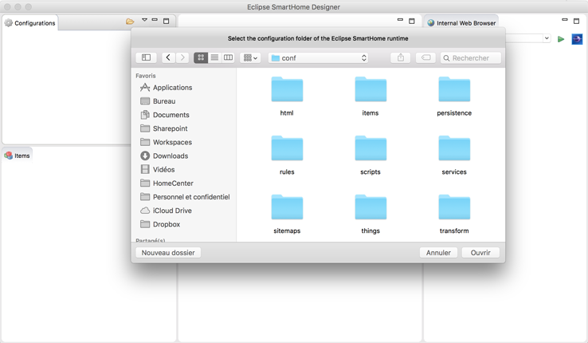
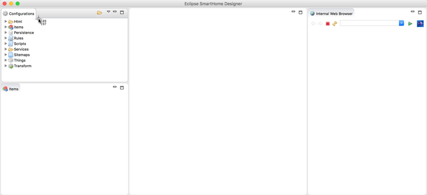



# Eclipse SmartHome Designer

The Eclipse SmartHome Designer is an eclipse-based IDE specialized for Eclipse SmartHome and openHAB configuration file management.
While your openHAB setup may run on a dedicated system, like a [Raspberry Pi](rasppi.html), the Designer can be installed and executed on your personal PC or Mac. In order to configure your openHAB setup, you will need a mounted network share to your configuration. 

## Setup

* The latest version is available for download at: [Eclipse SmartHome Designer Downloads](https://github.com/eclipse/smarthome/blob/master/docs/documentation/community/downloads.md#designer-builds)
* Get the designer for your plattform (Windows/OSX/Linux)
* As the SmartHome Designer is still in development, consider selecting the nightly snapshots build

The downloaded `.zip` archive contains the Designer executable. 
* **Windows**: Extract the archive to a path of your choosing, e.g. `C:\designer`
* **Linux**: Extract the archive to a path of your choosing, e.g. `/opt/designer`
* **Max OSX**: Extract the archive to your applications folder

## First launch

After launching the Designer executable, you will see an empty configuration file pane on the top left:

You will need to tell the Designer where your configuration files are located.
If your openHAB setup is on a different machine, you have to have some kind of network share set up and mounted. An example on how to do that on a Linux system can be found in the [Raspberry Pi article](rasppi.html).

* Click on the small `folder` icon at the top right of the configuration window
* Navigate to your openHAB configuration folder (containing `items`, `rules`, ...)

* Click on the Open button
* The configuration pane should now list the different configuration folders:

## Usage

You may now create and modify your configuration files. Changes are automatically loaded by the openHAB runtime.

