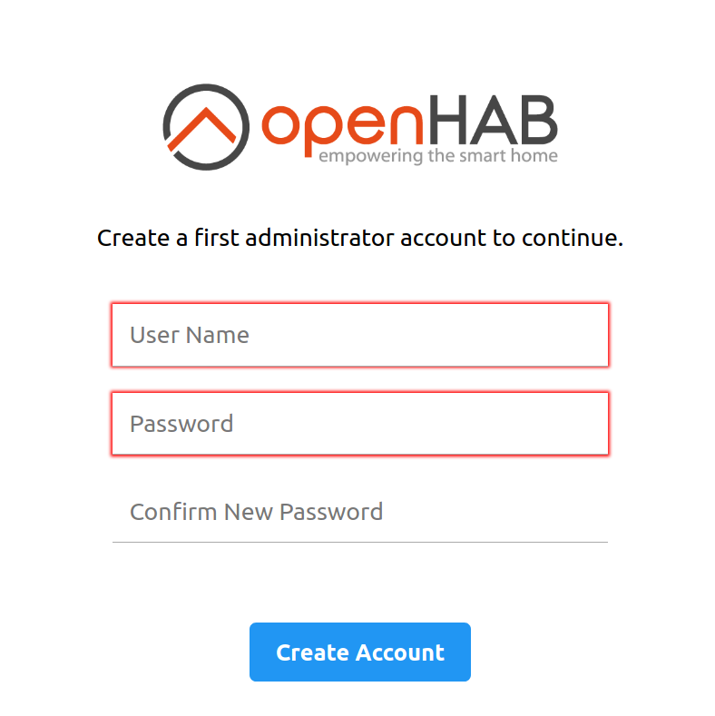

# openHAB on Linux

The following instructions will guide you through the process of setting up openHAB and recommended packages for both .DEB (Ubuntu, Debian etc.) and .RPM (RedHat, CentOS, Fedora etc.) Linux systems.

All instructions can be executed in a terminal or remotely via SSH connection.

This page is structured as follows:

[[toc]]

If you are unfamiliar with Linux, SSH and the Linux console or if you want to improve your skills, read up on these important topics.
A lot of helpful articles can be found on the internet, for example:

- "Learn the ways of Linux-fu, for free" interactively with exercises at [linuxjourney.com](https://linuxjourney.com).

Linux file permissions is one of the biggest sources of issues, Linux novices run into.
If you find yourself in a situation, where you have **no write access** to the openHAB configuration or system files wrong permissions and/or the incorrect use of `sudo` are often the cause.
Train your understanding of Linux permissions at [linuxjourney.com/lesson/file-permissions](https://linuxjourney.com/lesson/file-permissions).

## Meeting the Requirements

As a first step, please verify, that your system meets the [prerequisites](index.html#prerequisites).
You may want to install Zulu, a fully certified Java build [as a package or manually](https://docs.azul.com/zulu/zuludocs/ZuluUserGuide/InstallingZulu/InstallZulu.htm).

Alternatively, Zulu Embedded can be installed for small systems either from the same package repository as above or [manually](https://www.azul.com/downloads/zulu-embedded/).
If you're unsure which manual file you should download, using `dpkg --print-architecture` or `rpm -q --qf '%{ARCH}\n' rpm` in your Linux terminal should point you in the right direction (e.g. armhf means ARM Hard Float).

When installing Zulu or Zulu Embedded from a .zip or .tar archive, make sure to [set Zulu as the main Java "alternative"](https://docs.azul.com/zulu/zuludocs/#ZuluUserGuide/SwitchingBetweenJavaAlternatives/SwitchBetweenJavaAlts.htm).

::: tip Note
Make sure to download Zulu or Java **17**.
Java 21 can be used openHAB 4.x, and is required for openHAB 5.
:::

## Installation

openHAB can be installed through

- the openHABian project **(easiest method, ships with the openHABian configuration tool)**
- a package repository (apt, yum)
- manually from file.

The installation through the **openHABian project** and the use of the provided openHABian configuration tool is recommended for end users.

Installing using the provided **package repository** (using `apt`, `apt-get`, `yum` or `dnf`) is easier, but requires more manual configuration later on due to the missing openHABian configuration tool.

The manual installation through a platform independent archive file is suited for users who know what they are doing.

### openHABian project

The easy step by step instruction can be found [here](openhabian.html).

### Package Repository Installation

Installation through a package repository is the recommended choice. You can select the appropriate installation instructions by expanding from the apt or yum instructions.
Alternatively resort to the [manual installation approach](#manual-installation).




#### Apt Based Systems



First, add the openHAB repository key to your package manager (note `/usr/share/keyrings` may already exist):

```shell
curl -fsSL "https://openhab.jfrog.io/artifactory/api/gpg/key/public" | gpg --dearmor > openhab.gpg
sudo mkdir /usr/share/keyrings
sudo mv openhab.gpg /usr/share/keyrings
sudo chmod u=rw,g=r,o=r /usr/share/keyrings/openhab.gpg
```

Then, you can choose between, _Official (Stable)_, _Beta_ or _Snapshot_ builds:

- **Stable Release**

    The stable builds contain the latest official release with tested features.

    Add the **openHAB Stable Repository** to your systems apt sources list:

    ```shell
    echo 'deb [signed-by=/usr/share/keyrings/openhab.gpg] https://openhab.jfrog.io/artifactory/openhab-linuxpkg stable main' | sudo tee /etc/apt/sources.list.d/openhab.list
    ```

- **Testing Release**

    The beta and release candidate builds come out more frequently, but will contain new features that are currently in the testing phase.

    Add the **openHAB Beta Repository** to your systems apt sources list:

    ```shell
    echo 'deb [signed-by=/usr/share/keyrings/openhab.gpg] https://openhab.jfrog.io/artifactory/openhab-linuxpkg testing main' | sudo tee /etc/apt/sources.list.d/openhab.list
    ```

- **Snapshot Release**

    The snapshot build is created [almost daily](https://ci.openhab.org/job/openhab-linuxpkg/), and include the latest changes to the openHAB core and add-ons.
    These changes are often unstable, so you should use this branch only for testing or development purposes.

    The snapshot repository is hosted in openHAB's [JFrog Artifactory instance](https://www.jfrog.com/Artifactory).
    To use it, add the **openHAB Unstable Repository** to your systems apt sources list:

    ```shell
    echo 'deb [signed-by=/usr/share/keyrings/openhab.gpg] https://openhab.jfrog.io/artifactory/openhab-linuxpkg unstable main' | sudo tee /etc/apt/sources.list.d/openhab.list
    ```

Next, resynchronize the package index:

```shell
sudo apt-get update
```

##### Installing the latest version

Now install openHAB with the following command:

```shell
sudo apt-get install openhab
```

When you choose to install an add-on, openHAB will download it from the internet on request.
If you plan on disconnecting your machine from the internet, then you will want to also install the add-ons package.

```shell
sudo apt-get install openhab-addons
```

##### Prevent automatic upgrade of openHAB

To prevent unexpected breakage by accidentally updating openHAB it's recommended to only manually upgrade to the newest version.
This can be achieved by putting the openHAB package on "hold".

```shell
sudo apt-mark hold openhab
sudo apt-mark hold openhab-addons
```

To enable automatic upgrades again run

```shell
sudo apt-mark unhold openhab
sudo apt-mark unhold openhab-addons
```

To show the packages on hold run

```shell
sudo apt-mark showhold
```

##### Installing a specific version

Installing a specific version is possible by specifing the version that should be installed.

```shell
sudo apt install openhab=4.0.1
sudo apt install openhab-addons=4.0.1
```

To get a list of all available versions you can use

```shell
apt list -a openhab
```




#### Yum or Dnf Based Systems



The RPM repo information should be defined inside a file, make a new file at `/etc/yum.repos.d/openhab.repo` with the following contents depending on your choice of release.
You may add all three to the same file, but make sure the desired repo is is set to `enabled=1`:

- **Stable Release**

    The stable builds contain the latest official release with tested features.

    ```text
    [openHAB-Stable]
    name=openHAB Stable
    baseurl=https://openhab.jfrog.io/artifactory/openhab-linuxpkg-rpm/stable
    gpgcheck=1
    gpgkey="https://openhab.jfrog.io/artifactory/api/gpg/key/public"
    enabled=1
    ```

- **Testing Release**

    The beta or release candidate builds come out less frequently, but will contain new features that are currently in the testing phase.

    ```text
    [openHAB-Testing]
    name=openHAB Testing
    baseurl=https://openhab.jfrog.io/artifactory/openhab-linuxpkg-rpm/testing
    gpgcheck=1
    gpgkey=https://openhab.jfrog.io/artifactory/api/gpg/key/public
    enabled=1
    ```

- **Snapshot Release**

    The snapshot build is created [almost daily](https://ci.openhab.org/job/openhab-linuxpkg/), and include the latest changes to the openHAB core and add-ons.
    These changes are often unstable, so you should use this branch only for testing or development purposes.

    ```text
    [openHAB-Snapshots]
    name=openHAB Snapshots
    baseurl=https://openhab.jfrog.io/artifactory/openhab-linuxpkg-rpm/unstable
    gpgcheck=1
    gpgkey=https://openhab.jfrog.io/artifactory/api/gpg/key/public
    enabled=1
    ```

Now install openHAB with the following command, please note that for systems that support it `dnf` can be used instead of yum:

```shell
sudo yum install openhab
```

When you choose to install an add-on, openHAB will download it from the internet on request.
If you plan on disconnecting your machine from the internet, then you will want to also install the add-ons package.

```shell
sudo yum install openhab-addons
```




#### Arch Linux



The Arch User Repository ([AUR](https://wiki.archlinux.org/index.php/Arch_User_Repository)) is a community-driven repository for Arch users.

It contains package descriptions (PKGBUILDs) that allow you to compile a package from source with makepkg and then install it via pacman.

There is a package description for stable releases of [openHAB 3](https://aur.archlinux.org/packages/openhab3/) in the AUR.

In order to create the package first make sure the necessary tools are installed.

```shell
sudo pacman -Sy --needed base-devel
```

Next clone the package description, change into the created directory, and make the package.

```shell
git clone https://aur.archlinux.org/openhab3.git
cd openhab3
makepkg -s
```

If all goes well, you'll end up with a package file which can be installed with pacman.

```shell
sudo pacman -U openhab3-3.0.0.M4-1-any.pkg.tar.zst
```

If everything went well, you can start openHAB and register it to be automatically executed at system startup.




Systems based on **sysVinit** (e.g. Ubuntu 14.x, Debian Wheezy and older):



```shell
sudo /etc/init.d/openhab start
sudo /etc/init.d/openhab status

sudo update-rc.d openhab defaults
```




Systems based on **systemd** (e.g. Debian 8, Ubuntu 15.x, Raspbian Jessie and newer):



```shell
sudo systemctl start openhab.service
sudo systemctl status openhab.service

sudo systemctl daemon-reload
sudo systemctl enable openhab.service
```




The first start may take **up to 15 minutes**, this is a good time to reward yourself with hot coffee or a freshly brewed tea!

You should be able to reach the openHAB Dashboard at `http://openhab-device:8080` at this point.
Be sure to check whether you need to adjust your [firewall settings](#required-ports-and-firewalls).
If you're new to openHAB, then you should checkout the [beginner's tutorial]({{base}}/tutorial/first_steps.html)!



#### Service Control

openHAB will run as a service in the background.
The most important commands to control the openHAB service are given below.




Systems based on **sysVinit** (e.g. Ubuntu 14.x, Debian Wheezy and older):



  ```shell
  # Learn about the current service status
  sudo /etc/init.d/openhab status

  # (Re-)Start openHAB (background service)
  sudo /etc/init.d/openhab restart

  # Stop the openHAB background service
  sudo /etc/init.d/openhab stop

  # Make openHAB automatically start after booting the Linux host
  sudo update-rc.d openhab defaults
  ```




Systems based on **systemd** (e.g. Debian 8, Ubuntu 15.x, Raspbian Jessie and newer):



  ```shell
  # Learn about the current service status
  sudo systemctl status openhab.service

  # (Re-)Start openHAB (background service)
  sudo systemctl restart openhab.service

  # Stop the openHAB background service
  sudo systemctl stop openhab.service

  # Get the service log since the last boot
  sudo journalctl -u openhab.service -b

  # Make openHAB automatically start after booting the Linux host
  sudo systemctl daemon-reload
  sudo systemctl enable openhab.service
  ```




#### Command Line Interface (CLI)

After installing openHAB, a shortcut named `openhab-cli` provides access to the openHAB-specific commands (such as [backup, restore](#backup-and-restore), and [console]({{base}}/administration/console.html)).
To use the shortcuts in a terminal, simply type `openhab-cli` followed by the command.
For example:

```shell
Usage:  openhab-cli command [options]

Possible commands:
  start [--debug]     -- Starts openHAB in the terminal.
  stop                -- Stops any running instance of openHAB.
  status              -- Checks to see if openHAB is running.
  console             -- Opens the openHAB console.
  backup [filename]   -- Stores the current configuration of openHAB.
  restore filename    -- Restores the openHAB configuration from a backup.
  showlogs            -- Displays the log messages of openHAB.
  info                -- Displays distribution information.
```

#### Changing Versions

To stay up to date with new releases, you should do regular upgrades.
This is especially important if you are working with the latest snapshot as changes and fixes are incorporated constantly.

Your personal configuration will be retained on upgrades.
We still recommend a backup before each upgrade.




Apt Based Systems



Upgrading is as easy as:

```shell
sudo apt-get update
sudo apt-get upgrade
```

You may want to switch to a different repo, or an older (but more stable) version of openHAB.
To do this, simply select the repo as in the [installation instructions above](#package-repository-installation), then find the version by bringing a list of all versions available to install:

```shell
sudo apt-get update
apt-cache showpkg openhab
```

Once you know which version you want, you can upgrade/downgrade to it by using the `apt-get install openhab=[version]` command, for example:

```shell
sudo apt-get install openhab=3.0.0-1
```




Yum or Dnf Based Systems



Upgrading is as easy as: (you can use `dnf` instead of `yum` for systems that support it)

```shell
sudo yum upgrade
```

You may want to switch to a different version of openHAB.
To do this, simply select the repo as in the [installation instructions above](#package-repository-installation), then find the version by bringing a list of all versions available to install:

```shell
rpm -q openhab
```

Once you know which version you want, you can upgrade/downgrade to it by using the `yum install openhab-[version]` command, for example:

```shell
sudo yum install openhab-3.0.0-1
```




#### Uninstall

To uninstall openHAB and get rid of all related files managed by the package manager, make a backup, then uninstall openHAB and remove the repository:




Apt Based Systems



```shell
sudo apt-get purge openhab*
sudo rm /etc/apt/sources.list.d/openhab.list
```




Yum or Dnf Based Systems



```shell
sudo yum remove openhab*
sudo rm /etc/yum.repos.d/openhab.repo
```




### Manual Installation

The manual installation/setup is an alternative to the otherwise **recommended** [installation through package repository](#package-repository-installation).

First, create a Linux system user for openHAB.
This user will later serve to execute the openHAB runtime with restricted permissions and can be used by other services like Samba if desired.

```shell
sudo adduser --system --no-create-home --group --disabled-login openhab
```

:::tip note
The needed command syntax may vary based on the distribution you are using.

Below there is an example for fedora based systems:

```shell
sudo adduser --system --no-create-home --user-group --disabled-login openhab
```

So make sure to check the allowed command parameters in case of any errors.

:::

We are going to download a platform independent archive file and extract it to the path `/opt/openhab`.
Choose between the latest Beta release or a Snapshot with all incoming contributions, created daily.
As openHAB is still in an evolving state, the snapshot may be the **preferred choice**.

- **Official Release**

    Download and extract the latest official stable version of openHAB from [our downloadpage](https://www.openhab.org/download/) to your host:

    ```shell
    cd /tmp
    wget -O openhab-download.zip https://www.openhab.org/download/releases... # Insert download link here
    sudo unzip openhab-download.zip -d /opt/openhab
    rm openhab-download.zip
    ```

- **Beta/RC Release**

    If available, beta or release candidate builds of openHAB can also be downloaded from [our downloadpage](https://www.openhab.org/download/) and extracted to your host as shown above.

- **Snapshot Release**

    Download and extract the latest snapshot version of openHAB from [our downloadpage](https://www.openhab.org/download/) to your host. The process is analogue to above.

The extracted openHAB files should belong to the earlier created `openhab` user.
Execute:

```shell
sudo chown -hR openhab:openhab /opt/openhab
```

Everything is ready for a first test run.
**Execute** openHAB and you should be able to reach the openHAB Dashboard at `http://openhab-device:8080` after a few minutes:

```shell
# execute as restricted user openhab:
sudo su -s /bin/bash -c '/opt/openhab/start.sh' openhab
```

You will see the openHAB Console in your terminal and can directly interact with it.
Please be aware, that openHAB will need a few minutes so finish the first start, even after the openHAB console is visible.
Let openHAB settle for **around 15 minutes**.
If the portal is not reachable by then, restart once.


An important downside of the above method is, that openHAB will be terminated, as soon as you close your terminal.
To work around that, a quick solution is, to execute openHAB in a detached [screen](https://www.howtoforge.com/linux_screen) terminal.

A cleaner approach is to create a Linux service.

#### Service

The following instructions are intended for a Linux init system based on **systemd** (e.g. Debian 8 / Ubuntu 15.x and newer).
This will allow you to register openHAB as a service, so that it runs at startup and automatically restarts if openHAB crashes.
The service will be running with the privileges of the user "openhab" and expects the openHAB files under `/opt/openhab`.

Create the file `/usr/lib/systemd/system/openhab.service` with the following content:

```ini
[Unit]
Description=openHAB - empowering the smart home
Documentation=https://www.openhab.org/docs/
Documentation=https://community.openhab.org
Wants=network-online.target
After=network-online.target

[Service]
User=openhab
Group=openhab

WorkingDirectory=/opt/openhab
#EnvironmentFile=-/etc/default/openhab

ExecStart=/opt/openhab/runtime/bin/karaf daemon
ExecStop=/opt/openhab/runtime/bin/karaf stop
Restart=on-failure
SuccessExitStatus=0 143

[Install]
WantedBy=multi-user.target
```

Next, enable the service to be executed on system startup, start the service and retrieve status information:

```shell
# initialize the new service (execute only once)
sudo systemctl daemon-reload
sudo systemctl enable openhab.service

#start and retrieve status
sudo systemctl start openhab.service
sudo systemctl status openhab.service
```

The output of `status` after a successful execution should be similar to:

```text
 openhab.service - openHAB - empowering the smart home
   Loaded: loaded (/usr/lib/systemd/system/openhab.service; enabled)
   Active: active (running) since Thu 2016-08-14 01:16:00 GMT; 18h ago
     Docs: https://www.openhab.org/docs/
           https://community.openhab.org
```

#### Installing add-ons

When running a manual installation, it is possible to pre-download add-ons or legacy add-ons if you want to install any bindings at a later date without connecting to the internet.
Simply download the kar files (the latest builds can be found [here](https://ci.openhab.org/job/openHAB-Distribution/)) and move them to the `/opt/openhab/addons` folder.

#### Upgrade

To stay up to date with new releases, you should do regular upgrades of your manual installation.
This is especially important if you are working with the latest snapshot as changes and fixes are incorporated [constantly](https://openhab.jfrog.io/openhab/webapp/#/builds/openHAB-Distribution).

openHAB uses a script to update to any other version, or from stable to snapshot and visa-versa.
Your personal configuration will be retained on upgrades, but you should **stop openHAB** and perform a backup first.

- **Versions 2.1.0 and Above**

    From version 2.1.0, openHAB is distributed with the update script included.
    This script should be called from within openHAB's root directory.
    Assuming the openHAB directory is in `/opt/openhab`, simply run the following commands to update to the next major version of openHAB:

    ```bash
    cd /opt/openhab
    sudo runtime/bin/update
    ```

    You can also specify any version as a parameter. For example, to switch back to 2.0.0:

    ```bash
    sudo runtime/bin/update 2.0.0
    ```

    You may also change to openHAB's more frequent, but less stable snapshot builds.
    Just append "-SNAPSHOT" to the target version, e.g.:

    ```bash
    sudo runtime/bin/update 2.2.0-SNAPSHOT
    ```

- **Older Versions**

    If you're using a version earlier than 2.1.0, then you can use the following commands in Terminal to download the script and run it.
    Assuming the openHAB directory is in `/opt/openhab`:

    ```bash
    cd /opt/openhab
    sudo sh -c "$(curl -fsSL https://raw.githubusercontent.com/openhab/openhab-distro/main/distributions/openhab/src/main/resources/bin/update)" -- 2.1.0
    ```

#### Uninstall

To uninstall (or more precisely remove) openHAB after being manually set up, take a backup if needed and then simply stop and deactivate the openHAB service and get rid of all files:

```shell
sudo systemctl stop openhab.service
sudo systemctl disable openhab.service
sudo rm -rf /opt/openhab/
sudo rm /usr/lib/systemd/system/openhab.service
sudo rm /lib/systemd/system/openhab.service
sudo systemctl daemon-reload
```

### File Locations

|                               | Repository Installation     | Manual Installation (according to [guide](#manual-installation)) |
| :---------------------------: | --------------------------- | ---------------------------------------------------------------- |
|      openHAB application      | `/usr/share/openhab`        | `/opt/openhab`                                                   |
|    Additional add-on files    | `/usr/share/openhab/addons` | `/opt/openhab/addons`                                            |
|      Site configuration       | `/etc/openhab`              | `/opt/openhab/conf`                                              |
|           Log files           | `/var/log/openhab`          | `/opt/openhab/userdata/logs`                                     |
| Userdata like rrd4j databases | `/var/lib/openhab`          | `/opt/openhab/userdata`                                          |
|        Backups folder         | `/var/lib/openhab/backups`  | `/opt/openhab/backups`                                           |
|     Service configuration     | `/etc/default/openhab`      | (not preconfigured)                                              |

## Backup and Restore

It is recommended to make a backup of your configuration before _any_ major change.
To make a backup of openHAB 2 or higher, you need to retain your configuration and userdata files.
openHAB comes with scripts for storing your configuration in a zip file which is saved in `/var/lib/openhab/backups` for automatic installs and `openhab/backups` for manual installs.
You can change the default path by setting the $OPENHAB_BACKUPS environment variable.

```shell
sudo $OPENHAB_RUNTIME/bin/backup
## OR ##
sudo $OPENHAB_RUNTIME/bin/backup /path/to/backups/folder/myBackup.zip
```

To restore from these generated files:

```shell
sudo $OPENHAB_RUNTIME/bin/restore $OPENHAB_BACKUPS/myBackup.zip
```

If you're unsure how to use the above files, just use `--help` or `-h`:

```shell
$OPENHAB_RUNTIME/bin/backup --help
```

## Viewing Log Messages

You can learn more about openHAB and how it works by looking at your log files.
These will tell you everything you might need to know.
Execute the following command in one session or have both files separated in sessions side by side:

- Package repository based installation:

  ```shell
  tail -f /var/log/openhab/openhab.log -f /var/log/openhab/events.log
  ```

- Manual installation:

  ```shell
  tail -f /opt/openhab/userdata/logs/openhab.log -f /opt/openhab/userdata/logs/events.log
  ```

You could even set up an SSH configuration (in Putty or similar) to automatically connect and execute the commands every time you start working on your setup.

With openHAB you can also [use the openHAB console]({{base}}/administration/logging.html#karaf-console) to have a colored glance at the logging information.

## Recommended Additional Setup Steps

The following is not directly related to the openHAB installation but rather recommended on an openHAB system.
The need for these and the exact implementation on a specific system might differ from user to user.

### Privileges for Common Peripherals

An openHAB setup will often rely on hardware like a modem, transceiver or adapter to interface with home automation hardware.
Examples are a Z-Wave, Enocean or RXFcom USB Stick or a Raspberry Pi add-on board connected to the serial port on its GPIOs.
In order to allow openHAB to communicate with additional peripherals, it has to be added to corresponding Linux groups.
The following example shows how to add Linux user `openhab` to the often needed groups `dialout` and `tty`.
Additional groups may be needed, depending on your hardware and software setup.

```shell
sudo adduser openhab dialout
sudo adduser openhab tty
```

If you are looking to enable sound privileges for openHAB, it will also be necessary to add openHAB to the "audio" group.

```shell
sudo adduser openhab audio
```

### Java Network Permissions

The Java Virtual Machine hosting openHAB is restricted in its permissions to interact on network level for security reasons.
Some openHAB add-ons like the network binding need elevated permissions to work.
If needed, grant these permissions by executing the following command:

```shell
setcap 'cap_net_raw,cap_net_admin=+eip cap_net_bind_service=+ep' $(realpath /usr/bin/java)
```

### Network Sharing

openHAB depends on configuration files and folders with custom content (details in [Configuration]({{base}}/configuration/index.html) articles).
Because your openHAB installation most probably is stored on a remote device, being able to easily access and modify these files from your local PC or Mac is important.
Therefore setting up a [Samba](https://en.wikipedia.org/wiki/Samba_%28software%29) network share is **highly recommended**.

The [openHAB VS Code Extension]({{base}}/configuration/editors.html#openhab-vs-code-extension) software does also depend on a mounted share to access the openHAB configuration files.

We will now guide you through the Samba network shares setup process.
Start by installing Samba.
Afterwards open its configuration file in your favorite editor:

```shell
sudo apt-get install samba samba-common-bin
sudo vim /etc/samba/smb.conf
```

Change the workgroup name if needed, otherwise uncomment and enable WINS support:

```ini
wins support = yes
```

Next, add the desired share configurations to the end of the file:

<!-- Note to author: Do not name share "openhab". Depending on the host system, a share for the home of user "openhab" will be created.-->

<!-- TODO: Limit to configuration folder??? -->

- Package repository based installation:

    ```ini
    [openHAB-userdata]
      comment=openHAB userdata
      path=/var/lib/openhab
      browseable=Yes
      writeable=Yes
      only guest=no
      public=no
      create mask=0777
      directory mask=0777

    [openHAB-conf]
      comment=openHAB site configuration
      path=/etc/openhab
      browseable=Yes
      writeable=Yes
      only guest=no
      public=no
      create mask=0777
      directory mask=0777

    [openHAB-logs]
      comment=openHAB logs
      path=/var/log/openhab
      browseable=Yes
      writeable=Yes
      only guest=no
      public=no
      create mask=0777
      directory mask=0777
    ```

- Manual installation:

    ```ini
    [openHAB-files]
      comment=openHAB
      path=/opt/openhab
      browseable=Yes
      writeable=Yes
      only guest=no
      public=no
      create mask=0777
      directory mask=0777
    ```

Save and close the samba configuration file.

The shares are configured to be not open for guests nor to the public.
Let's activate the "openhab" user as a samba user and set his password (e.g. "habopen"):

```shell
sudo smbpasswd -a openhab
```

Be aware, that creating and later using a specific user will ensure, that **permissions** are honored.
Make sure, the "openhab" user has ownership and/or write access to the openHAB configuration files.
This can be accomplished by executing:

```shell
sudo chown -hR openhab:openhab /etc/openhab /opt/openhab/conf
```

Finally check the configuration file for correctness and restart Samba to load the new settings:

```shell
samba-tool testparm

# Linux init systems based on sysVinit
sudo service smbd restart
# Linux init systems based on systemd
sudo systemctl restart smbd.service
```

#### Mounting Locally

After setting up and restarting Samba, check your connection to the shared folder and create a permanent mount.
Check the network devices manager of your local operating system to find and access your openHAB host and share.
These might however not be auto-discovered.
You can also manually connect:

- **On macOS:** Open Finder → Go → Connect to Server: `smb://openhab@openhab-device.local`
- **On Windows:** Open Windows Explorer → Address bar: `\\openhab-device.local` → Right click a share and assign a drive letter

Be sure to use the actual host name instead of `openhab-device`.
When asked, authenticate with the username "openhab" and the chosen password.
If you are not able to connect, try with the IP of your device (e.g. `smb://openhab@192.168.0.2` or `\\192.168.0.2`).

If everything went well, you are set and ready to start [configuring]({{base}}/configuration/index.html) your openHAB system.

### Required Ports and Firewalls

Depending on your Linux distribution your system might come with a preconfigured firewall that could prevent access to the openHAB Dashboard.
Refer to your distribution's firewall documentation to open the required ports.

| Port | Protocol | Purpose |
|------|----------|---------|
| 8080 | TCP | openHAB Dashboard via HTTP |
| 8443 | TCP | openHAB Dashboard via HTTPS |
| 5007 | TCP | Language Server Protocol (LSP) for VS Code |

On a system using firewalld you could use the following commands:

```shell
sudo firewall-cmd --permanent --add-port=8080/tcp
sudo firewall-cmd --permanent --add-port=8443/tcp
sudo firewall-cmd --permanent --add-port=5007/tcp
```
