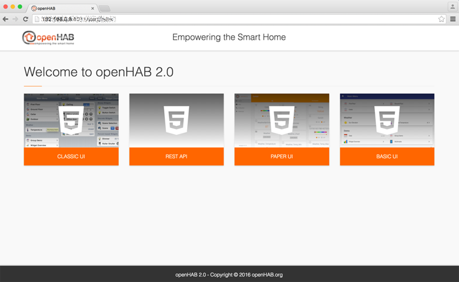



# openHAB 2 on Linux

<!-- TODO th
  * de/reinstallation
  * manual non-root
-->

The following instructions will guide you through the process of setting up openHAB 2 and recommended packages on a Linux system, with the focus on Debian/Ubuntu derivatives.
openHAB 2 can be set up and executed on other Linux distributions, the steps may slightly differ.

All instructions can be executed in a terminal or remotely via SSH connection.

This page is structured as follows:

{::options toc_levels="2..4"/}

* TOC
{:toc}

If you are unfamiliar with Linux, SSH and the Linux console or if you want to improve your skills, read up on these important topics.
A lot of helpful articles can be found on the internet, for example:

* "Learn the ways of Linux-fu, for free" interactively with exercises at [linuxjourney.com](https://linuxjourney.com).

Linux file permissions is one of the biggest sources of issues, Linux novices run into.
If you find yourself in a situation, where you have **no write access** to the openHAB configuration or system files, wrong permissions and/or the incorrect use of `sudo` are often the cause.
Train your understanding of Linux permissions at [linuxjourney.com/lesson/file-permissions](https://linuxjourney.com/lesson/file-permissions).

## Installation
As a first step, please verify, that your system meets the [prerequisites](index.html#prerequisites).
If you need to install Oracle Java 8, execute:

```shell
sudo apt-get update && sudo apt-get install oracle-java8-jdk
```

openHAB 2 can be installed though a package repository or manually from file.
The installation through a provided **package repository** (using `apt-get`) is **recommended** for end users.
The manual installation through a platform independent archive file is suited for users who know what they are doing and systems with a non-Debian distribution, not using the apt/deb package system.

### Package Repository Installation

Installation through a package repository is the recommended choice on Debian/Ubuntu derivatives.
Alternatively resort to the [manual installation approach](linux.html#manual-installation).

Choose between the latest Beta release or a Snapshot with all incoming contributions, rebuild on [every change](https://oss.jfrog.org/webapp/#/builds/openHAB-Distribution).
As openHAB 2 is still in an evolving state, the snapshot may be the **preferred choice**.

The repository URLs will be stored in the file `/etc/apt/sources.list.d/openhab.list`.
Be careful to not have conflicting repositories in your sources list.

Decide between two options:

* **Beta Release**

  Add the **openHAB 2 Beta repository** to your systems apt sources list (will overwrite your existing `openhab.list`):

  ```shell
  echo 'deb http://dl.bintray.com/openhab/apt-repo2 testing main' | sudo tee /etc/apt/sources.list.d/openhab.list
  ```

  Additionally, you need to add the openHAB 2 Bintray repositories key to your package manager by using either `wget` or `curl`:

  ```shell
  wget -qO - 'https://bintray.com/user/downloadSubjectPublicKey?username=openhab' | sudo apt-key add -
  # or
  curl 'https://bintray.com/user/downloadSubjectPublicKey?username=openhab' | sudo apt-key add -
  ```

* **Snapshot Release**

  Add the **openHAB 2 Snapshot repositories** to your systems apt sources list (will overwrite your existing `openhab.list`):

  ```shell
  echo 'deb https://openhab.ci.cloudbees.com/job/openHAB-Distribution/ws/distributions/openhab-offline/target/apt-repo/ /' | sudo tee /etc/apt/sources.list.d/openhab.list
  echo 'deb https://openhab.ci.cloudbees.com/job/openHAB-Distribution/ws/distributions/openhab-online/target/apt-repo/ /' | sudo tee --append /etc/apt/sources.list.d/openhab.list
  ```

  Note: CloudBees provides the openHAB 2 repositories through HTTPS.
  If your system fails at the next step, install the missing dependency: `sudo apt-get install apt-transport-https`


Scan the newly added repository and resynchronize the package index:

```shell
sudo apt-get update
```

Finally install openHAB 2 as either offline or online distribution.
The **offline distribution** is full blown and comes with all add-ons, the **online distribution** will install additional add-ons on request from the internet.

```shell
sudo apt-get install openhab2-offline
# or
sudo apt-get install openhab2-online
```

If everything went well, start openHAB and register it to be automatically executed at system startup:

* Linux init systems based on **sysVinit** (e.g. Debian 7 / Ubuntu 14.x and earlier):

  ```shell
  sudo /etc/init.d/openhab2 start
  sudo /etc/init.d/openhab2 status

  sudo update-rc.d openhab2 defaults
  ```

* Linux init systems based on **systemd** (e.g. Debian 8 / Ubuntu 15.x and newer):

  ```shell
  sudo systemctl start openhab2.service
  sudo systemctl status openhab2.service

  sudo systemctl daemon-reload
  sudo systemctl enable openhab2.service
  ```

The first start may take **up to 15 minutes**, this is a good time to reward yourself with hot coffee or a freshly brewed tea!

You should be able to reach the openHAB 2 portal at [http://openhab-device:8080](http://192.168.0.3:8080) at this point.



#### Upgrade

To stay up to date with new releases, you should do regular upgrades.
This is especially important if you are working with the latest snapshot as changes and fixes are incorporated [constantly](https://oss.jfrog.org/webapp/#/builds/openHAB-Distribution).

Your personal configuration will be retained on upgrades.
We still recommend a backup before each upgrade.

Upgrading is as easy as:

```shell
sudo apt-get update
sudo apt-get upgrade
```

Execute this additional command if you are working with the latest snapshot from CloudBees (every few weeks should suffice):

```shell
sudo apt-get --reinstall install openhab2-offline
# respectively
sudo apt-get --reinstall install openhab2-online
```

Reason: Snapshot builds are not provided as distinguishable versioned releases.
As such, apt does not detect the new snapshot as a possible upgrade.
To verify a new version is available and installed, check the [build history](https://oss.jfrog.org/webapp/#/builds/openHAB-Distribution) and the build version in the Karaf console before and after upgrade.

#### Backup and Restore

To make a backup of your openHAB 2 system, you need to retain your configuration and userdata files.

```shell
# stop openhab instance (here: systemd service)
sudo systemctl stop openhab2.service

# backup current installation with settings
TIMESTAMP=`date +%Y%m%d_%H%M%S`;
mkdir  ~/openhab2-backup-$TIMESTAMP
cp -arv /etc/openhab2 ~/openhab2-backup-$TIMESTAMP/conf
cp -arv /var/lib/openhab2 ~/openhab2-backup-$TIMESTAMP/userdata

# restart openhab instance
sudo systemctl start openhab2.service
```

If you later want to restore settings, just replace them.
Maybe you will need to delete the existing data first.

```shell
# stop openhab instance (here: systemd service)
sudo systemctl stop openhab2.service

# restore data
sudo cp -arv ~/openhab2-backup-20160131_235959/conf/* /etc/openhab2/
sudo cp -arv ~/openhab2-backup-20160131_235959/userdata/* /var/lib/openhab2/

# restart openhab instance
sudo systemctl start openhab2.service
```

### Manual Installation

The manual installation/setup is an alternative to the otherwise **recommended** [installation through package repository](#package-repository-installation).

First, create a Linux system user for openHAB.
This user will later serve to execute the openHAB runtime with restricted permissions and can be used by other services like Samba if desired.

```shell
sudo adduser --system --no-create-home --group --disabled-login openhab
```

We are going to download a platform independent archive file and extract it to the path `/opt/openhab2`.
Choose between the latest Beta release or a Snapshot with all incoming contributions, created daily.
As openHAB 2 is still in an evolving state, the snapshot may be the **preferred choice**.

* **Beta Release**

  Download and extract the desired **offline or online** beta version of openHAB 2 from [bintray.com/openhab](https://bintray.com/openhab/mvn/openhab-distro) to your host.
  We will use `openhab-offline-2.0.0.b3.zip` as an example:

  ```shell
  cd /tmp
  wget -O openhab-download.zip https://bintray.com/openhab/mvn/download_file?file_path=org%2Fopenhab%2Fdistro%2Fopenhab-offline%2F2.0.0.b3%2Fopenhab-offline-2.0.0.b3.zip
  sudo unzip openhab-download.zip -d /opt/openhab2
  rm openhab-download.zip
  ```

* **Snapshot Release**

  Download and extract the latest **offline or online** snapshot version of openHAB 2 as a **zip file** from [openhab.ci.cloudbees.com](https://openhab.ci.cloudbees.com/job/openHAB-Distribution) to your host.
  We will use `openhab-offline-2.0.0-SNAPSHOT.zip` as an example:

  ```shell
  cd /tmp
  wget https://openhab.ci.cloudbees.com/job/openHAB-Distribution/lastSuccessfulBuild/artifact/distributions/openhab-offline/target/openhab-offline-2.0.0-SNAPSHOT.zip
  sudo unzip openhab-offline-2.0.0-SNAPSHOT.zip -d /opt/openhab2
  rm openhab-offline-2.0.0-SNAPSHOT.zip
  ```

The extracted openHAB files should belong to the earlier created openhab user. Execute:

```shell
sudo chown -hR openhab:openhab /opt/openhab2
```

Everything is ready for a first test run.
Execute openHAB and you should be able to reach the openHAB 2 Portal at [http://openhab-device:8080](http://192.168.0.3:8080) after a few minutes:

<!-- Note to author: Yes Yes, this will be changed ;) -->

```shell
sudo /opt/openhab2/start.sh
```

You will see the openHAB Karaf Console in your terminal and can directly interact with it.
An important downside is, that openHAB will be terminated, as soon as you close your terminal.
To work around that, a quick solution is, to execute openHAB in a detached [screen](https://www.howtoforge.com/linux_screen) terminal:

```shell
screen -d -m /opt/openhab2/start.sh
```

A cleaner approach is to create a Linux service, described next.

#### Service

The following instructions are intended for a Linux init system based on **systemd** (e.g. Debian 8 / Ubuntu 15.x and newer).
This will allow you to register openHAB as a service, so that it runs at startup and automatically restarts if openHAB crashes.
The service will be running with the privileges of the user "openhab" and expects the openHAB files under `/opt/openhab2`.

Create the file `/lib/systemd/system/openhab2.service` with the following content:

```ini
[Unit]
Description=The openHAB 2 Home Automation Bus Solution
Documentation=http://docs.openhab.org
Wants=network-online.target
After=network-online.target

[Service]
Type=simple
User=openhab
Group=openhab
GuessMainPID=yes
WorkingDirectory=/opt/openhab2
#EnvironmentFile=/etc/default/openhab2
ExecStart=/opt/openhab2/start.sh
ExecStop=kill -SIGINT $MAINPID
Restart=on-failure

[Install]
WantedBy=multi-user.target
```

Next, start the service and retrieve status information:

```shell
sudo systemctl start openhab2.service
sudo systemctl status openhab2.service
```

The output of `status` after a successful execution should be similar to:

```text
 openhab2.service - The openHAB 2 Home Automation Bus Solution
   Loaded: loaded (/lib/systemd/system/openhab2.service; enabled)
   Active: active (running) since Thu 2016-08-14 01:16:00 GMT; 18h ago
     Docs: http://docs.openhab.org
```

If everything went fine, enable the service to be executed on system startup:

```shell
# initialize the new service (execute only once)
sudo systemctl daemon-reload
sudo systemctl enable openhab2.service
```

#### Upgrade, Backup and Restore

To stay up to date with new releases, you should do regular upgrades of your manual installation.
This is especially important if you are working with the latest snapshot as changes and fixes are incorporated [constantly](https://oss.jfrog.org/webapp/#/builds/openHAB-Distribution).

Your personal configuration will be retained on upgrades.
We still recommend a backup before each upgrade.

To upgrade your manual installation, you simply need to replace the openHAB runtime files.
Make sure to first **stop your openHAB instance**.

To make a backup of your openHAB 2 system, you need to retain your configuration and userdata files.

The following shell commands will create a backup, install the newest openHAB 2 version and restore settings:

```shell
# stop openhab instance (here: systemd service)
sudo systemctl stop openhab2.service

# backup current installation with settings
TIMESTAMP=`date +%Y%m%d_%H%M%S`;
sudo mv /opt/openhab2 /opt/openhab2-backup-$TIMESTAMP

# download new version (please replace URL)
cd /tmp
wget https://openhab.ci.cloudbees.com/job/openHAB-Distribution/lastSuccessfulBuild/artifact/distributions/openhab-offline/target/openhab-offline-2.0.0-SNAPSHOT.zip
sudo unzip openhab-offline-2.0.0-SNAPSHOT.zip -d /opt/openhab2
rm openhab-offline-2.0.0-SNAPSHOT.zip

# restore configuration and userdata
sudo cp -arv /opt/openhab2-backup-$TIMESTAMP/conf /opt/openhab2/
sudo cp -arv /opt/openhab2-backup-$TIMESTAMP/userdata /opt/openhab2/

# fix permissions
sudo chown -hR openhab:openhab /opt/openhab2

# restart openhab instance
sudo systemctl start openhab2.service
```

## File Locations

|                                  | Repository Installation  | Manual Installation (according to [guide](#manual-installation))  |
|:--------------------------------:|:-------------------------|:------------------------------------------------------------------|
| openHAB application              | `/usr/share/openhab2`    | `/opt/openhab2`                                                   |
| Site configuration               | `/etc/openhab2`          | `/opt/openhab2/conf`                                              |
| Log files                        | `/var/log/openhab2`      | `/opt/openhab2/userdata/logs`                                     |
| Userdata like rrd4j databases    | `/var/lib/openhab2`      | `/opt/openhab2/userdata`                                          |
| Service configuration            | `/etc/default/openhab2`  | (not preconfigured)                                               |

## Network Sharing

openHAB depends on configuration files and folders with custom content (details in [Configuration](http://docs.openhab.org/configuration/index.html) articles).
Because your openHAB installation most probably is stored on a remote device, being able to easily access and modify these files from your local PC or Mac is important, therefore setting up a Samba network share is highly recommended.

The [Eclipse SmartHome Designer](http://docs.openhab.org/installation/designer.html) software does also depend on a mounted share to access the openHAB configuration files.

We will now guide you through the Samba network shares setup process.
Start by installing Samba. Afterwards open it's configuration file in your favorite editor:

```shell
sudo apt-get install samba samba-common-bin
sudo vim /etc/samba/smb.conf
```

Change the workgroup name if needed, otherwise uncomment and enable WINS support:

```ini
wins support = yes
```

Next, add the desired share configurations to the end of the file:

<!-- Note to author: Do not name share "openhab". Depending on the host system, a share for the home of user "openhab" will be created.-->

<!-- TODO: Limit to configuration folder??? -->

* Package repository based installation:

  ```ini
  [openHAB-sys]
    comment=openHAB2 application
    path=/usr/share/openhab2
    browseable=Yes
    writeable=Yes
    only guest=no
    public=no
    create mask=0777
    directory mask=0777

  [openHAB-conf]
    comment=openHAB2 site configuration
    path=/etc/openhab2
    browseable=Yes
    writeable=Yes
    only guest=no
    public=no
    create mask=0777
    directory mask=0777
  ```

* Manual installation:

  ```ini
  [openHAB-files]
    comment=openHAB2
    path=/opt/openhab2
    browseable=Yes
    writeable=Yes
    only guest=no
    public=no
    create mask=0777
    directory mask=0777
  ```

Save and close the samba configuration file.


The shares are configured to be not open for guests nor to the public.
Let's activate the "openhab" user as a samba user and set his password (e.g. "habopen"):

```shell
sudo smbpasswd -a openhab
```

Be aware, that creating and later using a specific user will ensure, that [permissions](#permissions) are honored.
Make sure, the "openhab" user has ownership and/or write access to the openHAB configuration files.
This can be accomplished by executing:

```shell
sudo chown -hR openhab:openhab /etc/openhab2 /opt/openhab2/conf
```

Finally check the configuration file for correctness and restart Samba to load the new settings:

```shell
testparm

# Linux init systems based on sysVinit
sudo service smbd restart
# Linux init systems based on systemd
sudo systemctl restart smbd.service
```

### Mounting Locally

After setting up and restarting Samba, check your connection to the shared folder and create a permanent mount.
Check the network devices manager of your local operating system to find and access your openHAB host and share.
These might however not be auto-discovered. You can also manually connect:

* **On Mac OS X:** Open Finder → Go → Connect to Server: `smb://openhab@openhab-device.local`
* **On Windows:** Open Windows Explorer → Address bar: `\\openhab-device.local` → Right click a share and assign a drive letter

Be sure to use the actual host name instead of `openhab-device`.
When asked, authenticate with the username "openhab" and the chosen password.
If you are not able to connect, try with the IP of your device (e.g. `smb://openhab@192.168.0.2` or `\\192.168.0.2`).

If everything went well, you are set and ready to start [configuring](http://docs.openhab.org/configuration/index.html) your openHAB system.

## Viewing Log Messages

In order to get more insight on what your openHAB system is doing and to see occurring error messages, it is recommended to always have a look on the openHAB log files. These will tell you everything you might need to know. Execute the following command in one session or have both files separated in sessions side by side:

* Package repository based installation:

  ```shell
  tail -f /var/log/openhab2/openhab.log -f /var/log/openhab2/events.log
  ```

* Manual installation:

  ```shell
  tail -f /opt/openhab2/userdata/logs/openhab.log -f /opt/openhab2/userdata/logs/events.log
  ```

You could even set up an SSH configuration (in Putty or similar) to automatically connect and execute the commands every time you start working on your setup.

With openHAB 2 you can also [use the Karaf console](http://docs.openhab.org/administration/logging.html#karaf-console) to have a colored glance at the logging information.
