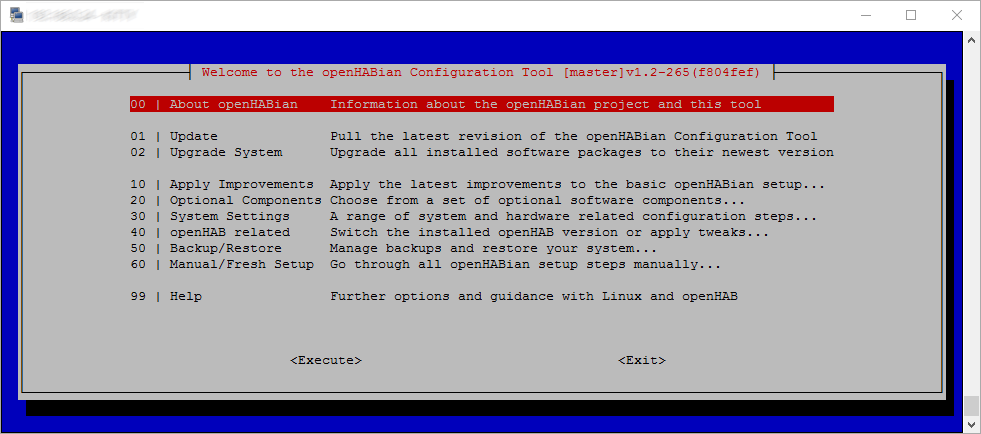
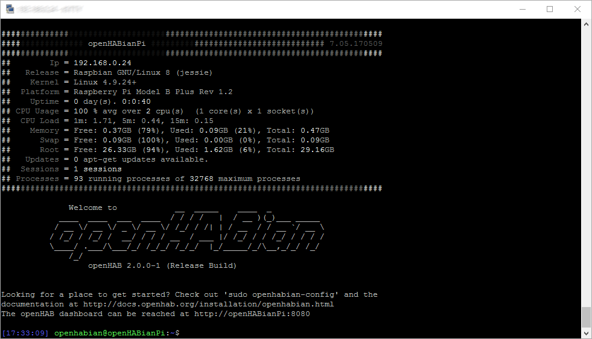
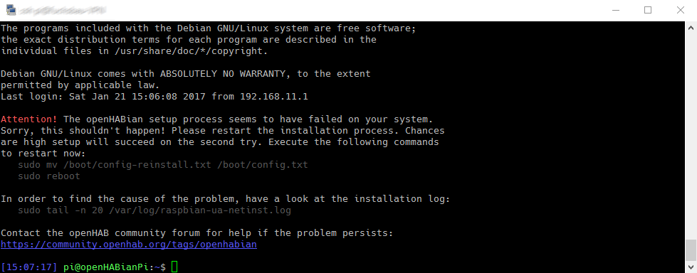



# openHABian - Hassle-free openHAB Setup

The Raspberry Pi and other small single-board computers are quite famous platforms for openHAB.
However, setting up a fully working Linux system with all recommended packages and openHAB recommendations is a **boring task** taking quite some time and **Linux newcomers** shouldn't worry about these technical details.

<p style="text-align: center; font-size: 1.2em; font-style: italic;"><q>A home automation enthusiast doesn't have to be a Linux enthusiast!</q></p>

openHABian aims to provide a **self-configuring** Linux system setup specific to the needs of every openHAB user.
The project provides two things:

* A set of scripts to set up openHAB on any Debian/Ubuntu based system
* Complete **SD-card images pre-configured with openHAB** and many other openHAB- and Hardware-specific preparations, namely for the Raspberry Pi.

#### Table of Content

{::options toc_levels="2..3"/}

* TOC
{:toc}

## Features

The following features are provided by openHABian:

* openHAB 2 in the latest recommended version (2.0.0 stable)
* Oracle Java 8 ([*build 1.8.0_101* or newer](https://launchpad.net/~webupd8team/+archive/ubuntu/java?field.series_filter=xenial))
* Useful Linux packages pre-installed, including `vim, mc, screen, htop, ...`
* Samba file sharing with [ready to use shares](http://docs.openhab.org/installation/linux.html#mounting-locally)
* Customized Bash shell experience
* Customized vim settings, including [openHAB syntax highlighting](https://github.com/cyberkov/openhab-vim)
* Customized nano settings, including [openHAB syntax highlighting](https://github.com/airix1/openhabnano)
* Version control for `/etc` by the help of [etckeeper](http://etckeeper.branchable.com) (git)
* Login information screen, powered by [FireMotD](https://github.com/willemdh/FireMotD)
* openHABian configuration tool including an updater
* [Raspberry Pi specific](rasppi.html): Extend to the whole SD card, 16MB GPU memory split

openHABian provides the configuration tool `openhabian-config` with the following optional settings and components:



* Switch over openHAB to the *testing* or *unstable* [build branches](https://bintray.com/openhab/apt-repo2/openhab2)
* Install and Setup an [Nginx reverse proxy](security.html#nginx-reverse-proxy) with password authentication and/or HTTPS access (incl. [Let's Encrypt](https://letsencrypt.org) certificate)
* Open the [Karaf remote console]({{base}}/administration/console.html) to all interfaces
* [KNXd](http://michlstechblog.info/blog/raspberry-pi-eibknx-ip-gateway-and-router-with-knxd) - KNX daemon
* [Homegear](https://www.homegear.eu/index.php/Main_Page) - Homemeatic control unit emulation
* [Mosquitto](http://mosquitto.org) - Open Source MQTT v3.1/v3.1.1 Broker
* [OWServer](http://owfs.org/index.php?page=owserver_protocol) - 1wire control system
* [InfluxDB+Grafana](https://community.openhab.org/t/influxdb-grafana-persistence-and-graphing/13761/1) - persistence and graphing
* Raspberry Pi specific:
  * Prepare the serial port for the use with Razberry, SCC, Enocean, ...
  * Set up Wifi connection (RPi3 only)
  * Move the system partition to an external USB stick or drive

## Quick Start

Here you'll find supported and tested installation platforms and instructions.

### Raspberry Pi

**Flash, plug, wait, enjoy:** The provided *image* of only 64MB contains a minimal boot system.
This system will install *Raspbian* followed by openHAB and the mentioned settings and tools.
All packages will be downloaded in their newest version and configured to work without further modifications.

Learn more about the Raspberry Pi as your platform for openHAB and about the requirements over in our [Raspberry Pi article](rasppi.html).

**Setup:**

* [Download the latest SD card image here](https://github.com/ThomDietrich/openhabian/releases)
* Write the image to your SD card ([instructions](https://www.raspberrypi.org/documentation/installation/installing-images/README.md))
* Connect Ethernet, SD card and power to your Raspberry Pi
* Wait up to **45 minutes** (setup depends on your downlink as almost everything is downloaded live)
* Enjoy! 🎉

* The device will be available under it's IP or via the local DNS name `openhabianpi`
* [Connect to the openHAB 2 portal](http://docs.openhab.org/configuration/packages.html) (available after a few more minutes): [http://openhabianpi:8080](http://openhabianpi:8080)
* [Connect to the Samba network shares](http://docs.openhab.org/installation/linux.html#mounting-locally) with `openhab:habopen`
* If you encounter a connection problem: [See here](#faq-successful)

You can stop reading now.
openHABian has installed and configured your openHAB system and you can start to use it right away.
If you want to get in touch with the system or install one of the previously mentioned optional components, you can come back here later.

Ready for more?
[Connect to your Raspberry Pi SSH console](https://www.raspberrypi.org/documentation/remote-access/ssh/windows.md)  using the username and password `pi:raspberry`.
You will see the following welcome screen:



➜ Continue at the ["First Steps"](#first-steps) chapter below!

### Pine64

***... Coming Soon! ...***

### Manual Setup

openHABian also supports general Debian/Ubuntu based systems on different platforms.

> **Attention:**
> openHABian usage on a custom existing system is supported but not yet widely tested.
> Please be cautious and have a close look at the console output for errors.
> Please report every error you see at the [openHABian Issue Tracker](https://github.com/openhab/openhabian/issues).

Starting with a fresh installation of your operating system, install git, then clone the openHABian poject and finally execute the openHABian configuration tool.

```shell
# install git
sudo apt-get update
sudo apt-get install git

# download and link
sudo git clone https://github.com/openhab/openhabian.git /opt/openhabian
ln -s /opt/openhabian/openhabian-setup.sh /usr/local/bin/openhabian-config

# execute
sudo openhabian-config
```

You'll see the openHABian configuration menu and can now run all desired actions, e.g. install the newest Oracle Java 8 revision or openHAB 2.

## First Steps

The following instructions are oriented at the Raspberry Pi openHABian setup but are transferable to all openHABian environments.

Once connected to the command line console of your system, please execute the openHABian configuration tool by typing the command `sudo openhabian-config`:


The configuration tool is the heart of openHABian.
It is not only a menu with a set of options, it's also used in a special unattended mode inside the ready to use images.

Execute the "Update" function before anything else. The menu and the menu options will evolve over time and you should ensure to be up to date.

All other menu entries should be self-explaining and a more details will be shown after selecting an option.

ℹ - The actions behind menu entry 1-5 are already taken care of on a Raspberry Pi openHABian image installation.

⌨ - A quick note on menu navgation.
Use the cursor keys to navigate, &lt;Enter&gt; to execute, &lt;Space&gt; to select and &lt;Tab&gt; to jump to the actions on the bottom of the screen.

### Linux Hints

If you are unfamiliar with Linux, SSH and the Linux console or if you want to improve your skills, read up on these important topics.
A lot of helpful articles can be found on the internet, for example:

* "Learn the ways of Linux-fu, for free" interactively with exercises at [linuxjourney.com](https://linuxjourney.com).
* The official Raspberry Pi help articles over at [raspberrypi.org](https://www.raspberrypi.org/help)
* "Now what?", Tutorial on the Command line console at [LinuxCommand.org](http://linuxcommand.org/index.php)

*The good news:* openHABian helps you to stay away from Linux - *The bad news:* Not for long.

Regardless of if you want to copy some files or are on the search for a solution to a problem, sooner or later you'll have to know some Linux.
Take a few minutes to study the above Tutorials and get to know the most basic commands and tools to be able to navigate on your Linux system, edit configurations, check the system state or look at log files.
It's really not complicated and something that doesn't hurt on noes resumé.

{: #passwords}
### Changing your Passwords

The openHABian system is preconfigured with a few passwords you should change to ensure the security of your system.
This is especially important of your system is accessible from outside your private subnet.

Here are the passwords in question, their default value and the way to change them:

* User password needed for SSH or sudo (e.g. "pi:raspberry") : `passwd`
* Samba share password (e.g. "openhab:habopen"): `sudo smbpasswd openhab`
* Karaf remote console (e.g. "openhab:habopen"): Please see [here](http://docs.openhab.org/administration/console.html#bind-console-to-all-interfaces)
* Nginx reverse proxy login (no default): Please see [here](http://docs.openhab.org/installation/security.html#adding-or-removing-users)

## FAQ and Troubleshooting

For openHABian related questions and further details, please have a look at the main discussion thread in the Community Forum:

* [https://community.openhab.org/t/13379](https://community.openhab.org/t/13379)

If you want to get involved, you found a bug, or just want to see what's planned for the future, come visit our Issue Tracker:

* [https://github.com/openhab/openhabian/issues](https://github.com/openhab/openhabian/issues)

{: #faq-image-size}
#### The RPi image is only "64 MB small", is that a typing error?

No. The Raspberry Pi image is based on [raspbian-ua-netinst](https://github.com/debian-pi/raspbian-ua-netinst), which produces a minimal boot system image of that size.

{: #faq-successful}
#### Did my Installation succeed?

During and after the first boot of your Raspberry Pi, the green on-board LED will indicate the setup progress (no display needed):

* `☼.☼....☼.☼....` - Steady "heartbeat": setup **successful**
* `.☼.........☼☼☼` - Irregular blinking: setup in progress...
* `☼.☼.☼.☼.☼.☼.☼.` - Fast blinking: error while setup, check `/var/log/raspbian-ua-netinst.log`

Besides that you should always be able to connect to the SSH console of your device.
If the installation was successful, you will see the normal login screen.
If the installation was *not* successful you will see a warning and further instructions:



{: #faq-other-platforms}
#### Can I use openHABian on ...?

openHABian is restricted to Debian/Ubuntu based systems.
If your Operating System is one of these or if your Hardware supports one, your chances are high openHABian can be used.
Differences between systems can still be a problem, so please check the [Community Forum thread](https://community.openhab.org/t/13379) or the [Issue Tracker](https://github.com/openhab/openhabian/issues) for more information.
Do not hesitate to ask!
