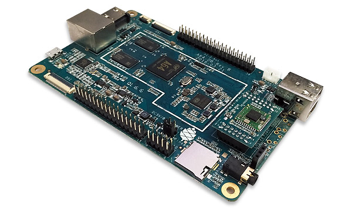



# Pine A64

The [PINE A64](https://www.pine64.org/?page_id=1194) is a young but promising single-board computers (SBC) on the market.
The project started off as a [Kickstarter campaign](https://www.kickstarter.com/projects/pine64/pine-a64-first-15-64-bit-single-board-super-comput) back in December 2015.
The Pine A64 is powered by Quad-Core ARM Cortex A53 64-Bit Processor.

Please visit the [official homepage](https://www.pine64.org) and [wiki](http://wiki.pine64.org/index.php/Main_Page) for more information and details.

## Recommended Setup

We are proud to provide a system image for the Pine A64, including the latest version of openHAB 2 and many recommended settings and useful software additions.
The image is based on the official [Ubuntu Base Image by longsleep](http://wiki.pine64.org/index.php/Pine_A64_Software_Release) and developed and maintained by the openHABian project.

Check out more details about [openHABian, the hassle-free openHAB setup](openhabian.html).
