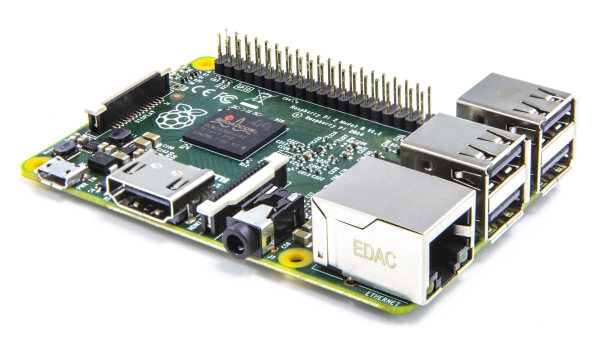



# Raspberry Pi

Because of it's **low price**, it's **small form factor** and the **low energy consumption**, the [Raspberry Pi](https://www.raspberrypi.org) is a quite popular platform for openHAB.
It is favored amongst existing users and a recommended choice for newcomers.



If you want to learn more about the possibilities of the Raspberry Pi and Linux in general, many tutorials can be found on the internet.
These including the official [raspberrypi.org help articles](https://www.raspberrypi.org/help) or the in-detail articles at [eLinux.org](http://elinux.org/RPi_Tutorials).

Recommendations for a ["headless"](https://en.wikipedia.org/wiki/Headless_computer) hardware setup:

- [Raspberry Pi 2 or newer](https://en.wikipedia.org/wiki/Raspberry_Pi#Specifications), compare your existing device [here](https://en.wikipedia.org/wiki/Raspberry_Pi#Connectors) if you are unsure.
- SD card (16GB or more to support [wear-leveling](https://en.wikipedia.org/wiki/Wear_leveling))
- Steady power supply
- Ethernet connection
- *No connected display or keyboard needed*

## Recommended Setup

We are proud to provide a **preconfigured image** for the Raspberry Pi, with the latest build of openHAB 2 and many useful software components (like Samba, Grafana or Mosquitto) as optional setup steps.
The image provided by the **openHABian** projects is based on Raspbian and under constant improvement.

Check out more details about [openHABian, the hassle-free openHAB setup](openhabian.html).

## Manual Setup

If you want or need to set up openHAB on a Raspberry Pi by yourself, please follow these recommendations.
For the beginning, we recommend to [download](https://www.raspberrypi.org/downloads/raspbian) and [install](https://www.raspberrypi.org/documentation/installation/installing-images/README.md) the latest Raspbian SD card image.
You may choose the "Lite" version.

**Attention:**
As of the November 2016 release, Raspbian has the SSH server disabled by default.
You will have to enable it manually.
For headless setup, SSH can be enabled by placing a file named "ssh", without any extension, onto the boot partition of the SD card.

**Connecting:**
Get your SD card and network cable plugged in and power up.
Booting up takes up to 10 minutes.
To connect with an SSH client (like [Putty](https://www.raspberrypi.org/documentation/remote-access/ssh/windows.md)), you need to know the IP address or hostname of your device.
A standard Raspbian setup should be reachable either by the hostname "raspberrypi" or though the local domain name "raspberrypi.local".
If you are not able to connect, check your routers web frontend for newly connected devices.

**First Steps:**
Connected via SSH, execute the Raspbian configuration menu by running `sudo raspi-config`.
Go through the following steps:

- Expand the file system
- Change your password
- (Change the host name if you wish, e.g. "openhabpi")
- From the advanced menu, change the memory split for the GPU to "16"
- Restart

As a good practice, run a full upgrade and install packages you like or need (a set of helpful packages is given as an example):

```shell
sudo apt-get update
sudo apt-get upgrade

sudo apt-get install screen mc vim git htop
```

**Note on Java:**
Raspbian in the latest full version already includes Oracle Java 8.
However, at the time of this writing, the installed revision is lower than the [recommended](index.html#prerequisites).
Raspbian Lite comes without Java to begin with.

Please refer to the Linux article for instructions on [how to install the latest Java 8 revision](linux.html).

**Installation:**
Finally install openHAB on your Raspberry Pi, just as it is described in the [openHAB 2 on Linux](linux.html) article:

- [Package Repository based Installation on Linux](linux.html#package-repository-installation)
