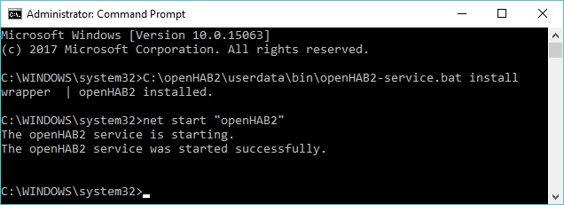
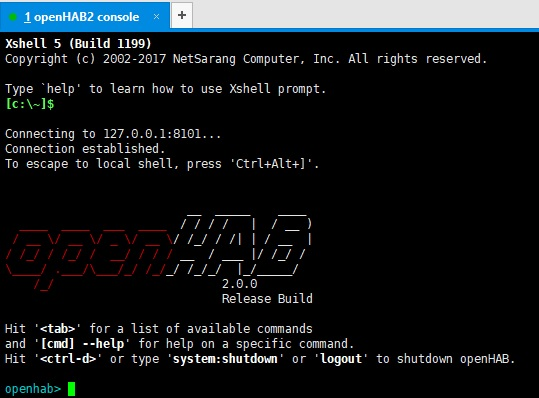



# openHAB 2 on Windows

The following instructions will guide you through the process of setting up openHAB 2.

## Prerequisites

First, be sure to check that your system has the necessary [prerequisites]({{base}}/installation/index.html#prerequisites).

Add the `JAVA_HOME` System Environment Variable in Windows. Navigate to:

* Control Panel ➡️ System and Security ➡️ System ➡️ Advanced System Settings ➡️ Environment Variables ➡️ System Variables

Create a New System Variable based on your Java installation directory:


The directory that openHAB is installed to must **contain no spaces**.
On this page, we will be using `C:\openHAB2` as an example.

## Installation

The openHAB runtime is distributed using a platform-independent zip file. 
To install it, follow these simple steps:

1. Choose between the Stable Version [  ](https://bintray.com/openhab/mvn/download_file?file_path=org%2Fopenhab%2Fdistro%2Fopenhab%2F2.0.0%2Fopenhab-2.0.0.zip) or the latest Snapshot Version [  ](https://openhab.ci.cloudbees.com/job/openHAB-Distribution/lastSuccessfulBuild/artifact/distributions/openhab/target/openhab-2.1.0-SNAPSHOT.zip) of openHAB2.

2. Unzip the file in your chosen directory (e.g. `C:\openHAB2`)


3. Start the server: Launch the runtime by executing the script `C:\openHAB2\start.bat` and wait a while for it to start and complete.


4. Point your browser to `http://localhost:8080`. You should be looking at the openHAB [package selection page]({{base}}/configuration/packages.html). 
   When you've selected an appropriate package, this page will contain the [UI]({{base}}/addons/uis.html) selection screen.

### File Locations

Assuming a successful install, you will now have various folders inside `C:\openHAB2`:

|                                  | Windows Installation         |
|:--------------------------------:|:-----------------------------|
| openHAB application              | `C:\openHAB2\runtime`        |
| Additional add-on files          | `C:\openHAB2\addons`         |
| Site configuration               | `C:\openHAB2\conf`           |
| Log files                        | `C:\openHAB2\userdata\logs`  |
| Userdata like rrd4j databases    | `C:\openHAB2\userdata`       |
| Service configuration            | `C:\openHAB2\userdata\etc`   |


## Backup

Make sure that you make regular backups of the **conf** and **userdata** folders, you can zip and unzip these folders too and from openHAB installations (even across most versions). 
When you have a setup that you are happy with, it would be a good idea to make a backup of the whole `C:\openHAB2` folder. Which can be used any time after a failure.

## Updating the openHAB Runtime

There is currently no automatic update script for Windows. To update manually, download a later version of the openHAB distribution zip file and follow these steps:

1. Stop the openHAB process if it is currently running.
2. Backup openHAB as described above.
3. Delete the following files from your existing install:
 - `userdata\etc\all.policy`
 - `userdata\etc\branding.properties`
 - `userdata\etc\branding-ssh.properties`
 - `userdata\etc\config.properties`
 - `userdata\etc\custom.properties`
 - `userdata\etc\distribution.info`
 - `userdata\etc\jre.properties`
 - `userdata\etc\profile.cfg`
 - `userdata\etc\startup.properties`
 - Any file in `userdata\etc` that starts with `org.apache.karaf`
 - The `userdata\cache` folder
 - The `userdata\tmp` folder
4. Copy and paste the new `userdata` folder over your existing install, when prompted **do not overwrite existing files**.
5. Copy and paste the new `runtime` folder over your existing install, when prompted **overwrite all existing files**

## Starting openHAB as a service

To install the openHAB process as a service in Windows in order to be able to launch it automatically and run it in the background, follow these steps:

1. Complete the [prerequisites](#prerequisites) and regular [installation](#installation) steps, including the package selection
2. Issue the following 2 commands in your openHAB console:
```
feature:install service-wrapper
wrapper:install --name "openHAB2" --display "openHAB2" --description "openHAB 2 Service"
```


3. Shutdown the currently running OH2 instance and modify the file `C:\openHAB2\userdata\etc\openHAB2-wrapper.conf` and using a text editor, replace all existing content with:
```
#**************************************************************************
# Change only this first setting to match your OH2 installation directory !
#**************************************************************************
set.default.OPENHAB_HOME=C:\openHAB2

# Wrapper Properties
set.default.OPENHAB_CONF=%OPENHAB_HOME%\conf
set.default.OPENHAB_RUNTIME=%OPENHAB_HOME%\runtime
set.default.OPENHAB_USERDATA=%OPENHAB_HOME%\userdata
set.default.OPENHAB_LOGDIR=%OPENHAB_HOME%\logs
set.default.KARAF_HOME=%OPENHAB_RUNTIME%
set.default.KARAF_BASE=%OPENHAB_USERDATA%
set.default.KARAF_DATA=%OPENHAB_USERDATA%
set.default.KARAF_ETC=%OPENHAB_USERDATA%\etc
set.default.PATH=%PATH%;%KARAF_BASE%\lib;%KARAF_HOME%\lib

# Java Application
wrapper.working.dir=%KARAF_BASE%
wrapper.java.command=%JAVA_HOME%/bin/java
wrapper.java.mainclass=org.apache.karaf.wrapper.internal.service.Main
wrapper.java.classpath.1=%KARAF_HOME%/lib/boot/*.jar
wrapper.java.classpath.2=%KARAF_DATA%/lib/wrapper/*.jar
wrapper.java.library.path.1=%KARAF_DATA%/lib/wrapper/

# Java Parameters
wrapper.java.additional.1=-Dkaraf.home="%KARAF_HOME%"
wrapper.java.additional.2=-Dkaraf.base="%KARAF_BASE%"
wrapper.java.additional.3=-Dkaraf.data="%KARAF_DATA%"
wrapper.java.additional.4=-Dkaraf.etc="%KARAF_ETC%"
wrapper.java.additional.5=-Dcom.sun.management.jmxremote
wrapper.java.additional.6=-Dkaraf.startLocalConsole=false
wrapper.java.additional.7=-Dkaraf.startRemoteShell=true
wrapper.java.additional.8=-Djava.endorsed.dirs="%JAVA_HOME%/jre/lib/endorsed;%JAVA_HOME%/lib/endorsed;%KARAF_HOME%/lib/endorsed"
wrapper.java.additional.9=-Djava.ext.dirs="%JAVA_HOME%/jre/lib/ext;%JAVA_HOME%/lib/ext;%KARAF_HOME%/lib/ext"
wrapper.java.additional.10=-Dopenhab.home="%OPENHAB_HOME%"
wrapper.java.additional.11=-Dopenhab.conf="%OPENHAB_HOME%\conf"
wrapper.java.additional.12=-Dopenhab.runtime="%OPENHAB_HOME%\runtime"
wrapper.java.additional.13=-Dopenhab.userdata="%OPENHAB_HOME%\userdata"
wrapper.java.additional.14=-Dopenhab.logdir="%OPENHAB_HOME%\logs"
wrapper.java.additional.15=-Dfelix.cm.dir="%OPENHAB_HOME%\userdata\config"
wrapper.java.additional.16=-Dorg.osgi.service.http.port=8080
wrapper.java.additional.17=-Dorg.osgi.service.http.port.secure=8443
wrapper.java.maxmemory=512

# Wrapper Logging Properties
wrapper.console.format=PM
wrapper.console.loglevel=INFO
wrapper.logfile=%OPENHAB_HOME%\logs\wrapper.log
wrapper.logfile.format=LPTM
wrapper.logfile.loglevel=INFO
wrapper.logfile.maxsize=10m
wrapper.logfile.maxfiles=5
wrapper.syslog.loglevel=NONE

# Wrapper Windows Properties
wrapper.console.title=openHAB2
wrapper.ntservice.name=openHAB2
wrapper.ntservice.displayname=openHAB2
wrapper.ntservice.description=openHAB 2 Service
wrapper.ntservice.dependency.1=
wrapper.ntservice.starttype=AUTO_START
wrapper.ntservice.interactive=false
```

4. Open an elevated command prompt and type the following commands:
```
C:\openHAB2\userdata\bin\openHAB2-service.bat install
net start "openHAB2"
```



5. Your openHAB Windows service is now installed and running.  Validate proper operations by:

 - Browsing to `http://localhost:8080`
 - Verifying that the Windows Service is running and set to Automatic Startup type.  Use `services.msc` and find the `openHAB2` service.

 - Logging in with an ssh client to the console (see info below)

6. How to login to openHAB console when using a Windows service:
 - Install a SSH Client application e.g. [Putty](https://www.chiark.greenend.org.uk/~sgtatham/putty/latest.html), [KiTTY](http://kitty.9bis.net/), [Xshell 5](https://www.netsarang.com/products/xsh_overview.html) etc
 - Setup a session with the following parameters:
```
Host: 127.0.0.1
Port: 8101
Username: openhab
Password: habopen
```



