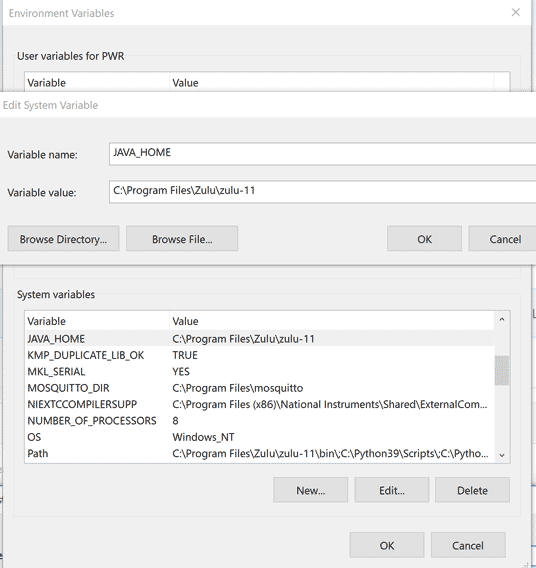

# openHAB on Windows

The following instructions will guide you through the process of setting up openHAB.

This page is structured as follows:

[[toc]]

## Preparation of the environment

### Before you start

Please be sure you have installed the required supporting applications as described in [Prerequisites]({{base}}/installation/index.html#prerequisites).

### Set the `JAVA_HOME` System Environment Variable in Windows

Note: If you have installed Java 17 (recommended for OH 4.x) or Java 21, you may skip this step because the JAVA_HOME environment variable was created during installation.

- Navigate to: Control Panel ➡️ System and Security ➡️ System ➡️ Advanced System Settings ➡️ Environment Variables ➡️ System Variables
- Create a New System Variable named JAVA_HOME (or update the existing one) to match the installation directory of the Java Platform chosen and installed in the step [Prerequisites]({{base}}/installation/index.html#prerequisites).



### Choose a folder name for the openHAB installation

The name must **contain no spaces**. On this page, we will be using `C:\openHAB` as an example.

## Installation

### Install openHAB

The openHAB runtime is distributed using a platform-independent zip file.
To install it, follow these simple steps:

1. Download the latest Windows Stable or Snapshot ZIP archive file for manual installation from the [Download](https://www.openhab.org/download/) page.

1. Unzip the file in your chosen directory (e.g. `C:\openHAB`)

    

1. Start the server: Launch the runtime by executing the script `C:\openHAB\start.bat` and wait a while for it to start and complete.

    

1. Point your browser to `http://localhost:8080`.
    You should be looking at the openHAB page requesting you to set up an administrator username and password:


You are now able to work in the openHAB environment, when launched using  `C:\openHAB\start.bat`.
You can choose to add a link to it on your Desktop, Taskbar or start menu as you deem more convenient.
If you instead would like to have openHAB start automatically with Windows and run in the background, you can choose to install it as a service as described below.

### Set up openHAB to run as a Windows Service

By installing the openHAB process as a service in Windows, you can:

- Launch it automatically upon system startup
- Run it in the background

#### Windows Service Installation Steps

1. Complete the [prerequisites](#before-you-start) and regular [installation](#installation) steps.
1. Issue the following two commands in your openHAB console:

    ```shell
    feature:install service-wrapper
    wrapper:install --name "openHAB" --display "openHAB" --description "openHAB Service"
    ```

    

1. Shutdown the openHAB instance by typing `logout` in the currently running console.

1. Update the newly created `C:\openHAB\userdata\etc\openHAB-wrapper.conf` to include all necessary parameters:

    1. Copy all the config text from the below section and paste it in your `openHAB-wrapper.conf`, replacing all existing content.
    1. Adapt the first entry (`OPENHAB_HOME`) to match your openHAB installation directory.

    ```conf
    #*******************************************************
    # openHAB-wrapper.conf for Windows Service Installation
    #*******************************************************

    # openHAB installation dir (Adapt this first setting to your system)
    set.default.OPENHAB_HOME=C:\openHAB

    # Wrapper Properties
    set.default.OPENHAB_CONF=%OPENHAB_HOME%\conf
    set.default.OPENHAB_RUNTIME=%OPENHAB_HOME%\runtime
    set.default.OPENHAB_USERDATA=%OPENHAB_HOME%\userdata
    set.default.OPENHAB_LOGDIR=%OPENHAB_USERDATA%\logs
    set.default.KARAF_LOG=%OPENHAB_USERDATA%\logs
    set.default.KARAF_HOME=%OPENHAB_RUNTIME%
    set.default.KARAF_BASE=%OPENHAB_USERDATA%
    set.default.KARAF_DATA=%OPENHAB_USERDATA%
    set.default.KARAF_ETC=%OPENHAB_USERDATA%\etc
    set.default.PATH=%PATH%;%KARAF_BASE%\lib;%KARAF_HOME%\lib

    # Java Application
    wrapper.working.dir=%KARAF_BASE%
    wrapper.java.command=%JAVA_HOME%\bin\java
    wrapper.java.mainclass=org.apache.karaf.wrapper.internal.service.Main
    wrapper.java.classpath.1=%KARAF_HOME%\lib\boot\*.jar
    wrapper.java.classpath.2=%KARAF_DATA%\lib\wrapper\*.jar
    wrapper.java.classpath.3=%KARAF_HOME%\lib\jdk9plus\*.jar
    wrapper.java.classpath.4=%KARAF_HOME%\lib\endorsed\*.jar
    wrapper.java.library.path.1=%KARAF_DATA%\lib\wrapper\

    # Java Parameters
    wrapper.java.additional.1=-Dkaraf.home="%KARAF_HOME%"
    wrapper.java.additional.2=-Dkaraf.base="%KARAF_BASE%"
    wrapper.java.additional.3=-Dkaraf.data="%KARAF_DATA%"
    wrapper.java.additional.4=-Dkaraf.etc="%KARAF_ETC%"
    wrapper.java.additional.5=-Dcom.sun.management.jmxremote
    wrapper.java.additional.6=-Dkaraf.startLocalConsole=false
    wrapper.java.additional.7=-Dkaraf.startRemoteShell=true
    wrapper.java.additional.8=-Dopenhab.home="%OPENHAB_HOME%"
    wrapper.java.additional.9=-Dopenhab.conf="%OPENHAB_HOME%\conf"
    wrapper.java.additional.10=-Dopenhab.runtime="%OPENHAB_HOME%\runtime"
    wrapper.java.additional.11=-Dopenhab.userdata="%OPENHAB_HOME%\userdata"
    wrapper.java.additional.12=-Dopenhab.logdir="%OPENHAB_USERDATA%\logs"
    wrapper.java.additional.13=-Dfelix.cm.dir="%OPENHAB_HOME%\userdata\config"
    wrapper.java.additional.14=-Djdk.util.zip.disableZip64ExtraFieldValidation=true
    wrapper.java.additional.15=-Djetty.host=0.0.0.0
    wrapper.java.additional.16=-Djetty.http.compliance=RFC2616
    wrapper.java.additional.17=-Dorg.apache.cxf.osgi.http.transport.disable=true
    wrapper.java.additional.18=-Dorg.osgi.service.http.port=8080
    wrapper.java.additional.19=-Dorg.osgi.service.http.port.secure=8443
    wrapper.java.additional.20=-Djava.util.logging.config.file="%KARAF_ETC%\java.util.logging.properties"
    wrapper.java.additional.21=-Dkaraf.logs="%OPENHAB_LOGDIR%"
    wrapper.java.additional.22=-Djava.awt.headless=true
    wrapper.java.additional.23=-Dfile.encoding=UTF-8
    wrapper.java.maxmemory=512

    # Wrapper Logging Properties
    wrapper.console.format=PM
    wrapper.console.loglevel=INFO
    wrapper.logfile=%OPENHAB_USERDATA%\logs\wrapper.log
    wrapper.logfile.format=LPTM
    wrapper.logfile.loglevel=INFO
    wrapper.logfile.maxsize=10m
    wrapper.logfile.maxfiles=5
    wrapper.syslog.loglevel=NONE

    # Wrapper Windows Properties
    wrapper.console.title=openHAB
    wrapper.ntservice.name=openHAB
    wrapper.ntservice.displayname=openHAB
    wrapper.ntservice.description=openHAB Service
    wrapper.ntservice.dependency.1=
    wrapper.ntservice.starttype=AUTO_START
    wrapper.ntservice.interactive=false
    ```

1. Open an elevated command prompt and type the following commands:

    ```text
    C:\openHAB\userdata\bin\openHAB-service.bat install
    net start "openHAB"
    ```

    

    

1. Your openHAB Windows service is now installed and running.

    Validate proper operations by browsing to `http://localhost:8080` and verifying that the Windows Service is running and set to Automatic Startup type.
    Use `services.msc` and find the `openHAB` service.
    Or by logging in with an SSH client to the console (see info below)

    

### File Locations

Assuming a successful install, you will now have various folders inside `C:\openHAB`:

|                               | Windows Installation       |
| :---------------------------: | :------------------------- |
|      openHAB application      | `C:\openHAB\runtime`       |
|    Additional add-on files    | `C:\openHAB\addons`        |
|      Site configuration       | `C:\openHAB\conf`          |
|           Log files           | `C:\openHAB\userdata\logs` |
| Userdata like rrd4j databases | `C:\openHAB\userdata`      |
|     Service configuration     | `C:\openHAB\userdata\etc`  |

## What next?

You can:

- continue reading the [Additional steps]({{base}}/installation/index.md#additional-steps) section of the Installation overview
- read more about how to handle basic maintenance tasks, in the section below

## Maintenance

### Backup

Make sure that you make regular backups of the **conf** and **userdata** folders, you can zip and unzip these folders too and from openHAB installations (even across most versions).
When you have a setup that you are happy with, it would be a good idea to make a backup of the whole `C:\openHAB` folder.
Which can be used any time after a failure.

### Updating the openHAB Runtime

To start the update process, run PowerShell as an administrator and use the following commands, while replacing `x.x.x` with the wanted openHAB version.
Assuming you have openHAB installed in `C:\openHAB`:

```shell
cd C:\openHAB
. .\runtime\bin\update.ps1
Update-openHAB -OHVersion x.x.x
```

Now that openHAB has updated, you only need to run the above commands again for future versions.

NB: Due to an issue with long file paths sometimes the update script may fail after the 'Copying files...' stage.
This can be resolved by deleting the c:\openHAB\userdata\tmp folder.

### Deinstallation

- perform a backup as described above
- uninstall openHAB as a Windows service: run PowerShell as an administrator and use the following commands

```text
net stop openHAB
C:\openHAB\userdata\bin\openHAB-service.bat remove
```

- you can delete the whole contents of the C:\openHAB\ folder.

### Connecting to the openHAB console

You can connect to openHAB's console using the the `C:\openHAB\runtime\bin\client.bat` script on the local machine.
Alternatively, you can use a standard SSH client:

1. Install an SSH client application, e.g., [Putty](https://www.chiark.greenend.org.uk/~sgtatham/putty/latest.html), [KiTTY](http://kitty.9bis.net/) or [Xshell](https://www.netsarang.com/en/xshell/)

1. Setup a session with the following parameters:

    ```text
    Host: 127.0.0.1
    Port: 8101
    Username: openhab
    Password: habopen
    ```


