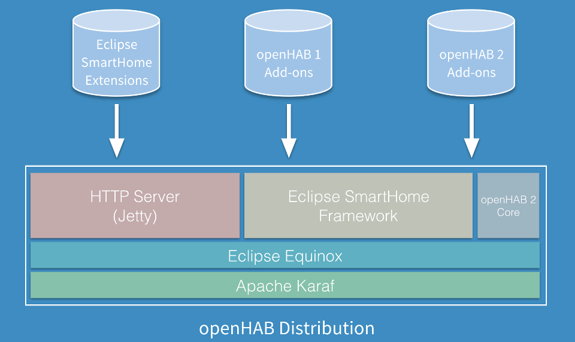



# About openHAB

openHAB **software** integrates different home automation systems, devices and technologies into a single solution.
It provides uniform user interfaces, and a common approach to automation rules across the entire system, regardless of the number of manufacturers and sub-systems involved.

## Getting Started

We highly recommend that you read the next chapter titled [Concepts]({{base}}/concepts/index.html).
It introduces a number of important ideas that will help you as you install and begin to configure openHAB for the first time.

openHAB runs on many popular platforms including Linux, Windows and Mac OSx.
You can find specific installation instructions for these and other platforms in the [Installation Overview]({{base}}/installation/index.html) article.
Many people find that the simplest way to experiment with openHAB is to get a [Raspberry Pi](https://raspberrypi.org) and install [openHABian]({{base}}/installation/openhabian.html); a "hastle-free openHAB setup".
While openHABian offers a streamlined and simplified way to get up and running quickly, it is a complete openHAB home automation system capable of automating your entire home.

Once you have openHAB up and running, the [Configuration]({{base}}/configuration/index.html) article contains everything you need to know to get your openHAB installation talking to different devices around your home.
You can use [Sitemaps]({{base}}/configuration/sitemaps.html) to control how the status of these devices are displayed on different openHAB User Interfaces, and you can begin to experiment with [Rules]({{base}}/configuration/rules-dsl.html) in order to get the most out of your installation.

Along the way, you may have some questions; the openHAB community is here to help.

## The openHAB Community

openHAB is not just software - it is also a **community** of users, contributors and maintainers, working together on an open-source, interoperable approach to home automation.
The center of this community is the [openHAB community forum](https://community.openhab.org).
You can search previous conversations and issues to see if your question has already been answered.
You can post your own question as well (although it is generally considered to be good etiquette to check fairly thoroughly before posting).
One of the great things about openHAB is that it has an active and responsive community of developers and maintainers who generally respond quite quickly to forum questions.
We believe you will find that our community works diligently to make newcomers feel at home.

## openHAB Structure

openHAB 2 is developed in [Java](https:/www.java.com/) and mainly based on the [Eclipse SmartHome](https://eclipse.org/smarthome/) framework.
It uses [Apache Karaf](http://karaf.apache.org/) together with [Eclipse Equinox](https://www.eclipse.org/equinox/) to create an Open Services Gateway initiative [(OSGi)](https://www.osgi.org/) runtime environment.
[Jetty](https://www.eclipse.org/jetty/) is used as an HTTP server.

openHAB is highly modular software that can be extended through "Add-ons".
Add-ons give openHAB a wide array of capabilities, from User Interfaces, to the ability to interact with a large and growing number of physical Things.
Add-ons may come from the openHAB 2 distribution, the Eclipse SmartHome project Extensions, or from the openHAB 1 distribution.

The overall architecture of openHAB is shown in the figure below:

If you are new to openHAB, we suggest you continue to the [Concepts]({{base}}/concepts/index.html) chapter where we introduce many fundamental ideas that are used throughout openHAB.
