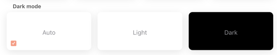
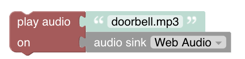

# Help & About Page

<!-- START MAINUI SIDEBAR DOC - DO NOT REMOVE -->
This page shows general information of your openHAB configuration and allows to configure some client related configuration, including:

- UI appearance (theming, color scheme etc.)
- **Web Audio Sink** support
- Setting up the **UI Command Item**

<!-- END MAINUI SIDEBAR DOC - DO NOT REMOVE -->

[[toc]]

## Top Section


- Version: shows the currently installed version of openHAB
- Links to the official openHAB Website, the openHAB Documentation and the Community Forum

## Technical Information

This section is collapsed by default and can be opened by clicking on it which then reveals the

- Configuration folder on the server
- User data folder on the server
- Logs folder on the server
- Operating System openHAB is running on
- Java Runtime openHAB is running on
- Number of processors and memory

Clicking on View Details opens up a popup window that contains very detailed information like

- Runtime information
- Locale (language)
- System information including memory information
- A list of all installed bindings
- Client information including device information, client settings (see also the below section), screen information, theme, user agent information.

The content can be easily copied with the copy button on the top to provide it as additional information when asking questions in the community.

## Appearance (for this device only)

This section allows to have different appearance settings _per_ device.

- **Theme**: Selects the theme for that device
  - Auto: tries to detect the client type
  - Android
  - iOS
  - Desktop


- **Dark mode** setting
  - Auto: uses the default mode
  - Light-Mode
  - Dark-Mode



- **Navigation bars style**: inverts the colors in the navigation bar


## Miscellaneous settings

- **Simple navigation bar on home page**: When switching it on, it means the navigation bar will look the same even whether you're at the top of the page or not - you won't have the alternate look with the date.
The first image depicts the normal setting (off), the second image shows it switched off

 

- **Standard home page background color**: This only relates to the light color scheme.
The background color will be the same as the regular pages you can show from e.g. the sidebar, which is a kind of gray instead of white.
The first image depicts the normal white setting (off), the second image shows it switched off with the gray setting.

 

- **Disable card expansion animations**: Disables the animations when expanding a widget card.
- **Disable page transition animations**: Disables the transitions when switching from one page to the other.

## Web Audio Sink

Main UI implements a web audio sink which allows the openHAB server to play audio through the web browser.

To enable web audio sink support for a client, turn on the **Enable Web Audio sink support** option on the **Help & About** page.
As it is a setting specific to your browser environment, web audio support has to be enabled for every client where it should be used.

Please note that due to limitations in Safari (and possibly Chrome as well), a user interaction is required after the first audio stream has been sent to actually play it.
This means, that after opening Main UI, the first audio that should be played on the web audio sink is only played after the user interacts with Main UI in any way (i.e. touching the screen is enough).
For subsequent audio playback the above is not required anymore and the audio is played immediately.

Please also note that you cannot address a particular web audio-enabled device.
When you play a sound on web audio, it will be played on all devices where web audio is enabled.

Web audio sinks can be used for example on wall-mounted tablets to make announcements using a [text-to-speech (TTS) engine]({{base}}/configuration/multimedia.html#text-to-speech) and play notification or alarm sounds.

For more information about audio sinks as well as audio and voice actions, please refer to the [multimedia configuration docs]({{base}}/configuration/multimedia.html), where you will also find examples including UI-based rules and Blockly.

### Testing Web Audio

To test if it works play some static content that comes with openHAB in the /sounds dir using an openHAB console command.
Use [openHABs console]({{base}}/administration/console.html#using-the-console) or just run the following from the Linux shell:

> openhab-cli console

and then enter the following command:

```text
openhab> audio play webaudio barking.mp3
```

If you have a dog that gets triggered by barking you may opt for playing `doorbell.mp3` instead.
If you play `doorbell.mp3` your dog will then probably play its own barking audio sound. 😉

Here are some useful actions available to rules in which you can specify webaudio as sink, see:

- [playSound]({{base}}/configuration/multimedia.html#actions-2)

```text
playSound("webaudio", "barking.mp3")
```

- [say]({{base}}/configuration/multimedia.html#actions-3)

```text
say("Hello world!", "voicerss:enUS", "webaudio")
```

You can also configure webaudio as sink when creating rules in the UI:


or using it in a Blockly rule:



## UI Command Item

Main UI can be controlled from the openHAB server by setting up a so-called UI command Item.

Similarly to web audio support, this is a setting specific to your local browser environment, so you have to define the UI command Item for each client, which also allows you to have different UI command Items for different clients.
To set up an Item as the UI command Item on your device, first create a particular Item of type `String`, then open the **Help & About** page from the menu and select an Item for the **Listen for UI command to** option.

The command Item has to be a `String` Item.
The UI is listening for commands to that Item, and if an Item command is a valid command string, the UI executes the given command.

Currently, the supported commands are:

- `navigate:$path`:
  Navigate to a given `$path`, e.g. `navigate:/locations` to navigate to the **Locations** tab of the home page or `navigate:/page/my_custom_page` to navigate to a page with the ID `my_custom_page`.
  For example, you can use this to open a video camera page of the door automatically when the doorbell is rung.
- `popup:$target`, `popover:$target` and `sheet:$target`:
  Open a `$target`, which can be a page (`$target` is `page:` + a page ID), a custom widget (`$target` is `widget:` + widget ID) or any [`oh-` component]({{base}}/ui/components/) (`$target` is the component name), in a popup, popover or sheet.

  For example, to open `oh-clock-card` inside a popup, send `popup:oh-clock-card` to the UI command Item.
- `notification:$text:$title:$subtitle:$titleRight:$closeTimeout`:
  Display a notification inside the UI:
  The `$text` parameter is mandatory, all other parameters are optional.
  `$closeTimeout` is in milliseconds and defaults to 5000, which means by default a notification will be closed after 5 seconds.
  To leave out a parameter, leave a colon space empty, e.g. `notification:$text:$title:::$closeTimeout`.

  For example, send `notification:This is the text.:This is the title.:This is the subtitle.:This is the right title.` to the UI command Item to display the following notification:
  <p align="center"></p>
- `close`:
  Close all popups, popovers and sheets.
- `back`:
  Navigate back.
- `reload`:
  Reload the current page.

## Reload

Main UI is using caching and service workers to locally store ressources to reduce loading times.
A consequence of this is, that updates might not always be properly recognized.

The reload buttons make Main UI to properly reload.
