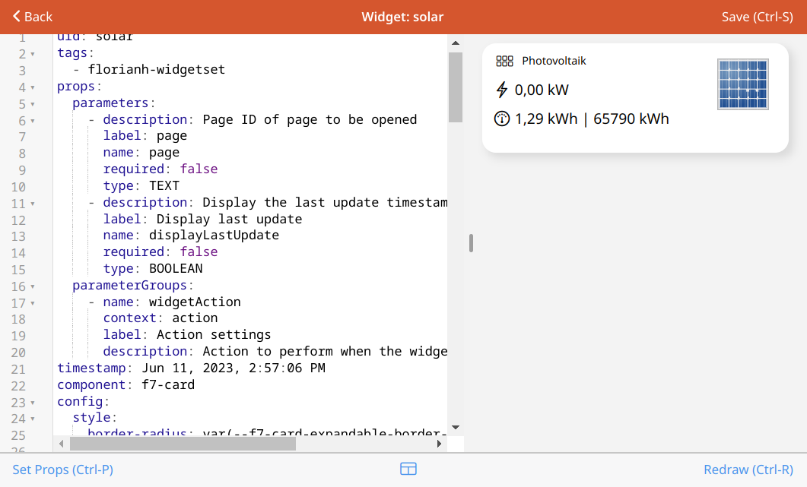

# Developer Tools - Widgets

<!-- START MAINUI SIDEBAR DOC - DO NOT REMOVE -->
**Widgets** are interactive elements that can be placed on pages.

Community made Widgets can also be added to your system from the **UI** tab of the add-on store.

Please read [Creating Personal Widgets]({{base}}/ui/personal-widgets.html) to learn about the structure, components and styling of personal widgets.

On this page you can manage all the custom widgets you have added to your system:

- **Add new Widgets** 
  Add Widgets using the <!--F7:blue plus_circle_fill --> plus button.
- **Edit Widgets** 
  Click on any widget in the list to open a code editor and graphical test space for the widget.
- **Delete Widgets** 
  Select multiple widgets using the top **Select** button and use the **Remove** button at the bottom
<!-- END MAINUI SIDEBAR DOC - DO NOT REMOVE -->
