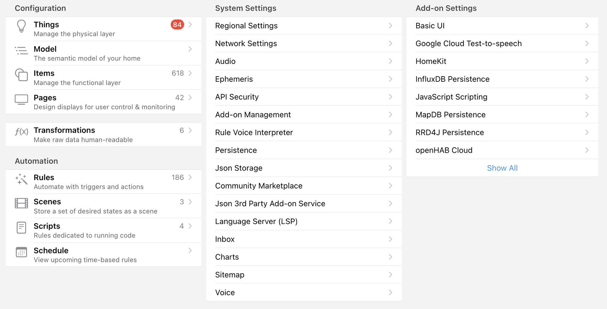
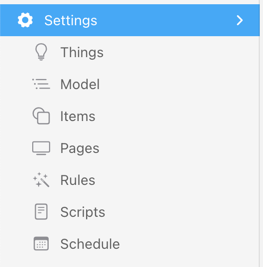
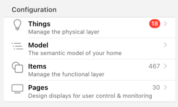
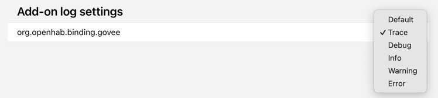

# Settings - Overview

<!-- START MAINUI SIDEBAR DOC - DO NOT REMOVE -->
The settings page provides access to all openHAB setup and server-related settings that are configurable from the UI.
Please note that this page is only accessible for users with the administrator role.

The settings page includes:

Some subpages, which are most often used, can also be accessed directly via the menu sidebar.

## Sections

### Configuration

- [**Things**](things.html) 
  Configure and add your IoT devices and services.
- [**Model**](model.html) 
  Configure the semantic, tree-like hierarchical model that structures Items and allows openHAB to automatically provide a no-configuration-required UI.
- [**Items**](items.html) 
  Basic units of openHAB control and information fully hardware-independent.
- [**Pages**](pages.html) 
  Manage custom user interfaces including Main UI pages and sitemaps.
- [**Transformations**](transformations.html) 
  Transformations convert a value or Item state into different value or state.
- [**Persistence**](persistence.html) 
  openHAB can store data over time; this is known as persistence.
  The data may be retrieved at a later time, for example to restore your system after startup, or to prepare graphs for display on a UI.

Next to the entity, the count of that entity is shown.
Please note that the Things count is not the number of configured Things, but the number of Things waiting in the [Inbox]({{base}}/tutorial/things_simple.html#accept-the-light-bulb-things).

### Automation

openHAB provides rules, scenes and scripts as well as a schedule overview to automate your home.
See [What's the Difference Between a Rule, Script, and Schedule?]({{base}}/tutorial/rules_introduction.html#what-s-the-difference-between-a-rule-script-and-schedule) to learn more about the different options.

- [**Rules**](rules.html) 
  Rules are essential for home automation:
  Each rule can be triggered, which invokes a script that performs any kinds of tasks, e.g. turn on lights by modifying your items, do mathematical calculations, start timers etc.
- [**Scenes**](scenes.html) 
  Special rules determined to command a some Items to a pre-defined state.
- [**Scripts**](scrips.html) 
  Special rules without triggers and with just one action determined to run code.
- [**Schedule**](schedule.html) 
  Provides an overview of rules with time-based triggers and the `Schedule` tag.

### System Settings

This section lists openHAB's system settings, which e.g. includes regional, language, unit system and network settings.

### Add-on Settings

This section lists the installed add-ons and provides direct access to the add-on settings as well as the add-on log level:

The standard log level is `INFO` but to track down an issue it might be necessary to increase the log-level upon request.
For more information see [Logging in openHAB]({{base}}/administration/logging.html).
<!-- END MAINUI SIDEBAR DOC - DO NOT REMOVE -->
