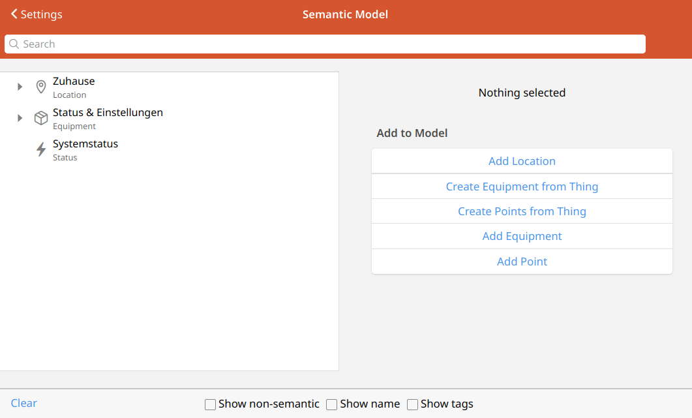

# Settings - Model

<!-- START MAINUI SIDEBAR DOC - DO NOT REMOVE -->
The **Semantic Model** is a way for you to group and categorize your openHAB Items to provide additional real-world relationships and information about them.
openHAB can use this information to automatically generate the location, equipment, and properties tabs of the home page.

Learn more about the semantic model in [the tutorial]({{base}}/tutorial/model.html).

Every semantic model object (location, equipment, or point) is just a regular openHAB Item with semantic tags and arranged in semantic groups.
It is important to note that not all of your Items need to be included in the semantic model.
For most systems it only makes sense to include these Items that users will interact with.

On this page you can manage your system's semantic model:

- **Add new Locations** 
  Add group Items with semantic group tags to represent physical locations in and around your home.
- **Add new Equipment** 
  Add group Items with semantic equipment tags to represent devices of interest to users in specific locations.
- **Add new Points** 
  Add Items with semantic class and property tags to represent the actual information and interactions that users will need.
- **Bulk creation of Points** 
  Create equipment directly from your Things with the desired Items for rapid building of a semantic model.
<!-- END MAINUI SIDEBAR DOC - DO NOT REMOVE -->
