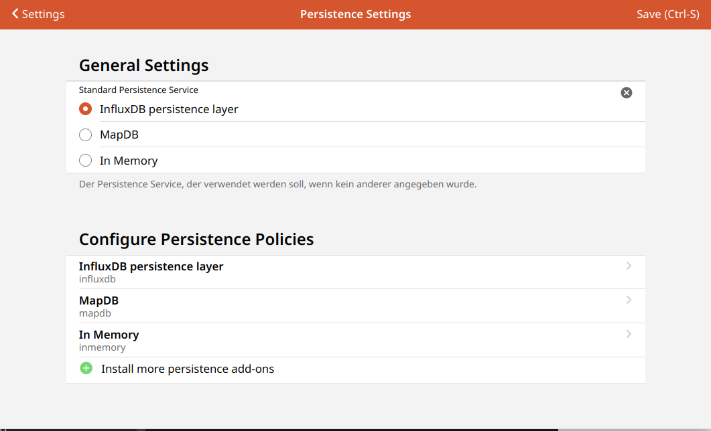

# Settings - Persistence

<!-- START MAINUI SIDEBAR DOC - DO NOT REMOVE -->
**Persistence** stores data over time.
The data may be retrieved at a later time, for example to restore your system after startup, or to prepare graphs for display on the UI.

Learn more about persistence in the [persistence docs]({{base}}/configuration/persistence.html).

To change persistence behaviour, this is the page you are looking for!

Here you can:

- Set the **default persistence service**.
- **Configure Persistence Policies** 
  For each installed persistence service, a list entry is added.
  Clicking on a persistence service from that list opens a page to create a new one or edit the existing persistence configuration of that persistence service.
- **Install more persistence add-ons** 
  Click on the <!--F7:green plus_circle_fill --> plus button to switch to the add-ons store and install more persistence services.
<!-- END MAINUI SIDEBAR DOC - DO NOT REMOVE -->
