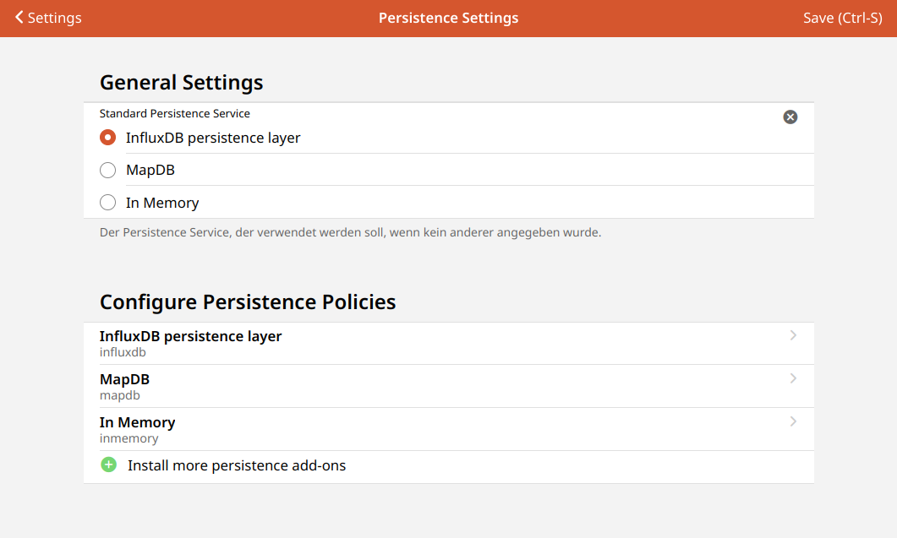

# Settings - Persistence

<!-- START MAINUI SIDEBAR DOC - DO NOT REMOVE -->
**Persistence** stores data over time.
The data may be retrieved at a later time, for example to restore your system after startup, or to prepare graphs for display on the UI.

openHAB ships with the [RRD4J persistence service](/addons/persistence/rrd4j/), which by default:

- persists every Item on every state change, and at least once a minute.
- restores the last stored value at system startup.

By default, a new openHAB installation does not activate any particular persistence engine. This means charts remain empty. The Analyze feature within Model also remains empty.

Data is however being collected in the background. Data becomes visible in charts when a persistence engine is selected.

To select an engine (for example, RRD4j), navigate to Settings > Configuration > Persistence.

Here you can:

- Set the **default persistence service**.
- **Configure Persistence Policies**: For each installed persistence service, a list entry is added.
  Clicking on a persistence service from that list opens a page to create a new one or edit the existing persistence configuration of that persistence service.
- **Install more persistence add-ons**: Click on the <!--F7:green plus_circle_fill --> plus button to switch to the add-ons store and install more persistence services.

[Learn more about persistence]({{base}}/configuration/persistence.html).

<!-- END MAINUI SIDEBAR DOC - DO NOT REMOVE -->
